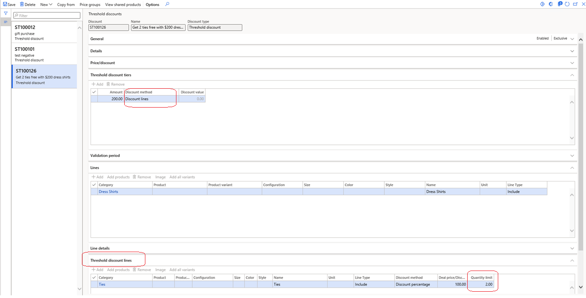

---
# required metadata

title: Configure gift with purchase promotions
description: This topic describes how to configure "gift with purchase" promotions in Microsoft Dynamics 365 Commerce.
author: shalabh
ms.date: 04/23/2021
ms.topic: article
ms.prod: 
ms.technology: 

# optional metadata

# ms.search.form: 
# ROBOTS: 
audience: IT Pro
# ms.devlang: 
ms.reviewer: v-chgri
# ms.tgt_pltfrm: 
ms.custom: 141393
ms.assetid: e23e944c-15de-459d-bcc5-ea03615ebf4c
ms.search.region: Global
ms.search.industry: Retail
ms.author: shajain
ms.search.validFrom: 2020-10-31
ms.dyn365.ops.version: AX 7.0.1

---

# Configure gift with purchase promotions

[!include [banner](../includes/banner.md)]

This topic describes how to configure "gift with purchase" promotions in Microsoft Dynamics 365 Commerce.

It's a common practice among retailers to run "gift with purchase" promotions. The goal is to persuade customers to buy a product at full price by offering a bonus of an additional item for free or at a discount. These promotions can help sell slow-moving products and (if they are run correctly) can also help improve the overall customer experience. As of the Dynamics 365 Commerce version 10.0.19 release, retailers can use the "Threshold discount" feature to configure these promotions.

## Threshold discount feature

As of the Commerce version 10.0.19 release, a new **Discount lines** value is available for selection in the **Discount method** field on the **Threshold discount tiers** FastTab of the **Threshold discounts** page in Commerce headquarters (**Retail and Commerce \> Pricing and discounts \> Threshold discounts**). If the **Discount lines** discount method is selected, a new FastTab that is named **Threshold discount lines** appears at the bottom of the page. 

The items that are listed on the **Lines** FastTab of the **Threshold discounts** page should be considered the qualifying items for a promotion, whereas the items that are listed on the **Threshold discount lines** FastTab should be considered the discounted items. The threshold amount that is specified on the **Lines** FastTab is checked against the qualifying lines to determine whether the threshold has been met. If the threshold is met, the discount is applied to the items that are listed on the **Threshold discount lines** FastTab. 

> [!NOTE]
> The discounted items should *not* be included in qualifying items. If they are, from discount calculation perspective, those items are not considered as gifts.

## Promotion configuration examples

You can use the **Quantity limit** field on the **Threshold discount lines** FastTab to specify (and therefore limit) the number of items that should be discounted when the threshold is met. For example, you want to run a promotion where customers who spend $200 on dress shirts get two ties for free. On the **Threshold discount lines** FastTab, you create a new threshold discount tier. You enter **200.00** in the **Amount** field and select **Discount lines** in the **Discount method** field. Next, on the **Lines** FastTab, you select the **Dress Shirts** category to specify the qualifying items. On the **Threshold discount lines** FastTab, you select the **Ties** category to specify the discounted items. Finally, for the **Ties** category, you enter **100.00** in the **Deal price/Discount percent** field to take 100 percent off the price, and you enter **2.00** in the **Quantity limit** field to limit the number of discounted items to a maximum of two items. Now, when dress shirts that total more than $200 are added to a transaction, and some ties are also added to the transaction, up to two ties will be provided to the customer for free. 

The following illustration shows the configuration for the "spend $200 on dress shirts and get two ties for free" promotion example in Commerce headquarters. 

As has been mentioned, the **Quantity limit** field on the **Threshold discount lines** FastTab lets you to limit the number of items that should be discounted. If this field is set to **0.00**, there is no limit on the number of items that can be discounted. Therefore, for the previous example, if the **Quantity limit** field for the **Ties** category is set to **0.00**, customers who meet the qualifying threshold can get any number of ties for free. 

You can add multiple items to the **Threshold discount lines** FastTab to indicate the items that should be discounted. For the previous example, if you add one row for two ties and another row for two bow ties, the system will interpret this configuration as "spend $200 on dress shirts, and get two ties *and* two bow ties for free." If the promotion should instead involve giving two ties *or* two bow ties for free (or one tie and one bow tie), you must create a new category for ties and bow ties, so that the tie and bow tie discounts can be configured on a single row.

## View available discounts feature

The "View available discounts" feature helps sales associates and customers learn, at the point of sale (POS), that a transaction has qualified for free or discounted items. This feature shows all applicable discounts for a given transaction. For more information about the "View available discounts" feature, see [Cross-sell and upsell by using discounts](discounts-pos.md#cross-sell-and-upsell-by-using-discounts).

## Additional resources

[Cross-sell and upsell by using discounts](discounts-pos.md#cross-sell-and-upsell-by-using-discounts)

