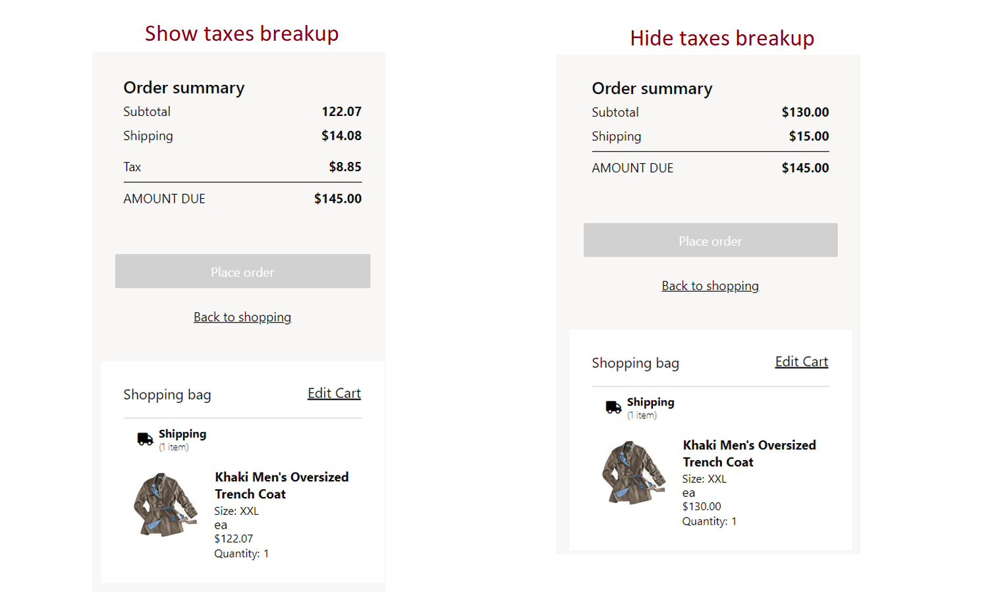
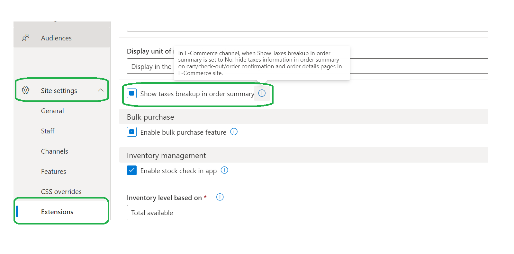

---
# required metadata

title: Hide tax breakup information in order summaries
description: This topic describes how to hide tax breakup information in order summaries on cart, checkout, order confirmation, and order details pages in Microsoft Dynamics 365 Commerce.
author: gvrmohanreddy
ms.date: 04/21/2022
ms.topic: article
audience: Application User, Developer, IT Pro
ms.reviewer: v-chgriffin
ms.search.region: Global
ms.author: gmohanv
ms.search.validFrom: 2022-03-28
---

# Hide tax breakup information in order summaries

[!include [banner](includes/banner.md)]
[!include [banner](includes/preview-banner.md)]

This topic describes how to hide tax breakup information in order summaries on cart, checkout, order confirmation, and order details pages in Microsoft Dynamics 365 Commerce.

By default, Dynamics 365 Commerce shows tax breakup information in order summaries on cart, checkout, order confirmation, and order details pages. As of the Commerce version 10.0.27 release, Commerce site builder includes an option that lets you hide the tax breakup information in order summaries.

The following illustration shows an example of two order summaries. The first shows the tax breakup information, and the second hides it.

> [!NOTE]
> - The option to hide tax breakup information in order summaries is available only when the **Prices include sales tax** option for the e-commerce channel is set to **Yes** in Commerce headquarters, at **Retail and Commerce \> Channels \> Stores \> All stores**. 
> - By default, the **Show taxes breakup in order summary** option is enabled in site builder.

## Hide tax breakup information in order summaries

To hide tax breakup information in order summaries, follow these steps.

1. In Commerce site builder, go to the site that you want to update.
1. Go to **Site settings \> Extensions**.
1. Clear the **Show taxes breakup in order summary** checkbox.

To show tax breakup information in order summaries, select the **Show taxes breakup in order summary** checkbox.  

The following illustration shows the **Show taxes breakup in order summary** checkbox highlighted and selected in site builder.

## Additional resources

[Sales tax overview](/finance/general-ledger/indirect-taxes-overview)

[Configure sales tax for online orders](sales-tax-config.md)

[Troubleshoot: Taxes on online orders are incorrectly calculated](troubleshoot/tax-miscalculated-online-order.md)
