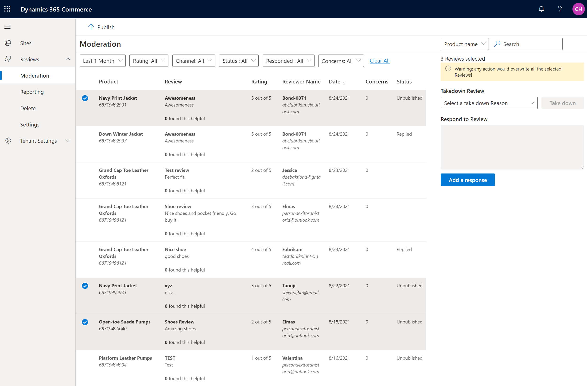

---
# required metadata
title: Ratings and Review Configuration - Publishing Reviews
description: Dynamics 365 Commerce's Ratings and Reviews allows enforcing human moderation before publishing reviews to E-Commerce channel.
author: gvrmohanreddy
manager: annbe
ms.date: 09/03/2021
ms.topic: article
ms.prod: 
ms.service: dynamics-365-commerce
ms.technology: 
# optional metadata
# ms.search.form:  
#ROBOTS: 
audience: Application User
# ms.devlang: 
ms.reviewer: v-chgri
ms.search.scope: Retail, Core, Operations
# ms.tgt_pltfrm: 
# ms.custom: 
ms.search.region: Global
# ms.search.industry: 
ms.author: gmohanv
ms.search.validFrom: 2021-09-03
ms.dyn365.ops.version: 10.0.22
---

# Ratings and Review Configuration - Publishing Reviews

[!include [banner](includes/banner.md)]
[!include [banner](includes/preview-banner.md)]

Currently Dynamics 365 Commerce's **Ratings and Reviews** uses **Azure Cognitive Services** to redact any profane words from reviews text and publishes ratings and reviews automatically. This process avoids need for manual intervention, to publish ratings and reviews for online shopper to see them on E-Commerce website. However, some businesses may want to manually approve reviews prior to publishing them to be viewed on E-Commerce website by online shoppers. 

This document explains on how to turn the feature called "Require moderator for ratings and reviews" ON or OFF and allow your moderator to manually publish ratings and reviews. 

## Enable require moderator feature

To enable require moderator feature in Commerce site builder, follow these steps.
	1. Go to **Home > Reviews > Settings**.
	2. Turn on **Require moderator for ratings and reviews** feature switch.

> [!NOTE]
> Enabling the "Require moderator for ratings and reviews" feature will stop auto-publishing and will require manual publishing. Azure Cognitive Services will continue to filter profanity in review titles and content.

## Publish ratings and reviews

After you enable **Require moderator for ratings and reviews**  feature, moderator needs to manually publish the ratings and reviews to make them appear on your E-Commerce website.  Moderator in Commerce site builder, follow these steps to publish ratings and reviews:

1. Go to **Home > Reviews > Moderate**.
1. Notice that the **Status** column with **Unpublished** value which indicates a rating and review is not published yet.
1. Select one or more ratings and reviews that are in **Unpublished** state and click on **Publish** icon in the header.
1. Up on clicking **Publish** icon the selected ratings and reviews will be added to publishing queue and appear on E-Commerce website in about X minutes. 
1. As a moderator, to view only **Unpublished** or **Published** ratings and reviews, use the **Status** filter in the header.  

> [!NOTE]
> - Once a rating and review is published the status value changes from Unpublished to empty.  
> - If you select multiple ratings and reviews those are in mixed statuses, some in unpublished state and some in other statuses, and click **Publish** in the top, ratings and reviews those are in unpublished state will be published and the ones those were already published will not go through the publishing process again.

