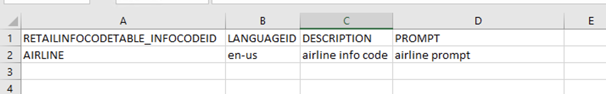

# Import info codes

This article describes how to import info codes in Microsoft Dynamics 365 Commerce. 

1. Go to **System administration \> Workspaces \> Data management**
2. Click the Data entities menu item
3. Add the RetailInfocodeTranslationEntity and RetailInfocodeEntity entities 
4. Go back to **System administration \> Workspaces \> Data management**
5. Click the Import menu item
6. Fill in the Group name field
7. Click the "Add file" button
8. Add the RetailInfocodeEntity and corresponding file where you want to import from
9. Add the RetailInfocodeTranslationEntity and corresponding file where you want to import from
10. The form should look like this 
11. Once all files are added, click the Import button at the top.
12. Check the final result form to confirm successful import. 
13. Go to Info Codes form to see imported info codes

## Importing files examples

