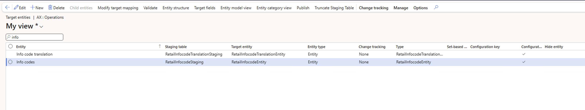
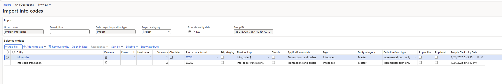
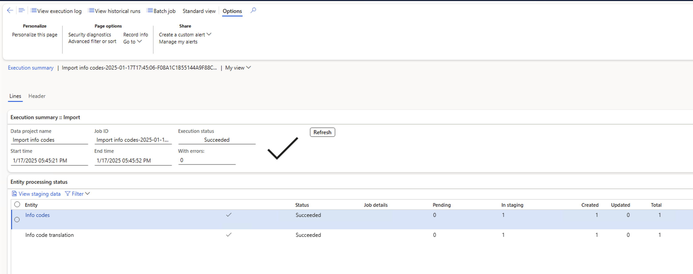

# Info codes and info code groups

[!include [banner](includes/banner.md)]

This article provides an overview on info codes and info code groups and how to use them in Microsoft Dynamics 365 Commerce.

Info codes provide a way for you to capture data at a point-of-sale (POS) register. You can use info codes to prompt the cashier to enter information during various actions at the POS, such as item sales, item returns, or selecting customers. Cashiers can select input from a list or enter it as a code, number, date, or text. You can assign info codes to predefined store actions, retail items, payment methods, customers, or specific point-of-sale activities. You can use info codes to do the following:

- Capture additional information at transaction time, such as a flight number or the reason for a return.
- Prompt the register cashier to select from a list of prices for specific products.
- Link a subcode to an info code to prompt the cashier for input when performing a specific activity. For example, when a customer returns a product, you can prompt the cashier to ask why the product is being returned. Then you can use subcodes to display a list of reasons that the cashier can choose from.
- Sell a product as a regular sale, discounted sale, or free product.
- Prompt the cashier to enter a value or select from a list of subcodes when the register drawer is opened without performing a sales operation.

## Info codes group

In Commerce, you can create groups of info codes. Info code groups add flexibility by enabling you to define fewer info codes and then use them in more versatile ways. You can use info code groups in the following ways:

- Define fewer info codes and easily re-use them. Info codes that are included in info code groups have no predefined dependencies on other info codes. You can include the same info code in multiple info code groups and then use prioritization to present the same info codes in the order that makes sense in any particular situation.
- Link info codes to other info codes or info code groups to gather information about a product or transaction without having to define a separate info code or linked info code for each scenario.

## Info code examples

**Example 1: Reuse info codes**

You can link info codes so that when one info code is triggered, another info code is triggered immediately after it. For example, when you sell certain products, you can prompt the cashier to ask the customer if they want to purchase batteries and a product warranty. For other products, you can prompt the cashier to ask the customer if they want to purchase batteries and collect their postal code. If you create linked info codes for these scenarios, you must set up every variation of the info code so that the cashier is prompted to ask for the right information. If you use info code groups, common info codes, such as asking for batteries, can be set up once and then reused in multiple info code groups. You can also use prioritization in the info code groups to identify the order in which the prompts are displayed.

**Example 2: Link info codes to info code groups**

When you sell certain products, for example mobile devices, you always want to collect a specific set of information, such as telephone number, mobile equipment identifier (MEID), and serial number. However, you also want to collect different information for a tablet versus a mobile phone. You can set up an info code group that includes prompts for the telephone number, MEID, and the serial number, and then link the info code group to an individual info code. When the product-specific info code is triggered, the info code group can be triggered next to enable you to collect the common data without having to define multiple sets of linked info codes for each device.

## Import info code

1. Go to **System administration \> Workspaces \> Data management**
2. Click the Data entities menu item
3. Add the RetailInfocodeTranslationEntity and RetailInfocodeEntity entities 
4. Go back to **System administration \> Workspaces \> Data management**
5. Click the Import menu item
6. Fill in the Group name field
7. Click the "Add file" button
8. Add the RetailInfocodeEntity and corresponding file where you want to import from
9. Add the RetailInfocodeTranslationEntity and corresponding file where you want to import from
10. The form should look like this 
11. Once all files are added, click the Import button at the top.
12. Check the final result form to confirm successful import. 
13. Go to Info Codes form to see the imported info codes

[!INCLUDE[footer-include](../includes/footer-banner.md)]
