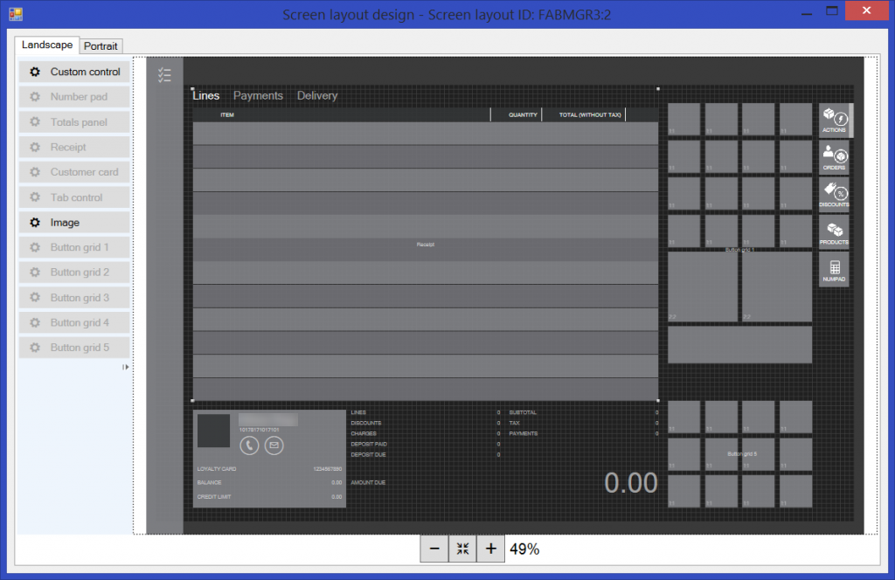

# Install the POS layout designer

[!include [banner](includes/banner.md)]

You can use the one-click designer to design different Store Commerce app and Store Commerce for web layouts, in either Landscape mode or Portrait mode, for stores, registers, cashiers, and managers.

The graphical design interface for the Store Commerce app and Store Commerce for web is controlled by the till layout. A layout controls the position of various objects. Examples include the total layout, the item grid layout, the customer layout, the payment layout, and the layout of various menu buttons. Layouts also include the overall appearance of the sales interface that is presented to workers.

## Install the one-click designer

1. In Commerce, use the menu in the upper left to navigate to **Retail and Commerce** &gt; **Channel setup** &gt; **POS setup** &gt; **POS** &gt; **Screen layouts**.
2. Select any layout that has an application type of **Modern POS - Full** or **Modern POS - Compact**, and then select **Layout designer**.
3. On the notification bar that appears at the bottom of the Internet Explorer window, click **Open** to install the one-click designer. (The notification bar might appear in a different place in other browsers.)
4. In the **Application Run - Security Warning** message box that appears, select **Run** to install the Retail designer host. A progress indicator shows the progress of the installation.
5. After the installation is completed, on the **Sign in** page, enter your Commerce user name and password, and then select **Sign in** to start the designer.
6. After your credentials are validated and the designer starts, you can design your own layout or modify the existing layout.

    

## Troubleshoot the installation of the Layout designer

- When you select **Designer**, the prompt to download (or run) the installer doesn't appear, or your current security settings don't allow you to download the file. 

    **Solutions:**

    - In Internet Explorer, make sure that the pop-up blocker is disabled for this site. Select **Settings \> Options \> Privacy \> Find Pop-up Blocker**, and change the setting, if a change is required.
    - In Internet Explorer, add the Commerce URL to your trusted sites. Select **Settings \> Options \> Security \> Trusted sites \> Sites \> Add**.

- The program doesn't start, and you're instructed to contact the vendor.

    **Solution:** In Internet Explorer, add the Commerce URL to your trusted sites. Select **Setting \> Options \> Security \> Trusted sites \> Sites \> Add**.

**Known issue:** The designer doesn't work correctly in the Google Chrome and Mozilla Firefox browsers. We are working to fix this issue.

<!--## Additional resources-->

<!--[Configure, install, and activate the Store Commerce app](retail-modern-pos-device-activation.md)-->

[!INCLUDE[footer-include](../includes/footer-banner.md)]
