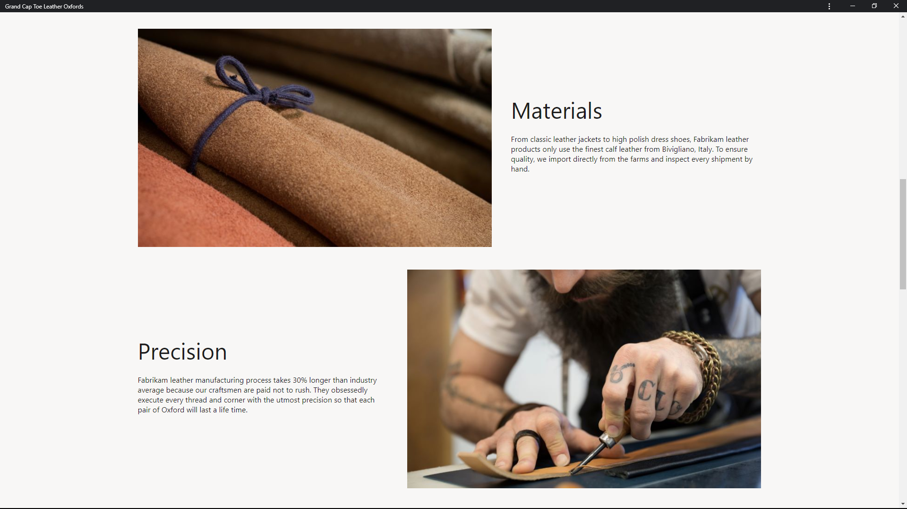

# Interactive feature module

[!include [banner](includes/banner.md)]

This article covers interactive feature modules and describes how to add them to site pages in Microsoft Dynamics 365 Commerce.

Interactive feature modules are mosaic-like modules that can be used to market multiple product categories or product brands by using a combination of images and text. For example, a retailer can add an interactive feature module to the home page of an e-commerce site to promote top-selling categories. The interactive feature module resembles the tile list module, but it has a different layout and different interaction functionality.

Each interactive feature module is a collection of interactive feature item modules. Each feature item module is driven by data from the content management system (CMS). It doesn't depend on any other modules or data from Commerce headquarters. The interactive feature module can be added to any site page where a retailer wants to market or promote something (for example, products, categories, or brands).

> [!IMPORTANT]
> - The interactive feature module is available as of the Dynamics 365 Commerce version 10.0.20 release.
> - The interactive feature module is showcased in the Adventure Works theme.

The following illustration shows an example of an interactive feature module on the Adventure Works home page.

## Interactive feature module and themes

The interactive feature module can support various layouts and styles, based on a theme. For example, in the Adventure Works theme, the interactive feature module has a two-column layout that shows animation effects when a site user hovers over each item. The interactive feature module is optimized for an even number of images that are arranged in a two-column layout.

## Interactive feature module properties

| Property name | Values | Description |
|---------------|--------|-------------|
| Heading       | Heading text and heading tag (**H1**, **H2**, **H3**, **H4**, **H5**, or **H6**) | A text heading for the interactive feature module. |

## Interactive feature item module properties

| Property name | Values | Description |
|---------------|--------|-------------|
| Image         | Image file | An image that represents a product or a category. The image can be uploaded to the Media Library in Commerce site builder, or an existing image can be used. |
| Heading       | Heading text and heading tag (**H1**, **H2**, **H3**, **H4**, **H5**, or **H6**) | By default, the **H2** heading tag is used for the heading, but the tag can be changed to meet accessibility requirements. |
| Paragraph     | Paragraph text | The module supports paragraph text in rich text format. Some basic rich text capabilities are supported, such as hyperlinks, and bold, underlined, and italic text. Some of these capabilities can be overridden by the page theme that is applied to the module. |
| Link          | Link text, link URL, Accessible Rich Internet Applications (ARIA) label, and **Open link in new tab** selector | The module supports one or more "call to action" links. If a link is added, link text, a URL, and an ARIA label are required. ARIA labels should be descriptive, to meet accessibility requirements. Links can be configured so that they are opened on a new tab. |

## Add an interactive feature module to a new page

To add an interactive feature module to a new page and set the required properties in Commerce site builder, follow these steps.

1. Go to **Templates**, and open the marketing template for your site's home page (or create a new marketing template).
1. In the **Main** slot of the default page, select the ellipsis (**...**), and then select **Add module**.
1. In the **Select modules** dialog box, select the **Interactive feature** module, and then select **OK**.
1. Select **Save**, select **Finish editing** to check in the template, and then select **Publish** to publish it.
1. Go to **Pages**, and open the site's home page (or create a new home page by using the marketing template).
1. In the **Main** slot of the default page, select the ellipsis button (**...**), and then select **Add module**.
1. In the **Select modules** dialog box, under **Select Modules**, select the **Interactive feature** module, and then select **OK**.
1. In the property pane of the interactive feature module, add a heading.
1. In the **Interactive feature** slot, select the ellipsis button (**...**), and then select **Add module**.
1. In the **Select modules** dialog box, select the **Interactive feature item** module, and then select **OK**.
1. In the property pane of the interactive feature item module, add an image, heading text, paragraph text, and a URL.
1. Add and configure additional interactive feature item modules as you require.
1. Select **Save**, and then select **Preview** to preview the page.
1. Select **Finish editing** to check in the template, and then select **Publish** to publish it.

## Additional resources

[Module library overview](starter-kit-overview.md)

[Adventure Works theme](adventure-works-theme.md)

[!INCLUDE[footer-include](../includes/footer-banner.md)]
