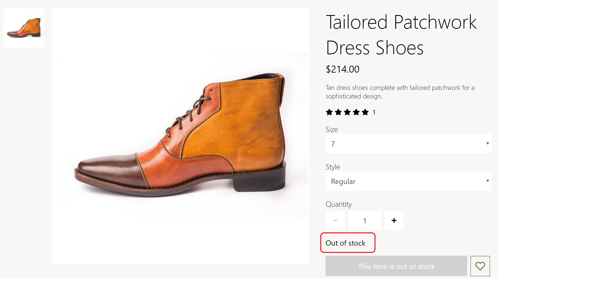

---
# required metadata

title: Apply inventory settings
description: This topic covers inventory settings and describes how to apply them in Dynamics 365 Commerce.
author:  anupamar-ms
manager: annbe
ms.date: 05/25/2020
ms.topic: article
ms.prod: 
ms.service: dynamics-365-commerce
ms.technology: 

# optional metadata

# ms.search.form: 
# ROBOTS: 
audience: Application User
# ms.devlang: 
ms.reviewer: v-chgri
ms.search.scope: Retail, Core, Operations
# ms.tgt_pltfrm: 
ms.custom: 
ms.assetid: 
ms.search.region: Global
ms.search.industry: 
ms.author: anupamar
ms.search.validFrom: 2019-10-31
ms.dyn365.ops.version: 
---

# Apply inventory settings

[!include [banner](includes/banner.md)]

This topic covers inventory settings and describes how to apply them in Dynamics 365 Commerce.

## Overview

Inventory settings specify if inventory should be checked before products are added to the cart, and also define inventory-related merchandising messages such as "In stock" and "Only a few left." These settings ensure that a product cannot be purchased if it is out of stock.

Microsoft Dynamics 365 Commerce provides on-hand availability for products. For details on how estimated on-hand availability is calculated, see [Calculate inventory availability for retail channels](calculated-inventory-retail-channels.md).

Inventory thresholds and ranges can be defined in Commerce for a product or category. These ranges help define inventory settings that are in stock vs. low stock. <!--For details, see [TBD](tbd).-->

## Inventory settings 

Inventory settings in Dynamics 365 Commerce are defined in site builder under **Site Settings \> Extensions \> Inventory Management**. 

**Enable inventory check on app** - This setting turns on a product inventory check. When this setting is selected, buy box, cart, and pick up in store modules will check product inventory and will only allow the product to be added to the cart if inventory is available.

**Inventory level based on** - This setting defines how inventory levels are calculated. The available setting properties are **Total Available**, **Physical Available**, and **Out of stock threshold**. In Dynamics 365 Commerce, inventory threshold and ranges can be defined for each product and category. The inventory APIs return product inventory information for both the **Total Available** and **Physical Available** properties. The retailer decides which of the **Total Available** or **Physical Available** properties should be used for determining the inventory count and the corresponding ranges for in-stock and out-of-stock statuses. 

The **Out of stock threshold** property is a legacy option. When this property is selected, the inventory count is determined from the **Total Available** property results but the threshold is defined by the **Out of stock threshold** numeric setting (see below). This threshold setting applies to all products across an e-Commerce site. If inventory is below the threshold number, the product is considered to be out of stock, otherwise it is considered to be in stock. The capabilities of this legacy setting option are limited and it is not recommended for use with release versions 10.0.12 and later.

**Inventory ranges** - This setting defines which inventory range messages are displayed on site modules, and is only applicable if either the **Total Available** or **Physical Available** properties are selected for the **Inventory level based on** setting. The property options for this setting are **All**, **Low and out of stock**, and **Out of stock**. 

- When **All** is selected, all inventory ranges from in stock ("Available") to "Out of stock" will be displayed.
- When **Low and out of stock** is selected, all ranges except in stock ("Available") will be displayed. 
- When **Out of stock** is selected, only the "Out of stock" message will be displayed.

**Out of stock threshold** - As noted above, this is a legacy setting. For this numeric setting to take effect, the **Out of stock threshold** property must be selected in the **Inventory level based on** setting.

## Modules that use inventory settings

Buy box, wishlist, store selector, cart, and cart icon modules rely on inventory settings. These modules display the inventory ranges and messages when a product cannot be added to the cart due to lack of inventory. 

The following image shows am example of a PDP displaying an in stock message ("Available").

The following image shows am example of a PDP displaying an "Out of stock" message.

The following image shows am example of a cart displaying an in stock message ("Available").

## Additional resources

[Starter kit overview](starter-kit-overview.md)

[Cart](add-cart-module.md)

[Buy box](add-buy-box.md)

[Wishlist](account-management.md)

[Store selector](add-store-selector.md)
