# Goods and Services Tax (GST) integration for cash registers for India

[!include [banner](../includes/banner.md)]

This article provides a walkthrough of the features that are related to Goods and Services Tax (GST). It also highlights the effect of GST on various types of commerce business transactions, and shows the accounting and posting of transactions where the receipt is printed at the point of sale (POS).

## Prerequisites

In order to work with GST in Commerce for India, you need to complete a general GST setup. For more information, see [India Goods and Services Tax (GST)](../../finance/localizations/apac-ind-gst.md).

You also need to enable the India-specific functionality on the Commerce channel side:
- If you are using Commerce version 10.0.34 or earlier, you must configure extensions for channel components. For more information, see the [deployment guidelines](./apac-ind-loc-deployment-guidelines.md).

## India tax entities for Commerce

The following table shows the navigation paths for the India tax entities in Commerce.

| India tax entities                  | Navigation path in Commerce                                                     |
|-------------------------------------|-------------------------------------------------------------------------------|
| Business verticals                  | Retail and Commerce \> Channel setup \> Sales taxes \> Business verticals                  |
| Enterprise tax registration numbers | Retail and Commerce \> Channel setup \> Sales taxes \> Enterprise tax registration numbers |
| GST reference number sequence group | Retail and Commerce \> Channel setup \> Sales taxes \> GST reference number sequence group |
| HSN codes                           | Retail and Commerce \> Channel setup \> Sales taxes \> HSN codes                           |
| Service accounting codes            | Retail and Commerce \> Channel setup \> Sales taxes \> Service accounting codes            |
| Maintain setoff hierarchy profiles  | Retail and Commerce \> Channel setup \> Sales taxes \> Maintain setoff hierarchy profiles  |
| VAT schedules                       | Retail and Commerce \> Channel setup \> Sales taxes \> VAT schedules                       |
| Tax setup                           | Retail and Commerce \> Channel setup \> Sales taxes \> Tax configuration \> Tax setup      |

> [!NOTE]
> The navigation paths for the India tax entities in Commerce differ from the navigations paths in Finance. For information about the navigation paths in Finance, see [India Goods and Services Tax (GST)](../../finance/localizations/apac-ind-gst.md).

## Validate tax information for the store

The tax information for the store comes from the selected warehouse. This warehouse is defined in the warehouse master. The configured tax information from the store is printed on the POS receipt. It's also updated on the sales order at the headquarters for the financial postings.

Follow these steps to view the tax information for a store.

1. Go to **Retail and Commerce** \> **Channels** \> **Stores** \> **All stores**.
2. Select a store.
3. Select the **Tax information** FastTab.

## Configure language texts and custom fields

You can configure the language text and custom fields that are used in the POS receipt formats. The default company of the user who creates the receipt setup should be the same as the legal entity where the language text setup is created. Alternatively, the same language texts should be created in both the user's default company and the legal entity of the store that the setup is created for.

### Set up the POS language text

1. Go to **Retail and Commerce** \> **Channel setup** \> **POS setup** \> **POS profile** \> **Language text**.
2. On the **POS** tab, on the **POS language text** FastTab, select the language ID for the text. The language should match the user's preferred language.
3. In the **Text ID** field, enter a unique ID that is equal to or more than **900001**.
4. In the **Text** field, enter the language text.

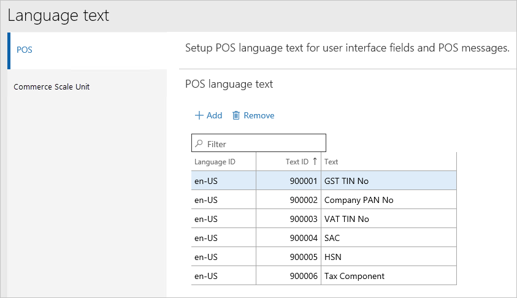

### Create custom fields

When you create custom fields, the value of the **Caption text ID** field must match the value that you entered for the **Text ID** field on the **Language text** page.

1. Go to **Retail and Commerce** \> **Channel setup** \> **POS setup** \> **POS profile** \> **Custom fields**.
2. Enter a name for the field.
3. Select the field type.
4. In the **Caption text ID** field, enter the **Text ID** value for one of the language texts on the **Language text** page.

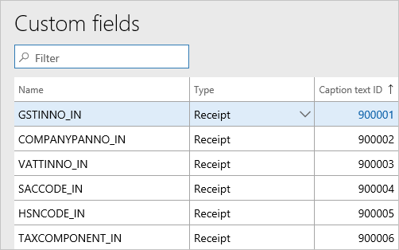

## Create the receipt format

You can use Receipt format designer to add custom fields to the appropriate receipt sections. For more information, see [Set up and design receipt formats](../receipt-templates-printing.md).

1. Go to **Retail and Commerce** \> **Channel setup** \> **POS setup** \> **POS profile** \> **Receipt formats**.
2. Select a receipt format for the **Receipt** receipt type, and make the required changes.

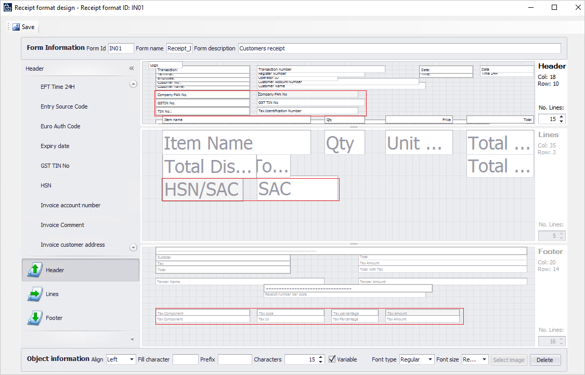

## Update receipt profiles

After you create a receipt format, you can assign that format to a receipt profile.

Follow these steps to update a receipt profile.

1. Go to **Retail and Commerce** \> **Setup** \> **POS** \> **Receipt profile**.
2. Select the receipt profile to update.
3. Select **Edit**.
4. For each receipt type in the list, select a receipt format.

## Update the POS invoice number

You can reconcile the POS receipt number with the invoice number for customer transactions. If you set the **Update POS invoice number** option to **Yes** on the **Posting** tab of the **Commerce parameters** page, the POS receipt number is entered in the **Transaction ID** field for corresponding sales orders.

You can set the **Update POS invoice number** option to **Yes** only if the existing receipt number format includes both the store number and the terminal number. The following illustration shows a POS functionality profile where the receipt numbering includes the store number and the terminal number.

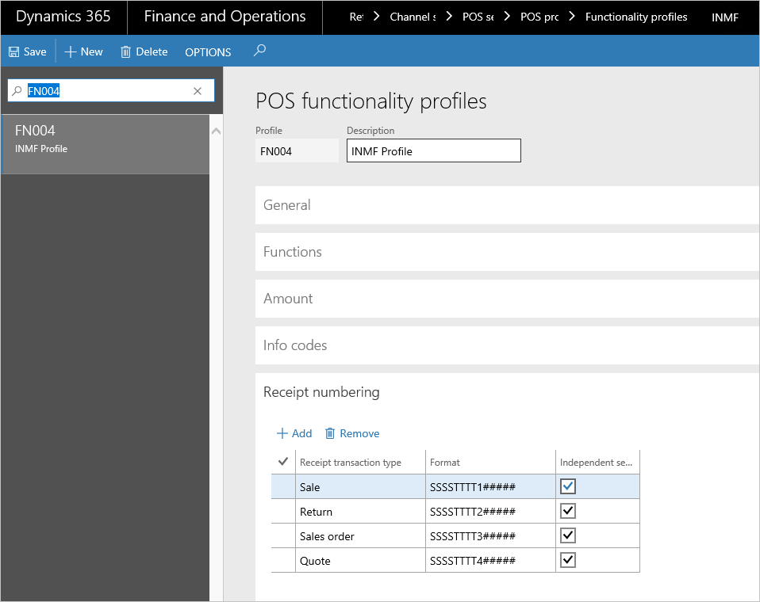

## Run a distribution schedule

To synchronize Tax Engine (GTE) data from headquarter to the POS database, you must add a job to the **Distribution schedule** page.

Follow these steps to verify that the job exists and to run the job.

1. Go to **Retail and Commerce** \> **Periodic** \> **Data distribution** \> **Distribution schedule**.
2. Verify that a new job, **1180**, has been added for **Generic tax engine**.
3. Run all the jobs (**9999**).

## Example scenarios

The following example scenarios walk you through sample transactions for India:

- Scenario 1: Sell to a registered customer
- Scenario 2: Sell taxable goods to a consumer
- Scenario 3: Sell taxable goods to an anonymous customer where GST is price-inclusive
- Scenario 4: Sell an exempted good
- Scenario 5: Return the transaction that has GST

### Scenario 1: Sell to a registered customer

Sales to a registered customer are known as *business-to-business* (B2B) sales. If the store location and the place of supply (that is, the customer address) are in the same state, the transaction is an *intrastate sale*, and Central GST (CGST) and State GST (SGST) must be paid. If the store location and the place of supply are in different states, the transaction is an *interstate sale*, and Integrated GST (IGST) must be paid.

> [!NOTE]
> For these transactions, the fields for the customer address and the registration number are required.

1. Sign in to the POS.
2. Enter the items, and then select **Enter**.

    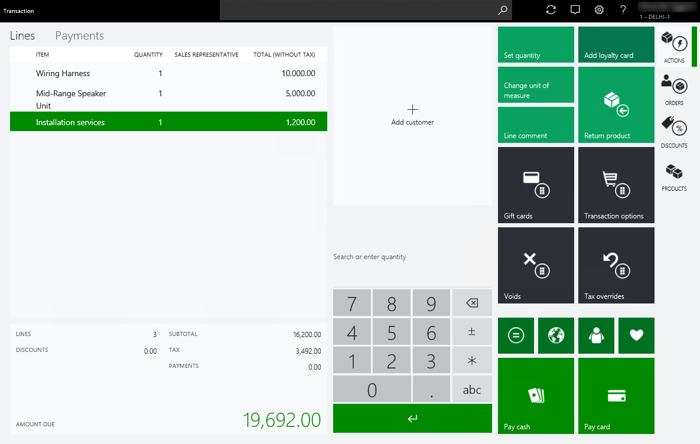

3. Validate the GST calculations. Consider the rate that is defined in the tax setup.

    | Item/service | Unit price | Tax rates          | CGST     | SGST      |
    |--------------|------------|--------------------|----------|-----------|
    | M0001        | 10,000.00  | CGST 12%, SGST 11% | 1,200.00 | 1,100.00  |
    | M0002        | 5,000.00   | CGST 10%, SGST 10% | 500.00   | 500.00    |
    | S0001        | 1,200.00   | CGST 11%, SGST 5%  | 132.00   | 60.00     |
    |              | 16,200.00  |                    | 1,832.00 | 1,660.00  |
    | Total amount |            |                    |          | 19,692.00 |

4. Select **Orders** \> **Create customer order**.
5. Select **Add customer**, and select the customer account.
6. Select **Pick up all**.
7. Select the store and the pick-up date.
8. Select **OK**.

    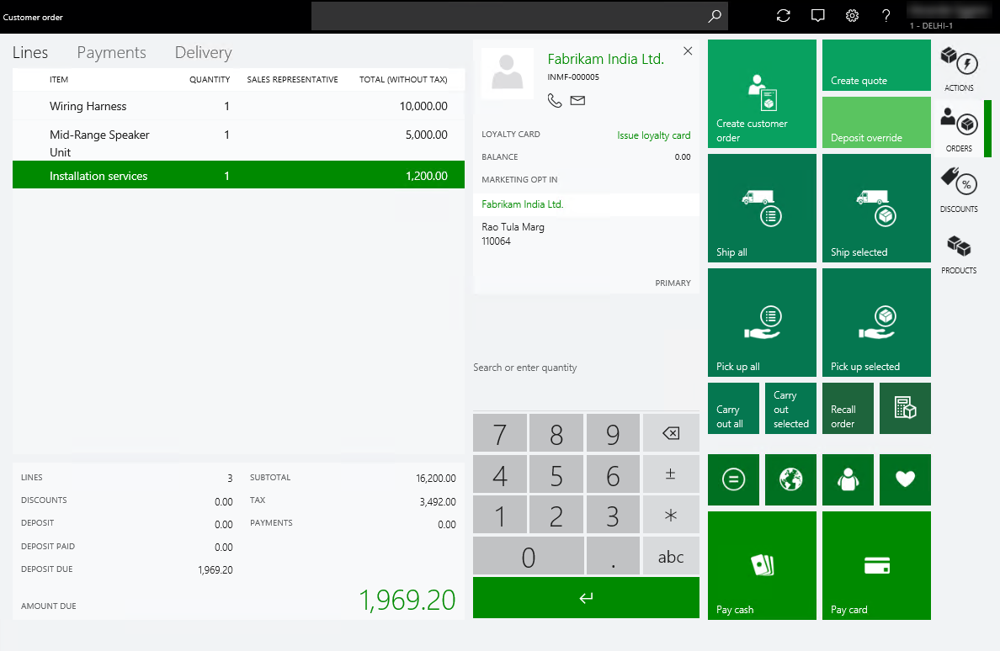

    > [!NOTE]
    > In this example, the state of the store location is Delhi, and the state of the customer address is also Delhi. Because the state is the same, intrastate GST is calculated.

9. Select **Exact** to process the deposit payment.
10. Validate the receipt:

    1. Select **Show journal**.
    2. Select the transactions.
    3. Select **Receipt**.

    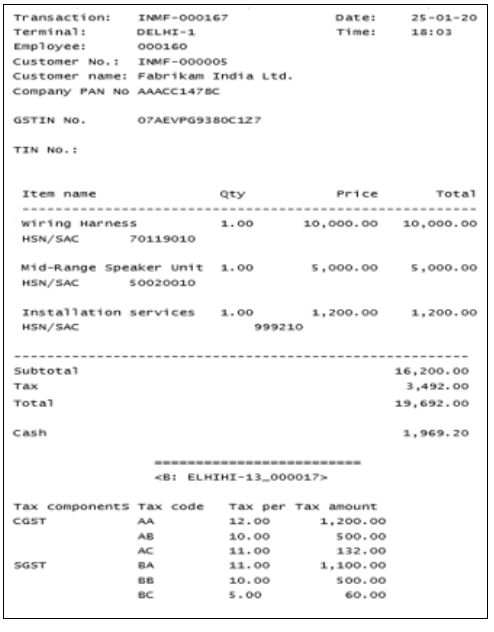

11. Validate the sales order and tax document in Headquarters:

    1. Go to **Retail and Commerce** \> **Customers** \> **All sales orders**.
    2. Select the sales order.
    3. On the Action Pane, on the **Sell** tab, in the **Tax** group, select **Tax document**.

    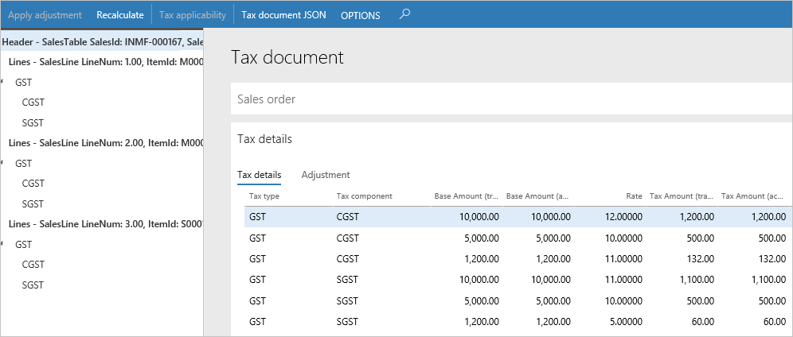

12. Recall and process the customer order:

    1. Sign in to the POS.
    2. Select **Recall order**.
    3. Search for and select the order.
    4. Select **Picking and packing** \> **Pickup**
    5. Select **Select all** and then **Pickup**.

    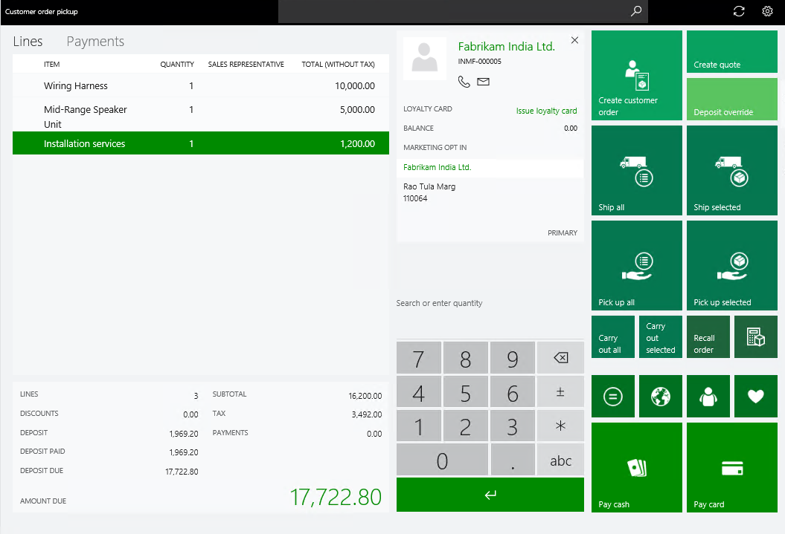

13. Select **Exact** to process the payment.
14. Validate the receipt.

    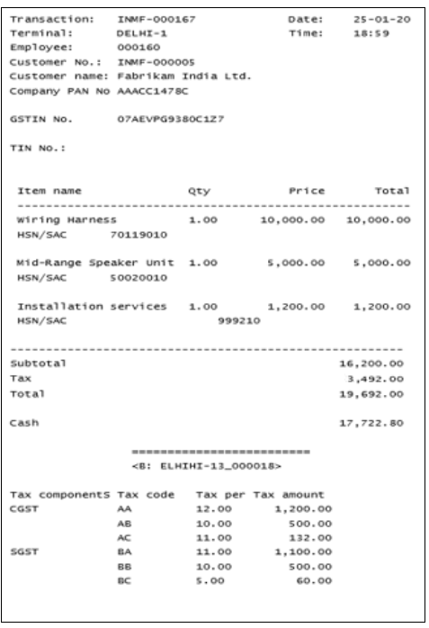

15. Validate the voucher transactions:

    1. Go to **Retail and Commerce** \> **Customers** \> **All sales orders**.
    2. Select the sales order.
    3. On the Action Pane, on the **Invoice** tab, select **Invoice journals**.
    4. Select **Voucher**.

        | Ledger account name  | Debit amount (Rs.) | Credit amount (Rs.) |
        |----------------------|--------------------|---------------------|
        | Customer account     | 19,692.00          |                     |
        | CGST payable account |                    | 1,832.00            |
        | SGST payable account |                    | 1,660.00            |
        | Sales account        |                    | 16,200.00           |

    5. Select **Tax document**.
    6. Verify that the receipt number is updated as the transaction ID.

        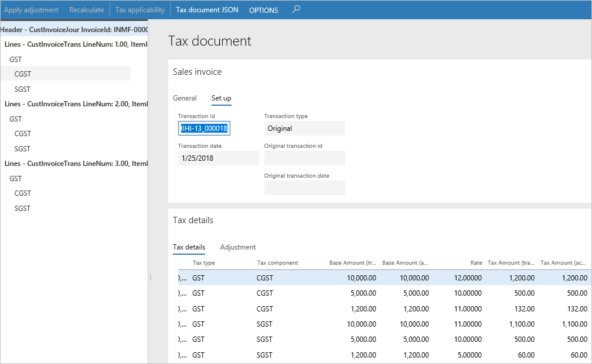

### Scenario 2: Sell taxable goods to a consumer

When you sell to unregistered customers, the sales are referred to as *business-to-consumer* (B2C) sales. Tax is calculated in the same manner for B2B and B2C sales.

1. Sign in to the POS.
2. Enter an item, and then select **Enter**.
3. Select **Add customer**, and select the customer account.

    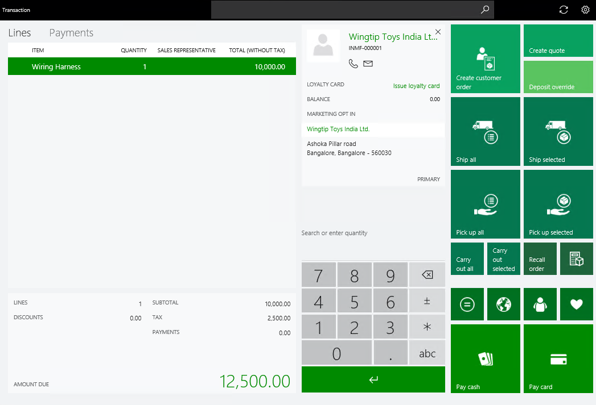

    > [!NOTE]
    > In this example, the state of the store location is Delhi, but the state of the customer address is Bengaluru (Bangalore). Because the states differ, interstate GST is computed.

4. Select **Exact** to process the payment.
5. Validate the receipt:

    1. Select **Show journal**.
    2. Select the transactions.
    3. Select **Receipt**.

    

6. Validate the sales invoice in Headquarters:

    1. Go to **Retail and Commerce** \> **Retail and Commerce IT** \> **Data distribution**.
    2. Run job **P-0001** (**Channel transactions**).
    3. Close the page.

7. Post the statement:

    1. Go to **Retail and Commerce** \> **Channels** \> **Stores** \> **Open statements**.
    2. Create a statement.
    3. Select **Calculate statement** and then **Post statement**.

8. Validate the voucher transactions:

    1. Go to **Retail and Commerce** \> **Customers** \> **All sales orders**.
    2. Select the sales invoice.
    3. Select **Sales order lines** \> **Tax information**.
    4. On the appropriate tabs, verify the location (store address) and the customer address.

        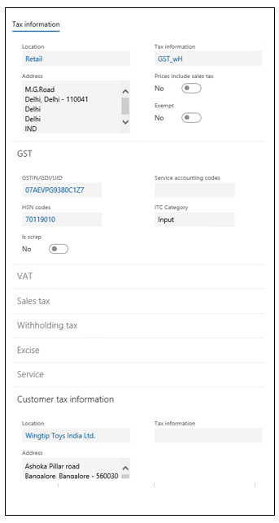

    5. Select **OK**.
    6. On the Action Pane, on the **Invoice** tab, select **Invoice journals**.
    7. Select **Voucher**.

        | Ledger account name  | Debit amount (Rs.) | Credit amount (Rs.) |
        |----------------------|--------------------|---------------------|
        | Customer account     | 12,500.00          |                     |
        | IGST payable account |                    | 2,500.00            |
        | Sales account        |                    | 10,000.00           |

    8. Select **Tax document**.
    9. Verify that the receipt number is updated as the transaction ID.

### Scenario 3: Sell taxable goods to an anonymous customer where GST is price-inclusive

1. Define price-inclusiveness at the store:

    1. Go to **Retail and Commerce** \> **Channels** \> **Stores** \> **All stores**.
    2. Select a store.
    3. Set the **Prices include sales tax** option to **Yes**.

2. Run the distribution schedule:

    1. Go to **Retail and Commerce** \> **Retail and Commerce IT** \> **Data distribution**.
    2. Run the job to update the changes in the POS database.
    3. Close the page.

3. Enter a transaction:

    1. Sign in to the POS.
    2. Enter an item, and then select **Enter**. For this example, use an item that has the following values:

        - **Taxable value:** 10,000.00
        - **CGST:** 12 percent
        - **SGST:** 11 percent

    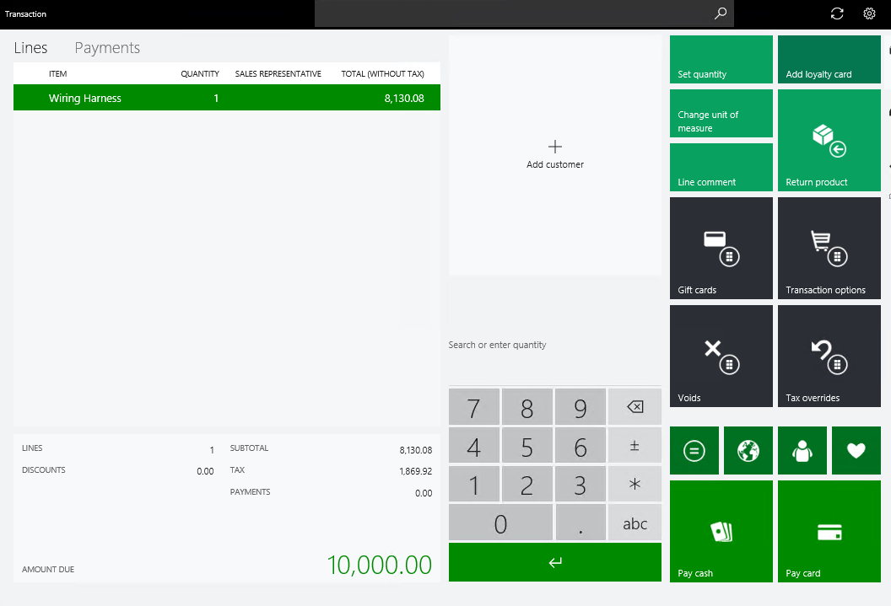

4. Select **Exact** to process the payment.
5. Validate the receipt.

    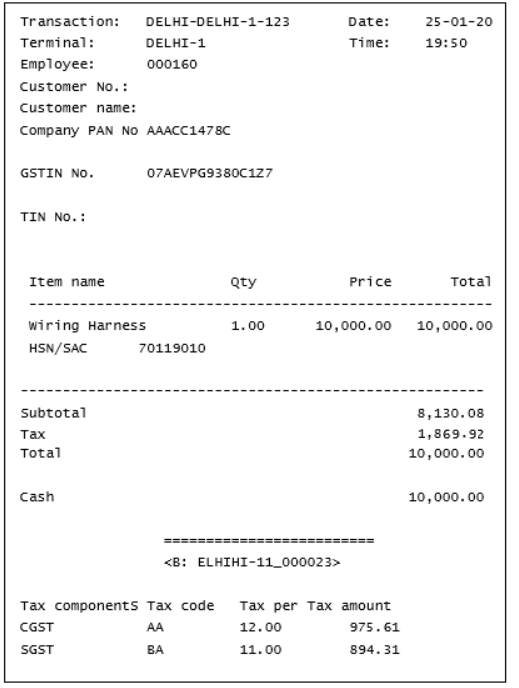

6. Validate the sales invoice in Headquarters:

    1. Go to **Retail and Commerce** \> **Retail and Commerce IT** \> **Data distribution**.
    2. Run job **P-0001** (**Channel transactions**).
    3. Close the page.

7. Post the statement:

    1. Go to **Retail and Commerce** \> **Channels** \> **Stores** \> **Open statements**.
    2. Create a statement.
    3. Select **Calculate statement** and then **Post statement**.

8. Validate the voucher transactions:

    1. Go to **Retail and Commerce** \> **Customers** \> **All sales orders**.
    2. Select the sales invoice.
    3. On the Action Pane, on the **Invoice** tab, select **Invoice journals**.
    4. Select **Voucher**.

        | Ledger account name  | Debit amount (Rs.) | Credit amount (Rs.) |
        |----------------------|--------------------|---------------------|
        | Customer account     | 10,000.00          |                     |
        | CGST payable account |                    | 975.61              |
        | SGST payable account |                    | 894.31              |
        | Sales account        |                    | 8,130.08            |

    5. Select **Tax document**.
    6. Verify that the transaction ID is updated according to the GST number sequence that is defined in the GST reference number sequence group.

        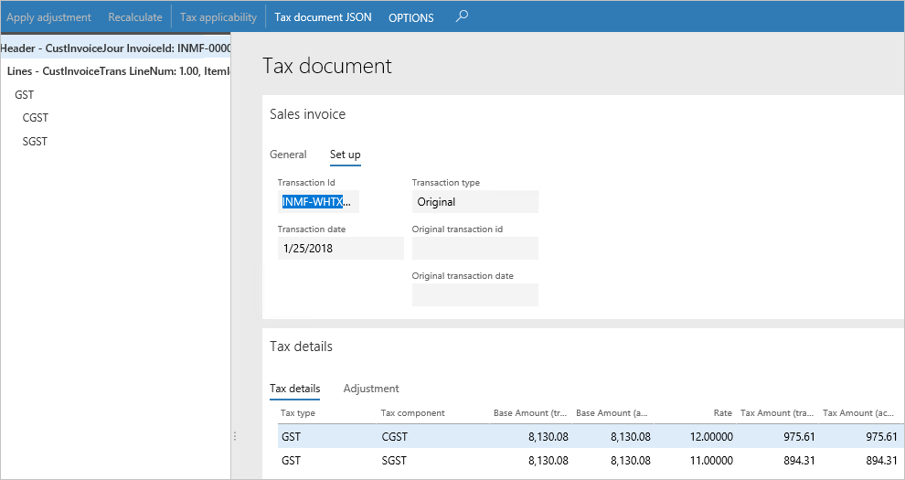

### Scenario 4: Sell an exempted good

1. Sign in to the POS.
2. Enter an exempted item.

    

3. Select **Exact** to process the payment.
4. Validate the receipt.

    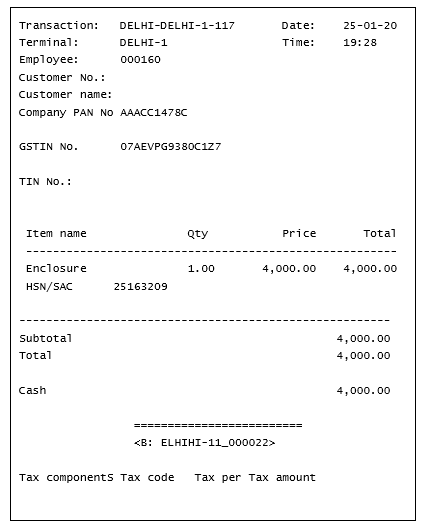

5. Validate the sales invoice in Headquarters:

    1. Go to **Retail and Commerce** \> **Retail and Commerce IT** \> **Data distribution**.
    2. Run job **P-0001** (**Channel transactions**).
    3. Close the page.

6. Post the statement:

    1. Go to **Retail and Commerce** \> **Channels** \> **Stores** \> **Open statements**.
    2. Create a statement.
    3. Select **Calculate statement** and then **Post statement**.

7. Validate the voucher transactions:

    1. Go to **Retail and Commerce** \> **Customers** \> **All sales orders**.
    2. Select the sales invoice.
    3. On the Action Pane, on the **Invoice** tab, select **Invoice journals**.
    4. Select **Voucher**.

        | Ledger account name    | Debit amount (Rs.) | Credit amount (Rs.) |
        |------------------------|--------------------|---------------------|
        | Customer account       | 12,000.00          |                     |
        | Sales - Finished Goods |                    | 12,000.00           |

    5. Select **Tax document**.
    6. Verify that the **Exempt** option is set to **Yes**.

### Scenario 5: Return the transaction that has GST:

1. Sign in to the POS.
2. Select **Show journal**.
3. Select the transaction, and then select **Return**.
4. Select **Select all** and then **Return**.
5. Verify that the GST calculation is done correctly, based on the selected original transactions that must be returned.

    

6. Select **Exact**.
7. Validate the receipt.

    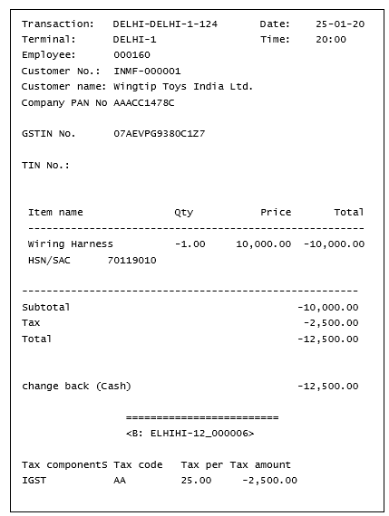

8. Validate the sales invoice in Headquarters:

    1. Go to **Retail and Commerce** \> **Retail and Commerce IT** \> **Data distribution**.
    2. Run job **P-0001** (**Channel transactions**).
    3. Close the page.

9. Post the statement:

    1. Go to **Retail and Commerce** \> **Channels** \> **Stores** \> **Open statements**.
    2. Create a statement.
    3. Select **Calculate statement** and then **Post statement**.

10. Validate the voucher transactions:

    1. Go to **Retail and Commerce** \> **Customers** \> **All sales orders**.
    2. Select the sales invoice.
    3. On the Action Pane, on the **Invoice** tab, select **Invoice journals**.
    4. Select **Voucher**.

        | Ledger account name  | Debit amount (Rs.) | Credit amount (Rs.) |
        |----------------------|--------------------|---------------------|
        | Customer account     |                    | 12,500.00           |
        | IGST payable account | 2,500.00           |                     |
        | Sales account        | 10,000.00          |                     |

    5. Select **Tax document**.
    6. Verify that the return receipt number is updated as the transaction ID.

## Update credit notes with references to original invoices

> [!NOTE]
> This functionality is available with Application update 10.0.3 and later.

In order to be correctly reflected in the GSTR reporting, sales credit notes should contain references to original sales invoices. When  store transactions are posted through statements, it is not always possible to establish this reference for return transactions. You can use the **Update credit notes with references to original invoices** procedure to update the **Original GST transaction ID** link in credit notes so that the link correctly references the related original sales invoice. The procedure is located on the **Retail and Commerce > Retail and Commerce IT > POS posting** menu.

It is also recommended that you enable the **Do not aggregate returns** parameter on the **Commerce parameters** page. In this case, each return transaction will be posted as a separate sale order when posting a statement. This option is only available if the transaction aggregation is enabled.

## Manage customer registration numbers from POS

You can specify customer registration numbers, such as GSTIN, VAT number (TIN), and PAN number, when creating or editing a customer master record and a customer address record in POS. The customer registration numbers may be printed in receipts or used for searching customers in POS.

> [!NOTE]
> It isn't possible to specify customer registration numbers in POS when **Create customer in async mode** is enabled in the POS functionality profile. Support for the ssync customer creation mode may be added in future updates.

### Configure printing customer registration numbers in receipts

To enable printing customer registration numbers in receipts, follow the procedure outlined in the [Configure language texts and custom fields](#configure-language-texts-and-custom-fields) section. Add language texts and custom fields with the following names:

- **TAXREGISTRATIONGST_IN** for the GST registration number;
- **TAXREGISTRATIONTIN_IN** for the VAT registration number;
- **TAXREGISTRATIONPAN_IN** for the PAN number.

Add the custom fields to receipt profiles.

### Enable searching customers by tax registration numbers in POS

To enable searching customers by tax registration numbers in POS, on the **POS search criteria** tab of the **Commerce parameters** page, add a record on the **Customer search criteria** fast-tab and select **Tax registration number** in the **Customer search criteria** drop-down list. Select the **Display as shortcut** checkbox while keeping the **Can be refined** checkbox clear. Run the 1110 job on the **Distribution schedules** page.

[!INCLUDE[footer-include](../../includes/footer-banner.md)]
