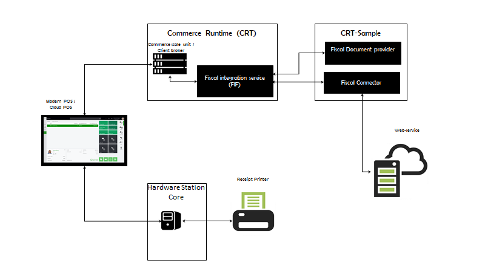
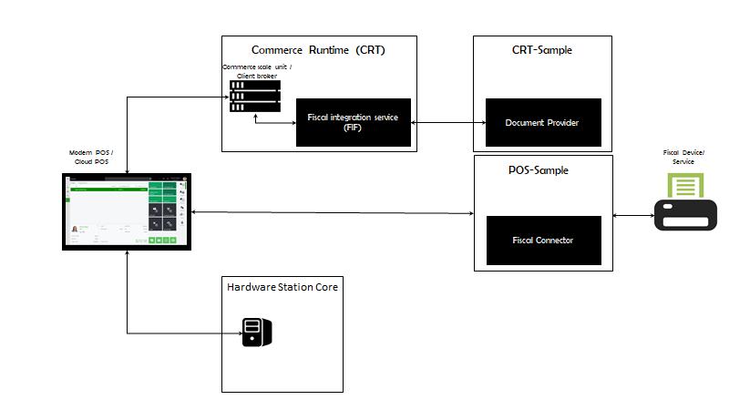

# Fiscal integration overview for Commerce channels

[!include [banner](../../../finance/includes/banner.md)]

This article is an overview of the fiscal integration capabilities that are available in Dynamics 365 Commerce. 

Fiscal integration includes integration with various fiscal devices and services that enable fiscal registration of sales in accordance with local fiscal laws that are aimed at preventing tax fraud in the retail industry. Here are some typical scenarios that can be covered by using fiscal integration:

- Register a sale on a fiscal device that is connected to point of sale (POS), such as a fiscal printer, and print a fiscal receipt for the customer.
- Securely submit information that is related to sales and returns that are completed in Retail POS to an external web-service that is operated by the tax authority.
- Help ensure inalterability of sales transaction data through digital signatures.

The fiscal integration functionality is a framework that provides a common solution for further development and customization of the integration between Retail POS and fiscal devices and services. The functionality also includes fiscal integration samples that support basic scenarios for specific countries or regions, and that work with specific fiscal devices or services. A fiscal integration sample consists of several extensions of Commerce components and is included in the software development kit (SDK). For more information about the fiscal integration samples, see [Fiscal integration samples in the Commerce SDK](#fiscal-integration-samples-in-the-commerce-sdk). For information about how to install and use the Commerce SDK, see [Retail software development kit (SDK) architecture](../../dev-itpro/retail-sdk/retail-sdk-overview.md).

To support other scenarios that aren't supported by a fiscal integration sample, to integrate Retail POS with other fiscal devices or services, or to cover requirements of other countries or regions, you must either extend an existing fiscal integration sample or create a new sample by using an existing sample as an example.

## Fiscal registration process and fiscal integration samples for fiscal devices and services

A fiscal registration process in Retail POS can consist of one or more steps. Each step involves fiscal registration of specific transactions or events in one fiscal device or service. The following solution components participate in the fiscal registration in a fiscal device or service:

- **Fiscal document provider** – This component serializes transaction/event data in the format that is also used for interaction with the fiscal device or service, parses responses from the fiscal device or service, and stores the responses in the channel database. The extension also defines the specific transactions and events that must be registered.
- **Fiscal connector** – This component initializes the communication with the fiscal device or service, sends requests or direct commands to the fiscal device or service, based on the transaction/event data that is extracted from the fiscal document, and receives responses from the fiscal device or service

A fiscal integration sample might contain the Commerce runtime (CRT), Hardware station, and POS extensions for a fiscal document provider and a fiscal connector. It also contains the following component configurations:

- **Fiscal document provider configuration** – This configuration defines an output method and a format for fiscal documents. It also contains a data mapping for taxes and payment methods, to make data from Retail POS compatible with the values that are predefined in the fiscal device or service firmware.
- **Fiscal connector configuration** – This configuration defines the physical communication with the specific fiscal device or service.

A fiscal registration process for a specific POS register is defined by a corresponding setting in the POS functionality profile. For more details about how to configure a fiscal registration process, upload fiscal document provider and fiscal connector configurations, and change configuration parameters, see [Set up a fiscal registration process](setting-up-fiscal-integration-for-retail-channel.md#set-up-a-fiscal-registration-process).

> [!NOTE]
> If you need devices for non-fiscal operations, such as product catalog search, customer lookup, or transaction draft creation, you can select these as registers with fiscal process restrictions. For more information, see [Set up registers with fiscal registration restrictions](setting-up-fiscal-integration-for-retail-channel.md#set-up-registers-with-fiscal-registration-restrictions).

The following typical fiscal registration flow starts with an event in the POS (for example, finalization of a sales transaction) and implements a predefined sequence of steps that involves other Commerce components (such as the CRT and Hardware station).

1. The POS requests a fiscal document from the fiscal integration framework (FIF).
1. The FIF determines whether the current event requires fiscal registration.
1. Based on the settings for the fiscal registration process, the FIF identifies a fiscal connector and a corresponding fiscal document provider to use for the fiscal registration.
1. The FIF runs the fiscal document provider that generates a fiscal document (for example, an XML document) that represents the transaction or event.
1. The FIF returns the generated fiscal document to the POS.
1. The POS requests that the FIF submit the fiscal document to the fiscal device or service.
1. The FIF runs the fiscal connector that processes the fiscal document and submits it to the fiscal device or service.
1. The FIF returns the fiscal response (that is, the response of the fiscal device or service) to the POS.
1. The POS analyzes the fiscal response to determine whether the fiscal registration was successful. As required, the POS requests that the FIF handle any errors that occurred. 
1. The POS requests that the FIF process and save the fiscal response.
1. The fiscal document provider processes the fiscal response. As part of this processing, the fiscal document provider parses the response and extracts extended data from it.
1. The FIF saves the response and the extended data to the channel database.
1. As required, the POS prints a receipt via a regular receipt printer that is connected to Hardware station. The receipt can contain required data from the fiscal response.
 
The following examples show fiscal registration execution flows for typical fiscal devices or services.
 
### Fiscal registration is done via a device connected to the Hardware station

This configuration is used when a physical fiscal device, such as a fiscal printer, is connected to the Hardware station. It's also applicable when the communication with a fiscal device or service is done via software that is installed on the Hardware station. In this case, the fiscal document provider is located on the CRT, and the fiscal connector is located on Hardware station.

### Fiscal registration is done via an external service

This configuration is used when fiscal registration is done via an external service, such as a web service that is operated by the tax authority. In this case, both the fiscal document provider and the fiscal connector are located on the CRT.

 
### Fiscal registration is done internally in the CRT

This configuration is used when no external fiscal device or service is required for fiscal registration. For example, it's used when fiscal registration is done through digital signing of sales transactions. In this case, both the fiscal document provider and the fiscal connector are located on the CRT.

### Fiscal registration is done via a device or service in the local network

This configuration is used when a physical fiscal device or fiscal service is present in the local network of the store and provides an HTTPS application programming interface (API). In this case, the fiscal document provider is located on the CRT, and the fiscal connector is located on the POS.

## Error handling

The fiscal integration framework provides the following options to handle failures during fiscal registration:

- **Retry** – The operator can use this option when the failure can be resolved quickly, and the fiscal registration can be rerun. For example, this option can be used when the fiscal device isn't connected, the fiscal printer is out of paper, or there is a paper jam in the fiscal printer.
- **Cancel** – This option lets the operator defer the fiscal registration of the current transaction or event if it fails. After the registration is deferred, the operator can continue to work on the POS and can complete any operation that the fiscal registration isn't required for. When any event that requires the fiscal registration occurs in the POS (for example, a new transaction is opened), the error handling dialog box automatically appears to notify the operator that the previous transaction wasn't correctly registered and to provide the error handling options.
- **Skip** – The operator can use this option when it's not possible to complete the fiscal registration of the current transaction or event, for example if the fiscal printer is out of order, **and** the fiscal registration can be omitted under specific conditions. For example, this option can be used when a sales transaction that the fiscal registration failed for can be registered in a special paper journal. After skipping the fiscal registration, regular operations can be continued on the POS. 
- **Mark as registered** – The operator can use this option when the current transaction or event has actually been registered in the fiscal device, for example a fiscal receipt has been printed, but a failure occurs when the fiscal response is being saved to the channel database. After marking the current transaction or event as registered, regular operations can be continued on the POS.
- **Postpone** – The operator can use this option when the transaction hasn't been registered because the registration device or service is unavailable **and** one of the following apply:
    - There is a backup fiscal registration option and it's possible to continue the fiscal registration process for the current transaction. For example, a local fiscal device can be a backup option for an online fiscal registration service when the service is unavailable.
    - The fiscal registration can be completed later by means other than the fiscal integration framework. For example, postponed transactions can later be fiscally registered in a batch by a separate functionality.
    
    After postponing the current transaction or event, regular operations can be continued on the POS.

> [!WARNING]
> The **Skip**, **Mark as registered**, and **Postpone** options should be considered emergency options and used only in exceptional cases. Discuss these error handling options with your legal or tax advisor and apply good judgment before enabling them. The options must be activated in the fiscal registration process before they are used. To make sure operators don't use them on a regular basis, corresponding permissions must be granted to operators.

A [fiscal transaction](#storing-fiscal-response-in-fiscal-transaction) is created when the **Skip**, **Mark as registered**, or **Postpone** options are selected, but the fiscal transaction doesn't contain a fiscal response. This allows you to capture the event of fiscal registration failure. These options also enable info codes to capture some specific information about a failure, such as the reason for the failure, or a justification for skipping the fiscal registration or marking the transaction as registered. For more details about how to set up error handling parameters, see [Set error handling settings](setting-up-fiscal-integration-for-retail-channel.md#set-error-handling-settings).

### Optional fiscal registration

Fiscal registration might be mandatory for some operations but optional for others. For example, the fiscal registration of regular sales and returns might be mandatory, but the fiscal registration of operations that are related to customer deposits might be optional. In this case, failure to complete the fiscal registration of a sale should block further sales, but failure to complete the fiscal registration of a customer deposit should not block further sales. To distinguish mandatory and optional operations, we recommend that you handle them through different document providers, and that you set up separate steps in the fiscal registration process for those providers. The **Continue on error** parameter should be enabled for any step that is related to optional fiscal registration. For more details about how to set up error handling parameters, see [Set error handling settings](setting-up-fiscal-integration-for-retail-channel.md#set-error-handling-settings).

### Manually rerun fiscal registration

If the fiscal registration of a transaction or event has been deferred after a failure (for example, if the operator selected **Cancel** in the error handling dialog box), you can manually rerun the fiscal registration by invoking a corresponding operation. For more details, see [Enable manual execution of deferred fiscal registration](setting-up-fiscal-integration-for-retail-channel.md#enable-manual-execution-of-deferred-fiscal-registration).

### Fiscal registration health check

The health check procedure for fiscal registrations verifies the availability of the fiscal device or service when specific events occur. If the fiscal registration can't currently be completed, the operator is notified in advance.

The POS runs the health check when the following events occur:

- A new transaction is opened.
- A suspended transaction is recalled.
- A sales or return transaction is finalized.

If the health check fails, the POS shows the health check dialog box. This dialog box provides the following buttons:

- **OK** – This button lets the operator ignore a health check error and continue to process the operation. Operators can select this button only if the **Allow skip health check error** permission is enabled for them.
- **Cancel** – If the operator selects this button, the POS cancels the last action (for example, an item isn't added to a new transaction).

> [!NOTE]
> The health check is run only if the current operation requires fiscal registration, and if the **Continue on error** parameter is disabled for the current step of the fiscal registration process. For more details, see [Set error handling settings](setting-up-fiscal-integration-for-retail-channel.md#set-error-handling-settings).

## Storing fiscal response in fiscal transaction

When fiscal registration of a transaction or event is successful, a fiscal transaction is created in the channel database and linked to the original transaction or event. Similarly, if the **Skip**, **Mark as registered**, or **Postpone** option is selected for a failed fiscal registration, this information is stored in a fiscal transaction. A fiscal transaction holds the fiscal response of the fiscal device or service. If the fiscal registration process consists of several steps, a fiscal transaction is created for each step of the process that resulted in a successful or failed registration.

Fiscal transactions are transferred to Headquarters by the *P-job*, together with transactions. On the **Fiscal transactions** FastTab of the **Store transactions** page, you can view the fiscal transactions that are linked to transactions.

A fiscal transaction stores the following details:

- Fiscal registration process details (process, connector group, connector, and so on). It also stores the serial number of the fiscal device in the **Register number** field, if this information is included in the fiscal response.
- The status of the fiscal registration: **Completed** for successful registration, **Skipped** if the operator selected the **Skip** option for a failed registration, **Marked as registered** if the operator selected the **Mark as registered** option, or **Postponed** if the operator selected the **Postpone** option.
- Info code transactions that are related to a selected fiscal transaction. To view the info code transactions, on the **Fiscal transactions** FastTab, select a fiscal transaction that has a status of **Skipped**, **Marked as registered**, or **Postponed**, and then select **Info code transactions**.

By selecting **Extended data**, you can also view some properties of the fiscal transaction. The list of properties that can be viewed is specific to the fiscal registration functionality that generated the fiscal transaction. For example, you can view the digital signature, sequential number, certificate thumbprint, hash algorithm identification, and other fiscal transaction properties for the digital signing functionality for France.

## Fiscal texts for discounts

Some countries or regions have special requirements about additional texts that must be printed on fiscal receipts when different kinds of discounts are applied. The fiscal integration functionality lets you set up a special text for a discount that is printed after a discount line on a fiscal receipt. For manual discounts, you can configure a fiscal text for the info code that is specified as the **Product discount** info code in the POS functionality profile. For more details about how to set up fiscal texts for discounts, see [Set up fiscal texts for discounts](setting-up-fiscal-integration-for-retail-channel.md#set-up-fiscal-texts-for-discounts).

## Printing fiscal X and fiscal Z reports

Fiscal integration functionality supports generation of end-of-day statements that are specific to the integrated fiscal device or service:

- New buttons that run corresponding operations should be added to the POS screen layout. For more details, see [Set up fiscal X/Z reports from the POS](setting-up-fiscal-integration-for-retail-channel.md#set-up-fiscal-xz-reports-from-the-pos).
- In the fiscal integration sample, these operations should be matched to the corresponding operations of the fiscal device.

## Fiscal integration samples in the Commerce SDK

The following fiscal integration samples are currently available in the Commerce SDK:

- [Fiscal printer integration sample for Italy](emea-ita-fpi-sample.md)
- [Fiscal printer integration sample for Poland](emea-pol-fpi-sample.md)
- [Fiscal registration service integration sample for Austria](emea-aut-fi-sample.md)
- [Fiscal registration service integration sample for Czech Republic](emea-cze-fi-sample.md)
- [Control unit integration sample for Sweden](emea-swe-fi-sample.md)
- [Fiscal registration service integration sample for Germany](emea-deu-fi-sample.md)
- [Digital signature sample for Norway](../norway/emea-nor-cash-registers.md)

The following fiscal integration functionality is also implemented by using the fiscal integration framework, but it's available out of the box and isn't included in the Commerce SDK:

- [Digital signature for France](../france/emea-fra-cash-registers.md)

The following legacy fiscal integration functionality that is available in the Commerce SDK doesn't use the fiscal integration framework and will be deprecated in later updates:

- [Control unit integration sample for Sweden (legacy)](retail-sdk-control-unit-sample.md)
- [Digital signature for France (legacy)](../france/emea-fra-deployment.md)
- [Digital signature for Norway (legacy)](emea-nor-loc-deployment-guidelines.md)

[!INCLUDE[footer-include](../../../includes/footer-banner.md)]
