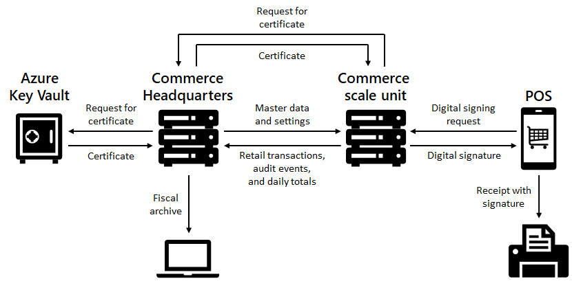

# Cash register functionality for France

[!include [banner](../includes/banner.md)]

This article provides an overview of the cash register functionality that is available for France in Microsoft Dynamics 365 Commerce. It also provides guidelines for setting up the functionality.

## Certification information

This version of the cash register functionality for France has passed an audit according to the NF 525 certification requirements and is granted a certificate of compliance that has the following category and number: 

- **Microsoft Dynamics 365 Commerce, version 10** (the most recent audited version is **10.0.27**):

    - Certificate category: B
    - Certificate number: 0498

An up-to-date certificate can be found on the [portal of the certification body](https://certificates.infocert.org/).

You can also view the certification information in the point of sale (POS) in the **NF 525 certification** dialog box. You can open this dialog box by selecting **View details** in the **NF 525 certification** section under **France** on the **Settings** page. If France-specific features are [enabled](#enable-features-for-france) in the **Feature management** workspace, and the fiscal registration functionality for France is correctly [enabled and configured](#set-up-fiscal-registration), the **NF 525 certification** dialog box shows the certified software name and version, the certification category, and the NF 525 certificate number.

### NF 525 compliance documentation

The following table shows the Dynamics 365 Commerce documentation that is related to the NF 525 certification.

| Document | Description | Links |
|----------|-------------|-------|
| 
High-level design

Technical architecture
 | This documentation describes the software product, its components, and data flows, and also the technical design of the product. | 
[Commerce home page](../welcome.md) and nested links

[Dynamics 365 Commerce architecture overview](../commerce-architecture.md)

[Design of the Commerce solution for France](#design-of-the-commerce-solution-for-france)
 |
| 
Functional specification

User documentation
 | This documentation describes the functions of the software. | 
[Commerce home page](../welcome.md) and nested links

[France-specific POS features](#france-specific-pos-features)
 |
| Versioning strategy | 
This documentation describes the versioning approach and the version management procedure for the software product.

The current major Dynamics 365 Commerce version is **10.0**. Service updates for this version are indicated by a consecutive number after the version number: **10.0.X**. For more information about the software lifecycle policy and service updates, use the links in this table.
 | 
[One Version service updates overview](../../fin-ops-core/dev-itpro/lifecycle-services/oneversion-overview.md)

[Software lifecycle policy and cloud releases](../../fin-ops-core/dev-itpro/migration-upgrade/versions-update-policy.md)

[Service update availability](../../fin-ops-core/fin-ops/get-started/public-preview-releases.md)

[Dynamics 365 release plans](/dynamics365/release-plans/)

[What's new or changed in Dynamics 365 Commerce](../get-started/whats-new-home-page.md)

[Dynamics 365 Commerce component versioning requirements](../arch-component-versioning.md)
 |
| Organizational documentation | This documentation describes the process that is established to control software product compliance. | [Globalization resources](../../fin-ops-core/dev-itpro/lcs-solutions/country-region.md) |
| Maintenance documentation | This documentation describes implementation and maintenance of the software solution. | 
[Service description](../../fin-ops-core/fin-ops/get-started/service-description.md)

[Before you buy](../../fin-ops-core/fin-ops/get-started/before-you-buy.md)

[Dynamics 365 Licensing Guide](https://www.microsoft.com/licensing/docs/grid/Microsoft-Dynamics-365)

[Implementation lifecycle management home page](../../fin-ops-core/fin-ops/imp-lifecycle/implementation-lifecycle.md)

[Synchronize self-service installers in Dynamics 365 Commerce](../dev-itpro/Synchronize-installers.md)

[Set up Commerce for France](#set-up-commerce-for-france)

[Compliance checklist](#compliance-checklist)

[Dynamics 365 Support](https://dynamics.microsoft.com/support/)

[Submit service requests](../../fin-ops-core/dev-itpro/lifecycle-services/submit-request-dynamics-service-engineering-team.md)

[One Version service updates overview](../../fin-ops-core/dev-itpro/lifecycle-services/oneversion-overview.md)
 |
| Auditor documentation | This documentation describes how to access the data, the files, and the process that are used by the authorities. | [Fiscal archive for France](./emea-fra-fiscal-archive.md) |

## Design of the Commerce solution for France

The following illustration shows the high-level design of the Commerce solution for France. For more information about Dynamics 365 Commerce components, see [Dynamics 365 Commerce architecture overview](../commerce-architecture.md).

The high-level, end-to-end process flow for France is as follows:

1. When the checkout process is completed for a sales transaction in POS, POS sends a digital signing request to the Commerce runtime (CRT) via Commerce Scale Unit (CSU). Digital signing of transactions and audit events is implemented by using the [Fiscal registration framework](./fiscal-integration-for-retail-channel.md) and an [internal](./fiscal-integration-for-retail-channel.md#fiscal-registration-is-done-internally-in-the-crt) connector.

    > [!NOTE]
    > If POS is in the offline mode, the digital signing occurs in the local copy of CRT on the POS machine.

1. CRT prepares the transaction data to be signed. For more information about digital signatures, see the [Digital signing overview](#digital-signing-overview) section.
1. CRT sends a request to Commerce headquarters to provide a digital certificate.
1. Commerce headquarters extracts the digital certificate from Azure Key Vault and sends it back to CRT. For more information about how Commerce handles digital certificates, see the [Configure the digital signature parameters](#configure-the-digital-signature-parameters) section.

    > [!NOTE]
    > If POS is in the offline mode, the local copy of CRT uses a digital certificate installed locally on the POS machine.

1. CRT digitally signs the transaction data. The signature, together with the signed data and other information, is saved in the channel database (DB) in a fiscal transaction that is linked to the sales transaction. The signature is returned to POS.
1. POS requests a sales receipt from CRT. CRT builds the receipt, including an extract from the digital signature of the transaction, and sends it back to POS. POS sends the receipt to the receipt printer.
1. When any of the audit events that must be digitally signed occur, the above steps, except for the receipt, are repeated for the audit event. The signature of the audit event is saved in the channel DB in a fiscal transaction that is linked to the audit event.
1. When the shift is closed, a shift closing audit event is registered and also digitally signed. The Z-report is printed on the receipt printer.
1. Headquarters downloads the transaction and audit event data together with fiscal transactions from CSU via Commerce Data Exchange (CDX). The data is stored in the headquarters DB throughout the period of life of your production environment.
1. As part of the fiscal period closing procedure, a period grand total journal is processed in headquarters and a fiscal archive is produced from the headquarters DB. The archive includes sales totals for a store for the fiscal period, along with details and signatures of all shifts, sales transactions, and audit events during the fiscal period. The period grand total journal and fiscal archive are digitally signed. For more information about period grand total journals, see [Period grand total journal](#period-grand-total-journal). For more information about fiscal archives, see [Fiscal archive for France](./emea-fra-fiscal-archive.md).

## France-specific POS features

The following France-specific POS features are enabled when the primary address of the legal entity that the store belongs to is in France.

### Registration of audit events

If the **Audit** option in the POS functionality profile is set to **Yes**, the following events are registered in the POS audit event log:

- Sign-in
- Sign-out
- Printing a copy of a receipt
- Starting offline mode
- Ending offline mode
- Applying a manager override
- Voiding a transaction 
- Voiding a transaction line
- Closing a shift
- Cleanup of transactions from the channel database
- Applying a major update of the software with compliance impact

### Digital signing overview

The following types of records (transactions and events) are digitally signed in POS:

- Sales and return transactions
- Copies of receipts
- Closed shifts/Z reports
- Audit events

The signature is created and recorded in the channel database at the same time that the transaction is finalized or the event is registered. The data that is signed is a text string that consists of several data fields. These fields vary, depending on the type of record. The general signing process consists of the following steps:

1. Select the next sequential number, for signing purposes, for the same register and type of record. 
1. Extract the data fields that must be signed from the record that is being signed.
1. Build a string that consists of a comma-separated list of the data fields.
1. Add the previous signature for the same register and type of record.
1. Calculate a hash code of the string.
1. Calculate an asymmetric electronic signature for the resulting string by using a digital certificate.
1. Do the base64url transformation for the resulting string.
1. Store the string that is used for signing, the sequential number, the signature, the hash algorithm identification, and the thumbprint of the certificate in a fiscal response record that is linked to the transaction or event.
1. Transfer the fiscal response to the enterprise resource planning (ERP) system in Commerce headquarters, together with the transaction or event.

> [!NOTE]
> The following hash functions aren't acceptable: CRC16, CRC32, SHA-1, and MD5. Commerce supports only the SHA256, SHA384, and SHA512 hash functions. If you want to use a different hash function, you must implement a customization.
>
> You can use either a digital certificate that is issued by an accredited body or a self-signed certificate for digital signing. Only certificates that have RSA-2048-bit or Elliptic Curve Digital Signature Algorithm (ECDSA) 224-bit minimum private keys are acceptable. Commerce supports only RSA-2048-bit or longer keys. If you want to use an ECDSA key, you must implement a customization.

### Digital signing of sales and return transactions

Only transactions for cash sales and returns are signed. Here are some examples of transactions that are excluded from the signing process:

- Prepayments (customer account deposits)
- Quotations
- Prepayments for sales orders (customer order deposits)
- Issuing a gift card and adding funds to a gift card
- Non-sales transactions (float entry, tender removal, and so on)

The data that is signed for a sales or return transaction is a text string that consists of the following data fields:

- The total amount of the sale or return, including tax per tax rate.
- The total amount of the sale or return, including tax.
- The date and time of the transaction, in YYYYMMDDHHMMSS format.
- The register number.
- The sequential number of the signed sales or return transaction for the register.
- The type of sales or return transaction.
- A value (Y/N) that indicates whether the transaction is the first signed sales or return transaction for the register.
- The previous signature for the same register. A blank value is used for the first signed sales or return transaction.

> [!NOTE]
> For digital signing purposes, return transactions are considered regular sales transactions. Therefore, the signing process for return transactions is the same as the signing process for sales transactions, and return transactions are included in the same sequence of signatures as sales transactions. The total amount of a return is negative. In other words, it includes a minus sign when it's added to the text string that is signed.

You can view the transaction signature and the transaction data that was used to generate it on the **Fiscal transactions** FastTab of the **Store transactions** page in Commerce headquarters. By selecting **Extended data**, you can view specific properties of the fiscal transaction, such as the signature, sequential number, certificate thumbprint, and hash algorithm identification. 

### Digital signing of receipt copies

When a copy of a receipt is printed, the event is registered in the POS audit event log. Only copies of receipts for signed sales transactions are signed. The data that is signed for a receipt copy event is a text string that consists of the following data fields:

- The register number that the copy of the receipt is printed from.
- The sequential number of the signed receipt copy event for the register.
- The type of transaction for the original sales transaction.
- The number of the receipt copy for the sales transaction.
- The staff ID of the operator who prints the receipt copy.
- The date and time of the receipt copy event, in YYYYMMDDHHMMSS format.
- The register number of the original sales transaction.
- The sequential number of the original sales transaction for the register.
- A value (Y/N) that indicates whether the transaction is the first signed receipt copy event for the register.
- The previous signature for the same register. A blank value is used for the first signed receipt copy event.

You can view the signature of the receipt copy, together with the event data that was used to generate it, on the **Fiscal registration results** tab of the **Audit events** page in Commerce headquarters.

### Digital signing of closed shifts

When a shift is closed, the event is registered in the POS audit event log. The data that is signed for a shift closing event is a text string that consists of the following data fields:

- The total amount of sales and returns for the shift, including tax per tax rate.
- The total amount of sales and returns for the shift, including tax.
- The cumulative perpetual grand total of absolute values of sales and returns for shifts of the same register, including tax. 
- The date and time of the shift closing event, in YYYYMMDDHHMMSS format.
- The date and time of the shift.
- The sequential number of the shift closing event for the register.
- A value (Y/N) that indicates whether the transaction is the first signed shift closing event for the register.
- The previous signature for the same register. A blank value is used for the first signed shift closing event.

> [!NOTE]
> Because of the requirement to maintain a chain of closed shifts for the same register, closing a shift on a register that is different from the one that the shift was opened on is not supported. It may be added in later updates.

You can view the signature of a closed shift, together with the shift data that was used to generate it, on the **Fiscal registration results** tab of the **Shifts** page in Commerce headquarters.

### Digital signing of events

Only the [France-specific](#registration-of-audit-events) audit events are signed. Three separate sequences of digitally signed audit events are maintained per register:

- The sequence of **Shift closed** audit events that are registered when shifts are closed
- The sequence of **Receipt copy printed** audit events that are registered when receipt copies are printed
- The sequence of other signed audit events

Audit events that aren't digitally signed are excluded from these sequences.

The data that is signed for an event other than a receipt copy or shift closing event is a text string that consists of the following data fields:

- The sequential number of the signed event for the register.
- A predefined event code.
- A description of the event.
- The date and time of the event.
- The staff ID of the operator who raised the event.
- The register number.
- A value (Y/N) that indicates whether the transaction is the first signed event for the register.
- The previous signature for the same register. A blank value is used for the first signed event.

You can view the event signature, together with the event data that was used to generate it, on the **Fiscal registration results** tab of the **Audit events** page in Commerce headquarters.

### Receipts

Receipts for France can include additional information that was implemented by using custom fields:

- **Transaction type** – You can add a field to a receipt format layout to identify the type of transaction. For example, a sales receipt will include the text "Sales."
- **Sequential number of signed sales transaction** – A receipt can include the sequential number of a signed sales transaction. This number is used to associate the printed receipt with a digital signature in the database.
- **Extract from digital signature** – A receipt can include an extract from the digital signature. This extract is used to confirm that the transaction is signed. It consists of a concatenation of the third, seventh, thirteenth, and nineteenth symbols of the signature.
- Information about a receipt copy:

    - **Reprint message** – A receipt copy can include a "Copy" caption.
    - **Reprint number** – An original receipt or a receipt copy can include the number of the receipt copy. For an original receipt, the value is **0** (zero).
    - **Reprint date** – A receipt copy can include the date of the copy.
    - **Reprint time** – A receipt copy can include the time of the copy in either the 12-hour format or the 24-hour format.
    - **Reprint signature** – A receipt copy can include an extract from the digital signature of the copy.

- **Line count** – A receipt can include the number of printed item lines on the receipt.
- **Sales totals** – Custom fields for receipt totals exclude non-sales amounts from the total transaction amounts. Non-sales amounts include amounts for the following operations:

    - Prepayments (customer account deposits)
    - Prepayments for sales orders (customer order deposits)
    - Issuing a gift card
    - Adding funds to a gift card

- **Certification data** – A receipt can include the category and number of a certificate of compliance that an authorized body issued per the NF 525 certification requirements.
- **Software version** – A receipt can include the version of the software that was certified per the NF 525 certification requirements and that is used to produce receipts.

### Restricting the duration of shifts

There is an option to enforce daily shift closing in POS. A shift can't last longer than the time that is specified in the **Shift closing time** field. (The time of the machine that POS is installed on is used.) Several minutes before that time, the operator will start to receive warnings that the shift must be closed. The number of minutes is determined by the value of the **Shift closing interval (minutes)** field. If the shift is closed and restarted within the warning interval, selling can continue after the shift closing time. Otherwise, completion of the sales transaction will be blocked, and the operator will have to either void or suspend the transaction, close the shift, open a new shift, and then recall and complete the transaction.

### X and Z reports

The information that is included on X and Z reports is based on French requirements:

- **Total sales** for the shift. This information includes amounts only for cash sales transactions. Prepayments and operations for issuing a gift card are excluded.
- **Total returns** for the shift.
- **Cumulative perpetual grand total**. This amount is calculated as the cumulative perpetual grand total amount of the previous shift, plus the total sales amount of this shift, minus the absolute value of the total return amount of this shift.
- **Cumulative perpetual grand total (absolute value)**. This amount is calculated as the cumulative perpetual grand total (absolute value) amount of the previous shift, plus the total sales amount of this shift, plus the absolute value of the total return amount of this shift.
- Value-added tax (VAT) amounts per tax rate.

The totals are also stored in the closed shift record and transferred to Commerce headquarters.

You can export a Z report from a closed shift in Commerce headquarters. An exported Z report is an XML file that includes the totals for the closed shift. Specifically, the file includes the data that is described in the following table.

| Element/Node                     | Comment |
|----------------------------------|---------|
| RegisterNumber                   | The identification of the register that the shift was opened on. |
| Date                             | The date of the shift. |
| TotalCashSales                   | The total amount of sales, including tax, for the shift. |
| TotalCashReturns                 | The absolute value of the total amount of returns, including tax, for the shift. |
| GrandTotal                       | The total amount of sales, including tax, minus the absolute value of the total amount of returns, including tax, for the shift. |
| PerpetualGrandTotal              | The cumulative perpetual grand total for the shift. In other words, the cumulative perpetual grand total for the previous shift of the same register, plus the total amount of sales, including tax, for the shift, minus the absolute value of the total amount of returns, including tax, for the shift. |
| PerpetualGrandTotalAbsoluteValue | The cumulative perpetual grand total (absolute value) for the shift. In other words, the cumulative perpetual grand total (absolute value) for the previous shift of the same register, plus the total amount of sales, including tax, for the shift, plus the absolute value of the total amount of returns, including tax, for the shift. |
| ShiftLines                       | A collection of grand total amounts per tax rate. |
| ShiftLine                        | A node for the grand total amount for a tax rate. |
| TotalInclTax                     | The grand total amount for the shift for the tax rate. |
| TaxRate                          | The tax rate. |
| TaxAmount                        | The grand total amount of tax for the tax rate. |
| SequentialNumber                 | The sequential number of the signed shift for the register. |
| DataToSign                       | The string that was [built from the elements of the shift record](#digital-signing-of-closed-shifts) and used for signing. |
| DataToSignFormatVersion          | The internal version of the format of data that was used for signing. |
| Signature                        | The digital signature of the shift record. |
| HashAlgorithm                    | The hash algorithm that was used to hash the data before signing. |
| CertificateThumbprint            | The thumbprint of the certificate that was used for signing. |

The exported Z report file is digitally signed, and the signature is contained in a separate file.

### Period grand total journal

Period grand total journals summarize sales totals per store and fiscal period (for example, per month), and should be used as part of the fiscal period closing procedure. In addition, an annual journal summarizes sales totals per store and fiscal year, and should be used as part of the year closing procedure.

Before you create a period grand total journal, you must ensure that retail sales data for the store and the fiscal period is uploaded to Commerce headquarters and processed in retail statements.

Period grand total journals are maintained on the **Period grand total journal** page.

1. To create a new journal, you must specify a store. If previous journals exist for the store, the next fiscal period after the last closed journal for the store is automatically used as the new journal period. If previous journals don't exist, you can specify the end date of the journal. In this case, the fiscal period that includes the specified date is used as the journal period.
1. The journal can then be calculated. Shifts that were closed during the journal period are selected, and totals are calculated for those shifts. You can view the journal's tax totals per sales tax code and the shifts that are included in the journal. You can also select **Functions \> Clear journal** to clear the calculation results and return the journal to **New** status.
1. After the journal is calculated, it can be closed. A closed journal can't be modified, and another journal can't be created for a previous fiscal period, the same period, or an intersecting period. However, the last closed journal for a store can be canceled. In that case, another journal can be created for the same store and fiscal period.

A closed journal is digitally signed. The data that is signed for a closed journal is a text string that consists of the following data fields:

- The total amounts of sales and returns for the store and period, including tax per tax rate.
- The total amount of sales and returns for the store and period, including tax.
- The cumulative perpetual grand total of absolute values of sales and returns for the store and period, including tax. 
- The date and time of closing the journal, in YYYYMMDDHHMMSS format.
- The start and end dates of the period.
- The sequential number of the signed period grand total journal for the store.
- A value (Y/N) that indicates whether the journal is the first signed journal for the store.
- The previous signature for the store and period. A blank value is used for the first signed journal for the store.

You can view the journal signature, together with the journal data that was used to generate it, on the **Signature details** tab of the **Period grand total journal** page in Commerce headquarters.

You must create and close period grand total journals for all stores every fiscal period. Journal maintenance can be automated by using the following two periodic procedures that can be run in batch mode:

- **Create period grand total journals** – This procedure creates and optionally calculates journals for selected stores for a given period. You must select a specific period for the procedure. Therefore, you must manually create a batch job for each period and can't use recurrence. The procedure doesn't close the journals, because it's expected that each journal will be manually validated before it's closed.
- **Export archive** – This procedure exports archives for selected stores for a given period. You must select a specific period for the procedure and can't use recurrence.

A period grand total journal can also be marked as **Annual** when it's created. An annual journal summarizes period grand total journals for the fiscal periods of a fiscal year. An annual journal can be created for a fiscal year only if a journal for the last fiscal period of the fiscal year has been created, calculated, and closed. However, journals don't have to exist for *all* fiscal periods of the fiscal year. For example, if a new store is opened in the middle of the year, the first journal will correspond to the fiscal period that the store is opened during. In this case, the first annual journal will summarize journals for fiscal periods from the fiscal period that the store is opened during to the last fiscal period of the fiscal year.

### Fiscal archive

A fiscal archive is an XML file that can be exported from a period grand total journal that has been closed. It includes the totals for the closed period. It also includes detailed data about sales transactions and events. The exported file is digitally signed, and the signature is contained in a separate file. Exported fiscal archives must be kept on secured external media for the legal retention period.

Commerce also includes a tool that can be used to verify the integrity of a fiscal archive, and to detect violations of the signature of the archive and of the chains of signed records in the archive. This tool takes the form of a Windows PowerShell script that is available via the Commerce software development kit (SDK). For detailed information about the structure of the fiscal archive format and guidance about how to use the Fiscal archive integrity verification tool, see [Fiscal archive for France](./emea-fra-fiscal-archive.md).

## Set up Commerce for France

This section describes the Commerce settings that are specific to and recommended for France. For more information about common Commerce features and settings, see [Commerce home page](../welcome.md).

To use the France-specific functionality, you must complete these tasks:

- Set the **Country/region** field to **FRA** (France) in the primary address of the legal entity.
- Set the **ISO code** field to **FR** (France) in the POS functionality profile of every store that is located in France.

You must also specify the following settings for France. Note that you must run appropriate distribution jobs after you complete the setup.

1. [Enable Commerce features](#enable-features-for-france) for France in the **Feature management** workspace.
1. [Specify various registration numbers](#set-up-the-legal-entity) of the organization, such as the VAT identifier, on the **Legal entities** page. These registration numbers will be used when the fiscal archive is exported.
1. [Set up VAT](#set-up-vat-per-french-requirements) per the French VAT regulations.
1. [Set up POS functionality profiles](#set-up-pos-functionality-profiles) to enable features and options that are required for France.
1. [Configure custom fields](#configure-custom-fields-so-that-they-can-be-used-in-receipt-formats-for-sales-receipts) and [receipt formats](#configure-receipt-formats) to comply with the local regulatory requirements.
1. [Configure the fiscal registration functionality](#set-up-fiscal-registration) for France to enable digital signing of sales transactions and audit events.
1. [Configure digital certificates](#configure-the-digital-signature-parameters) and other parameters of digital signing for the Commerce channel and Commerce headquarters sides.
1. [Specify Electronic reporting (ER) formats](#configure-the-z-report-and-archive-export-formats) that should be used to export Z-reports and fiscal archives from Commerce headquarters.
1. [Reinitialize Commerce components](#reinitialize-commerce-components) to enable France-specific audit events and transmission of France-specific data from POS to Commerce headquarters.
1. [Configure channel components](#configure-channel-components) to enable France-specific extensions of the components.

    > [!IMPORTANT]
    > You should configure channel components only if you're using Commerce version 10.0.28 or earlier. As of version 10.0.29, all required Commerce channel components for France are enabled out of the box. If you're using Commerce version 10.0.28 or earlier, and are migrating to Commerce version 10.0.29 or later, you must follow the steps in [Migrate to Commerce version 10.0.29 or later](./emea-fra-fi-deployment.md#migrate-to-commerce-version-10029-or-later).

1. [Enable the digital signature in offline mode](#enable-the-digital-signature-in-offline-mode).
1. [Validate your configuration](#compliance-checklist) to make sure all France-specific features work properly.

### Enable features for France

You must enable the following features in the **Feature management** workspace:

- (France) Enable additional audit events in POS
- (France) Enable additional information in end-of-day statements in POS
- (France) Enable exporting Z-Report to file

### Set up the legal entity

You must make the following changes on the **Legal entities** page. These settings are used in the archive format.

- On the **Bank account information** FastTab, in the **Routing number** field, specify the VAT identifier of the organization.
- On the **Registration numbers** FastTab, in the **NAF code** field, specify the Nomenclature des Activités Françaises (NAF) code of the organization.
- On the **Tax registration** FastTab, in the **Tax registration number** field, specify the Système d'identification du répertoire des établissements (SIRET) number of the organization.

### Set up VAT per French requirements

You must create sales tax codes, sales tax groups, and item sales tax groups. You must also set up sales tax information for products and services. For more information about how to set up and use sales tax, see [Sales tax overview](/dynamics365/finance/general-ledger/indirect-taxes-overview).

You must also specify sales tax groups and enable the **Prices include sales tax** option for stores that are located in France.

### Set up POS functionality profiles

You must enable printing of Z-reports by setting the **Print X/Z report on POS** option to **Yes**.

You must enable auditing by setting the **Audit** option to **Yes**.

To enforce daily shift closing, you must make the following changes:

- Set the **Enforce daily shift closing** option to **Yes**.
- Set the **Shift closing time** and **Shift closing interval (minutes)** fields.

### Configure custom fields so that they can be used in receipt formats for sales receipts

You can configure the language text and custom fields that are used in the POS receipt formats. The default company of the user who creates the receipt setup should be the same legal entity where the language text setup is created. Alternatively, the same language texts should be created in both the user's default company and the legal entity of the store that the setup is created for.

On the **Language text** page, add the following records for the labels of the custom fields for receipt layouts. Note that the **Language ID**, **Text ID**, and **Text** values that are shown in the table are just examples. You can change them to meet your requirements. However, the **Text ID** values that you use must be unique, and they must be equal to or higher than 900001.

| Language ID | Text ID | Text                      |
|-------------|---------|---------------------------|
| en-US       | 900001  | Transaction type          |
| en-US       | 900002  | Sequential number         |
| en-US       | 900003  | Digital signature         |
| en-US       | 900004  | Reprint number            |
| en-US       | 900005  | Sales tax basis           |
| en-US       | 900006  | Sales tax amount          |
| en-US       | 900007  | Sales total               |
| en-US       | 900008  | Sales total tax           |
| en-US       | 900009  | Sales total including tax |
| en-US       | 900010  | NF 525 Certificate        |
| en-US       | 900011  | Line count                |
| en-US       | 900012  | Reprint date              |
| en-US       | 900013  | Reprint time 12H          |
| en-US       | 900014  | Reprint time 24H          |
| en-US       | 900015  | Reprint digital signature |

On the **Custom fields** page, add the following records for the custom fields for receipt layouts. Note that **Caption text ID** values must correspond to the **Text ID** values that you specified on the **Language text** page.

| Name                            | Type    | Caption text ID |
|---------------------------------|---------|-----------------|
| TRANSACTIONTYPE_FR              | Receipt | 900001          |
| SEQUENTIALNUMBER_FR             | Receipt | 900002          |
| DIGITALSIGNATURE_FR             | Receipt | 900003          |
| REPRINTNUMBER_FR                | Receipt | 900004          |
| SALESTAXBASIS_FR                | Receipt | 900005          |
| SALESTAXAMOUNT_FR               | Receipt | 900006          |
| SALESTOTAL_FR                   | Receipt | 900007          |
| SALESTOTALTAX_FR                | Receipt | 900008          |
| SALESTOTALINCLUDETAX_FR         | Receipt | 900009          |
| CERTIFICATENUMBERANDCATEGORY_FR | Receipt | 900010          |
| LINECOUNT_FR                    | Receipt | 900011          |
| REPRINTDATE_FR                  | Receipt | 900012          |
| REPRINTTIME12H_FR               | Receipt | 900013          |
| REPRINTTIME24H_FR               | Receipt | 900014          |
| REPRINTDIGITALSIGNATURE_FR      | Receipt | 900015          |

### Configure receipt formats

For every required receipt format, change the value of the **Print behavior** field to **Always print**. You must also configure hardware profiles to support receipt printers and to enable Hardware station. For more information about how to work with POS peripherals, see [Peripherals](../retail-peripherals-overview.md).

In the Receipt format designer, add the following custom fields to the appropriate receipt sections. Note that field names correspond to the language texts that you defined in the previous section.

- **Header:** Add the following field:

    - **Transaction type** – This field identifies the type of receipt.
    - **Reprint message** – This standard field prints a "Copy" caption on a receipt copy.

- **Lines:** We recommend that you add the following standard fields:

    - **Unit price with tax**
    - **Total price with tax**
    - **Tax ID**

- **Footer:** Add the following fields:

    - **Sales total** – This field prints the receipt's total cash sale amount. The amount excludes tax. Prepayments and gift card operations are excluded.
    - **Sales total tax** – This field prints the receipt's total tax amount for cash sales. Prepayments and gift card operations are excluded. 
    - **Sales total including tax** – This field prints the receipt's total cash sale amount. The amount includes tax. Prepayments and gift card operations are excluded.
    - **Tax ID** – This standard field enables a sales tax summary to be printed per sales tax code. The field must be added to a new line.
    - **Sales tax basis** – This field prints the receipt's tax basis for cash sales per sales tax code. Prepayments and gift card operations are excluded. The field must be added to the same line as the **Tax ID** field.
    - **Sales tax amount** – This field prints the receipt's tax amount for cash sales per sales tax code. Prepayments and gift card operations are excluded. The field must be added to the same line as the **Tax ID** field.
    - **Sequential number** – This field prints the sequential number of a signed sales transaction.
    - **Digital signature** – This field prints the extract from the digital signature.
    - **Reprint number** – This field prints the number of a receipt copy. For an original receipt, the value is **0** (zero).
    - **Reprint date** – This field prints the date of a receipt copy.
    - **Reprint time 12H** or **Reprint time 24H** – This field prints the time of a receipt copy in the selected format.
    - **Reprint digital signature** – This field prints an extract from the digital signature of a receipt copy.
    - **NF 525 Certificate** – This field prints the category and number of the certificate of compliance that an authorized body issued to Dynamics 365 Commerce version 10 per the NF 525 certification requirements.
    - **Text** – Add a text field, and specify the version of the software that was certified per the NF 525 certification requirements and that is used to produce receipts (for example, **Microsoft Dynamics 365 Commerce v.10**).

        > [!NOTE]
        > If you customize the POS application, and your customizations affect the compliance of the application, you might have to request a new certificate of compliance from an accredited body. In this case, you must override the certificate category and number, and specify a corresponding software version number. Otherwise, the default values for the certificate category and number will be printed.

    - **Line count** – This field prints the number of printed item lines on a receipt.
    - **Text** – Add a text field, and specify the VAT identifier of the organization.
    - **Text** – Add a text field, and specify the NAF code of the organization.
    - **Text** – Add a text field, and specify the SIRET number of the organization.
    - **Store name** – This standard field prints the name of the store.
    - **Store address** – This standard field prints the address of the store.

For more information about how to work with receipt formats, see [Set up and design receipt formats](../receipt-templates-printing.md).

### Set up fiscal registration

Complete the fiscal registration setup steps that are described in [Set up the fiscal integration for Commerce channels](./setting-up-fiscal-integration-for-retail-channel.md):

1. [Set up a fiscal registration process](./setting-up-fiscal-integration-for-retail-channel.md#set-up-a-fiscal-registration-process). Be sure to note the settings of the fiscal registration process that are [specific to France](#configure-the-fiscal-registration-process).
1. [Set error handling settings](./setting-up-fiscal-integration-for-retail-channel.md#set-error-handling-settings).
1. [Enable manual execution of deferred fiscal registration](./setting-up-fiscal-integration-for-retail-channel.md#enable-manual-execution-of-deferred-fiscal-registration).

#### Configure the fiscal registration process

To enable the fiscal registration process for France in Commerce headquarters, follow these steps.

1. Download configuration files for the fiscal document provider and the fiscal connector from the Commerce SDK:

    1. Open the [Dynamics 365 Commerce Solutions](https://github.com/microsoft/Dynamics365Commerce.Solutions/) repository.
    2. Open the last available release branch.
    3. Open **src \> FiscalIntegration \> SequentialSignatureFrance \> Configurations**.
    4. Download the fiscal connector configuration file at **Connector \> ConnectorMicrosoftSequentialSignatureFRA.xml**.
    5. Download the fiscal document provider configuration file at **DocumentProvider \> DocumentProviderMicrosoftSequentialSignatureFRA.xml**.

1. Go to **Retail and Commerce \> Headquarters setup \> Parameters \> Shared parameters**. On the **General** tab, set the **Enable fiscal integration** option to **Yes**.
1. Go to **Retail and Commerce \> Channel setup \> Fiscal integration \> Fiscal connectors**, and load the fiscal connector configuration file that you downloaded earlier.
1. Go to **Retail and Commerce \> Channel setup \> Fiscal integration \> Fiscal document providers**, and load the fiscal document provider configuration file that you downloaded earlier.
1. Go to **Retail and Commerce \> Channel setup \> Fiscal integration \> Connector functional profiles**. Create a new connector functional profile, and select the document provider and the connector that you loaded earlier. Update the data mapping settings as required.
1. Go to **Retail and Commerce \> Channel setup \> Fiscal integration \> Connector technical profiles**. Create a new connector technical profile, and select the connector that you loaded earlier. Set the connector type to **Internal**. Update the other connection settings as required.
1. Go to **Retail and Commerce \> Channel setup \> Fiscal integration \> Fiscal connector groups**, and create a new fiscal connector group for the connector functional profile that you created earlier.
1. Go to **Retail and Commerce \> Channel setup \> Fiscal integration \> Fiscal registration processes**. Create a new fiscal registration process, create a fiscal registration process step, and select the fiscal connector group that you created earlier.
1. Go to **Retail and Commerce \> Channel setup \> POS setup \> POS profiles \> Functionality profiles**. Select a functionality profile that is linked to the store where the registration process should be activated. On the **Fiscal registration process** FastTab, select the fiscal registration process that you created earlier. On the **Fiscal services** FastTab, select the connector technical profile that you created earlier. 
1. Go to **Retail and Commerce \> Retail and Commerce IT \> Distribution schedule**. Open the distribution schedule, and select jobs **1070** and **1090** to transfer data to the channel database.

### Configure the digital signature parameters

You must configure certificates that will be used for digital signing of records on the Commerce channel side (sales transactions and audit events) and on the Commerce headquarters side (period grand total journals, Z reports, and fiscal archives). The signing is done by using a digital certificate that is stored in Azure Key Vault. For the offline mode of the Store Commerce app, the signing can also be done by using a digital certificate that is stored in the local storage of the machine that the Store Commerce app is installed on. The [User-defined certificate profiles for retail stores](./certificate-profiles-for-retail-stores.md) feature enables configuration of certificates that are stored in Key Vault. It also supports failover to offline mode when Key Vault or Commerce headquarters isn't available. This feature extends the [Manage secrets for retail channels](../dev-itpro/manage-secrets.md) feature.

> [!NOTE]
> You can use either a digital certificate that is issued by an accredited body or a self-signed certificate for digital signing. Only certificates that have RSA-2048-bit or Elliptic Curve Digital Signature Algorithm (ECDSA) 224-bit minimum private keys are acceptable. Commerce supports only RSA-2048-bit or longer keys. If you want to use an ECDSA key, you must implement a customization.

To configure certificates and certificate profiles that can be used for digital signing, follow the steps in [Set up certificate profiles](./certificate-profiles-for-retail-stores.md#set-up-certificate-profiles).

After you configure certificate profiles, go to **Retail and Commerce \> Channel setup \> Fiscal integration \> Connector technical profiles**, select the connector technical profile that you created earlier, and then, on the **Settings** FastTab, set the following parameters for digital signatures:

- **Certificate profile** – Select the certificate profile that you configured earlier.
- **Hash algorithm** – Specify one of the cryptographic hash algorithms that are supported by Microsoft .NET (for example, **SHA256**).
- **Activate health check** – For more information about the health check feature, see [Fiscal registration health check](./fiscal-integration-for-retail-channel.md#fiscal-registration-health-check).

Finally, on the **Commerce parameters** page (**Retail and Commerce \> Headquarters setup \> Parameters \> Commerce parameters**), you must specify the following parameters for digital signing on the Commerce headquarters side:

- **Certificate** – Select a certificate that is stored in Key Vault.
- **Hash function** – Specify one of the cryptographic hash algorithms that are supported by Microsoft .NET, such as **SHA256**.
- **Encoding** – Specify the encoding of the signed data, such as **UTF-8**.
- You can also specify a number sequence to use for automatic numbering of period grand total journals. On the **Number sequences** tab, select a record where the **Reference** field is set to **Period grand total journal**, and then select a number sequence code in it.

> [!NOTE]
> The following hash functions aren't acceptable: CRC16, CRC32, SHA-1, and MD5. Commerce supports only the SHA256, SHA384, and SHA512 hash functions. If you want to use a different hash function, you must implement a customization.

### Configure the Z report and archive export formats

Depending on your purposes, you can download the ER configurations for the Z report and archive from the following sources:

- If you don't have to customize the ER configurations that are provided by Microsoft or create your own ER configurations, you can import the Microsoft-provided configurations from Microsoft Dynamics Lifecycle Services. For more information, see [Import a configuration from Lifecycle Services](../../fin-ops-core/dev-itpro/analytics/download-electronic-reporting-configuration-lcs.md). Alternatively, you can [download ER configurations from the Global repository of Configuration service](../../fin-ops-core/dev-itpro/analytics/er-download-configurations-global-repo.md).
- If you must customize the ER configurations that are provided by Microsoft or create your own ER configurations, you must provision a Regulatory Configuration Services (RCS) environment. For more information about how to work with RCS, see [Import ER configurations from RCS](../../fin-ops-core/dev-itpro/analytics/rcs-download-configurations.md).

You must download the following versions (or later versions) of the configurations:

- **Retail channel data.version.2** data model
- **Archiving DMM.version.2.3** data model mapping
- **Retail Z-Report (FR).version.24.23.3** format
- **Retail data archive (FR).version.2.5** format

After you import the configurations, select ER formats for the Z report and archive in the following fields on the **Electronic documents** tab of the **Commerce parameters** page:

- **Z-Report export format** – Select the **Retail Z-Report (FR).version.24.23.3** format or the format that you downloaded earlier.
- **Retail data archive export format** – Select the **Retail data archive (FR).version.2.5** format or the format that you downloaded earlier.

### Reinitialize Commerce components

> [!NOTE]
> You only need to complete the steps of this section if you are updating an existing environment.

To enable audit events, you must reinitialize the Commerce extensible enumerations. To enable France-specific data to be transmitted from POS to Commerce headquarters, you must reinitialize the Commerce scheduler.

1. On the **Commerce parameters** page, on the **General** FastTab, select **Initialize**. For more information, see [Initialize seed data in new Retail environments](../enable-configure-retail-functionality.md).
1. There is an option to separately configure the scheduler. Go to **Commerce scheduler** \> **Initialize Commerce scheduler**. In the **Initialize Commerce scheduler** dialog box, select **OK**.

### Configure channel components

> [!IMPORTANT]
> You should configure channel components only if you're using Commerce version 10.0.28 or earlier. As of version 10.0.29, all required Commerce channel components for France are enabled out of the box. If you're using Commerce version 10.0.28 or earlier, and are migrating to Commerce version 10.0.29 or later, you must follow the steps in [Migrate to Commerce version 10.0.29 or later](./emea-fra-fi-deployment.md#migrate-to-commerce-version-10029-or-later).

To enable France-specific functionality, you must configure extensions for channel components. For more information, see the [deployment guidelines](./emea-fra-fi-deployment.md).

> [!NOTE]
> This version of the Commerce functionality for France is based on the [Fiscal integration framework](./fiscal-integration-for-retail-channel.md). For information about the legacy digital signing sample for France, see [Deployment guidelines for cash registers for France (legacy)](./emea-fra-deployment.md). For guidance about how to enable the fiscal integration functionality for France in existing environments that use the legacy digital signing sample, see [Migrate from legacy Commerce functionality for France](./emea-fra-fi-migration.md).

### Enable the digital signature in offline mode

To enable the digital signature in offline mode, you must follow these steps after you activate POS on a new device.

1. Sign in to POS.
1. On the **Database connection status** page, ensure that the offline database is fully synchronized. When the value of the **Pending downloads** field is **0** (zero), the database is fully synchronized.
1. Sign out of POS.
1. Wait for the offline database to be fully synchronized.
1. Sign in to POS.
1. On the **Database connection status** page, ensure that the offline database is fully synchronized. When the value of the **Pending transactions in offline database** field is **0** (zero), the database is fully synchronized.
1. Restart POS.

## Compliance checklist

This section describes basic scenarios that you can complete to validate that your environment is correctly configured so that it complies with the cash register requirements for France. These scenarios can be completed in a series, so that they constitute a comprehensive end-to-end compliance checklist. We recommend that you start the validation with a clean database, so that you can easily validate sequential numbers and perpetual amounts.

1. [Preparation](#1-preparation)
1. [Basic sale](#2-basic-sale)
1. [Basic return](#3-basic-return)
1. [Issue gift card](#4-issue-gift-card)
1. [Customer order](#5-customer-order)
1. [Hybrid customer order](#6-hybrid-customer-order)
1. [Sale in offline mode](#7-sale-in-offline-mode)
1. [Non-sale transaction (expense)](#8-non-sale-transaction-expense)
1. [Print receipt copy](#9-print-receipt-copy)
1. [Audit events](#10-audit-events)
1. [Close shift and print Z-report](#11-close-shift-and-print-z-report)
1. [Shift duration restriction](#12-shift-duration-restriction)
1. [Process period grand total journal](#13-process-period-grand-total-journal)
1. [Export and verify fiscal archive](#14-export-and-verify-fiscal-archive)

### Validation

#### Validate a sales transaction

To validate a digitally signed sales transaction after it's completed, follow these steps.

1. In POS, verify that all [France-specific fields](#configure-receipt-formats) of the receipt, except the fields that are related to a receipt copy, are printed and have correct values. To check some of the fields, you must complete the next step.
1. In Commerce headquarters, follow these steps:

    1. Run the P-job to download retail transaction data to Commerce headquarters.
    1. Open the **Store transactions** page, and select the recently completed transaction.
    1. On the **Fiscal transactions** FastTab, verify that there is a fiscal transaction that has a successful registration status.
    1. Verify that the text in the **Fiscal register response** field is in JavaScript Object Notation (JSON) format and contains the following information:

        - The digital signature of the transaction
        - The string that was used for digital signing of the transaction
        - The signed transaction sequential number
        - The thumbprint of the certificate that is used for digital signing
        - The hash algorithm
        - The version of the digital signing algorithm, which can be used later to verify the digital signature

    1. You can also select **Extended data** and view specific properties of the fiscal transaction, such as the signature, sequential number, certificate thumbprint, and hash algorithm identifier.
    1. Verify that the signed transaction sequential number equals the sequential number of the previous signed sales transaction on the same register (if there is any previous signed sales transaction) plus 1. This sequential number should also be printed in the **Sequential number** field of the receipt.
    1. Check the string that was used for [digital signing of the transaction](#digital-signing-of-sales-and-return-transactions). Validate the amounts of the transaction, the register number, and other data. Check the previous signature for the same register.
    1. Verify that the **Digital signature** field of the receipt contains an extract from the digital signature of the transaction, and that it consists of a concatenation of the third, seventh, thirteenth, and nineteenth symbols of the signature.
    1. Note the sequential number of the signed transaction and its digital signature, so that you can use this information for further validation of the next transaction.

#### Validate a shift

To validate a digitally signed shift after it's closed, follow these steps.

1. In POS, verify that all [France-specific fields](#x-and-z-reports) of the Z-report are printed and have correct values. To check some of the fields, you must complete the next step.
1. In Commerce headquarters, follow these steps:

    1. Run the P-job to download retail transaction data to Commerce headquarters.
    1. Open the **Shifts** page, and select the recently closed shift.
    1. Compare France-specific fields (that is, **Total sales**, **Total returns**, **Grand total**, **Cumulative perpetual grand total**, and **Cumulative perpetual grand total (absolute value)**) with the fields that are printed on the Z-report.
    1. Select **Shift tax transactions**, compare the VAT amounts per tax rate with the VAT amounts that are printed on the Z-report, and then close the **Shift tax transactions** page.
    1. On the **Shifts** page, select **Audit events**. The audit event that was registered when the shift was closed should be shown, and the **Log string** field should contain the shift number.
    1. On the **Fiscal registration results** FastTab, verify that there is a fiscal transaction that has a successful registration status.
    1. Verify that the text in the **Fiscal register response** field is in JSON format and contains the following information:

        - The digital signature of the shift
        - The string that was used for digital signing of the shift
        - The signed shift sequential number
        - The thumbprint of the certificate that is used for digital signing
        - The hash algorithm
        - The version of the digital signing algorithm, which can be used later to verify the digital signature

    1. Verify that the signed shift sequential number equals to the sequential number of the previous signed closed shift on the same register (if there is any previous signed closed shift) plus 1.
    1. Check the string that was used for [digital signing of the shift](#digital-signing-of-closed-shifts). Validate the amounts of the shift and other data. Check the previous signature for the same register.
    1. Note the sequential number of the signed shift and its digital signature, so that you can use this information for further validation of the next shift.

#### Validate an audit event

To validate a digitally signed audit event, follow these steps.

1. In Commerce headquarters, run the P-job to download audit event data to Commerce headquarters.
1. Open the **Audit events** page, and select an audit event. You can use the **Store number**, **Register number**, **Event type**, **Date**, and **Time** fields to find the event. The **Log string** field contains the description of the event.
1. On the **Fiscal registration results** FastTab, verify that there is a fiscal transaction that has a successful registration status.
1. Verify that the text in the **Fiscal register response** field is in JSON format and contains the following information:

    - The digital signature of the event
    - The string that was used for digital signing of the event
    - The signed event sequential number
    - The thumbprint of the certificate that is used for digital signing
    - The hash algorithm
    - The version of the digital signing algorithm, which can be used later to verify the digital signature

1. Verify that the signed event sequential number equals the sequential number of the previous signed event of the same event sequence type on the same register (if there is any previous signed event) plus 1.

    > [!NOTE]
    > Only the [France-specific audit events](#registration-of-audit-events) are signed. The following three sequences of digitally signed audit events are maintained per register. Audit events that aren't digitally signed are excluded from these sequences.
    >
    > - The sequence of **Shift closed** audit events that are registered when shifts are closed
    > - The sequence of **Receipt copy printed** audit events that are registered when receipt copies are printed
    > - The sequence of other signed audit events

1. Check the string that was used for [digital signing of the event](#digital-signing-of-events). Validate the predefined event code, the description of the event, and other data. Check the previous signature of the event of the same event sequence type for the same register.
1. Note the sequential number of the signed event and its digital signature, so that you can use this information for further validation of the next event.

### 1. Preparation

1. In Commerce headquarters, follow these steps:

    1. [Set up Commerce for France](#set-up-commerce-for-france).
    1. Run appropriate distribution jobs or the **9999** (**All jobs**) job.

1. In POS, follow these steps:

    1. Sign in to POS, and open a new shift.
    1. Open the **Settings** page.
    1. Under **France**, in the **NF 525 certification** section, select **View details**.
    1. In the **NF 525 certification** dialog box, review the software name and version, the certification category, and the NF 525 certificate number.
    1. On the **Current transaction** page, add several items, and pay the exact amount.
    1. Return to **Home**, and select **Show journal**.
    1. On the **Transaction journal** page, select the previous sales transaction, and return one item from it. Pay the exact amount.
    1. Close the shift.
    1. [Validate the transactions](#validate-a-sales-transaction). Note the sequential number of the last signed transaction (that is, the return transaction) and its digital signature, so that you can use this information for further validation in later scenarios.
    1. [Validate the shift](#validate-a-shift). Note the sequential number of the signed shift, its digital signature, its cumulative perpetual grand total, and the cumulative perpetual grand total of absolute values of sales and returns, so that you can use this information for further validation in later scenarios.

### 2. Basic sale

1. Sign in to POS, and open a new shift if it isn't open yet.
1. On the **Current transaction** page, add several items, and pay the exact amount.
1. [Validate the transaction](#validate-a-sales-transaction).

### 3. Basic return

1. Sign in to POS, and open a new shift if it isn't open yet.
1. On the **Current transaction** page, add an item, and then select **Return product**. Select or specify a reason code as required.
1. Pay the exact amount.
1. [Validate the transaction](#validate-a-sales-transaction). Note that the amounts in the string that is used for digital signing of the transaction are negative, but the type of the transaction is still **Sales**. For digital signing purposes, return transactions are considered regular sales transactions. Likewise, the **Transaction type** field of the receipt should specify **Sales**.

### 4. Issue gift card

1. Sign in to POS, and open a new shift if it isn't open yet.
1. On the **Current transaction** page, select **Issue gift card**, and then specify the number of the new gift card and the amount to add to it.
1. Pay the exact amount.
1. [Validate the transaction](#validate-a-sales-transaction). Note that the transaction isn't digitally signed. No signature is printed on the receipt.
1. In POS, on the **Current transaction** page, add several items.
1. Select **Issue gift card**, and specify the number of the new gift card and the amount to add to it.
1. Pay the exact amount.
1. [Validate the transaction](#validate-a-sales-transaction). Note that the gift card amount is excluded from the total amount of the sales transaction, both on the receipt and in the transaction data that was used to digitally sign it.

### 5. Customer order

1. Sign in to POS, and open a new shift if it isn't open yet.
1. On the **Current transaction** page, add several items.
1. Add a customer to the transaction.
1. Select **Create customer order**.
1. Select **Pick up all**, select a store and date, and then confirm the operation.
1. Pay the exact amount (that is, the deposit).
1. [Validate the transaction](#validate-a-sales-transaction). Note that the transaction isn't digitally signed. No signature is printed on the receipt.
1. In POS, select **Recall order**, and find the previously created order.
1. Select **Pick up**, specify the pick-up quantities, and then confirm the operation.
1. Pay the exact amount.
1. [Validate the transaction](#validate-a-sales-transaction). Validate that the total amount of the sales transaction includes only picked-up items. The amount of the applied deposit isn't excluded from the total amount.

### 6. Hybrid customer order

1. Sign in to POS, and open a new shift if it isn't open yet.
1. On the **Current transaction** page, add several items.
1. Add a customer to the transaction.
1. Select **Create customer order**.
1. Select **Pick up all**, select a store and date, and confirm the operation.
1. Add an item, and select **Carry out selected**.
1. Pay the exact amount (that is, the deposit), plus the amount of the item that is marked as **Carry out**.
1. [Validate the transaction](#validate-a-sales-transaction). Validate that the receipt contains a digital signature, and that the total amount of the sales transaction includes only the carry-out item.
1. In POS, select **Recall order**, and find the previously created order.
1. Select **Pick up**, specify the pick-up quantities, and confirm the operation.
1. Pay the exact amount.
1. [Validate the transaction](#validate-a-sales-transaction). Validate that the total amount of the sales transaction includes only picked-up items. The amount of the applied deposit isn't excluded from the total amount.

### 7. Sale in offline mode

1. Sign in to POS, and open a new shift if it isn't open yet.
1. Use the **Database connection status** operation to manually disconnect POS from the Commerce Scale Unit and switch POS to offline mode.
1. On the **Current transaction** page, add several items, and pay the exact amount.
1. Use the **Database connection status** operation to manually connect POS to the Commerce Scale Unit and switch POS to the online mode. Wait until the synchronization between the offline database and the channel database is completed.
1. [Validate the transaction](#validate-a-sales-transaction). Note that the transaction is digitally signed, and the sequence of digital signatures isn't broken.

### 8. Non-sale transaction (expense)

1. Sign in to POS, and open a new shift if it isn't open yet.
1. Run the **Expense accounts** operation, select an expense account, specify the expense amount, and confirm the operation.
1. Pay the exact amount.
1. [Validate the transaction](#validate-a-sales-transaction). Note that the transaction isn't digitally signed. No signature is printed on the receipt.

### 9. Print receipt copy

1. Sign in to POS, and open a new shift if it isn't open yet.
1. On the **Current transaction** page, add several items, and pay the exact amount.
1. Return to **Home**, select **Show journal**, and select the recently completed sales transaction.
1. Select **Show receipt**, and then, in the receipt preview, select **Print \> Print this**.
1. Review the printed receipt copy. Note the "Copy" caption on the receipt. Check the data of the copy, such as the **Reprint number** value (it should be **1**), the **Reprint date** and **Reprint time** values, and the extract from the digital signature of the copy.
1. Close the receipt preview.
1. [Validate the receipt copy audit event](#validate-an-audit-event). The audit event has the **Receipt copy printed** type. Verify that the **Reprint digital signature** field of the receipt copy contains an extract from the digital signature of the audit event, and that it consists of a concatenation of the third, seventh, thirteenth, and nineteenth symbols of the signature.
1. In POS, on the **Transaction journal** page, select the recently completed sales transaction. Select **Show receipt**, and then, in the receipt preview, select **Print \> Print this**. A second copy of the same receipt is printed.
1. Review the printed receipt copy. Verify that **Reprint number** value is now increased to **2**.
1. [Validate the receipt copy audit event](#validate-an-audit-event). The audit event has the **Receipt copy printed** type. Verify that the signed event sequential number equals the sequential number of the previous receipt copy event plus 1. Verify that the string that was used for [digital signing of the receipt copy event](#digital-signing-of-receipt-copies) contains the signature of the previous receipt copy event.

### 10. Audit events

1. Sign in to POS, and open a new shift if it isn't open yet.
1. On the **Current transaction** page, add several items.
1. Select a transaction line, and select **Void line**.
1. Pay the exact amount.
1. Add several items to a new transaction.
1. Select **Void transaction**, and confirm the operation.
1. [Validate the audit events](#validate-an-audit-event). One has the **Item voided** type, and the other has the **Transaction voided** type.

### 11. Close shift and print Z-report

1. Sign in to POS, and open a new shift if it isn't open yet.
1. On the **Current transaction** page, add several items, and pay the exact amount.
1. Return to **Home**, and select **Show journal**
1. On the **Transaction journal** page, select the previous sales transaction, and return one item from it. Pay the exact amount.
1. Return to **Home**, and select **Close shift**.
1. [Validate the shift](#validate-a-shift).

### 12. Shift duration restriction

1. In Commerce headquarters, follow these steps:

    1. Open the **POS functionality profiles** page.
    1. Make sure that the **Enforce daily shift closing** option is set to **Yes**.
    1. Set the **Shift closing time** field to a time that is 20 minutes after the current time.
    1. Set the shift closing interval to 10 minutes, and save the record.
    1. Run the **1070** distribution job.

1. In POS, follow these steps:

    1. Sign in to POS, and open a new shift if it isn't open yet. You should start the shift more than 10 minutes before the specified shift closing time.
    1. On the **Current transaction** page, add several items, and pay the exact amount. You should not receive any error or warning.
    1. Wait until the current time is the specified shift closing time minus five minutes.
    1. On the **Current transaction** page, add an item. You should receive the following warning: "You must close the shift by \<specified shift closing time\>." However, the line should be successfully added.
    1. Pay the exact amount. You should receive the same warning, but the sale should be successfully completed.
    1. On the **Current transaction** page, add an item. You should receive the same warning.
    1. Wait until the current time is later than the specified shift closing time.
    1. Try to pay the exact amount. You should receive the following error: "Shift duration exceeds the limit. Suspend the transaction, close the shift and open a new shift." The payment should not be successful.
    1. Suspend the transaction.
    1. Close the shift.
    1. Recall the transaction.
    1. Pay the exact amount. You should not receive any error or warning.

### 13. Process period grand total journal

1. In Commerce headquarters, run the P-job to download retail sales data to Commerce headquarters.
1. Create and post all retail statements for the fiscal period.
1. Open the **Period grand total journal** page.
1. Create a new journal.
1. In the **Journal** field specify the journal number, if it isn't automatically set.
1. In the **Store number** field, select the store number.
1. If the journal is the first journal for the selected store, you must select the "to" date in the **To date** field. You can select any date in a fiscal period, and the **From date** and **To date** fields will automatically be set to the first and the last day of the fiscal period that the selected date belongs to.

    If the journal isn't the first journal for the store, the **From date** and the **To date** fields are automatically set to the first and the last day of the fiscal period that is next to the latest fiscal period that a closed journal exists for.

1. Select **Functions \> Calculate journal**. The **Status** value of the journal should change to **Calculated**.
1. Select **Shifts**, and verify that correct shifts are included in the journal. In other words, verify that all shifts that were closed during the period of the journal are included. Close the **Shifts** page.
1. On the **Amounts** tab, verify the journal totals. Check the **Total sales amount**, **Total returns amount**, and **Grand total** fields. Verify that the **Perpetual grand total** and **Perpetual grand total (absolute value)** amounts equal the amounts of the last closed shift that is included in the journal.
1. Select **Tax totals**, and verify the period totals per tax rate.
1. Select **Functions \> Close journal**. The **Status** value of the journal should change to **Closed**, and the journal should be digitally signed. Check the digital signature details on the **Signature details** FastTab. The **Signed data** field contains the string that was used for [digital signing of the journal](#period-grand-total-journal). Validate the amounts of the journal and other data. Check the previous journal signature for the same store.

### 14. Export and verify fiscal archive

1. In Commerce headquarters, open the **Period grand total journal** page, and select a closed period grand total journal.
1. Select **Archive \> Export archive**, specify the name of the export file, and confirm the operation. You must also disable the pop-up blocker of the browser, so that that export can be completed.
1. Verify that the exported file is a zip archive that contains XML and SIGN files.
1. To verify the exported fiscal archive, follow the steps in [Fiscal archive for France](./emea-fra-fiscal-archive.md#fiscal-archive-integrity-verification-tool).

[!INCLUDE[footer-include](../../includes/footer-banner.md)]
