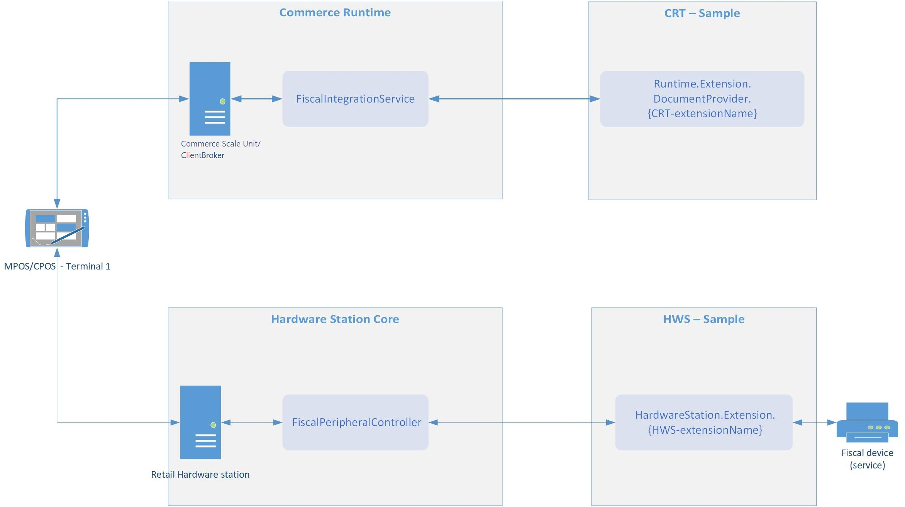

---
# required metadata

title: Overview of fiscal integration for Commerce channels
description: This topic provides an overview of the fiscal integration capabilities that are available in Dynamics 365 Commerce. 
author: josaw
manager: annbe
ms.date: 02/01/2019
ms.topic: article
ms.prod: 
ms.service: dynamics-365-retail
ms.technology: 

# optional metadata

ms.search.form: RetailFunctionalityProfile, RetailFormLayout, RetailParameters
audience: Application User
# ms.devlang: 
ms.reviewer: josaw
ms.search.scope: Core, Operations, Retail
# ms.tgt_pltfrm: 
# ms.custom: 
ms.search.region: Global
ms.search.industry: Retail
ms.author: v-kikozl
ms.search.validFrom: 2019-1-16
ms.dyn365.ops.version: 10.0

---
# Overview of fiscal integration for Commerce channels

[!include [banner](../includes/banner.md)]

## Introduction

This topic is an overview of the fiscal integration capabilities that are available in Dynamics 365 Commerce. Fiscal integration includes integration with various fiscal devices and services that enable fiscal registration of sales in accordance with local fiscal laws that are aimed at preventing tax fraud in the retail industry. Here are some typical scenarios that can be covered by using fiscal integration:

- Register a sale on a fiscal device that is connected to point of sale (POS), such as a fiscal printer, and print a fiscal receipt for the customer.
- Securely submit information that is related to sales and returns that are completed in Retail POS to an external web-service that is operated by the tax authority.
- Help guarantee inalterability of sales transaction data through digital signatures.

The fiscal integration functionality is a framework that provides a common solution for further development and customization of the integration between Retail POS and fiscal devices and services. The functionality also includes fiscal integration samples that support basic scenarios for specific countries or regions, and that work with specific fiscal devices or services. A fiscal integration sample consists of several extensions of Commerce components and is included in the software development kit (SDK). For more information about the fiscal integration samples, see [Fiscal integration samples in the Retail SDK](#fiscal-integration-samples-in-the-retail-sdk). For information about how to install and use the Retail SDK, see [Retail software development kit (SDK) architecture](../dev-itpro/retail-sdk/retail-sdk-overview.md).

To support other scenarios that aren't supported by a fiscal integration sample, to integrate Retail POS with other fiscal devices or services, or to cover requirements of other countries or regions, you must either extend an existing fiscal integration sample or create a new sample by using an existing sample as an example.

## Fiscal registration process and fiscal integration samples for fiscal devices

A fiscal registration process in Retail POS can consist of one or more steps. Each step involves fiscal registration of specific transactions or events in one fiscal device or service. The following solution components participate in the fiscal registration in a fiscal device that is connected to a Hardware station:

- **Commerce runtime (CRT) extension** – This component serializes transaction/event data in the format that is also used for interaction with the fiscal device, parses responses from the fiscal device, and stores the responses in the channel database. The extension also defines the specific transactions and events that must be registered. This component is often referred to as a *fiscal document provider*.
- **Hardware station extension** – This component initializes the communication with the fiscal device, sends requests and direct commands to the fiscal device based on the transaction/event data that is extracted from the fiscal document, and receives responses from the fiscal device. This component is often referred to as a *fiscal connector*.

A fiscal integration sample for a fiscal device contains the CRT and Hardware station extensions for a fiscal document provider and a fiscal connector, respectively. It also contains the following component configurations:

- **Fiscal document provider configuration** – This configuration defines an output method and a format for fiscal documents. It also contains a data mapping for taxes and payment methods, to make data from Retail POS compatible with the values that are predefined in the fiscal device firmware.
- **Fiscal connector configuration** – This configuration defines the physical communication with the specific fiscal device.

A fiscal registration process for a specific POS register is defined by a corresponding setting in the POS functionality profile. For more details about how to configure a fiscal registration process, upload fiscal document provider and fiscal connector configurations, and change their parameters, see [Set up a fiscal registration process](setting-up-fiscal-integration-for-retail-channel.md#set-up-a-fiscal-registration-process).

The following example shows a typical fiscal registration execution flow for a fiscal device. The flow starts with an event in the POS (for example, finalization of a sales transaction) and implements the following sequence of steps:

1. The POS requests a fiscal document from CRT.
2. CRT determines whether the current event requires fiscal registration.
3. Based on the fiscal registration process settings, CRT identifies a fiscal connector and corresponding fiscal document provider to use for the fiscal registration.
4. CRT runs the fiscal document provider that generates a fiscal document (for example, an XML document) that represents the transaction or event.
5. The POS sends the fiscal document that CRT prepares to a Hardware station.
6. The Hardware station runs the fiscal connector that processes the fiscal document and communicates it to the fiscal device or service.
7. The POS analyzes the response from the fiscal device or service to determine whether the fiscal registration was successful.
8. CRT saves the response to the channel database.

## Error handling

The fiscal integration framework provides the following options to handle failures during fiscal registration:

- **Retry** – Operators can use this option when the failure can be resolved quickly, and the fiscal registration can be rerun. For example, this option can be used when the fiscal device isn't connected, the fiscal printer is out of paper, or there is a paper jam in the fiscal printer.
- **Cancel** – This option lets operators postpone the fiscal registration of the current transaction or event if it fails. After the registration is postponed, the operator can continue to work on the POS and can complete any operation that the fiscal registration isn't required for. When any event that requires the fiscal registration occurs in the POS (for example, a new transaction is opened), the error handling dialog box automatically appears to notify the operator that the previous transaction wasn't correctly registered and to provide the error handling options.
- **Skip** – Operators can use this option when the fiscal registration can be omitted under specific conditions and regular operations can be continued on the POS. For example, this option can be used when a sales transaction that the fiscal registration failed for can be registered in a special paper journal.
- **Mark as registered** – Operators can use this option when the transaction was actually registered in the fiscal device (for example, a fiscal receipt was printed), but a failure occurred when the fiscal response was being saved to the channel database.

> [!NOTE]
> The **Skip** and **Mark as registered** options must be activated in the fiscal registration process before they are used. In addition, corresponding permissions must be granted to operators.

The **Skip** and **Mark as registered** options enable info codes to capture some specific information about the failure, such as the reason for the failure or a justification for skipping the fiscal registration or marking the transaction as registered. For more details about how to set up error handling parameters, see [Set error handling settings](setting-up-fiscal-integration-for-retail-channel.md#set-error-handling-settings).

### Optional fiscal registration

Fiscal registration might be mandatory for some operations but optional for others. For example, the fiscal registration of regular sales and returns might be mandatory, but the fiscal registration of operations that are related to customer deposits might be optional. In this case, failure to complete the fiscal registration of a sale should block further sales, but failure to complete the fiscal registration of a customer deposit should not block further sales. To distinguish mandatory and optional operations, we recommend that you handle them through different document providers, and that you set up separate steps in the fiscal registration process for those providers. The **Continue on error** parameter should be enabled for any step that is related to optional fiscal registration. For more details about how to set up error handling parameters, see [Set error handling settings](setting-up-fiscal-integration-for-retail-channel.md#set-error-handling-settings).

### Manually running fiscal registration

If the fiscal registration of a transaction or event has been postponed after a failure (for example, if the operator selected **Cancel** in the error handling dialog box), you can manually rerun the fiscal registration by invoking a corresponding operation. For more details, see [Enable manual execution of postponed fiscal registration](setting-up-fiscal-integration-for-retail-channel.md#enable-manual-execution-of-postponed-fiscal-registration).

### Fiscal registration health check

The health check procedure for fiscal registrations verifies the availability of the fiscal device or service when specific events occur. If the fiscal registration can't currently be completed, the operator is notified in advance.

The POS runs the health check when the following events occur:

- A new transaction is opened.
- A suspended transaction is recalled.
- A sales or return transaction is finalized.

If the health check fails, the POS shows the health check dialog box. This dialog box provides the following buttons:

- **OK** – This button lets the operator ignore a health check error and continue to process the operation. Operators can select this button only if the **Allow skip health check error** permission is enabled for them.
- **Cancel** – If the operator selects this button, the POS cancels the last action (for example, an item isn't added to a new transaction).

> [!NOTE]
> The health check is run only if the current operation requires fiscal registration, and if  the **Continue on error** parameter is disabled for the current step of the fiscal registration process. For more details, see [Set error handling settings](setting-up-fiscal-integration-for-retail-channel.md#set-error-handling-settings).

## Storing fiscal response in fiscal transaction

When fiscal registration of a transaction or event is successful, a fiscal transaction is created in the channel database and linked to the original transaction or event. Similarly, if the **Skip** or **Mark as registered** option is selected for a failed fiscal registration, this information is stored in a fiscal transaction. A fiscal transaction holds the fiscal response of the fiscal device or service. If the fiscal registration process consists of several steps, a fiscal transaction is created for each step of the process that resulted in a successful or failed registration.

Fiscal transactions are transferred to Headquarters by the *P-job*, together with transactions. On the **Fiscal transactions** FastTab of the **Store transactions** page, you can view the fiscal transactions that are linked to transactions.

A fiscal transaction stores the following details:

- Fiscal registration process details (process, connector group, connector, and so on). It also stores the serial number of the fiscal device in the **Register number** field, if this information is included in the fiscal response.
- The status of the fiscal registration: **Completed** for successful registration, **Skipped** if the operator selected the **Skip** option for a failed registration, or **Marked as registered** if the operator selected the **Mark as registered** option.
- Info code transactions that are related to a selected fiscal transaction. To view the info code transactions, on the **Fiscal transactions** FastTab, select a fiscal transaction that has a status of **Skipped** or **Marked as registered**, and then select **Info code transactions**.

## Fiscal texts for discounts

Some countries or regions have special requirements about additional texts that must be printed on fiscal receipts when different kinds of discounts are applied. The fiscal integration functionality lets you set up a special text for a discount that is printed after a discount line on a fiscal receipt. For manual discounts, you can configure a fiscal text for the info code that is specified as the **Product discount** info code in the POS functionality profile. For more details about how to set up fiscal texts for discounts, see [Set up fiscal texts for discounts](setting-up-fiscal-integration-for-retail-channel.md#set-up-fiscal-texts-for-discounts).

## Printing fiscal X and fiscal Z reports

Fiscal integration functionality supports generation of end-of-day statements that are specific to the integrated fiscal device or service:

- New buttons that run corresponding operations should be added to the POS screen layout. For more details, see [Set up fiscal X/Z reports from the POS](setting-up-fiscal-integration-for-retail-channel.md#set-up-fiscal-xz-reports-from-the-pos).
- In the fiscal integration sample, these operations should be matched to the corresponding operations of the fiscal device.

## Fiscal integration samples in the Retail SDK

The following fiscal integration samples are currently available in the Retail SDK:

- [Fiscal printer integration sample for Italy](emea-ita-fpi-sample.md)
- [Fiscal printer integration sample for Poland](emea-pol-fpi-sample.md)
- [Fiscal registration service integration sample for Austria](emea-aut-fi-sample.md)
- [Fiscal registration service integration sample for Czech Republic](emea-cze-fi-sample.md)
- [Control unit integration sample for Sweden](./emea-swe-fi-sample.md)

The following fiscal integration functionality is also available in the Retail SDK but doesn't currently take advantage of the fiscal integration framework. Migration of this functionality to the fiscal integration framework is planned for later updates.

- [Digital signature for France](emea-fra-cash-registers.md)
- [Digital signature for Norway](emea-nor-cash-registers.md)

The following legacy fiscal integration functionality that is available in Retail SDK does not use the fiscal integration framework and will be deprecated in later updates:

- [Control unit integration sample for Sweden (legacy)](./retail-sdk-control-unit-sample.md)
