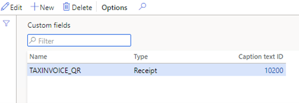

---
# required metadata

title: Generate QR codes and print them on receipts
description: This topic explains how to generate Unified Payments Interface (UPI) Quick Response (QR) codes and print them on receipts.
author: prabhatb2011
manager: tfehr
ms.date: 03/14/2021
ms.topic: article
ms.prod:
ms.service: dynamics-365-retail
ms.technology:

# optional metadata

# ms.search.form:
audience: IT Pro
# ms.devlang:
ms.reviewer: josaw
# ms.tgt_pltfrm:
# ms.custom:
ms.search.region: India
ms.search.industry: Retail
ms.author: epopov
ms.search.validFrom: 
ms.dyn365.ops.version: 10.0.17
---
# Generate QR codes and print them on receipts

[!include [banner](../includes/banner.md)]

## Prerequisites

Functionality for generating QR codes in the Commerce runtime (CRT) was introduced in Microsoft Dynamics 365 Commerce version 10.0.13. Therefore, the information in this topic is valid only for version 10.0.13 and later.

Commerce versions 10.0.17 and later support printing QR codes on receipts using Retail Hardware Station. In versions 10.0.16 and earlier, QR codes can only be printed from Modern POS (MPOS).

## Data schema changes

Because invoice printing isn't supported in Dynamics 365 Commerce, there are no UPI-related fields in Point of sale (POS). Therefore, the fields should be added in the scope of code customization. We recommend that you extend the RetailStoreTenderTypeTable table by adding two string fields: **UPIId** and **UPIName**. As part of this customization, you should extend the **RetailStoreTenderTypeTable** form to edit the fields in the user interface (UI). You should also extend the channel data schema and download jobs. For more information, see [Channel database extensions](../dev-itpro/channel-db-extensions.md).

## Set up receipts in Commerce headquarters

1. Create a new language text that will be used for a new custom receipt field for a QR code:

    1. Go to **Retail and Commerce > Retail and commerce IT > Channel setup > POS profiles > Language text**.
    2. On the **POS** tab, on the **POS language text** FastTab, select **Add** to create a language text.
    3. In the **Language ID** field, specify the language of the new language text (for example, **en-us** for US English).
    4. In the **Text ID** field, enter the identifier of the new language text.
    5. In the **Text** field, enter the new language text (for example, **Tax invoice QR code**).

       

2.  Create a new custom receipt field for a QR code:

    1. Go to **Retail and Commerce > Retail and commerce IT > Channel setup > POS profiles > Custom field**.
    2. On the Action Pane, select **New** to add a field.
    3. In the **Name** field, enter a name for the new field (for example, **TAXINVOICE\_QR**).
    4. In the **Type** field, select **Receipt**.
    5. In the **Caption text ID** field, enter the **Text ID** value from the language text that you created earlier.

        

3.  Add a custom field for a QR code to a receipt:

    1. Go to **Retail and Commerce > Retail and commerce IT > Channel setup > POS > Receipt formats**.
    2. Select the receipt to add a QR code to.
    3. On the Action Pane, select **Designer**.
    4. Download the receipt designer, run it, and sign in.
    5. Add a custom field to the receipt header or footer.

4. Sync the changes with the channel database:

    1. Go to **Retail and Commerce > Retail and commerce IT > Distribution schedule**.
    2. Run jobs **1070** and **1090**.

## Create a CRT extension to support printing QR codes

To support the new custom receipt field for a QR code, you must create a CRT extension that will create a URL string and generate a QR code for it. For an example that shows how to add a custom field to a receipt, see [Extend Commerce Store receipts](../dev-itpro/retail-sdk/retail-sdk-samples.md).

Follow these steps to handle the new custom receipt field for a QR code.

1. Install the Retail software development kit (SDK). For more information, see [Retail software development kit (SDK)](../dev-itpro/retail-sdk/retail-sdk-overview.md).
2.  In the Retail SDK, create a C\# project.
3.  In the new C\# project, add references to the following packages:

    - Microsoft.Dynamics.Commerce.Runtime.DataModel.India
    - Microsoft.Dynamics.Commerce.Runtime.DataServices
    - Microsoft.Dynamics.Commerce.Runtime.ElectronicReporting
    - Microsoft.Dynamics.Commerce.Runtime.GenericTaxEngine
    - Microsoft.Dynamics.Commerce.Runtime.Services.Messages
    - Microsoft.Dynamics.Commerce.Runtime.TaxRegistrationIdIndia

4. Create a class to handle public class GetSalesTransactionCustomReceiptFieldService : IRequestHandlerAsync, ICountryRegionAware. {…}
5. Implement a handler method that will handle the new custom receipt field and return a QR code as a string.

        /// 

        /// Gets the custom receipt field value for sales receipt.
        /// 

        /// <param name="request">The service request to get custom receipt field value.</param>
        /// <returns>The value of custom receipt field.</returns>
        private async Task<Response>
        GetCustomReceiptFieldForSalesTransactionReceiptsAsync(GetSalesTransactionCustomReceiptFieldServiceRequest
        request)
        {
          ThrowIf.Null(request.SalesOrder, "sales order");
          string receiptFieldName = request.CustomReceiptField;
          string receiptFieldValue = string.Empty;
          switch (receiptFieldName)
          {
              case "TAXINVOICE\_QR":
                receiptFieldValue = await GetQRCode(request).ConfigureAwait(false);
                break;
              default:
                return new NotHandledResponse();
          }
          return new GetCustomReceiptFieldServiceResponse(receiptFieldValue);
        }

   The handler should include the following steps.

     1. Generate UPI link based on the sales order (**SalesOrder**) that is passed as the request parameter.
     2. Run **EncodeQrCodeServiceRequest** to generate a QR code. (**EncodeQrCodeServiceRequest** is part of the **Microsoft.Dynamics.Commerce.Runtime.ElectronicReporting** package.)
     3. Wrap the QR code string that is returned in an **<L:>** tag.

            var qrCodeRequest = new
            EncodeQrCodeServiceRequest(stringBuilder.ToString())
            {
              Width = 150, // Replace with desired QR code width
              Height = 150 // Replace with desired QR code width
            };

            EncodeQrCodeServiceResponse qrCodeDataResponse = await
            request.RequestContext.ExecuteAsync<EncodeQrCodeServiceResponse>(qrCodeRequest).ConfigureAwait(false);
            receiptFieldValue = $"<I:{qrCodeDataResponse.QRcode}>";
            return receiptFieldValue;

6. Add the required extensions to **CommerceRuntime.Ext.config**. Here, **Contoso.Commerce.Runtime.ReceiptsIndia** is the name of the new extension for printing the QR code assembly.

        <commerceRuntimeExtensions>
          <composition>
            <!--
            Register your own assemblies or types here.
            The following example registers MyNewCrtService (and all its request handlers). 
            Any other services are not being overridden:
            <add source="type" value="Contoso.Commerce.Runtime.MyNewCrtService, Contoso.Commerce.Runtime.Services" />
            >add source="assembly" value="Contoso.Commerce.Runtime.Services" />
            -->
           <add source="assembly" value="Contoso.Commerce.Runtime.ReceiptsIndia" />
           <add source="assembly" 
       value="Microsoft.Dynamics.Commerce.Runtime.ElectronicReporting" />
           <add source="assembly" 
       value="Microsoft.Dynamics.Commerce.Runtime.GenericTaxEngine" />
           <add source="assembly"
       value="Microsoft.Dynamics.Commerce.Runtime.TaxRegistrationIdIndia" />
          </composition>
       </commerceRuntimeExtensions>

## Appendix A
### Sample of a CRT extension class for printing QR codes

    namespace Contoso
    {
        namespace Commerce.Runtime.ReceiptsIndia
        {
            using System;
            using System.Collections.Generic;
            using System.Globalization;
            using System.Linq;
            using System.Text;
            using System.Threading.Tasks;
            using Microsoft.Dynamics.Commerce.Runtime;
            using Microsoft.Dynamics.Commerce.Runtime.DataModel;
            using Microsoft.Dynamics.Commerce.Runtime.DataServices.Messages;
            using Microsoft.Dynamics.Commerce.Runtime.Messages;
            using Microsoft.Dynamics.Commerce.Runtime.Services.Messages;
            using Microsoft.Dynamics.Commerce.Runtime.TaxRegistrationIdIndia.Messages;

            /// 

            /// The extended service to get custom sales receipt field.
            /// 

            public class GetSalesTransactionCustomReceiptFieldService : IRequestHandlerAsync, ICountryRegionAware
            {
                /// 

                /// Gets the supported request types.
                /// 
  
                public IEnumerable&lt;Type&gt; SupportedRequestTypes
                {
                  get
                    {
                        return new\[\]
                        {
                            typeof(GetSalesTransactionCustomReceiptFieldServiceRequest),
                       };
                    }
                }

                /// 

                /// Gets a collection of companies supported by this request handler.
                /// 

                public IEnumerable&lt;string&gt; SupportedCountryRegions
                {
                    get
                    {
                        return new\[\]
                        {
                            nameof(CountryRegionISOCode.IN),
                        };
                    }
                }
                /// 

                /// Executes the requests.
                /// 

                /// <param name="request"&gt;The request parameter.</param>
                /// <returns>The GetReceiptServiceResponse that contains the formatted receipts.</returns>
                public async Task&lt;Response&gt; Execute(Request request)
                {
                    ThrowIf.Null(request, nameof(request));
                    Type requestedType = request.GetType();
                    if (requestedType == typeof(GetSalesTransactionCustomReceiptFieldServiceRequest))
                    {
                        return await
               this.GetCustomReceiptFieldForSalesTransactionReceiptsAsync((GetSalesTransactionCustomReceiptFieldServiceRequest)request).ConfigureAwait(false);
                    }
                    throw new NotSupportedException(string.Format("Request '{0}' is not supported.", request.GetType()));
                    }
                    /// 

                    /// Gets the custom receipt field value for sales receipt.
                    /// 

                    /// <param name="request">The service request to get custom receipt field value.</param>
                    /// <returns>The value of custom receipt field.<returns>
                    private async Task<Response&>
               GetCustomReceiptFieldForSalesTransactionReceiptsAsync(GetSalesTransactionCustomReceiptFieldServiceRequest request)
                    {
                        ThrowIf.Null(request.SalesOrder, 
               $"{nameof(request)},{nameof(request.SalesOrder)}");
                        string receiptFieldName = request.CustomReceiptField;
                        string receiptFieldValue = string.Empty;
                        switch (receiptFieldName)
                        {
                            case "TAXINVOICE\_QR":
                                receiptFieldValue = await 
               GetQRCode(request).ConfigureAwait(false);
                                       break;
                                  default:
                                       return new NotHandledResponse();
                        }

                        return new GetCustomReceiptFieldServiceResponse(receiptFieldValue);
                    }
                    /// &lt;summary&gt;
                    /// Gets the QR code for the receipt.
                    /// &lt;/summary&gt;
                    /// &lt;param name="request"&gt;The service request to get customreceipt field value.&lt;/param&gt;
                    /// &lt;returns&gt;QR code custom field value.&lt;/returns&gt;
                    private static async Task&lt;string&gt;
            GetQRCode(GetSalesTransactionCustomReceiptFieldServiceRequest request)
                    {
                        var salesOrder = request.SalesOrder;
                        string receiptFieldValue = string.Empty;
                        bool isB2C = await IsB2CTransactionAsync(request.RequestContext, salesOrder).ConfigureAwait(false);
                        if (isB2C)
                        {
                            string gstNumber = await GetStoreGSTIN(request.RequestContext).ConfigureAwait(false);
                            var paymentInfo = await GetPaymentUPIInfo(request.RequestContext, salesOrder).ConfigureAwait(false);
                            string totalAmount = FormatAmount(salesOrder.TotalAmount);
                            string igstAmt = FormatAmount(GetTaxComponentAmount(salesOrder,
                            "IGST"));
                            string cgstAmt = FormatAmount(GetTaxComponentAmount(salesOrder,
                            "CGST"));
                            string sgstAmt = FormatAmount(GetTaxComponentAmount(salesOrder,
                            "SGST"));
                            string cessAmt = FormatAmount(GetTaxComponentAmount(salesOrder,
                            "CESS"));
                            StringBuilder stringBuilder = new
                   StringBuilder($"upi://pay?cu={salesOrder.CurrencyCode}");
                            stringBuilder.Append($"&am={totalAmount}");
                            stringBuilder.Append($"&pa={paymentInfo.Item1}");
                            stringBuilder.Append($"&pn={paymentInfo.Item2}");
                            stringBuilder.Append($"&tr={salesOrder.ReceiptId}");
                   stringBuilder.Append($"&dt={salesOrder.TransactionDateTime.ToString("dd/MM/yyyy")}");                    
                            stringBuilder.Append($"&no={gstNumber}");
                            stringBuilder.Append($"&IgstAmt = {igstAmt}");
                            stringBuilder.Append($"&CgstAmt = {cgstAmt}");
                            stringBuilder.Append($"&SgstAmt = {sgstAmt}");
                            stringBuilder.Append($"&CesAmt = {cessAmt}");
                            var qrCodeRequest = new
                   EncodeQrCodeServiceRequest(stringBuilder.ToString())
                            {
                                Width = 150, // Replace with desired QR code width
                                Height = 150 // Replace with desired QR code width
                            };
                   EncodeQrCodeServiceResponse qrCodeDataResponse = await
                   request.RequestContext.ExecuteAsync&lt;EncodeQrCodeServiceResponse&gt;(qrCodeRequest).ConfigureAwait(false);
                            receiptFieldValue = $"&lt;I:{qrCodeDataResponse.QRcode}&gt;";
                        }
                        return receiptFieldValue;
                    }
                    
                    /// &lt;summary&gt;
                    /// Gets store GSTIN.
                    /// &lt;/summary&gt;
                    /// &lt;param name="requestContext"&gt;Request context.&lt;/param&gt;
                    /// &lt;returns&gt;Store GSTIN.&lt;/returns&gt;
                    private static async Task&lt;string&gt; GetStoreGSTIN(RequestContext
                    requestContext)
                    {
                        var dataRequest = new GetReceiptHeaderGteTaxInfoIndiaDataRequest
                        {
                            QueryResultSettings = QueryResultSettings.SingleRecord,
                        };
                        var headerTaxInformation = await
              requestContext.ExecuteAsync&lt;SingleEntityDataServiceResponse&lt;ReceiptHeaderGteTaxInfoIndia&gt;&gt;(dataRequest).ConfigureAwait(false);
                        return headerTaxInformation.Entity?.GstRegistrationNumber;
                    }

                    /// &lt;summary&gt;
                    /// Gets payment UPI info for the sales order.
                    /// &lt;/summary&gt;
                    /// &lt;param name="requestContext"&gt;Request context.&lt;/param&gt;
                    /// &lt;param name="salesOrder"&gt;Sales order.&lt;/param&gt;
                    /// &lt;returns&gt;Payment info.&lt;/returns&gt;
                    private static async Task&lt;Tuple&lt;string, string&gt;&gt;
              GetPaymentUPIInfo(RequestContext requestContext, SalesOrder salesOrder)
                    {
                        var channelTenderDataRequest = new
              GetChannelTenderTypesDataRequest(requestContext.GetPrincipal().ChannelId,
              QueryResultSettings.AllRecords);
                        var channelTenderTypes = (await
              requestContext.Runtime.ExecuteAsync&lt;EntityDataServiceResponse&lt;TenderType&gt;&gt;(channelTenderDataRequest,
              requestContext).ConfigureAwait(false)).PagedEntityCollection.Results;
                        string upiId = string.Empty;
                        string upiName = string.Empty;
                        int count = salesOrder.ActiveTenderLines.Count;
                        foreach (var tenderLine in salesOrder.ActiveTenderLines)
                        {
                            TenderType tenderType = channelTenderTypes.Where(type =&gt;
                        type.TenderTypeId == tenderLine.TenderTypeId).SingleOrDefault();
                            if (tenderType == null)
                            {
                                continue;
                            }
                            if (!string.IsNullOrEmpty(upiId))
                            {
                                upiId += ",";
                            }
                            if (!string.IsNullOrEmpty(upiName))
                            {
                                upiName += ",";
                            }
                            upiId += tenderType.TenderTypeId; // Here should be customized field UPIId
                            upiName += tenderType.Name; // Here should be customized field UPIName
                            if (count &gt; 1)
                            {
                                string amount = FormatAmount(tenderLine.Amount);
                                upiId += $":{amount}";
                                upiName += $":{amount}";
                            }
                        }
                        return new Tuple&lt;string, string&gt;(upiId, upiName);
                    }

                    /// &lt;summary&gt;
                    /// Gets tax component amount.
                    /// &lt;/summary&gt;
                    /// &lt;param name="salesOrder"&gt;Sales order.&lt;/param&gt;
                    /// &lt;param name="taxComponent"&gt;Tax component.&lt;/param&gt;
                    /// &lt;returns&gt;Tax component amount.&lt;/returns&gt;
                    private static decimal GetTaxComponentAmount(SalesOrder salesOrder, string taxComponent)
                    {
                        decimal taxAmount = 0m;
                        IEnumerable&lt;TaxLineGTE&gt; taxLineGte = 
                    salesOrder.ActiveSalesLines.SelectMany(x =&gt; x.TaxLines).OfType&lt;TaxLineGTE&gt;();
                        var groups = taxLineGte.GroupBy(x =&gt; new { x.TaxComponent }).OrderBy(x =&gt; 
                    x.Key.TaxComponent);
                        var group = groups.Where(g =&gt; string.Equals(g.Key.TaxComponent, 
                    taxComponent, StringComparison.InvariantCultureIgnoreCase)).FirstOrDefault();
                        if (group != null)
                        {
                            taxAmount = group.Sum(l =&gt; l.Amount);
                        }
                        return taxAmount;
                    }

                    /// &lt;summary&gt;
                    /// Gets the store customer account number based on store type.
                    /// &lt;/summary&gt;
                    /// &lt;returns&gt;The store customer account number.&lt;/returns&gt;
                    internal static string
                GetStoreCustomerAccountNumberFromChannelProperties(RequestContext requestContext)
                    {
                        if (requestContext.GetChannelConfiguration().IsOnlineStore())
                        {
                            if (requestContext.GetPrincipal().IsCustomer)
                            {
                                return requestContext.GetPrincipal().UserId;
                            }
                        }
                        return requestContext.GetChannel().DefaultCustomerAccount;
                    }

                    /// &lt;summary&gt;
                    /// Defines whether the customer is store default customer.
                    /// &lt;/summary&gt;
                    /// &lt;param name="requestContext"&gt;Request context.&lt;/param&gt;
                    /// &lt;param name="customerId"&gt;Customer id.&lt;/param&gt;
                    /// &lt;returns&gt;True if the customer is store default customer; false otherwise.&lt;/returns&gt;
                    private static bool IsStoreCustomer(RequestContext requestContext, string customerId)
                    {
                        return string.IsNullOrEmpty(customerId)
                            || string.Equals(customerId,
                GetStoreCustomerAccountNumberFromChannelProperties(requestContext),
                StringComparison.InvariantCultureIgnoreCase);
                    }
                    /// &lt;summary&gt;
                    /// Defines whether the transaction is B2C.
                    /// &lt;/summary&gt;
                    /// &lt;param name="requestContext"&gt;Request context.&lt;/param&gt;
                    /// &lt;param name="salesOrder"&gt;Sales order.&lt;/param&gt;
                    /// &lt;returns&gt;True if the transaction is B2C; false otherwise.&lt;/returns&gt;
                    private static async Task&lt;bool&gt; IsB2CTransactionAsync(RequestContext requestContext, SalesOrder salesOrder)
                    {
                        if (IsStoreCustomer(requestContext, salesOrder.CustomerId))
                        {
                            return true;
                        }
                        var customer = await GetCustomerAsync(requestContext, salesOrder.CustomerId).ConfigureAwait(false);
                        if (customer == null)
                        {
                            return true;
                        }
                        var address = customer.GetPrimaryAddress();
                        if (address == null)
                        {
                            return true;
                        }
                        GetPrimaryAddressTaxInformationDataRequest
                getPrimaryAddressTaxInformationDataRequest = new
                GetPrimaryAddressTaxInformationDataRequest(address.LogisticsLocationRecordId);
                        AddressTaxInformationIndia addressTaxInformationIndia = (await
                requestContext.Runtime.ExecuteAsync
                &lt;SingleEntityDataServiceResponse&lt;AddressTaxInformationIndia&gt;&gt;(getPrimaryAddressTaxInformationDataRequest,
                requestContext)
                            .ConfigureAwait(false)).Entity;
                        if (addressTaxInformationIndia == null ||
                addressTaxInformationIndia.GstinRegistrationNumber == null
                                ||
                string.IsNullOrEmpty(addressTaxInformationIndia.GstinRegistrationNumber.RegistrationNumber))
                        {
                            return true;
                        }
                        return false;
                    }

                    /// &lt;summary&gt;
                    /// Gets customer by customer identifier.
                    /// &lt;/summary&gt;
                    /// &lt;param name="customerId"&gt;Customer identifier.&lt;/param&gt;
                    /// &lt;returns&gt;Customer object.&lt;/returns&gt;
                    private static async Task&lt;Customer&gt; GetCustomerAsync(RequestContext requestContext, string customerId)
                    {
                        Customer customer = null;
                        if (!string.IsNullOrWhiteSpace(customerId))
                        {
                            var getCustomerDataRequest = new GetCustomerDataRequest(customerId);
                            SingleEntityDataServiceResponse&lt;Customer&gt; getCustomerDataResponse = await
                    requestContext.ExecuteAsync&lt;SingleEntityDataServiceResponse&lt;Customer&gt;&gt;(getCustomerDataRequest).ConfigureAwait(false);
                            customer = getCustomerDataResponse.Entity;
                        }
                        return customer;
                    }

                    /// &lt;summary&gt;
                    /// Formats amount.
                    /// &lt;/summary&gt;
                    /// &lt;param name="amount"&gt;Amount to format.&lt;/param&gt;
                    /// &lt;returns&gt;Formatted amount.&lt;/returns&gt;
                    private static string FormatAmount(decimal amount)
                    {
                        return amount.ToString("0.00", CultureInfo.InvariantCulture);
                    }
                }
            }
        }
