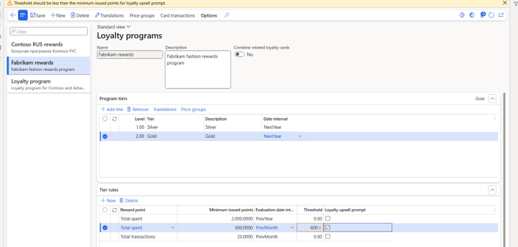
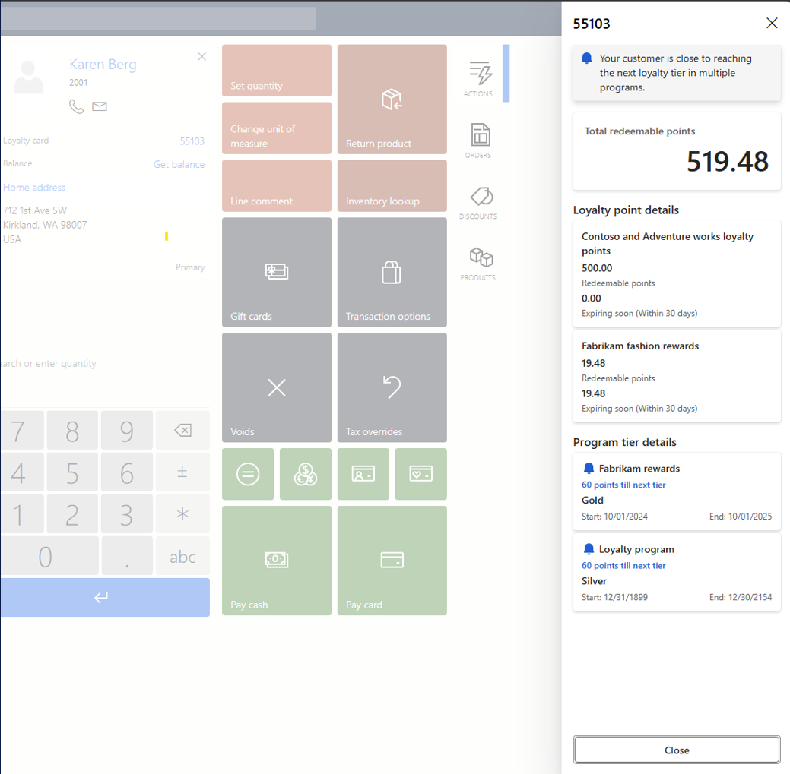
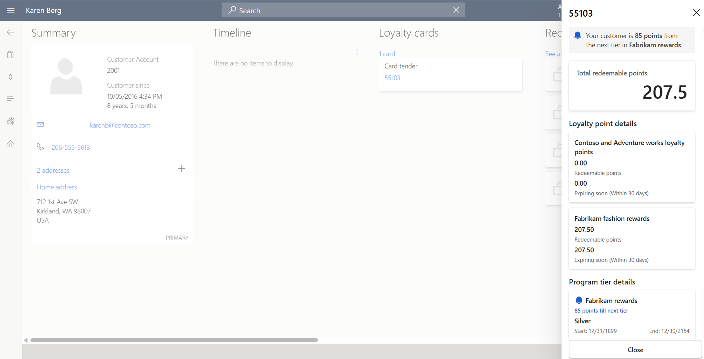

# Loyalty upsell prompt feature in POS

[!INCLUDE [banner](includes/banner.md)]

This article explains how the loyalty upsell prompt feature helps inform customers about their loyalty program status and tier qualifying points in Microsoft Dynamics 365 Commerce POS.

The loyalty upsell prompt feature is designed to enable store associates to inform customers about their loyalty program status and tier qualifying points. The purpose of this feature is to enhance customer engagement and satisfaction, and therefore lead to increased loyalty, repeat purchases, and overall sales.

Retailers are striving to win more customers and convert their user base into loyalty members. However, to do so, they need a way to effectively promote their loyalty programs and ensure that customers are aware of the benefits. Retailers that can't meet these challenges risk lower engagement and missed opportunities for customer retention. For example, frequent shoppers might not realize that they are close to reaching the next tier in a loyalty program, and that they might be missing significant discounts or rewards.

The loyalty upsell prompt feature enables store associates to provide customers with information about their tier qualifying points and loyalty program status. By showing customers how close they are to reaching the next tier, retailers can motivate them to continue their engagement with the brand and unlock new benefits. These prompts can lead to additional purchases and increased average order value (AOV). The loyalty upsell prompt feature enhances customer engagement and satisfaction, and therefore leads to increased loyalty that can boost sales and customer retention.

## Enable the loyalty upsell prompt feature

> [!NOTE]
> The loyalty upsell prompt feature is available as of Commerce version 10.0.44. The feature isn't backported to previous releases.

To enable the loyalty upsell prompt feature, follow these steps:

1. In Commerce headquarters, go to **Systems administration** \> **Workspaces** \> **Feature management**.
1. Search for the **Retail Loyalty Upsell Prompt** feature, and then select it.
1. In the right pane, select **Enable now**.

## Configure the loyalty upsell prompt feature

To configure the loyalty upsell prompt feature, follow these steps:

1. In headquarters, go to **Retail and Commerce** \> **Customers** \> **Loyalty** \> **Loyalty programs**.
1. In the left pane, select your loyalty program. For example, select **Fabrikam Rewards**.
1. On the **Program tiers** FastTab, select your loyalty tier. For example, select **Gold**.
1. On the **Tier rules** FastTab, select one of the tier rules that are set up to use reward points of the amount type (instead of, for example, the transaction type). For example, a workable tier rule might have **Reward point** = "Total Spent", **Evaluation Date Interval** = "PrevMonth", and **Minimum issued points** = "500".
1. In the **Threshold** column, define the threshold for when the loyalty upsell prompt appears. For example, specify "100".

<!--  -->
:::image type="content" source="./media/HQ_Setup_Loyalty_Threshold.png" alt-text="Loyalty upsell prompt configuration in headquarters":::

> [!NOTE]
> Only loyalty reward points of the amount type are allowed for the loyalty upsell prompt experience. If you try to select a tier rule that has loyalty reward points of the "Total transactions" type, the following warning appears in a yellow bar at the top of the page: "Only reward points of type "Amount" are considered for the Loyalty Upsell Prompt."

## Loyalty upsell prompts on the POS transaction screen

If more than one loyalty card is associated with a customer, store associates on the point of sale (POS) transaction screen are prompted to select a loyalty card.

- **For a selected card with only one loyalty program**: If the customer's tier qualifying points are within the threshold of the configured loyalty upsell prompt feature, a bell symbol appears next to the loyalty program tier information.
- **For a selected card with multiple loyalty programs**: For each loyalty program, if the loyalty upsell prompt tier rule is configured with defined thresholds, and the user's tier qualifying points are within those thresholds, a bell symbol appears next to the loyalty program tier information.

> [!NOTE]
> If a customer's tier qualifying points are beyond the configured threshold, no bell symbol appears next to the loyalty program tier information in headquarters.

<!--  -->
:::image type="content" source="./media/Multiple_LoyaltyPrograms_TransactionScreen_LoyaltyUpsellPromptFeature.png" alt-text="Loyalty upsell prompt from POS transaction screen":::

### Examples of loyalty upsell prompts

The following table shows examples of loyalty upsell prompts where the threshold is set to "100".

| Customer   | Current loyalty tier | Tier qualifying points | Loyalty upsell prompt for the next tier |
|------------|----------------------|------------------------|-----------------------------------------|
| Customer A | Silver               | 420 points             | "80 points away from Gold tier." |
| Customer B | Silver               | 380 points             | (No loyalty upsell prompt appears, because the customer is more than 100 points away from the Gold tier.) |

## Loyalty upsell prompts via the customer details page

When store associates view loyalty card details via the POS customer details page, they are presented with the same controls that appear on the transaction screen. However, the slider isn't loaded until the associate selects a loyalty card.

The following example image shows loyalty card details on the POS customer details page. Prompts indicate that two loyalty programs are within the threshold of the next loyalty tier.

<!--  -->
:::image type="content" source="./media/Multiple_LoyaltyPrograms_CustomerScreen_LoyaltyUpsellPromptFeature.png" alt-text="Loyalty upsell prompt from the customer details page":::

## Constraints

### Immediate effect of tier rule switching

When you switch the tier rule for loyalty prompt sell consideration, if no Commerce Data Exchange (CDX) jobs are expected to be run, the switch is effective immediately. For example, if you switch between permitted tier rules that have reward points of the amount type, a notification asks you to confirm the switch. After you confirm the switch, the newly selected tier rule becomes effective immediately.

### Loyalty upsell prompt threshold value

The threshold value for the loyalty upsell prompt can't be more than the minimum issued points for the tier rule. For example, if a user defines a loyalty upsell prompt threshold value of "600" for a selected tier rule that has a **Minimum issued points** value of "500", the following warning appears: "Threshold should be less than the minimum issued points for the loyalty upsell prompt."

[!INCLUDE[footer-include](../includes/footer-banner.md)]
