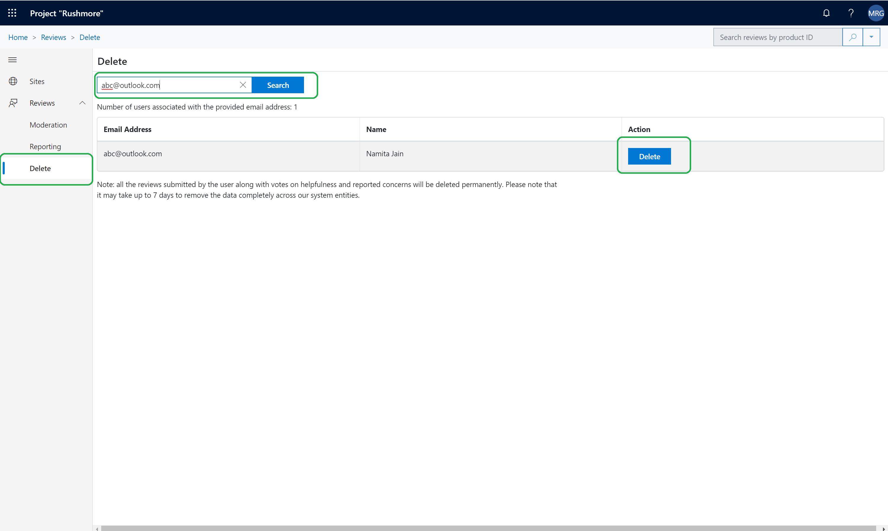

---
# required metadata

title: Manage ratings and reviews 
description: This topic explains how to manage ratings and reviews using the Ratings and Reviews Moderation tool.
author:  gvrmohanreddy 
manager: annbe
ms.date: 10/01/2019
ms.topic: article
ms.prod: 
ms.service: dynamics-ax-retail
ms.technology: 

# optional metadata

# ms.search.form: 
# ROBOTS: 
audience: Application User
# ms.devlang: 
ms.reviewer: v-chgri
ms.search.scope: Operations, Retail, Core
# ms.tgt_pltfrm: 
ms.custom: 
ms.assetid: 
ms.search.region: Global
ms.search.industry: 
ms.author: gmohanv
ms.search.validFrom: 2019-10-01
ms.dyn365.ops.version: Release 10.0.5
---

# Manage ratings and reviews

[!include [banner](../includes/preview-banner.md)]
[!include [banner](../includes/banner.md)]

This topic explains how to manage ratings and reviews using the Dynamics 365 Commerce Ratings and Reviews Moderation tool.

## Overview

Dynamics 365 Commerce uses Azure Cognitive Service to automatically moderate review text by redacting profane words. In addition, the Ratings and Reviews Moderation tool can be used to do the following.

- Moderate reviews by responding to them or taking them down
- Bulk import review data across products into a provided Power BI template and analyze ratings and reviews trends
- Delete a user's reviews after a request by the user

## Read a review 
  
1. Go to **Site Management > Global Settings**.
1. Under **RnR Moderator**, click **Manage**.
1. ???
1. Use the **Search** feature at the top of page to filter reviews by product ID, product name, or review text.
    - There are also filters to limit displayed reviews by time period, rating, channel, or concern status (takedown/responded/reported).

 

## Respond to a review 

Sometimes customers who have purchased a product express their satisfaction or dissatisfaction or may have misunderstandings about a product's usage. As a moderator, you can post a response to a review that will display inline with the review on the site. 

To respond to a review, do the following.

1. Go to **Site Management > Global Settings**.
1. Under **RnR Moderator**, click **Manage**.
1. ???
1. In the left pane, select the review that needs a response.
1. In the right pane, click **Add a response** to provide a response.
1. Enter the response text and choose which responder name to display. The default responder name is "Moderator."
1. When done, click **Post response**.

 

## Take down a review 

Sometimes there is a business justification for a moderator to take down a customer review. 

To take down a review, do the following.

1. Go to **Site Management > Global Settings**.
1. Under **RnR Moderator**, click **Manage**.
1. ???
1. In the left pane, select the review that needs to be taken down.
1. In the right pane, select a takedown reason and click **Take down**.
	
## Delete a customer's reviews on request 

Sometimes a customer wants their ratings and reviews data to be permanently deleted from an e-Commerce website. When a moderator receives a removal request from a customer, they can remove the customer's data by using the delete reviews feature. To locate users, the email address the customer used to sign in and provide reviews is required. 

To locate and delete user data, do the following.

1. Go to **Site Management > Global Settings**.
1. Under **RnR Moderator**, click **Manage**. 
1. ???
1. Click **Delete**. 
1. In the **Search for users by email address** box, enter the customer's email address and click **Search**.
1. If the customer has any reviews activity (for example, review submissions, votes on the helpfulness of other's reviews, or comments on another customer's review), the results will be displayed and each item will have a "Delete" option for the moderator to act on.
1. Click **Delete** for the review item you want to delete. When prompted for confirmation, click **Yes**. 
	
Refer to the following screenshot for more details.  
	
[!NOTE]
 - It may take up to 7 days for data to be completely removed from the system. Moderators should notify customers of this delay.
 - If a customer has changed their name in account settings, multiple items may display in the search results. The moderator should click **Delete** for each item to completely delete the customer's data. 

 

##  Download ratings and reviews data

The Commerce Ratings and Reviews Moderation tool enables moderators to import bulk data of ratings and reviews for analyzing trends.  There is a Power BI template with basic metrics available for moderators to connect imported bulk data and see a dashboard, without needing to create a custom dashboard.  Moderators can also customize the PowerBI template to meet their specific needs. 

To download ratings and reviews data, do the following.

1. Go to **Site Management > Global Settings**.
1. Under **RnR Moderator**, click **Manage**. 
1. ??? 
1. Click **Reporting**. 
1. Click **Download reviews data** to download ratings and reviews bulk data in .csv format.

##  View ratings and reviews trends

Moderators can also download the PowerBI template to view trends in a dashboard.

To view ratings and reviews trends, do the following.

1. ???download the PowerBI template???
1. Open the downloaded template using the Power BI app. After opening the template, the **Access to web content** appears. Close the dialog box, and then close the "Refresh" error message as well.
1. Go to **Home** and click **Edit queries**, and then click **Data source settings**.
1. In the **Data source settings** dialog box, click **Change Source**.
1. In the **URL** text box, enter the path of the previously downloaded reviews data, e.g. c:\reviews\ReviewsData.csv file.
1. Click **OK** and then click **Apply changes**. It will take 1-2 minutes to apply changes to the data source.
1. Click **Trends sheet** to view ratings and reviews trends.

Refer to the following screenshots for more details:

 
 
 
