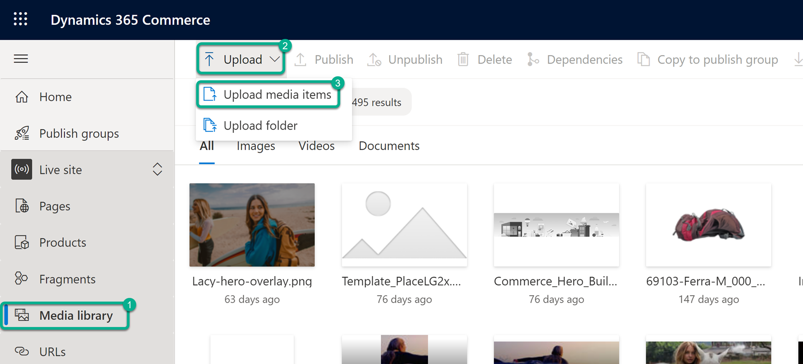
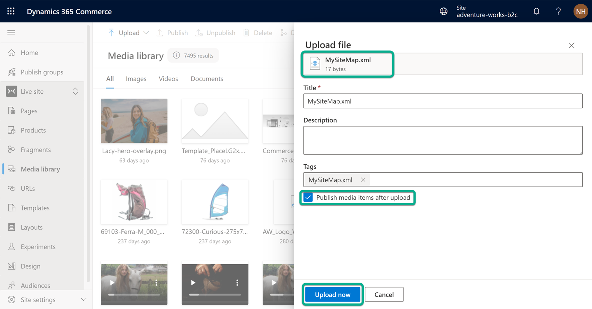
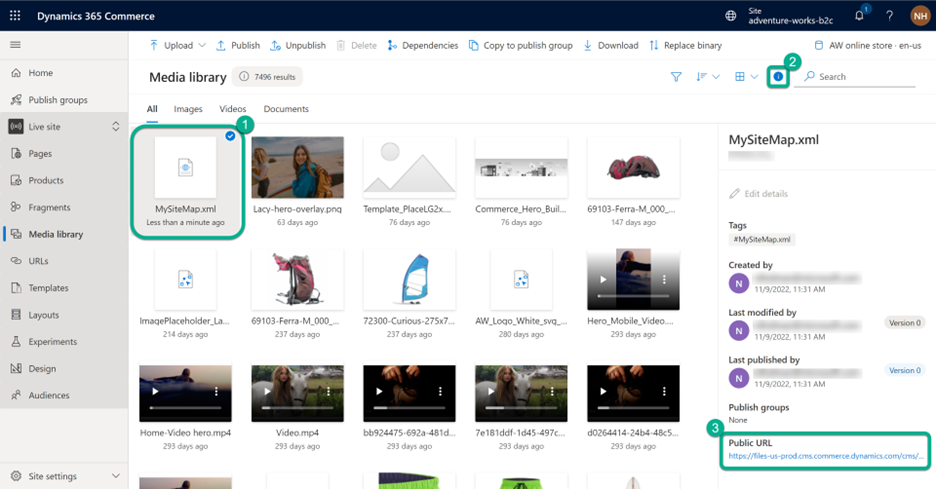

# Manage SEO metadata

[!include [banner](includes/banner.md)]

This article describes how to manage search engine optimization (SEO) metadata in Microsoft Dynamics 365 Commerce.

SEO metadata for a site can be managed by using site maps and page metadata.
	
## Site maps

A site map is a machine-readable list, in XML format, of the pages on your website. It's intended to be consumed by search engines, so that they can provide better search results from your site. Site maps can be manually ingested by search engines or published in a robots.txt file.

Dynamics 365 Commerce supports both the automatic generation and manual curation of site maps. When the automated site map feature is enabled, site maps are automatically updated when pages are published and unpublished.

### Option 1: Enable automated site map generation

To enable automated site map generation in Commerce site builder, follow these steps.

1. Under **Sites**, select the name of your site (example: Adventure Works).
1. In the left navigation pane on the left, select **Site settings \> General**.
1. Set the **Site maps enabled** option to **On**.
1. Select **Save and publish**.

> [!NOTE]
> Once automated site maps are enabled, it takes some time (depending on the size of your site) for the initial automated site map creation job to complete. This progress can be monitored in **Site settings > General > Site map additional data**, where the site map generation state, status, last execution datetime, and content update datetime is displayed. Any new content publish action (for example, a new page or URL published) will automatically update the site map file. After the site map is generated, the URL(s) to the site map file(s) can be found at **Site settings > General > Site map URLs**

### Option 2: Manually manage site maps

The automated solution in Option 1 above works for many scenarios, but there are cases where manually managing a site map is preferred to enable more granular control over which pages are included or excluded. This can be achieved by hosting your own manually generated site map file in the site builder Media library as a document binary, and then pointing your site's Robots.txt file to the site map's URL. To manage your site map manually, first ensure the automated site map generation feature described in Option 1 above is disabled, and then manually manage your site map and host it in the site builder Media library.

To manually manage your site map and host it in the site builder Media library, follow these steps.

1. In the left navigation pane, select **Media library**. 
1. Select **Upload \> Upload media items**.
<!--    -->
1. In the File Explorer window, browse to your custom sitemap XML file, select it, and then select **Open**.  
1. In **Upload file** flyout menu, select the **Publish media items after upload** checkbox, and then select **Upload now**.
<!--    -->
1. In the Media library, next to the **Search** box, select the the information (**i**) symbol to display the property pane on the right. 
1. Select the site map file, and in the properties pane under **Public URL**, copy the the site map file URL. 
<!----> 
1. Download your site's [robots.txt file](go-live/add-robots-txt.md). For instructions, see [Download a robots.txt file](manage-robots-txt-files.md#download-a-robotstxt-file). 
1. Using a text editor, paste the copied site map URL into the **Sitemap** key:value pair, as shown in the following example.


```txt
User-agent: *
Disallow: /EditService.asmx/
Disallow: /images/
Disallow: /scripts/
Disallow: /SyndicationService.asmx/
Disallow: /EditConfig.aspx
Disallow: /Login.aspx

Sitemap: [Paste your site map URL here]
```

5. Save the robots.txt file, and then [upload it](manage-robots-txt-files.md#upload-a-robotstxt-file) to your site. For go-live information regarding robots.txt files, see [Add or update a robots.txt file](go-live/add-robots-txt.md).

> [!TIP]
> To avoid having to update the robots.txt file the next time you manually update your site map file, follow these steps.
> 1. Update the site map file on your local machine.
> 1. Go to the site builder Media library and select your original site map file. 
> 1. Select the **Replace binary** button on the command bar. 
> 1. In File Explorer, browse to and select the updated site map file on your local machine. Using this method keeps your site map file's URL static, avoiding the need to update the robots.txt file.

## Page metadata

Dynamics 365 Commerce lets you manage SEO metadata for individual pages. You can view and modify this information in the **SEO Properties** section of a page container. The following SEO metadata properties are supported:

- Title
- Description
- SEO keywords
- Aria labels
- noindex
- nofollow
- noarchive
- nocache
- noOpenDirectoryProject
- nosnippet
- noImageIndex
- unavailableAfter

### Modify page metadata

To modify page metadata, follow these steps.
1. Under **Sites**, select the **Fabrikam** (or the name of your site).
1. In the navigation pane on the left, select **Pages**.
1. Select the home page to open it in the page editor.
1. On the command bar, select **Edit**.
1. In the page editor, at the top of the page outline control on the left, select the **Outline mode option** (gear symbol), and then select **Advanced outline view**.
1. In the outline view, expand the tree controls to show the contents of the **HTML head** slot.
1. In the **HTML head** slot, select the desired SEO module (for example, **Page summary**, **Product page summary**, **Category page summary**, or **Metatags**).
1. In the properties pane on the right, edit the desired SEO data for the selected SEO module (for example, **Title**, **Description**, or **Sharing image**).
1. Select **Save**, and then select **Finish editing**.
1. In the **Comments** field, enter **Updated SEO data**, and then select **OK**.
1. Select **Preview** to preview your page. When you've finished, close the preview tab to return to the authoring tool.
1. Select **Publish**.

> [!TIP]
> Authors can use the **Outline mode option** (gear symbol) at the top of the left outline control in the page editor to switch between **Basic outline view** and **Advanced outline view**. **Basic outline view** is the default setting and filters the outline so that it shows only modules in the **Body** HTML slot for a page. **Advanced outline view** shows the whole page module, including **HTML head**, **Body begin**, and **Body end** slots. This view is useful when authors must edit specific SEO or script module settings for a page.

## Additional resources

[Modify an existing site page](modify-existing-page.md)

[Add a new site page](add-new-page.md)

[Select page layouts](select-page-layouts.md)

[Save, preview, and publish a page](save-preview-publish-page.md)

[Enrich a product page](enrich-product-page.md)

[Enrich a category landing page](enrich-category-page.md)

[Verify page content accessibility](verify-accessibility.md)

[Create dynamic e-commerce pages based on URL parameters](create-dynamic-pages.md)


[!INCLUDE[footer-include](../includes/footer-banner.md)]
