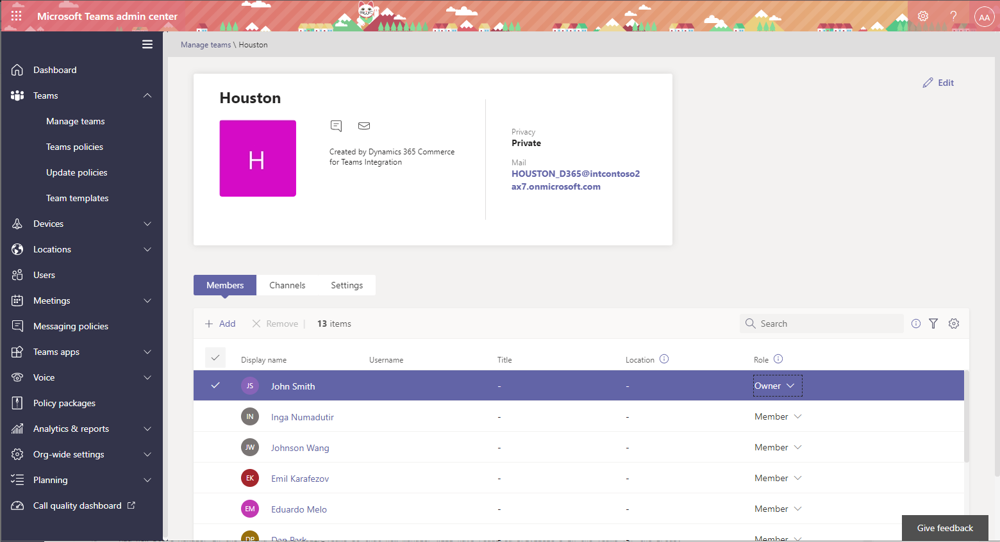

# Manage user roles in Microsoft Teams

[!include [banner](includes/banner.md)]

This article describes how to manage Microsoft Dynamics 365 Commerce user roles in Microsoft Teams.

As you create a team for each store or channel in Teams, you also create a corresponding group membership (for example, `HOUSTON_D365@<YourTenantAzureADDomain>.com`). All the store workers under a team group membership are assigned one of two user roles: **Owner** or **Member**. Store employees who have the **Owner** user role can perform operations such as adding a private channel, and adding or deleting members. Typically, store managers have the **Owner** user role.

The following illustration shows an example of a list of team members and their user roles in the Microsoft Teams admin center.

For more information, see [Assign team owners and members in Microsoft Teams](/microsoftteams/assign-roles-permissions).

## Additional resources

[Dynamics 365 Commerce and Microsoft Teams integration overview](commerce-teams-integration.md)

[Enable Dynamics 365 Commerce and Microsoft Teams integration](enable-teams-integration.md)

[Provision Microsoft Teams from Dynamics 365 Commerce](provision-teams-from-commerce.md)

[Synchronize task management between Microsoft Teams and Dynamics 365 Commerce POS](synchronize-tasks-teams-pos.md)

[Map stores and teams if there are preexisting teams in Microsoft Teams](map-stores-existing-teams.md)

[Dynamics 365 Commerce and Microsoft Teams integration FAQ](teams-integration-faq.md)

[!INCLUDE[footer-include](../includes/footer-banner.md)]