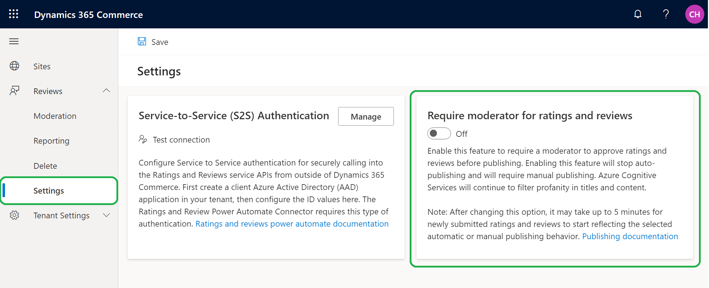
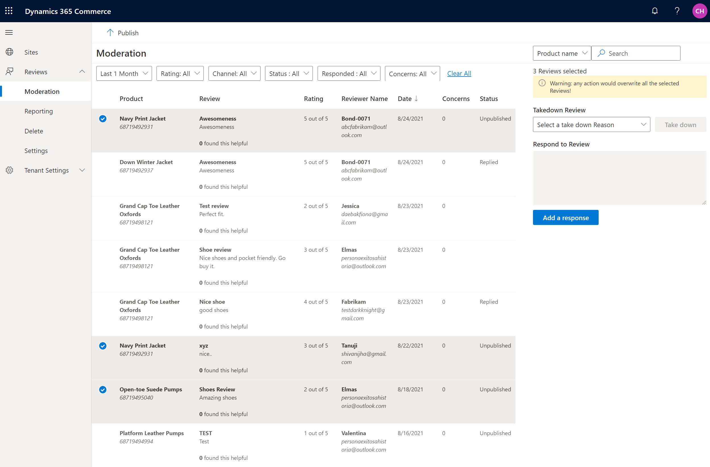
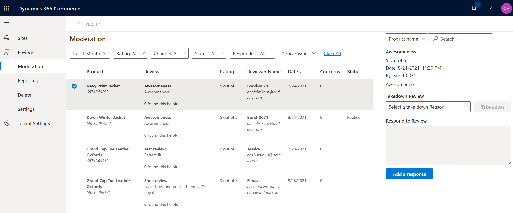
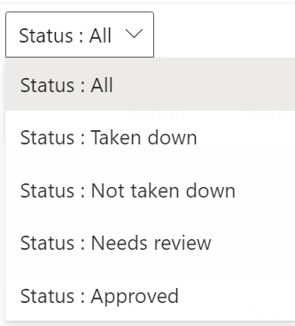

# Enable manual publishing of ratings and reviews by a moderator

[!include [banner](includes/banner.md)]

This article describes how to enable manual publishing of ratings and reviews by a moderator in Microsoft Dynamics 365 Commerce, and how to manually publish ratings and reviews.

Dynamics 365 Commerce's ratings and reviews solution uses Azure Cognitive Services to automatically redact profanity in review titles and content, and to publish ratings and reviews. Therefore, manual intervention isn't required to review and publish ratings and reviews to your e-commerce site.

However, some businesses might prefer that moderators manually review and approve reviews before they are published. To enable manual publishing of ratings and reviews by a moderator, you must enable the **Require moderator for ratings and reviews** feature in Commerce site builder.

## Enable the Require moderator for ratings and reviews feature in Commerce site builder

To enable the **Require moderator for ratings and reviews** feature in Commerce site builder, follow these steps.

1. Go to **Home \> Reviews \> Settings**.
1. Set the **Require moderator for ratings and reviews** option to **On**.

> [!NOTE]
> By enabling the **Require moderator for ratings and reviews** feature, you stop the automatic publishing of ratings and reviews, so that manual publishing is now required. However, Azure Cognitive Services will continue to redact profanity in review titles and content.

<!---->

## Publish ratings and reviews

When you enable the **Require moderator for ratings and reviews** feature, a moderator must manually review and publish ratings and reviews to make them appear on your e-commerce site.

To review and publish ratings and reviews in Commerce site builder, follow these steps.

1. Go to **Reviews \> Moderation**.
1. In the grid, if the **Status** field for a row is set to **Unpublished**, the rating and review in that row hasn't been published yet. To view only unpublished ratings and reviews, select **Status: Needs review** in the status filter above the grid.
1. Select one or more ratings and reviews that have a status of **Unpublished**, and then select **Publish** on the command bar. The selected ratings and reviews are added to the publishing queue and will appear on the e-commerce site after they are published.

> [!NOTE]
> - After a rating and review are published, the status value changes from **Unpublished** to a null value (blank field).
> - If you select multiple ratings and reviews that have mixed statuses, and then select **Publish**, ratings and reviews that haven't been published yet will be published. However, ratings and reviews that have already been published won't be published again.

The following illustration shows an example where three unpublished ratings and reviews are selected on the **Moderation** page in Commerce site builder.

<!---->
<!---->

## Additional resources

[Ratings and reviews overview](ratings-reviews-overview.md)

[Opt in to use ratings and reviews](opt-in-ratings-reviews.md)

[Manage ratings and reviews](manage-reviews.md)

[Configure ratings and reviews](configure-ratings-reviews.md)

[Sync product ratings](sync-product-ratings.md)

[Import and export ratings and reviews](import-export-reviews.md)

[Configure Service-to-Service authentication](service-to-service-auth.md)

[Ratings and reviews FAQ](ratings-reviews-faq.md)
