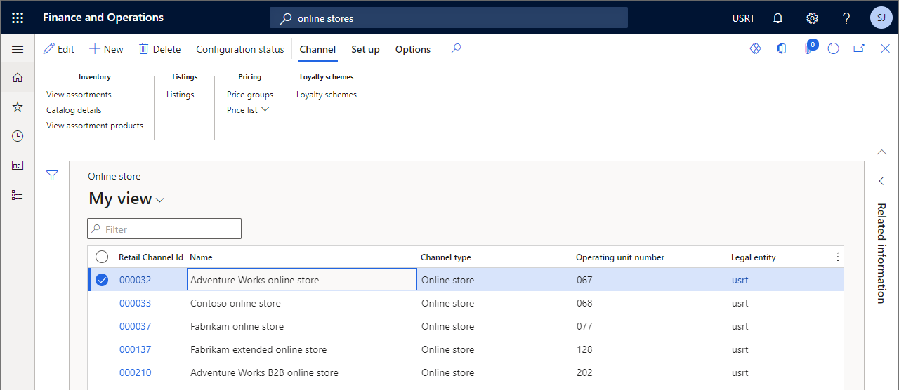
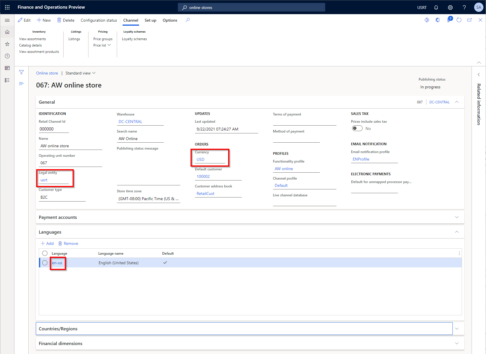
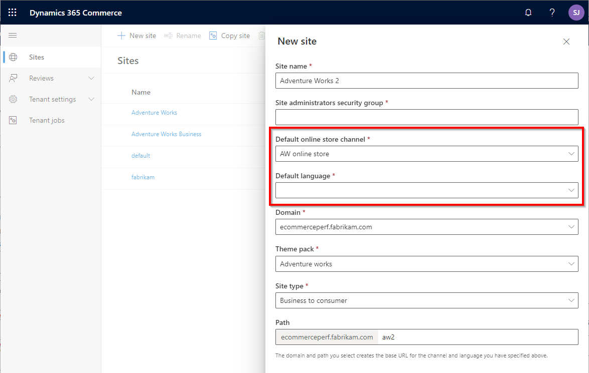
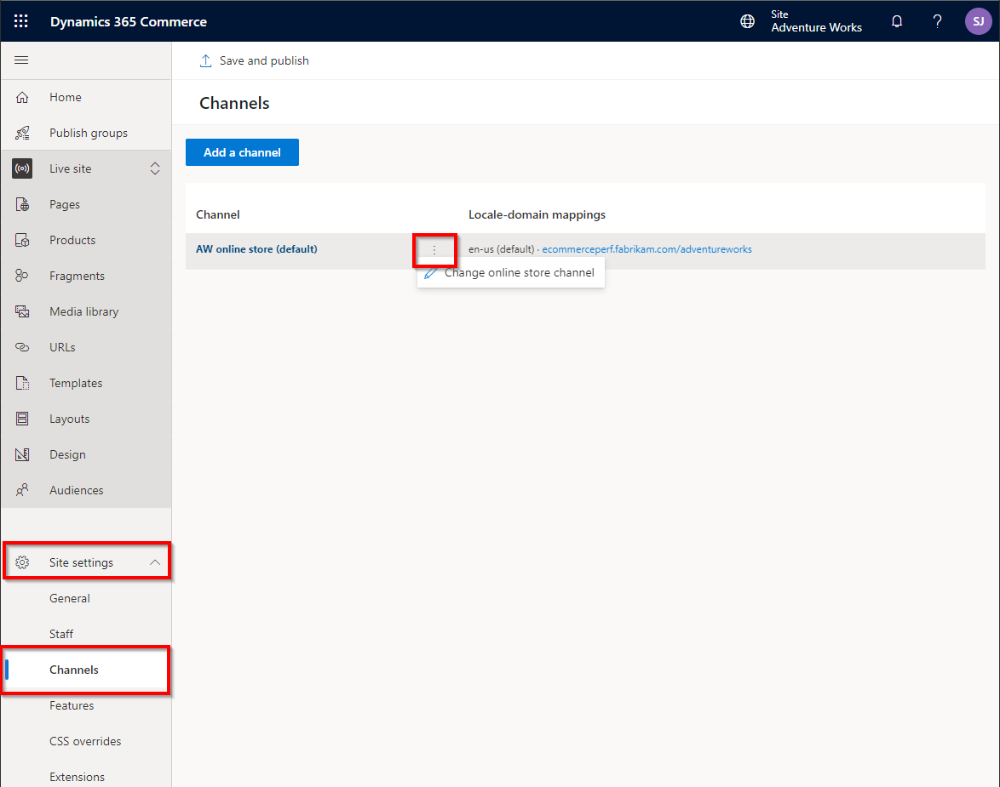
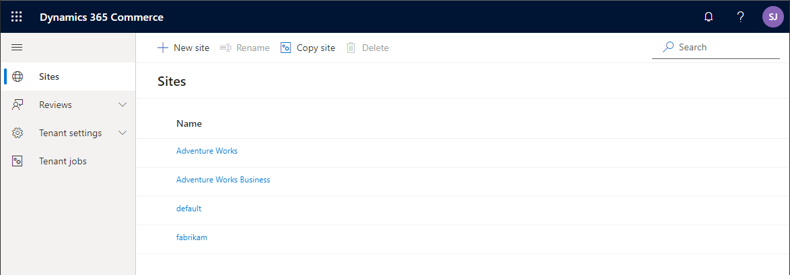
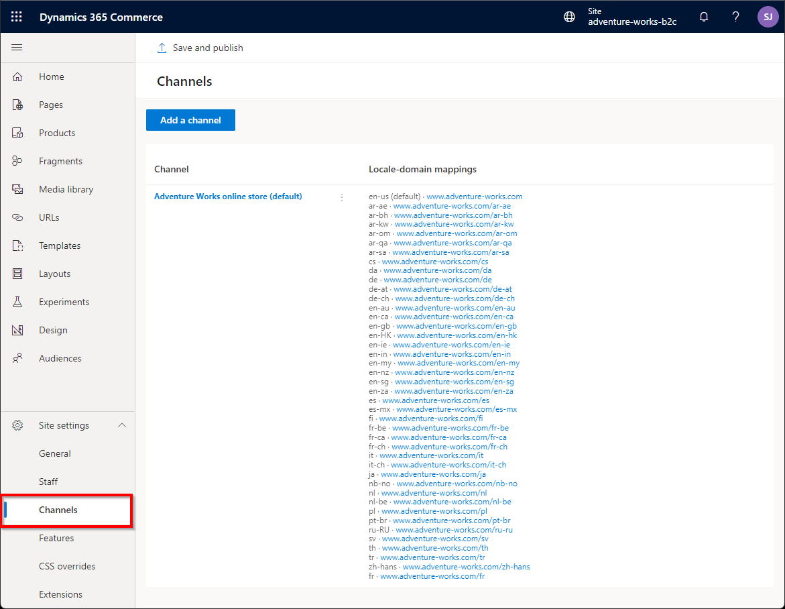
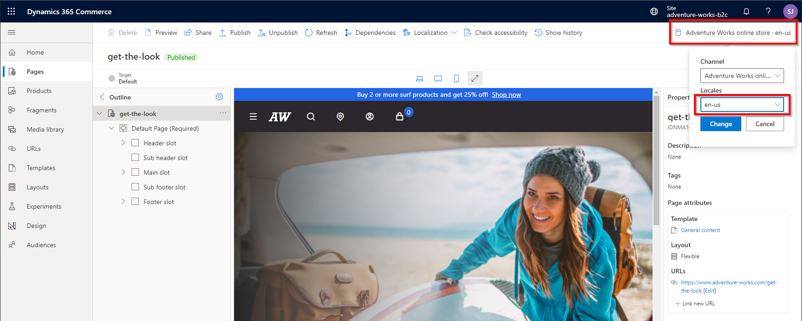
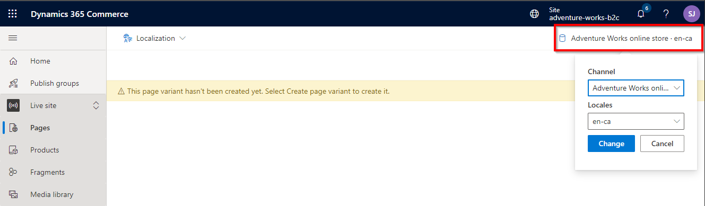
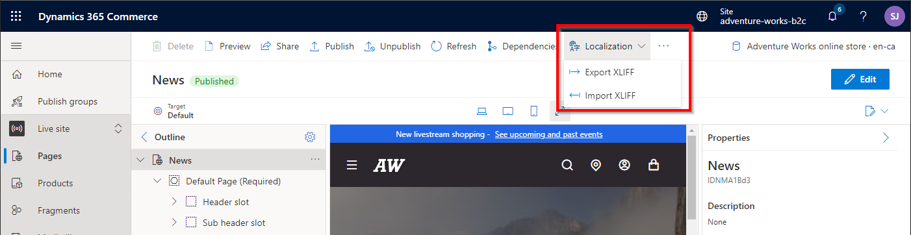

---
# required metadata

title: Map channels to e-commerce sites
description: This article describes some of the more common channel mapping scenarios in Microsoft Dynamics 365 Commerce that can be extrapolated for most other business requirements.
author: samjarawan
ms.date: 05/11/2022
ms.topic: article
ms.prod: 
ms.technology: 

# optional metadata

# ms.search.form: 
audience: Application user
# ms.devlang: 
ms.reviewer: v-chgriffin
# ms.tgt_pltfrm: 
ms.custom: 
ms.assetid: 
ms.search.region: Global
# ms.search.industry: 
ms.author: samjar
ms.search.validFrom: 2019-10-31
ms.dyn365.ops.version: Release 10.0.5

---
# Map channels to e-commerce sites

This article describes some of the more common channel mapping scenarios in Microsoft Dynamics 365 Commerce that can be extrapolated for most other business requirements.

Dynamics 365 Commerce supports many business scenarios for mapping [online channels](#channels) that have a configured set of products, prices, and discounts to [e-commerce site](#e-commerce-sites) experiences for customers.

This article covers the following scenarios:

- **A single-language channel that has a single e-commerce site experience.** For example, this scenario might involve a single brand site that is configured for the US English market.
- **A multi-language channel that has a single localized site experience.** For example, this scenario might involve a single brand site that is configured for Canada with French and English language support. In this scenario, users who select different languages have the same site experience, but it's localized into each user's selected language.
- **A multi-language channel that has a different site experience per language.** For example, this scenario might involve a single brand site that is configured for Canada with French and English language support. In this scenario, there is a unique site experiences for each language.
- **Multiple channels (single-language and/or multi-language) that have a single localized site experience.** For example, this scenario might involve a single brand site that is configured for Australia and New Zealand. In this scenario, both countries share the same site experience in English, but each country is configured with different products, currency, prices, discounts, and shipping modes.
- **Multiple channels (single-language and/or multi-language) that have a different site experience per channel.** For example, this scenario might involve a single brand site that is configured for Australia, Canada, and Germany in multiple languages. In this scenario, each country has a unique site experience that is configured with different products, currency, prices, discounts, and shipping modes.

## Channels

A channel (also known as an online store or online channel) represents an online e-commerce storefront that is used to map products, pricing, discounts, languages, payment methods, delivery modes, fulfillment centers, and other aspects of the online experience that will be available to your e-commerce customers. Channels are created and managed in Commerce headquarters and mapped to a single [legal entity](../fin-ops-core/fin-ops/organization-administration/organizations-organizational-hierarchies.md?toc=/dynamics365/commerce/toc.json#legal-entities). The legal entity is usually based in a single country that requires tax reporting for the channel, and can be configured with only a single currency.

For more information about channels, see [Channel overview](channels-overview.md). For more information about how to create an online channel, see [Set up an online channel](channel-setup-online.md).

The following example illustration from Commerce headquarters shows the default online channels that are deployed with Dynamics 365 Commerce if the demo data option is selected.

## E-commerce sites

An e-commerce site contains a set of site pages that customers use to browse and shop. E-commerce sites are managed in Commerce site builder.

For more information about how to create and manage sites in site builder, see [E-commerce site overview](online-store-overview.md).

## Common channel mapping scenarios

Dynamics 365 Commerce supports a wide range of channel mapping scenarios. The channel mapping scenarios that follow are just a subset of all possible channel mapping scenarios. They are intended as a guide to help you plan for any unique business scenarios that you have. The fictitious Adventure Works sporting goods store that is included with the Dynamics 365 Commerce demo data is used as an example for each scenario.

### Single-language channel that has a single e-commerce site experience

In the most basic scenario, a single channel has a single language for selling in a single market. An example for this scenario is an Adventure Works online store that is set up for the US English market only.

The following example illustration shows a channel configuration in Commerce headquarters. In this configuration, the online channel supports only a single language (**en-us**), a single currency (**USD**), and a single business entity (**usrt**) that is used for tax reporting.

The single online channel can be mapped to a single e-commerce site in site builder. For information about how to create a new site and map it to a channel, see the [Map a channel to a site in site builder](#map-a-channel-to-a-site-in-site-builder) section of this article.

### Multi-language channel that has a single localized site experience

In this scenario, a single channel supports more than one language. Therefore, product names, descriptions, and attributes can be localized in Commerce headquarters. To provide a complete localized site experience, marketing content on the site can also be localized in Commerce site builder.

The limitation of this scenario is that a single channel can be configured with only one currency, one legal entity, and one set of products and prices. This configuration works best for countries/regions that have a single currency and multiple languages (for example, Canada, which has the English and French languages), a single legal entity, and a single set of products and prices.

Each language in a channel can be configured with its own domain name. For example, the `www.adventure-works.ca` domain can be configured for the Canada English version, and the `www.adventure-works-fr.ca` domain can be configured for the Canada French version. Alternatively, different languages in a channel can be configured in a single domain, and then a different path can be used for each language. For example, the `www.adventure-works.ca` domain can be configured for the Canada English version, and then the `www.adventure-works.ca/fr` path can be used for the Canada French version. [Geo detection](geo-detection-redirection.md) can also be enabled to automatically redirect a user to the correct site, based on the user's location.

For information about how to enable customers to manually switch between languages, see the [Add and configure the site picker module](#add-and-configure-the-site-picker-module) section of this article. For information about how to customize localized pages and fragments, see the [Manage site content that has multiple channels and languages](#manage-site-content-that-has-multiple-channels-and-languages) section.

### Multi-language channel that has a different site experience per language

You might prefer a scenario where a single channel supports more than one language, but a completely different site experience is rendered for each language. The recommended method for implementing this scenario is to use [page variants](#implement-page-variants-for-each-language) on a single site.

Another method is to create a new e-commerce site for each language in site builder, and then map each site to a single online channel and language. The result will be a single online channel that is mapped to multiple e-commerce sites, one for each language. This multiple-site method requires extra management resources, because there will be more than one site to manage in site builder.

### Multiple channels (single-language and/or multi-language) that have a single localized site experience

A branded site might require multiple online channels per region to support a different currency, set of products, and set of prices for each channel in a single site. For example, the Adventure Works site might have an online channel for the Canadian market that has multiple languages, a channel for the US market that has one language, and a channel for the German market that has one language. In this scenario, each online channel will be configured for a region-specific legal entity, and it can have the same set of products that other channels have, a subset of those products, or a different set of products. Each channel will also have its own prices in the regional currency, taxes, discounts, and shipping modes.

In this scenario, each market can be configured with its own domain names. For example, the `www.adventure-works.com` domain can be configured for the US market, and the `www.adventure-works.de` domain can be configured for the German market. Alternatively, each market can be configured to use a different path. For example, the `www.adventure-works.com` domain can be configured for the US market, and then the `www.adventure-works.com/de` path can be used for the German market. [Geo detection](geo-detection-redirection.md) can also be enabled to automatically redirect users to the correct site, based on their region.

You might also want your site to provide a drop-down list that lets users manually switch to a specific market. For more information, see the [Add and configure the site picker module](#add-and-configure-the-site-picker-module) section of this article.

For information about how to configure multiple channels on a single site, see the [Configure multiple channels on an e-commerce site](#configure-multiple-channels-on-an-e-commerce-site) section.

### Multiple channels (single-language and/or multi-language) that have a different site experience per channel

You might want to have multiple channels for a single brand in different regions, and you might want each region to have a different site experience. There are two methods for implementing this scenario:

- Use [page variants](#implement-page-variants-for-each-language).
- Configure a different site for each online channel in site builder, and then map each site to a different online channel and language. This method requires extra management resources, because there will be more than one site to manage in site builder.

## Cross-channel sharing

Cross-channel sharing is useful when multiple channels on a single site can share content. For example, a retailer that has multiple brands and storefronts that are grouped under a single site can share some content among some or all of the storefronts. Shared content can include pages for terms and conditions, payment terms, shipment methods, and frequently asked questions (FAQ). For more information, see [Enable and use cross-channel sharing](cross-channel-sharing.md).

## Map a channel to a site in site builder

There are multiple methods for creating and configuring sites to use different online channels.

### Create a new site

You can create a brand-new site in site builder by going to the **Sites** list page and selecting **New site**. Then, in the **New site** dialog box that appears, you can select the default online channel and language for the site, as shown in the following example illustration.

The site that you create in this way will be empty and won't include any site pages (for example, a home page, category pages, and product pages).

For more information, see [Create an e-commerce site](create-ecommerce-site.md).

### Create a new site by using the site copy operation

Instead of creating a brand-new, empty site as described in the previous section, a better practice is to start with a copy of one of the starter sites that are provided in the Commerce module library, such as the Fabrikam or Adventure Works site.

To copy an existing site, go to the **Sites** list page in site builder, and select **Copy site**. Then, in the **Copy site** dialog box that appears, you can select the source site and specify the name of the destination site.

At this point, you can't yet select the default online channel and language for the site. However, you can configure those properties after the site copy operation has been completed. When you first select the site on the **Sites** list page in site builder, the **Setup your site** dialog box appears, where you can select the default channel and language.

For more information about the site copy operation, see [Copy an e-commerce site](copy-ecommerce-site.md).

### Manage an existing site channel

After a site has been configured with a channel, you can manage and update the channel from within the selected site in site builder at **Site settings \> Channels**, as shown in the following example illustration.

## Support multiple sites in a single tenant

Many branded sites can coexist in a single tenant. The following example illustration shows three different branded sites (Adventure Works, Adventure Works Business, and Fabrikam), each of which is mapped to a different single online channel.

## Configure a single domain name with paths for multiple sites

A single domain name can be used for multiple sites, and paths can then be used to separate sites or languages. For example, the `www.mycompany.com` domain is configured for two different e-commerce sites: one for Fabrikam and one for Adventure Works. In this case, the default path (`www.mycompany.com`), also known as the blank path, can be used for the Fabrikam site, and another path (for example, `www.mycompany.com/adventureworks`) can be used for the Adventure Works site. Another option is to use a custom path (for example, `www.mycompany.com/fabrikam`) instead of the default path for the Fabrikam site too.

Alternatively, a different domain name can be used for each site (for example, `www.adventure-works.com` and `www.fabrikam.com`). Paths can then be used for different languages or regions (for example, `www.adventure-works.com/fr-ca` for Canada French).

## Configure multiple languages on a site

Languages can be configured for the e-commerce site in site builder at **Site settings \> Channels**. In the following example illustration, each language has been configured by using the locale for the path, so that each language has a unique URL.

To add a new channel language, go to **Site settings \> Channels**, and select the channel link. In the pane that appears on the right, select **Add a locale** to select the channel and locale that you want to add. Then specify the path to use for the selected channel.

### Add and configure the site picker module

After you've configured a site with multiple languages and or channels, you might want to add a language selector to the site page header, so that users can manually select their language or country/region. The module library [header module](author-header-module.md) has built-in support for users to select a language by using the [site picker module](site-selector.md). The site picker module can be added to the header module in the header fragment.

For more information about how to add and configure the site picker module, see [Site picker module](site-selector.md).

### Implement page variants for each language

In this scenario, there is only one channel, but there are multiple languages. You can change the appearance of a page based on the selected language by creating a page variant for it. You can then add localized content to the variant.

When you have a page open in site builder, and you select the link in the upper right that shows the current channel and language, a channel and language picker appears, as shown in the following example illustration. If you want to override the page for the current language, select another locale, and then select **Change**. You can also change the channel if you're [managing a site that has multiple channels and languages](#manage-site-content-that has-multiple-channels-and-languages).

If the variant for the selected page or fragment hasn't yet been created, you receive a warning message, as shown in the following example illustration. In this case, select the **Create page variant** link in the message text. The dialog box that appears provides options that let you either start with a copy of an existing variant or create a brand-new page from a template.

If you don't create a variant, the original page is rendered and shows the appropriate language for module strings and product information from Commerce headquarters. However, if text such as a page title or other marketing content has been specified directly in default page modules, the strings for that text will remain in the original language.

Instead of manually creating each page and fragment, you can export each page and fragment to an XML Localization Interchange File Format (XLIFF) file that can then be sent for localization. After each XLIFF has been localized, it can be imported as a localized page variant. To export an XLIFF file from a page or fragment in site builder, or to import an XLIFF file into a page or fragment, select **Localization** on the command bar. Then select either **Export XLIFF** or **Import XLIFF**, as shown in the following example illustration.

## Manage site content that has multiple channels and languages

A site that has multiple channels and/or languages stores a unique variant of each page and fragment for each combination of a channel and a language. This behavior enables the page variants to contain localized data but also gives you the flexibility to change the look and feel of a page for a specific variant.

For information about how to work with page variants, see the [Implement page variants for each language](#implement-page-variants-for-each-language) section of this article.

## Configure multiple channels on an e-commerce site

You can add channels to an e-commerce site in site builder by going to **Site settings \> Channels** and selecting **Add a channel**. Then, in the **Add a channel** dialog box that appears, you can select the online channel and default locale.

## Additional resources

[Channels overview](channels-overview.md)

[Set up an online channel](channel-setup-online.md)

[Organizations and organizational hierarchies overview](../fin-ops-core/fin-ops/organization-administration/organizations-organizational-hierarchies.md)

[Set up geo detection and redirection](geo-detection-redirection.md)

[Enable and use cross-channel sharing](cross-channel-sharing.md)

[Create an e-commerce site](create-ecommerce-site.md)

[Copy an e-commerce site](copy-ecommerce-site.md)

[Site picker module](site-selector.md)
