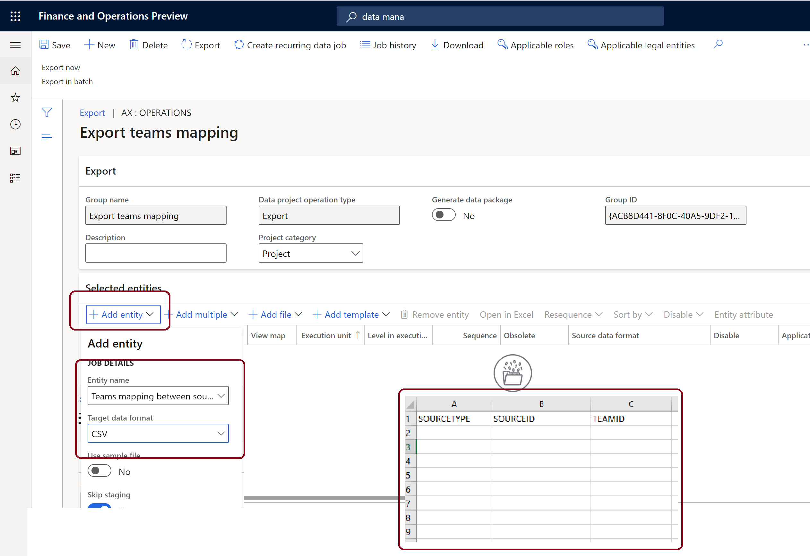

# Map stores and teams if there are pre-existing teams in Microsoft Teams

[!include [banner](includes/banner.md)]

This article covers how to map stores and corresponding teams in Dynamics 365 Commerce headquarters if your organization has already created teams in Microsoft Teams before Commerce integration.

Your organization may have teams created for some or all of your stores before integrating Dynamics 365 Commerce and Microsoft Teams. If this is the case, to establish task synchronization between Commerce POS and Microsoft Teams you must provide the mapping of stores and corresponding team in Commerce headquarters.

## Map stores and corresponding teams in Commerce headquarters 

To map stores and corresponding teams in Commerce headquarters, follow these steps.

1. Go to **System Administration \> Workspace \> Data management**.
1. Select **Export**. 
1. On the Action Pane, select **New**.
1. Under **Group name**, enter "Export Teams mapping".
1. On the **Selected entities** FastTab, select **Add entity**. The **Add entity** dialog box appears.  
1. In the **Entity name** drop-down list, select **Teams mapping between source and team**.
1. In the **Target data format** drop-down list, select **CSV**.
1. Select **Add**, and then select **Close**.
1. On the top left under the Action Pane, select **Export now**.
1. Under **Entity processing status**, select **Download file**.
1. In the exported CSV file, enter values for **SOURCETYPE**, **SOURCEID**, and **TEAMID** as follows:
    - For **SOURCETYPE**, enter "RetailStore". 
    - For **SOURCEID**, enter the store number (for example, "000135" for the San Francisco store). You can find store numbers at **Retail and Commerce \> Channels \> Stores**.
    - For **TEAMID**, enter the corresponding team ID from Microsoft Teams (for example, "5f8bc92b-6aa8-451e-85d1-3949c01ddc6c"). You can find team ID information at [admin.teams.microsoft.com](https://admin.teams.microsoft.com).
1. Save the CSV file to your local machine.
1. Go to **System Administration \> Workspace \> Data management**, and then select **Import**.
1. On the **Selected entities** FastTab, select **Add file**. The **Add file** dialog box appears.
1. In the **Entity name** drop-down list, select **Teams mapping between source and team**.
1. In the **Source data format** drop-down list, select **CSV**.
1. Select **Upload and add**, select the CSV file that you saved previously, and then select **Open**.
1. In the **Add file** dialog box, select **Close**.
1. On the Action Pane, select **Save** , and then select **Import**.

The following example image shows the **Export teams mapping** group in Commerce with **Add entity** elements and the exported CSV file headers highlighted.

> [!NOTE]
> After you complete the preceeding steps, follow the steps in [Synchronize task management between Microsoft Teams and POS](synchronize-tasks-teams-pos.md) to synchronize task management. 

## Additional resources

[Dynamics 365 Commerce and Microsoft Teams integration overview](commerce-teams-integration.md)

[Enable Dynamics 365 Commerce and Microsoft Teams integration](enable-teams-integration.md)

[Provision Microsoft Teams from Dynamics 365 Commerce](provision-teams-from-commerce.md)

[Synchronize task management between Microsoft Teams and Dynamics 365 Commerce POS](synchronize-tasks-teams-pos.md)

[Manage user roles in Microsoft Teams](manage-user-roles-teams.md)

[Dynamics 365 Commerce and Microsoft Teams integration FAQ](teams-integration-faq.md)
