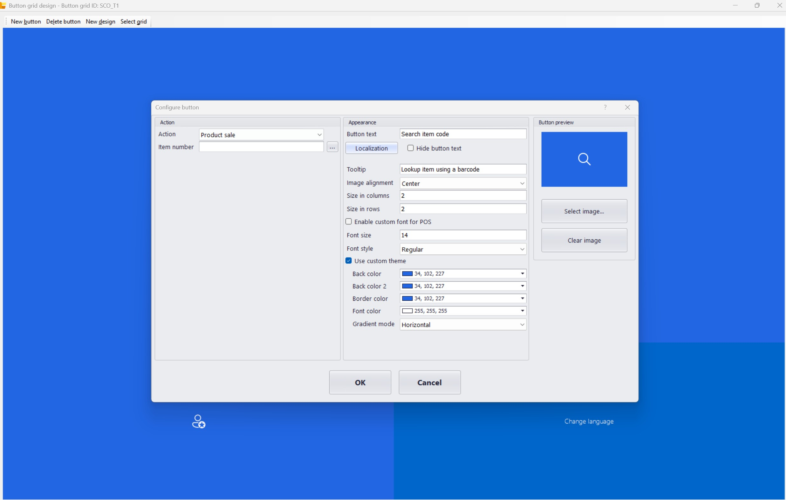
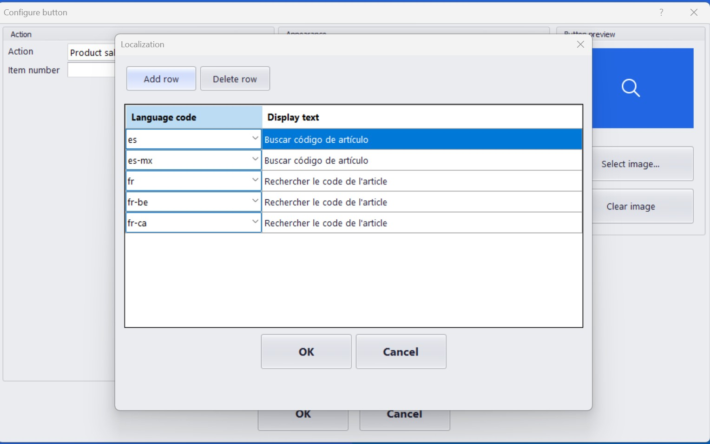
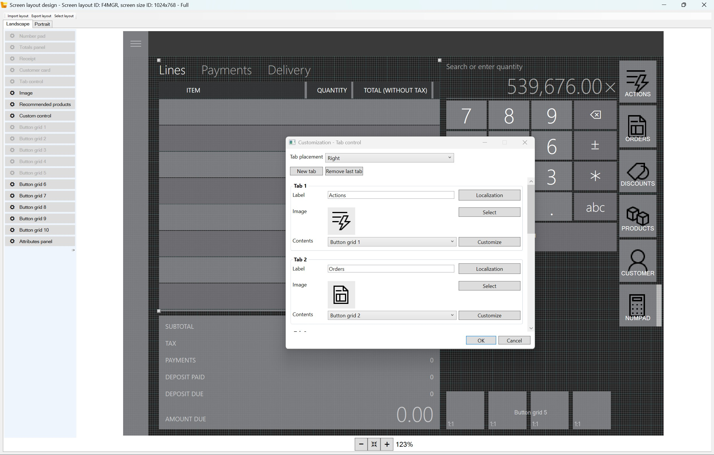

# Enable multilanguage support for self-checkout

This explains how to configure and use multilanguage features in Microsoft Dynamics 365 Commerce Store Commerce self-checkout, including localization of button grids and screen layout tabs.

The 10.0.47 release of Store Commerce POS introduces enhanced multilanguage capabilities that will allow retailers to offer a more accessible, and globally consistent experience for shoppers by enabling language selection on the Self-Checkout welcome screen and introducing new options to localize POS screen layout button grids and tabs.. This article describes how to configure and use these multi-language enhancements, helping you streamline checkout for both customers and store associates.

## Multilanguage self-checkout

Below, we describe language selection at self-checkout in Store Commerce POS and how stores can configure supported languages.

- **Language selection on the welcome screen** : Shoppers can choose their preferred language directly from the Self-Checkout welcome screen, without staff assistance.
- **Configurable per store** : Administrators can select which languages are available for each store, ensuring the right options for every location. To enable additional languages for a store , go to **Retail and Commerce ** -> Stores -> **General** -> **Regional settings** and list the additional languages in **Secondary languages**.
- **Consistent UI localization** : All labels, buttons, and tabs automatically resolve to the selected language for the duration of the transaction.
- **Session-based language reset**:  After checkout, the language resets to the store or associate default, ensuring a fresh experience for each customer.
- **Scan from welcome screen**:  Customers can begin scanning items immediately from the welcome screen, streamlining the checkout process.
- **Feature flag control** : Language selection on the welcome screen is enabled via a configuration flag in the functionality profile, allowing retailers to control rollout and experience. To enable the flag go to **Functionality profile**-> **Self-Checkout** and turn ON the flag **Enable language selection on Self-checkout Welcome page**.
- **New change language operation**:  This operationcan be added into the transaction grid for switching the language during checkout.

  

## Localization of button labels and screen layout tabs

Below, you’ll learn how to localize POS button labels and tabs within layout designer to support multiple languages.

- **Localize button grids and tabs:** Configure multiple languages for button labels and tab names directly in the layout designer. To localize a button grid, open the button **properties** in the button grid designer and select **localization** and use the dialog to add languages with their corresponding text. Select **OK** to save and exit. To localize a tab, go to **Customize** option for a tab in the layout designer and select **localization** and use the dialog to add languages with their corresponding text. Select **OK** to save and exit.
  
  
  
  
  
  
  
- **Single configuration, multi-language support:** Design layouts once and reuse across all supported languages—no need to duplicate layouts for each language.
- **Runtime resolution:** When a store associate logs into POS, the layout automatically resolves to the language configured for their worker profile.
- **Consistent experience:** UI elements update instantly to reflect the selected language, ensuring clarity and usability.

