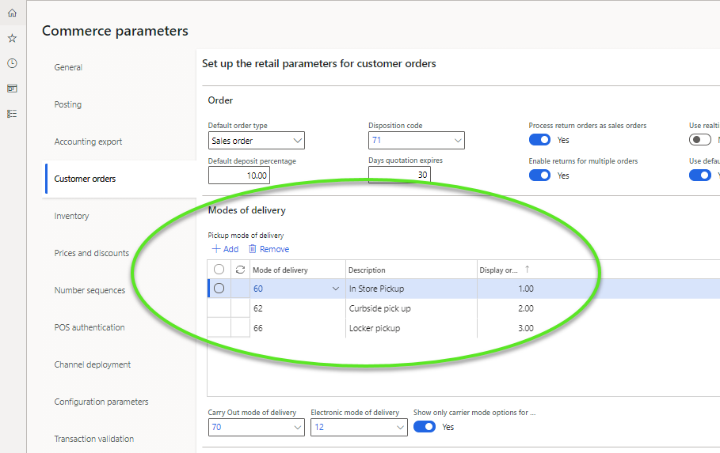
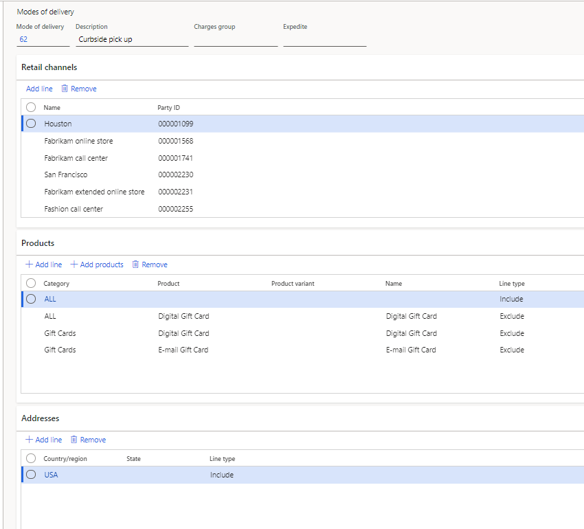
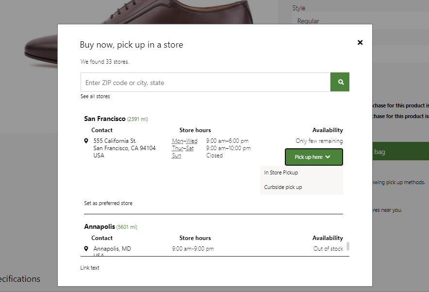
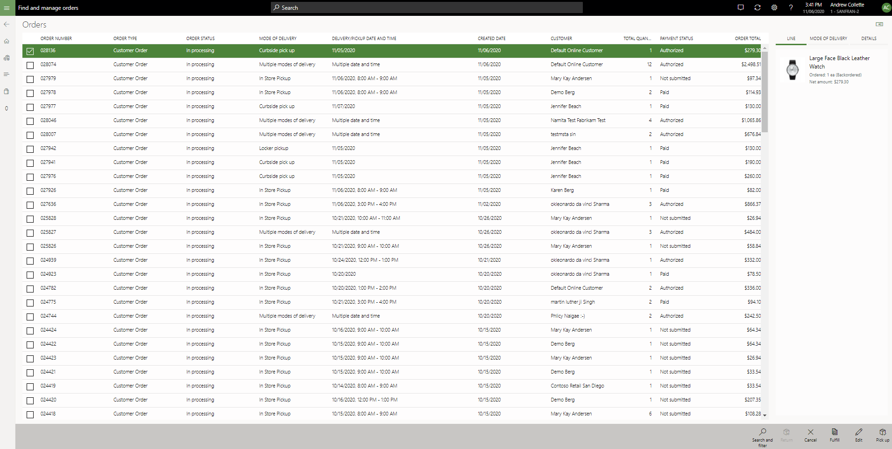

---
# required metadata

title: Enable multiple pickup delivery modes for customer orders
description: This topic explains the functionality in Microsoft Dynamics 365 Commerce that lets you create customer orders for pickup at a store.
author: hhainesms
ms.date: 06/07/2021
ms.topic: article
ms.prod:
ms.technology: 

# optional metadata

# ms.search.form:
audience: Application User
# ms.devlang: 
ms.reviewer: josaw
# ms.tgt_pltfrm: 
# ms.custom:
ms.search.region: global
# ms.search.industry:
ms.author: hhaines
ms.search.validFrom:
ms.dyn365.ops.version: 10.0.16
---

# Enable multiple pickup delivery modes for customer orders

[!include [banner](includes/banner.md)]

In Microsoft Dynamics 365 Commerce version 10.0.16 and later, organizations can define multiple modes of delivery that shoppers or sales associates can choose among when they create an order that will be picked up at a store. In this way, organizations can provide multiple pickup options to their shoppers. For example, many retailers now offer shoppers the choice of in-store pickup or curbside pickup for their orders. Commerce supports the configuration of these different pickup delivery modes. Users can then take advantage of them when they create customer orders in any supported Commerce channel (e-commerce, call center, or store).

## Enable and configure pickup delivery modes

To use this functionality, turn on the **Support for multiple pickup delivery modes** feature in the **Feature management** workspace in Commerce headquarters. After you turn on the feature, additional configuration is required.

In Commerce version 10.0.15 and earlier, organizations can define only one mode of delivery as the designated pickup delivery mode. This definition is done on the **Commerce parameters** page. In version 10.0.16 and later, when you turn on the **Support for multiple pickup delivery modes** feature, the mode of delivery that was previously defined as the pickup delivery mode on the **Commerce parameters** page is automatically copied into the new configuration for pickup delivery modes.

After you turn on the **Support for multiple pickup delivery modes** feature, you can define multiple pickup delivery modes in the **Pickup mode of delivery** grid on the **Modes of delivery** FastTab on the **Customer orders** tab of the **Commerce parameters** page.

The **Carry Out mode of delivery** and **Electronic mode of delivery** fields, and the **Show only carrier mode options for ship orders** option, have been relocated to this FastTab.

Before you configure additional pickup delivery modes, you must define the modes of delivery. On the **Modes of delivery** page in Commerce headquarters, add the modes of delivery that should be considered pickup delivery modes. Make sure that all configuration is completed. For example, if you are offering curbside pickup as a delivery option for your online shoppers for certain stores, you need to create a new delivery mode for this purpose. You can create this delivery mode using "curbside pickup" as the description. You'll then want to ensure that the "curbside pickup" mode of delivery is mapped to all of the Commerce channels that can offer it, including online stores that may offer this option and the individual store channels that will offer this method of fulfillment. Modes of delivery must also be linked to the products. In this example, if there are certain products that can't be fulfilled using "curbside pickup", you need to ensure that those items are excluded. When you've finished adding any new modes of delivery, run the **Process delivery modes** job to create the relationships between the mode of delivery, channels, and items. When the job is completed, open the **Distribution schedule** page in Commerce headquarters, and run the **1120** distribution job to ensure that the relevant Commerce channel databases are updated with your new delivery mode configuration.

After you define the additional pickup delivery modes, add them to the **Pickup mode of delivery** grid on the **Commerce parameters** page. Then run the appropriate distribution jobs to update the relevant Commerce channel databases with the configuration change.

> [!NOTE]
> Apart from the existing pickup delivery mode that is copied to the **Pickup mode of delivery** grid when you turn on the **Support for multiple pickup delivery modes** feature, for every additional pickup delivery mode configuration that you create, you should configure new modes of delivery. When you add modes of delivery to the **Pickup mode of delivery** grid, Commerce validates whether any active open sales lines already use them. If any open sales lines are found, you receive an error message. Modes of delivery aren't considered pickup delivery modes until all open sales lines that use them have been closed (either invoiced or canceled).

> [!IMPORTANT]
> After you define more than one pickup delivery mode on the **Commerce parameters** page, the **Support for multiple pickup delivery modes** feature becomes mandatory and can no longer be turned off. If you must turn off the feature, remove all but one pickup delivery mode from the **Pickup mode of delivery** grid. When only one pickup delivery mode is defined, the feature is longer considered mandatory and can be turned off.

### E-commerce site configurations

When the **Support for multiple pickup delivery modes** feature is turned on, the following modules on e-commerce pages show the new pickup delivery modes as configured:

- Buy box
- Store selector
- Cart
- Pickup information
- Order confirmation
- Order details

No additional steps are required on e-commerce pages to make the pickup delivery modes available.

## Work with multiple pickup delivery modes

When multiple pickup delivery modes are available for a channel, an enhanced experience is provided to customers when they shop for products that will be picked up. 

- In e-commerce channels, shoppers can select any valid pickup delivery mode that is available. For example, a retailer defines two pickup delivery modes (in-store pickup and curbside pickup), both are configured in the **Pickup mode of delivery** grid, and both are valid for the order fulfillment channel and the product that a shopper is currently purchasing. In this case, the shopper can select their preferred pickup delivery mode. The selected pickup delivery mode then becomes the mode of delivery that is linked to the sales order line when the order is created in Commerce headquarters.

    

- In store channels, if a customer order for pickup is created through the point of sale (POS) application, the sales associate is prompted to choose among the available pickup delivery modes, if any have been configured. If only one valid pickup delivery mode is available for the channel and item, the sales associate isn't prompted to select it. Instead, the available pickup delivery mode is automatically applied to the order lines.

    

- In call center channels, when users create pickup orders, they can manually select any defined pickup delivery mode that is linked to the call center channel. The system then validates that the selected pickup delivery mode can be used when the item that is being linked to it is ordered. When a pickup delivery mode is selected in call center channels, the sales order lines must be linked to a valid store warehouse. If a non-store warehouse is defined on a call center sales line, a pickup delivery mode can't be set on that sales line.
- Sales associates can use the **Order recall** or **Order fulfillment** operation in the POS application to retrieve a list of orders or order lines for pickup. If a sales associate uses a predefined search filter to show all orders that will be picked up at the current store, the queries are modified to ensure that the search results include all eligible orders that use any pickup delivery mode. POS users can also use existing filters to narrow down the list of orders to a specific pickup delivery mode. For example, they can show only orders for curbside pickup.

    

## Considerations for distributed order management

The [distributed order management (DOM)](./dom.md) features in Commerce ignore any sales lines that are marked for store pickup. These features have been updated to ensure that sales lines that are linked to configured pickup delivery modes bypass the DOM logic and won't be reallocated to a new fulfillment warehouse.

[!INCLUDE[footer-include](../includes/footer-banner.md)]
