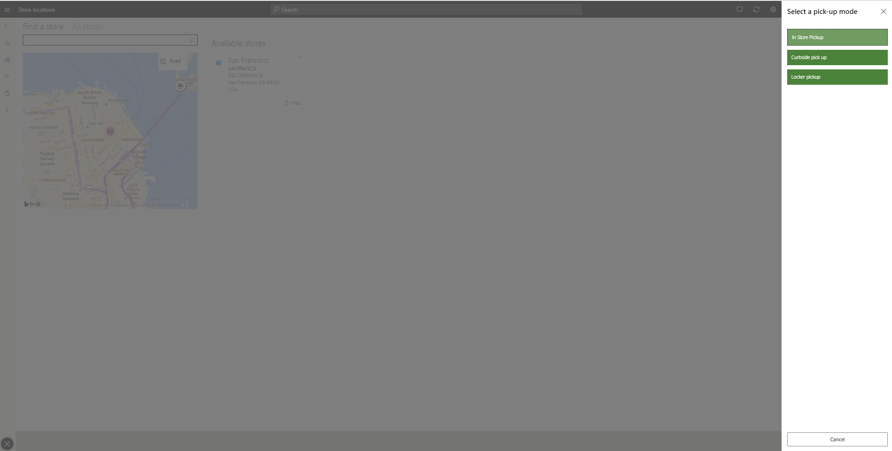

---
# required metadata

title: Enable multiple pickup delivery modes for customer orders
description: This topic explains functionality available in Dynamics 365 Commerce for creating customer orders for pickup at a store.
author: hhainesms
manager: annbe
ms.date: 11/17/2020
ms.topic: article
ms.prod:
ms.service: dynamics-365-commerce
ms.technology: 

# optional metadata

# ms.search.form:
audience: Application User
# ms.devlang: 
ms.reviewer: josaw
ms.search.scope: Core, Operations, Retail
# ms.tgt_pltfrm: 
# ms.custom:
ms.search.region: global
# ms.search.industry:
ms.author: hhaines
ms.search.validFrom:
ms.dyn365.ops.version: 10.0.16
---

# Enable multiple pickup delivery modes for customer orders

[!include [banner](includes/banner.md)]
[!include [banner](includes/preview-banner.md)]

In Dynamics 365 Commerce version 10.0.16 and later, organizations can define multiple modes of delivery that shoppers or sales associates can choose from when creating an order to be picked up in store. This functionality allows organizations to enable multiple pickup options for their shoppers to choose from. For example, many retailers now offer shoppers the choice of in-store or curbside pickup for their orders. Commerce supports the configuration of these different pickup types as needed. Users can leverage these pickup delivery mode options when creating a customer order in any supported Commerce channel (e-commerce, call center, or store).

## Enable and configure pickup delivery modes
To use this functionality, enable the **Support for multiple pickup delivery modes** feature from the **Feature management** workspace in Commerce headquarters. After you enable the feature, additional configurations are required.

In Commerce version 10.0.15 and earlier, organizations can only define a single mode of delivery as the designated pickup delivery mode. This is done on the **Commerce parameters** page. In versions 10.0.16 and later, when you enable **Support for multiple pickup delivery modes**, the mode of delivery that was previously defined as the pickup mode of delivery in **Commerce parameters** is automatically copied into the new pickup delivery modes configuration.

After you enable **Support for multiple pickup delivery modes**, go to the **Modes of delivery** FastTab under the **Customer orders** tab on the **Commerce parameters** page.  In the **Pickup mode of delivery** section, you can define multiple pick up modes of delivery. 

The parameters for **Carry Out mode of delivery** and **Electronic mode of delivery** were relocated to this section, as well as as the **Show only carrier mode options for ship orders** parameter.

Before you configure additional pickup modes of delivery, you ust define the delivery modes. Go to the **Modes of delivery** page in Commerce headquarters and add the additional delivery modes that should be considered as pickup delivery mode options. Make sure that all configurations are complete, such as linking the mode of delivery to appropriate channels and items. Then run the **Process delivery modes job** to create the delivery mode/channel/item relationships. When the processing job completes, go to the **Distribution schedule** in Commerce headquarters and run the **1120** distribution job to ensure the relevant Commerce channel databases are updated with your new delivery mode configurations.

After you define the additional pickup modes of delivery, add the new modes to the **Pickup mode of delivery** parameter on the **Commerce parameters** page. Then run the appropriate distribution jobs to update the relevant Commerce channel databases with the configuration change.

> [!NOTE]
> Outside of the existing pickup mode of delivery that is copied to the **Pickup mode of delivery** parameter when you enable the feature, you should configure new modes of delivery when creating additional pickup delivery mode configurations. When delivery modes are added to the **Pickup mode of delivery** parameter, Commerce verifies if there are active open sales lines that already use the delivery mode being added. If any open sales lines are detected, you will receive an error. The modes of delivery aren't considered pickup delivery modes until all open sales lines using that mode of delivery have been closed (either invoiced or canceled).

> [!IMPORTANT]
> Once you have defined more than one pick up mode of delivery in **Commerce parameters**, the **Support for multiple pickup delivery modes** feature becomes a **Mandatory** feature and can no longer be disabled. If you need to disable the feature, remove all but one pickup delivery mode from the **Pickup mode of delivery** parameter. When there is only one pickup mode defined, the feature will no longer be considered mandatory and it can be disabled.

### E-commerce site configurations
When the **Support for multiple pickup delivery modes** feature is enabled, the following modules show the new pickup delivery modes as configured.

- BuyBox
- Store selector
- Cart
- Pickup information
- Order confirmation 
- Order details.

There are no additional steps required on e-commerce pages to enable the pickup modes of delivery.

## Work with multiple pickup modes of delivery

When multiple pickup modes are available for a channel, an enhanced experience is provided for customers when shopping for products that will be picked up.   

- In e-commerce channels, the shopper can choose from any of the valid pickup modes of delivery available. For example, if the retailer defined two different pickup modes of delivery (in-store and curbside), both of these modes of delivery are configured in the **Pickup mode of delivery** parameter, and both of these modes of delivery are valid for the order fulfillment channel and the product being purchased, the shopper can choose their preferred pickup mode of delivery. The mode of delivery selected by the shopper becomes the mode of delivery linked to the sales line for the order when the order is created in Commerce headquarters.

- In store channels, if creating a customer order for pickup through the point of sale (POS) application, the sales associate is prompted to choose from available pickup modes of delivery if they have been configured. If only one valid pickup mode of delivery is available for the channel and item, the user isn't prompted to choose, and the available pickup mode of delivery is automatically applied to those order lines.

- In call center channels, users can manually choose from any of the defined pickup modes of delivery linked to that call center channel when creating a pick up order. Validation is done to ensure the item being linked to the pickup mode of delivery can be ordered with that pickup mode. When choosing a pickup delivery mode in call center, the sales order lines must be linked to a valid store warehouse. If a non-store warehouse is defined on the call center sales line, a pickup mode of delivery setting on the sales line isn't allowed.
  
- When a sales associate uses the **Order recall** or **Order fulfillment** operations in POS to retrieve a list of orders or order lines for pickup, if the sales associate uses a pre-defined search filter to show all orders to pick up for their current store, the queries are modified to ensure that all eligible orders that use any of the pickup modes of delivery are included in the search results. POS users can also use existing filters to narrow down the list of orders to a specific pickup mode (for example, show only curbside pickup orders).

## Considerations for distributed order management (DOM)

The [distributed order management](https://docs.microsoft.com/en-us/dynamics365/commerce/dom)(DOM) features in Commerce will ignore any sales lines that are marked for store pickup. This logic has been updated to ensure that sales lines linked to any of the configured pickup delivery modes bypass DOM logic and won't be potentially reallocated to a new fulfillment warehouse.
