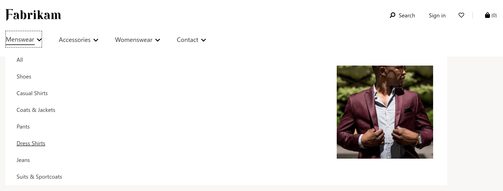

---
# required metadata

title: Navigation menu module 
description: This topic covers navigation menu modules and describes how to add them to site pages in Microsoft Dynamics 365 Commerce.
author:  anupamar-ms
ms.date: 10/27/2021
ms.topic: article
ms.prod: 
ms.technology: 

# optional metadata

# ms.search.form: 
# ROBOTS: 
audience: Application User
# ms.devlang: 
ms.reviewer: v-chgri
# ms.tgt_pltfrm: 
ms.custom: 
ms.assetid: 
ms.search.region: Global
ms.search.industry: 
ms.author: anupamar
ms.search.validFrom: 2019-10-31
ms.dyn365.ops.version: Release 10.0.14

---

# Navigation menu module

[!include [banner](includes/banner.md)]

This topic covers navigation menu modules and describes how to add them to site pages in Microsoft Dynamics 365 Commerce.

The primary purpose of navigation menu modules is to allow site users to browse products and site pages according to the channel navigation hierarchy defined in Dynamics 365 Commerce headquarters. Items configured in a navigation menu module appear as site header navigation. Navigation menu modules also support static menu items that link to other pages on an e-Commerce site.

The navigation menu module can be added to the header module of a page. In the Fabrikam theme, the navigation menu shows two levels by default. In the Starter theme, the navigation menu shows three levels by default. To change to the number of levels, a view extension is required on the theme.

The following illustration shows an example of a navigation menu for the Fabrikam site with two levels of category hierarchy and some static menu items.

## Navigation menu module properties

| Property name             | Value                 | Description |
|---------------------------|-----------------------|-------------|
| Source                  | **Retail**, **Manual authoring**, **Retail and manual authoring** | The **Retail** value allows the channel navigation hierarchy from Commerce headquarters to be displayed on the navigation menu. The **Manual authoring** value allows static menu items to be curated. The **Retail and manual authoring** value allows a mix of both. |
| Show category images | **True** or **False**    | When enabled, this property displays category images on the navigation menu as defined in Commerce headquarters for each category. Added in Commerce release 10.0.14. |
| Show promotional images | **True** or **False** | When this property is enabled, promotions can be configured by using images, links, and text. This property was added in the Commerce version 10.0.17 release. |
|Add category promotional content | Text, image, or link | When the **Show promotional images** property is enabled, you can add text, an image, or a link as promotional content on the navigation menu. |
| Enable multi-level navigation menu | **True** or **False** | When this property is enabled, the navigation menu can show multiple levels of the navigation hierarchy. This feature is available in the Commerce version 10.0.15 release. |
| Number of levels | integer | This property defines the numbers of levels that should be shown if the **Enable multilevel navigation menu** property is set to **True**. |
| Static menu item| Array of values| Static menu items that associate a menu item name with a link to a static site page. You can create menu items below other menu items. By default, static menus appear at the root level and will be appended to the channel navigation hierarchy if it exists. |
| Show root menu | **True** or **False** | When this property is enabled, the navigation menu can be defined under a custom root (for example, **Shop now**). This feature is available in the Dynamics 365 Commerce 10.0.15 release. |
| Root menu | string | This property can be used to define text for a custom root if the **Show root menu** property is set to **True**. |

The following illustration shows an example of a category image displayed on the navigation menu for the Fabrikam site.

## Add a navigation menu module to a header module

For details about how to add a navigation menu module to a header module, see [Header module](author-header-module.md).

## Additional resources

[Module library overview](starter-kit-overview.md)

[Breadcrumb module](add-breadcrumb.md)

[Site picker module](site-selector.md)

[Buy box module](add-buy-box.md)

[Cookie compliance](cookie-compliance.md)

[Header module](author-header-module.md)

[!INCLUDE[footer-include](../includes/footer-banner.md)]
