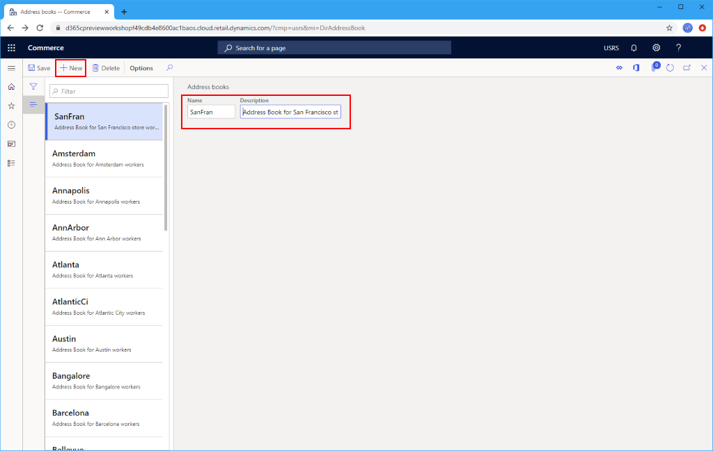

---
# required metadata

title: Create a new address book
description: This topic describes how to create address books in Microsoft Dynamics 365 Commerce.
author: samjarawan
ms.date: 01/27/2020
ms.topic: article
ms.prod: 
ms.technology: 

# optional metadata

# ms.search.form: 
audience: Application User
# ms.devlang: 
ms.reviewer: v-chgri
# ms.tgt_pltfrm: 
ms.custom: 
ms.assetid: 
ms.search.region: Global
# ms.search.industry: 
ms.author: samjar
ms.search.validFrom: 2020-01-20
ms.dyn365.ops.version: Release 10.0.8

---
# Create new address book

[!include [banner](includes/banner.md)]

This topic describes how to create a new address book in Microsoft Dynamics 365 Commerce.

Address books are used in Commerce for various reasons including storing customer lists and employee lists for a channel. Address books can be used for a single channel or shared between channels.

## Create a new address book

To create a new address book, follow these steps.
 
1. In the navigation pane, go to **Modules \> Channel setup \> Address books**.
1. On the action bar, select **New**.
1. Enter name and description information.
1. On the action bar, select **Save**.

The following image shows the creation of an employee address book for a retail store.

## Additional resources

[Info codes and info code groups](info-codes-retail.md)  		  

[Create a retail functionality profile](retail-functionality-profile.md)	  

[Screen layout overview](pos-screen-layouts.md)		  

[Configure and install Retail hardware station](retail-hardware-station-configuration-installation.md)  

[!INCLUDE[footer-include](../includes/footer-banner.md)]
