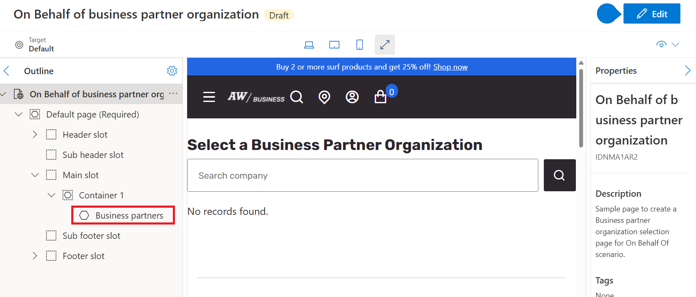

---
# required metadata

title: Create pages for "on behalf of" functionality in site builder
description: This article describes how to create pages for "on behalf of" functionality in Microsoft Dynamics 365 Commerce site builder.
author:  mariash529
ms.date: 03/03/2023
ms.topic: article
audience: Application User, Developer, IT Pro
ms.reviewer: v-chgriffin
ms.search.region: Global
ms.author: mashneer
ms.search.validFrom: 2023-02-27
ms.dyn365.ops.version: 10.0.33
---

# Create pages for "on behalf of" functionality in site builder

[!include[banner](../includes/banner.md)]

This article describes how to create pages for "on behalf of" functionality in Microsoft Dynamics 365 Commerce site builder. These pages allow account managers to sign in to a business-to-business (B2B) e-commerce website and perform operations on behalf of B2B buyers.

To enable on behalf of functionality in site builder, you must perform the following three actions. The fourth action is optional. 

- [Create a new page for selecting a business partner organization.](#create-a-business-partner-organization-selection-page)
- [Create a new page for selecting a business partner.](#create-a-business-partner-selection-page)
- [Modify B2B sign-in page to include a button for the account manager sign-in.](#modify-b2b-sign-in-page-to-include-employee-sign-in-button) 
- [Optional: Modify word "For" in the header.](#modify-the-word-for-in-the-header-optional)

The following sections provide details for performing each action.

## Create a business partner organization selection page

To create a business partner organization selection page in Commerce site builder, follow these steps. 

1. Go to **Pages**, and select **New** to create a new page.
1. In the **Create a new page** dialog box, under **Page name**, enter a name for the page, and then select **Next**.
1. Under **Choose a template**, select a template, and then select **Next**.
1. Under **Choose a layout**, select a page layout (for example, **Flexible layout**), and then select **Next**.
1. Under **Review and finish**, review the page configuration. If you need to edit the page information, select **Back**. If the page information is correct, select **Create page**. 
1. In the **Main** slot of the new page, select the ellipsis (**...**), and then select **Add module**.
1. In the **Select modules** dialog box, select the **business-partners** module, and then select **OK**.
1. In the property pane for the module, edit the module properties. For example, set the heading to be "Select a Business Partner Organization".
1. Select **Save**, and then select **Preview** to preview the page.
1. Select **Finish editing** to check in the page, and then select **Publish** to publish it.

### Configure a route for the page

To configure a route for the business partner page, follow these steps.

1. In site builder, go to **Site settings \> Extensions \> Routes**.
1. Under **Business partner selection**, select **Add a link**.
1. In the **Add a link** dialog box, select the business partner organization you created, and the select **Apply**.
1. Select **Save and publish**.

## Create a business partner selection page

To create a business partner selection page, follow the same steps as for the business partner organization page, using the same **business-partner** module. For the property of the container, specify a different heading (for example, "Select a Business Partner").

## Modify B2B sign-in page to include "Employee sign-in" button

To modify a B2B sign-in page to include an employee sign-in button, follow these steps. 

1. Go to **Pages**, and then select the site's B2B sign-in page.
1. In the **Main** slot of the new page, select the ellipsis (**...**), and then select **Add module**.
1. In the **Select modules** dialog box, select the **Sign in** module, and then select **OK**. The system will name this second sign-in module **Sign in 1**.
1. In the property pane for the module, under **Sign-in heading**, select **Heading**.
1. In the **Heading** dialog box, enter "Employee sign-in", and then select **OK**.
1. Select **Save**, and then select **Preview** to preview the page.
1. Select **Finish editing** to check in the page, and then select **Publish** to publish it.

## Modify the word "For" in the header (optional)

For the on behalf of scenario, a header should contain the names of the account manager and the buyer that is being represented. By default, the word "For" is used, for example, "Alexander For Cameron Hartnett". This word can be modified or removed in the header.definition.json file. For more information, see [Change module library static strings](e-commerce-extensibility/change-module-library-strings.md).

