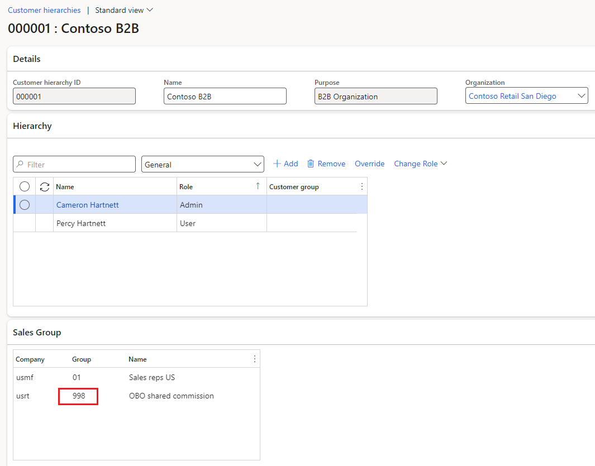

---
# required metadata

title: Set up and configure on behalf of (OBO) functionality
description: This article describes how to set up and configure on behalf of (OBO) functionality in Microsoft Dynamics 365 Commerce headquarters.
author:  mariash529
ms.date: 03/03/2023
ms.topic: article
audience: Application User, Developer, IT Pro
ms.reviewer: v-chgriffin
ms.search.region: Global
ms.author: mashneer
ms.search.validFrom: 2023-02-27
ms.dyn365.ops.version: 10.0.33
---

# Set up and configure on behalf of (OBO) functionality

[!include[banner](../includes/banner.md)]

This article describes how to set up and configure on behalf of (OBO) functionality in Microsoft Dynamics 365 Commerce headquarters.

## Add identity providers in Commerce Shared parameters

To add identity providers in Commerce Shared parameters, follow these steps.

To set up an identity provider in Commerce headquarters to be used by Retail server, follow these steps.

1. Go to **Retail and Commerce \> Headquarters setup \> Parameters \> Commerce Shared parameters**. 
1. In **Identity Providers tab**, add an identity provider you [created](obo-create-aad-application.md) for the Azure Active Directory (Azure AD) business-to-consumer (B2C) application:
1.	In Identity providers section add the following entry:
    1. **Issuer:** https://sts.windows.net/TENANTID
    1. **Issuer Type:** “Azure Active Directory”.
    1. **Issuer Name:** any name
1. In the **Relying Party** section, add the following entry:
    1. **ClientID:**  Client ID of Azure AD B2C application
    1. **Type:** Confidential
    1. **User Type:** Worker
1.	In Server Resource IDS section add the following entry:
    1. **Server Resource Id:** https://APPLICATIONIDUR
    1. **Name:** blank

## Create and configure a sales group

Create a [sales group](tasks/worker.md) of one or more account managers. Assign commissions percentage if your organization assigns commissions. For OBO functionality to work, it's sufficient for a sale representative to be present in a sales group. A commission percentage can be equal to zero. 

## Associate a sales group with a B2B buyer organization

To associate a sales group with a B2B buyer organization, follow these steps.

Under **Sales and Marketing \> Customers \> All customers** locate a customer of type organization that needs to be managed by the sales group you set up in the previous step. Specify this sales group ID in the field **Sales group** under **Sales order defaults** tab. Note, in the customer hierarchy that corresponds to this customer organization you'll be able to observe the sales group appear as a read-only field in the section **Sales Groups**. Any member of the Sales group is able to work on behalf of any user in this customer hierarchy.  

## Additional resources

[Update Commerce headquarters with the new Azure AD B2C information](update-hq-aad-b2c-info.md)

[Configure a worker](tasks/worker.md)

[Enter worker information](../human-resources/hr-personnel-enter-worker-information.md)
