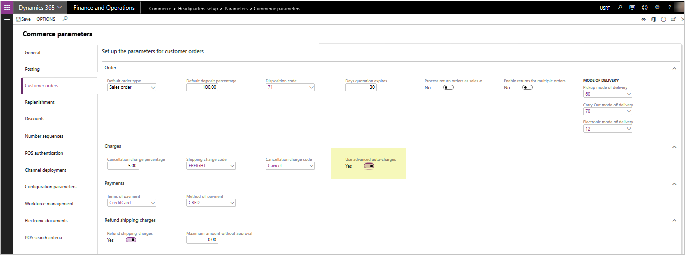
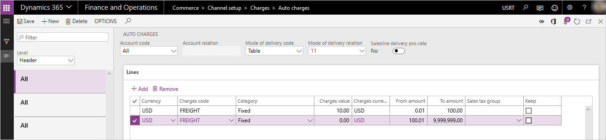
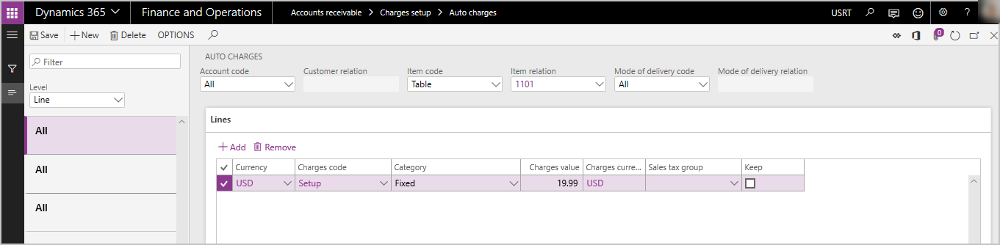
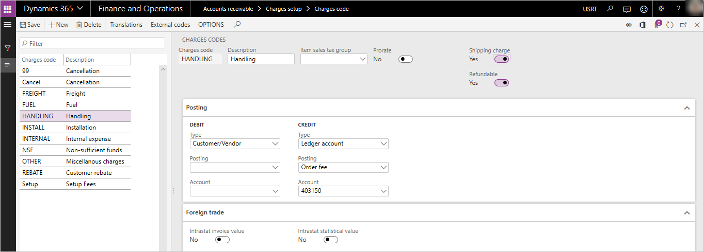

---
# required metadata

title: Omni-channel advanced auto charges
description: This topic describes capabilities for managing other order charges for Commerce channel orders using advanced auto charges features.
author: hhaines
ms.date: 03/24/2022
ms.topic: article
ms.prod: 
ms.technology: 

# optional metadata

ms.search.form:  
# ROBOTS: 
audience: Application User
# ms.devlang: 
ms.reviewer: josaw
# ms.tgt_pltfrm: 
ms.custom: 
ms.assetid: 
ms.search.region: global
ms.search.industry: Retail
ms.author: hhaines
ms.search.validFrom: 
ms.dyn365.ops.version: 10.0

---

# Omni-channel advanced auto charges

[!include [banner](includes/banner.md)]

This topic provides information on configuration and deployment of the advanced auto charges features that are available in Dynamics 365 for Retail version 10.0.

When the advanced auto charges features are enabled, orders created in any supported Commerce channel (point of sale (POS), call center, and online), can take advantage of the [auto charges](/dynamics365/unified-operations/retail/configure-call-center-delivery#define-charges-for-delivery-services) configurations defined in the ERP application for both header and line-level related charges.

In releases prior to Retail version 10.0, [auto charge](/dynamics365/unified-operations/retail/configure-call-center-delivery#define-charges-for-delivery-services) configurations are only accessible by orders created in e-Commerce and call center channels. In versions 10.0 and later, POS-created orders can use the auto charges configurations. That way, extra miscellaneous charges can systematically be added to sales transactions.

When using releases prior to version 10.0, a POS user is prompted to manually enter a shipping fee during the creation of a "ship all" or "ship selected" POS transaction. While the miscellaneous charges capabilities of the application are utilized in respect to how the charges are written to the order, no systematic calculation is provided – the calculation relies on the user's input to determine the value of the charges. The charges can only be added as a single "shipping" related charges code and cannot easily be edited or changed in the POS after they are created.

The use of manual prompts to add shipping charges is still available in versions 10.0 and later. If an organization does not enable the **Advanced Auto-charges** parameter, the POS prompts for manual entry of charges will remain the same.

With the advanced auto charges feature, POS users can have systematic calculations for any defined miscellaneous charges based on auto charges setup tables. In addition, users will have the ability to add or edit an unlimited number of additional charges and fees to any POS sales transaction at the header or line-level (for a cash and carry or customer order).

## Enable advanced auto charges

On the **Retail and Commerce \> Headquarters setup \> Parameters \> Commerce parameters** page, go to the **Customer orders** tab. On the **Charges** FastTab, set **Use advanced auto-charges** to **Yes**.

When advanced auto charges are enabled, users are no longer prompted to manually enter a shipping charge at the POS terminal when creating a ship-all or ship-selected customer order. POS order charges are systematically calculated and added to the POS transaction (if a corresponding auto charges table that matches the criterion of the order being created are found). Users can also add or maintain header or line-level charges manually through newly added POS operations that can be added to the POS screen layouts.

When advanced auto charges are enabled, the existing **Commerce parameters** for **Shipping charges code** and **Refund shipping charges** are no longer utilized. These parameters are only applicable if the **Use advanced auto charges** parameter is set to **No**.

Before you enable this feature, ensure that you have tested and trained your employees, as the enabled feature will change the business process flow of how shipping or other charges are calculated and added to POS sales orders. Make sure that you understand the impact of the process flow to the creation of transactions from POS. For call center and e-Commerce orders, the impact of enabling advanced auto charges is minimal. Call center and e-Commerce applications will continue to have the same behavior they have had historically related to the auto charges tables to calculate extra order fees. Call center channel users will continue to have the ability to manually edit any system calculated auto charges at the header or line level, or manually add additional miscellaneous charges at the header or line level.

## Add POS operations

For advanced auto charges to work properly in your POS application environment, new POS operations have been added. These operations must be added to your [POS screen layouts](/dynamics365/unified-operations/retail/pos-screen-layouts) and deployed to the POS devices as you deploy advanced auto charges. If these operations are not added, users will not be able to manage or maintain miscellaneous charges on the POS transactions and will have no way of adjusting or changing the charges values that are systematically calculated based on auto charges configurations. At minimum, it is suggested that you deploy the **Manage charges** operation to your POS layout.

The new operations are as follows.

- **142 - Manage charges** – Use this operation to allow POS users to view and edit miscellaneous charges for the POS transaction that were either added manually or systematically through auto charges calculations.
- **141 - Add header charges** – Use this operation to give the user the ability to manually add a header-level miscellaneous charge to any POS sales transaction (and select the charges code to be used).
- **140 - Add line charges** – Use this operation to give the user the ability to manually add a line level miscellaneous charge to any POS sales transaction line (and select the charges code to be used).
- **143 - Recalculate charges** – Use this operation to perform a full recalculation of the charges for the sales transaction. Any previously user-overwritten auto charges will be recalculated based on the current cart configuration.

As with all POS operations, security configurations can be made to require manager approval in order to execute the operation.

It is important to note that the above listed POS operations can also be added to the POS layout even if the **Use advanced auto-charges** parameter is disabled. In this scenario, organizations will still get added benefits of being able to view manually added charges and edit them using the **Manage charges** operation. Users may also use the **Add header charges** and **Add line charges** operations for POS transactions even when **Use advanced auto-charges** parameter is disabled. The **Recalculate charges** operation has less functionality if used when **Use advanced auto-charges** is disabled. In this scenario, nothing would be recalculated and any charges manually added to the transaction would just reset to $0.00.

## Use case examples

In this section, sample use cases are presented to help you understand the configuration and usage of auto charges and miscellaneous charges within the context of channel orders. These examples illustrate the behavior of the application when the **Use advanced auto-charges** parameter has been enabled.

### Auto charges header charges example

#### Use case scenario

A retailer wants to automatically add charges for freight when transactions are created in any Commerce channel that require a shipment of products to the customer. The retailer offers two methods of delivery: Ground and Air. If a customer chooses Ground delivery and the order value is less than $100, the retailer wants to charge the customer a freight charge of $10.00. If the order is over $100 in value and the customer chooses ground shipping, the customer will not be charged any extra freight fees. If the customer chooses the Air method of delivery for all orders, regardless of their total value, will be charged a freight fee of $20.00.

#### Setup and configuration

This scenario requires the configuration of two auto charges tables.

Go to **Accounts receivable \> Charges setup \> Auto charges**.

Configure two different header-level auto charges. Configure one for the "Ground mode" of delivery and one for the "Air mode" of delivery. For this scenario, configure them to be used for "All customers".

For the ground delivery charges, in the lines section of the **Auto-charges** page, define a charge that will be applied for orders between $.01 and $100 as $10.00. Create another charges line to indicate orders over $100.01 will have no charges.

For the air delivery charges, in the lines section of the auto charges form, define a charge of $20.00 that will be applied to all orders (between a value of $.01 to $9,999,999).

Send the changes to the Commerce Scale Unit/Channel DB so that the POS can utilize them by running the **1040 distribution schedule** job.

#### Sales processing for this scenario

After the configuration steps above are complete and the changes have been applied to the channel database, any customer order or sales transaction created in the POS, call center, or e-Commerce channels that have the ground or air delivery methods set at the header level will utilize these charges and automatically apply them to the sale.

At this time, the charges will apply to all sales transactions created within the legal entity that utilize these delivery modes, as there is no functionality to designate that an auto charge configuration will only apply to a specific selling channel.

For POS and e-Commerce scenarios, because there is no clearly defined "header" on these orders, header-level charges will only apply if all sales lines on the transaction are set to ship with the exact same mode of delivery. If there are "mixed-modes" of fulfillment on the transactions created by POS or e-Commerce, only line-level auto charges will be considered and applied.

In call center scenarios, the user has control over the setting of the delivery mode at the order header, therefore header-level charges will apply for these orders even if some of the sales lines have been configured to use a different mode of delivery. Header-level charges for call center orders will always be based on the mode of delivery that is defined at the order header level of the sales order.

### Auto charges line charges example

#### Use case scenario 

A retailer wants to add an extra charge to the customer for setup fees when the customer purchases a particular model of computer. This computer requires additional non-optional setup actions that the retailer will perform for the customer. The retailer has informed customers that there will be an additional fee for this setup. The retailer prefers to manage the charges related to this fee separately from the product sales price for financial reporting purposes. A setup fee of $19.99 will be charged to the customer when this specific computer is purchased in any channel.

#### Setup and configuration

This scenario requires the configuration of one line-level auto charges table.

Go to **Accounts Receivable \> Charges setup \> Auto charges**.

Set the **Level** drop-down menu to **Line**, and create a new auto charges record for all customers and for the specific product or product group where the setup fees will be charged.

Send the charges to the Commerce Scale Unit/Channel DB so that the POS can utilize them by running the **1040 distribution schedule** job.

#### Sales processing for this scenario

After the configurations steps above are complete and the changes have been applied to the channel database, any customer order or sales transaction created in the POS, call center, or e-Commerce channels that have this item on the order will trigger a line-level charge to be systematically added to the order total.

At this time, the charges will apply to any sales line that matches the configuration of the line-level auto charges within the legal entity, as there is no functionality to configure a line-level auto charge to apply only to a specific selling channel.

### Manual header charges example

#### Use case scenario description

A retailer is making an exception to typical processes by offering to provide a special home delivery of products to customers who order products in the store. The retailer and the customer have agreed that the customer will pay an additional $25 handling fee for this service. The order-taker needs to add this additional fee to the transaction. Because the fee is a blanket fee and not related to any single product on the order, a header charge will be utilized.

#### Setup and configuration

Ensure the charges code that will be used in this scenario has been properly configured by going to **Accounts Receivable \> Charges setup \> Charges** to define an appropriate charges code for the scenario.

If the charge should be considered a "shipping" related charge for the purpose of shipping related discounts or promotions, set **Shipping charge** on the charges code to **Yes**. If this charge is also allowed to be systematically refunded during the processing of a return transaction in the POS application, set **Refundable** to **Yes**. The **Refundable** flag is only applicable when the **Use advanced auto-charges** parameter is set to **Yes**.

Send the charges to the Commerce Scale Unit/Channel DB so that the POS can utilize them by running the **1040 distribution schedule** job.

The **Add header charge** operation must be configured in your [POS screen layout](/dynamics365/unified-operations/retail/pos-screen-layouts) so that a button that is accessible to the user from POS can call this operation (operation 141). The screen layout changes must be distributed to the channel as well through the distribution schedule function.

#### Sales processing of manual header charges

To execute the scenario in the POS application, the POS user will create the sales transaction as usual, adding the products and any other configurations to the sale. Prior to collecting payment, the user should execute the **Add header charge** operation, which will prompt the user to select a charges code and enter the charges value. Once the user completes the process, the charge will be added to the sales order as a header-level charge.

This process can be applied in the call center by using the existing **Charges** feature found on the **Sell** tab on the toolbar. On the **Maintain charges** page, the user can add a new charges line to the order header.

### Manual line charges example

#### Use case scenario

A customer has requested that two of the five items on their sales order be gift-wrapped. The retailer offers this optional service for a fee of $2.00 per item. The order-taker will need to add these fees to the specific items that need to be gift-wrapped.

#### Setup and configuration

Ensure the charges code that will be used in this scenario has been properly configured by going to **Accounts Receivable \> Charges setup \> Charges** to define an appropriate charges code for the scenario.

If the charge should be considered a "shipping" related charge for the purpose of shipping related discounts or promotions, set the **Shipping charge** on the charges code to **Yes**. If the charge is also allowed to be systematically refunded during the processing of a return transaction in the POS application, set **Refundable** to **Yes**. The **Refundable** flag is only applicable when the **Use advanced auto-charges** parameter is set to **Yes**.

Send the charges to the Commerce Scale Unit/Channel DB so that the POS can utilize them by running the **1040 distribution schedule** job.

The **Add line charge** operation must be configured in your [POS screen layout](/dynamics365/unified-operations/retail/pos-screen-layouts) so that a button that is accessible to the user from POS can call this operation (operation 140). The screen layout changes must be distributed to the channel as well through the distribution schedule function.

#### Sales processing of the manual line charge

To execute the scenario in the POS application, the POS user will create the sales transaction as usual, adding the products and any other configurations to the sale. Prior to collecting payment, the user should select the specific line where the charge will apply from the POS item list display and execute the **Add line charge** operation. The user will be prompted to select a charges code and enter the charges value. Once the user completes the process, the charge will be linked to the line and added to the order total as a line level charge. The user can repeat the process to add more line charges to other items lines on the transaction if needed.

The same process can be applied in the call center by using the "maintain charges" feature found under the **Financials** drop-down menu in the **Sales order lines** section on the **Sales order** page. Selecting this option will open the **Maintain charges** page where the user can add a new line-specific charge to the transaction.

## Additional features

### Editing charges on a POS sales transaction

The **Manage charges** operation (142) should be added to the [POS screen layout](/dynamics365/unified-operations/retail/pos-screen-layouts) so that a user can view and edit or override any system-calculated or manually created header or line-level charges. If the operation is not added, users will not be able to adjust the value of the charges on the POS transaction, nor will they be able to view the details of the charges such as the type of charges code tied to the charge.

On the **Manage charges** page in POS, the user can view both header and line-level charges details. The user can use the **Edit** function available on this page to make changes to the amount charged to a specific charges line. Once a charges line is overwritten manually, it will not be systematically recalculated unless the user initiates the **Recalculate charges** operation.

If the **Charge override reason code** has been configured on the **Commerce parameters** setup page, the user will be prompted to provide a reason code when charges have been modified in the POS application.

If reason codes have been captured for overwritten charges, a new report is also available to review and audit these overrides. The report can be found in **Retail and Commerce \> Inquiries and reports \> Charge override history**.

### Refunding charges on a POS return transaction

If the **Use advanced auto-charges** parameter is set to **Yes**, the existing Commerce parameter for **Refund shipping charges** is no longer applicable. To indicate which charges should be systematically refunded to a customer when using advanced auto charges, ensure the related charges code has been configured as **Refundable** on the **Charges code** setup page. Make sure that the settings have been synchronized to your Commerce channel databases through distribution schedule processing.

> [!TIP]
> For guidance that will help you ensure that line-level refundable charges are calculated based on the quantity that is returned, see [Refundable charges are not calculated based on the quantity returned](/troubleshoot/Refund-charges-miscalculated-for-partial-quantity-returned.md).

### Refunding charges on a return order transaction

Charges are not systematically refunded to **Return orders** created in Commerce. Users are required to select the **Copy charges** option when creating the **Return order**. If **Copy charges** is not selected, charges from the original sales transaction will not be automatically refunded. If **Copy charges** is selected, all charges will be copied to the return order and the user can manually edit or remove any charges they do not want to have refunded. The call center return order process currently does not acknowledge the **Refundable** flag on the **Charges code** setup.

### Configuring POS receipts to show charges

The following receipt elements have been added to the receipt line and footer to support the advanced auto charges functionality.

- **Line Shipping Charges** – This line-level element can be used to recap specific charges codes that have been applied to the sales line. Only charges codes that have been flagged as **Shipping** charges on the **Charges code** page will be displayed here.
- **Line Other Charges** – This line-level element can be used to recap any non-shipping specific charge codes that have been applied to the sales line. **Line Other Charges** are charges codes where the **Shipping** flag on the **Charges code** page has not been enabled.
- **Order Shipping Charges Details** – This footer-level element displays the descriptions of the charge codes applied to the order that have been flagged as **Shipping** charges on the **Charges code** setup page.
- **Order Shipping Charges** – This footer-level element shows the dollar value of the shipping-related charges.
- **Order Other Charges Details** – This footer-level element displays the description of the charges codes applied to the order that have not been flagged as shipping-related charges.
- **Order Other Charges** – This footer-level element displays the dollar value of the other charges that are not shipping-related.

It is recommended that the organization also add free text fields to the receipt footer, in order to define the areas where charges will be recapped.

### Preventing charges from being calculated until the POS order is completed

Some organizations may prefer to wait until the user has finished adding all of the sales lines to the POS transaction before calculating charges. To prevent calculation of charges as items are added to the POS transaction, turn on the **Manual charge calculation** parameter in the **Functionality profile** used by the store. Enabling this parameter will require the POS user to use the **Calculate totals** operation when they have completed adding the products to the POS transaction. The **Calculate totals** operation will then trigger the calculation of any auto charges for the order header or lines as applicable.

### Charges override reports

If users manually override the calculated charges or add a manual charge to the transaction, this data will be available for auditing in the **Charge Override History** report. The report can be accessed from **Retail and Commerce \> Inquiries and reports \> Charge Override History**. It is important to note that the data needed for this report is imported from the channel database into HQ through the "P" distribution schedule jobs. Therefore, information about overrides just performed in the POS may not be immediately available on this report until this job has uploaded the store transaction data into HQ.

## Additional resources

[Enable and configure auto charges by channel](auto-charges-by-channel.md)

[Prorate header charges to matching sales lines](pro-rate-charges-matching-lines.md)

[!INCLUDE[footer-include](../includes/footer-banner.md)]
