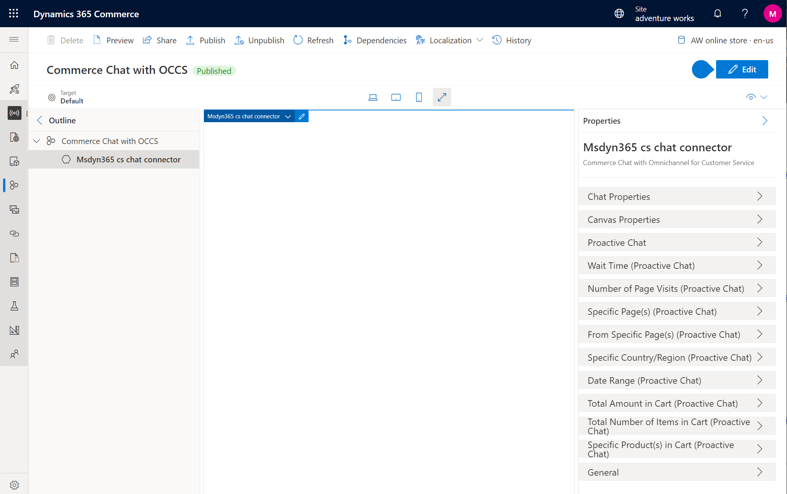

---
# required metadata

title: Commerce Chat with Omnichannel for Customer Service module additional parameters
description: This article describes the additional parameters that Commerce Chat with Omnichannel for Customer Service module allows in Microsoft Dynamics 365 Commerce.
author: gvrmohanreddy
ms.date: 09/07/2022
ms.topic: article
audience: Application User, Developer, IT Pro
ms.reviewer: v-chgriffin
ms.search.region: Global
ms.author: gmohanv
ms.search.validFrom: 2022-07-20
---

# Omnichannel for Customer Service module  parameters

This document provides details of all parameters of **Commerce Chat with Omnichannel for Customer Service** module. 

## Chat Properties

| Friendly name | Description | Default value |
| ------------- |--------------|--------------|
| Script source | Input the script source from chat configuration in Omnichannel for Customer Service. |Empty |
|Application ID  | Input the data application identifier from chat configuration in Omnichannel for Customer Service. | Empty|
| Organization ID | Input the data organization identifier from chat configuration in Omnichannel for Customer Service. | Empty|
| Organization URL | Input the data organization URL from chat configuration in Omnichannel for Customer Service. | Empty|
| Hide chat button | Set this value to hide the default open chat button that is available in the live chat widget. | Disabled|
| Default color override | Override default color specified in chat configuration within Omnichannel for Customer Service. Use HEX code (e.g., #2266E3). | Empty|
| Default font family override |  Specify the chat widget font family here to override the settings in chat configuration within Omnichannel for Customer Service.| Empty|
|  Anonymous username| Specify the username for an anonymous user. | “Visitor”|

 

## Canvas Properties
| Friendly name | Description | Default value |
| ------------- |--------------|--------------|
|Enable telemetry  |  Determines if telemetry data needs to be collected within Omnichannel for Customer Service.| Enabled|
|Open in window  |  Determines whether chat should be opened in a new window.|Disabled |
|Autofill browser window  | Determines whether chat widget will autofill the browser window in embedded mode. |Disabled |
|  Suggested action display|Determines the display of suggested actions. Set to ‘stacked’ to display suggested actions in vertical orientation. Leave empty for default horizontal orientation.  | Empty|

 
> [!Note] 
> All proactive chat properties below will be empty by default. Recommendation is to explore these properties to learn more and set them only if needed. This will help reduce any erroneous proactive chats from getting triggered.
## Proactive Chat
| Friendly name | Description | Default value |
| ------------- |--------------|--------------|
|  Enabled| Engage customers proactively based on different triggers. |Disabled |
|Chat greeting  |  Greeting message for when proactive chat has been triggered.| Empty|

## Wait Time (Proactive Chat)
| Friendly name | Description |
| ------------- |--------------|
|  Wait time (sec)|  Time (in seconds) spent on page before chat is triggered.| 
|  Chat greeting|Greeting message for when proactive chat has been triggered.  | 

## Number of page visits (Proactive Chat)
| Friendly name | Description |
| ------------- |--------------|
|Number of page visits  |  Number of page visits before chat is triggered. End-user must first accept cookie consent banner.| 
|Chat greeting  | Greeting message for when proactive chat has been triggered. | 

## Specific Page(s) (Proactive Chat)
| Friendly name | Description |
| ------------- |--------------|
| Page(s) |  List of pages that will trigger proactive chat when visited.| 
|Chat greeting  |Greeting message for when proactive chat has been triggered.  | 

## From specific page(s) (Proactive Chat)
| Friendly name | Description |
| ------------- |--------------|
|  Page(s)| List of pages that will trigger proactive chat when user navigates away from. | 
|Chat greeting  | Greeting message for when proactive chat has been triggered. | 

## Specific Country/Region (Proactive Chat)
| Friendly name | Description |
| ------------- |--------------|
| Country code | User visiting from specified country/region will trigger proactive chat. Country/region code should be 2-characters and uppercase (e.g., US). | 
|  Chat greeting| Greeting message for when proactive chat has been triggered. | 

## Date Range (Proactive Chat)
| Friendly name | Description |
| ------------- |--------------|
| Start Date (dd/mm/yyyy) |  On or after this date, proactive chat will be triggered.| 
| End Date (dd/mm/yyyy) | On or before this date, proactive chat will be triggered. | 
| Chat greeting | Greeting message for when proactive chat has been triggered. | 

## Total Amount in Cart (Proactive Chat)
| Friendly name | Description |
| ------------- |--------------|
|  Minimum| The minimum monetary amount (inclusive), in the shopping cart, required to trigger proactive chat when user visits cart page. | 
|  Maximum|The maximum monetary amount (inclusive), in the shopping cart, required to trigger proactive chat when user visits cart page.  | 
|Chat greeting  | Greeting message for when proactive chat has been triggered. | 
 

## Total Number of Items in Cart (Proactive Chat)
| Friendly name | Description |
| ------------- |--------------|
|Minimum  | The minimum number of items (inclusive), in the shopping cart, required to trigger proactive chat when user visits cart page. | 
|Maximum  | The maximum number of items (inclusive), in the shopping cart, required to trigger proactive chat when user visits cart page. | 
 |Chat greeting  | Greeting message for when proactive chat has been triggered. | 

Specific Product(s) in Cart (Proactive Chat)
| Friendly name | Description |
| ------------- |--------------|
| Product(s) ID/SKU | List of product IDs/SKU number(s) that will trigger proactive chat when user visits cart page. | 
| Chat greeting | Greeting message for when proactive chat has been triggered. | 
