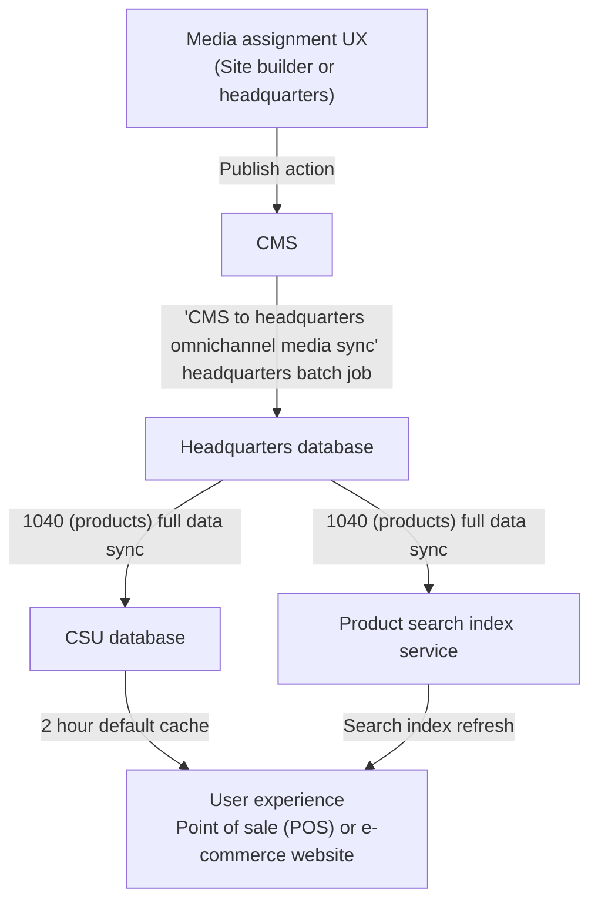

# Omnichannel media management overview

[!include[banner](../includes/banner.md)]
[!include[banner](../includes/preview-banner.md)]
[!include[banner](../includes/production-ready-preview-banner.md)]

This article provides an overview of omnichannel media management in Microsoft Dynamics 365 Commerce.

Starting with Dynamics 365 Commerce version 10.0.35, Commerce introduced an integrated solution for managing merchandising media that makes it easier to assign images and other media to products, product dimensions, and variants. Media assignments are no longer based on legacy filenames, allowing for the reuse of a single media asset for multiple merchandising entities. Specific product dimensions can be assigned media while ignoring unnecessary dimensions. For example, a shirt product with size, color, and style dimensions can assign media to color and style dimension combinations while ignoring size dimension media assignments. Large sets of media assignments and metadata can be managed through bulk export and import using tab-separated .tsv manifest files. 

The omnichannel media management solution integrates media management capabilities into the Commerce headquarters merchandising flow, and introduces a new omnichannel content workspace within Commerce site builder. All omnichannel media management capabilities introduced in Commerce starting with version 10.0.35 are currently opt-in using feature flags. New implementations activate this capability by default, while for existing solutions you can opt in on your own preferred timeline by following the migration steps. With these media management capabilities, Dynamics 365 Commerce offers a more flexible native solution for managing merchandising media.

<!-- ## Omnichannel media management how-to guides-->

## Omnichannel media management prerequisites and configuration

The omnichannel media management features introduced in Commerce version 10.0.35 are enabled using multiple sequential feature switches that allow staged rollouts to the new data model and workflows. User experiences such as e-commerce websites and point of sale (POS) can still use the legacy data model, while media and assignments are migrated and configured using the new product media assignment workflows. When the new media assignments are staged, feature switches can be used to update Commerce headquarters, Commerce Scale Unit (CSU), and rendering behavior to switch to the new media assignment data. To enable the necessary feature switches in your environments, you'll need system and tenant administrator privileges for headquarters and Commerce site builder, respectively.

To configure omnichannel media management features in your Commerce environments, follow these steps.

1. In site builder, go to **Tenant settings \> Features**, set the **Omnichannel content** feature flag to **On**, and select **Save and publish**. These actions make all omnichannel content authoring controls visible in site builder.
2. In headquarters, go to **Workspaces \> Feature management**.
3. On upper right, select **Check for updates**.
4. Select the **All** tab, and then search for "\*omni" in the **Filter** text box. 
5. Select **Enable omnichannel media assignment authoring UX** from the filter results.
6. On the lower right, select **Enable now**.  

    > [!NOTE]
    > During the pre-GA preview timeframe, if the **Feature state** column value for the **Enable omnichannel media assignment authoring UX** feature is **Preview**, then you'll need to submit an support request asking Microsoft to enable this feature flight for your environment. Once the feature flight support request is approved, you'll be able to complete the preceding step above. After enabling the feature, go to **Retail and Commerce \> Headquarters setup \> Parameters \> Commerce parameters**, select **Omnichannel media management** in the left navigation pane, enter the content management system (CMS) endpoint and CMS tenant code values that were provided by Microsoft Support in the feature flighting support request response, and then select **Save**.

7. Go to **Distribution schedules** and run the **1110 (Global configuration)** job.
8. At this stage you can use all authoring experiences to stage product media assignments, but nothing will flow through to headquarters, CSU databases, or end clients yet. For an existing environment migration, you may want to wait to proceed to step 9 until all of your media assignments are staged. For new or test environments, you can immediately proceed to step 9 now.
9. In headquarters, search and navigate to **CMS to HQ omnichannel media sync** from the headquarters search bar.
10. Set the **Batch processing** option to **Yes**.
11. Select **Recurrence** and schedule the **CMS to HQ omnichannel media sync** job to run on your preferred schedule (typically once per hour).
12. Search and navigate to the **Channel database** screen from the headquarters search bar, select the **Full data sync \> 1040 (Products)** from the drop-down list, and then select **OK**.
13. Search and navigate to the **Batch jobs** screen from the headquarters search control, search for "omni" in the **Job description** column filter control, and then validate that the **CMS to HQ omnichannel media sync** job has completed with a status of **Ended**.
14. Using the **Job description** column filter control, search for "Full sync", and then validate that the **Full sync...** job has completed with a status of **Ended**.
15. Go to **Workspaces \> Feature management**.
16. Select the **All** tab, and then in the **Filter** text box, search for "\*omni". 
17. Select **Enable omnichannel media assignments for CSU media locations**, and then select **Enable now**. This action changes how CSU delivers product media from the legacy data to the version 10.0.35 product media data model. This switch can also be disabled in case a reversion to the old data model is necessary.
18. Search and navigate to the **Distribution schedules** screen from the headquarters search control, and then run the **1110 (Global configuration)** job to push the feature flag settings to CSU.
19. For any e-commerce channels, open site builder and navigate to each site's **Site settings \> Extensions** controls, and select the **Enable omnichannel media management** feature switch until a checkmark appear, and then select **Save and publish**.

<!--Your environment should now be ready to use the omnichannel media features end-to-end. For more information on job and cache behavior for product media publishing, see [Omnichannel media management overview](#omnichannel-media-management-overview) for authoring tutorials, and [Omnichannel media publish architecture and dataflow](#omnichannel-media-publish-and-unpublish-architecture-and-dataflow).-->

## Omnichannel media publish (and unpublish) architecture and dataflow

On their way to user interfaces, product media assignments flow from site builder's content management system (CMS) to the headquarters database, and then to the CSU database(s).

The following illustration shows the product media assignment architecture and dataflow.

:::image type="content" source="media/OMM_1.png" alt-text=" Illustration showing the product media assignment architecture and dataflow.":::

For more information, see [Publish media assignments](publish-media-omnichannel.md).

## Omnichannel content media library

Starting with Commerce version 10.0.35, site builder contains an **Omnichannel content** workspace that can host and manage omnichannel media items that can be assigned to products and categories. The **Omnichannel content** workspace has visual similarities to the authoring experience for individual websites within site builder, with the primary difference being that content is organized without pairing channels to specific front-end website domains. The **Omnichannel content** CMS capabilities can be employed for both e-commerce and non-e-commerce scenarios (for example, POS). The **Omnichannel content** workspace functions as the central media library for merchandising media items that can be assigned to products and categories. The **Media library** in the **Omnichannel content** workspace behaves similar to the **Media library** for individual websites in site builder, with some important distinctions:  

- The available languages in the **Omnichannel content** **Media library** are a superset of all languages in headquarters across all configured channels.
- There's a system-default language called **Neutral** that can be used as a base configuration and [default fallback](assign-media-omnichannel.md#omnichannel-channel-specific-and-locale-specific-media-assignments) for media items and assignments.

## Additional resources

[Assign media to products and categories](assign-media-omnichannel.md)

[Publish media assignments](publish-media-omnichannel.md)

[Copy omnichannel content between tenants](copy-content-between-tenants.md)

[!INCLUDE[footer-include](../includes/footer-banner.md)]
