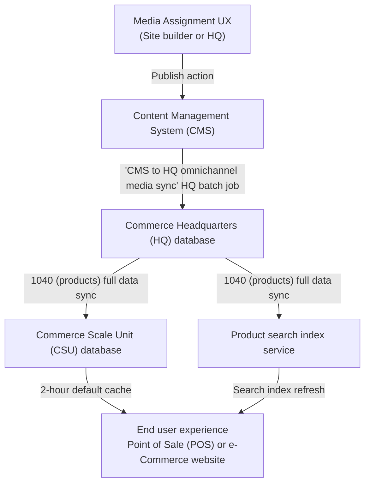

# Omnichannel media management overview

[!include[banner](../includes/banner.md)]
[!include[banner](../includes/preview-banner.md)]

This article provides an overview of omnichannel media management in Microsoft Dynamics 365 Commerce.

Starting with Dynamics 365 Commerce version 10.0.35, Commerce introduced an integrated solution for managing merchandising media that makes it easier to assign images and other media to products, product dimensions, and variants. Media assignments are no longer based on legacy filenames, allowing for the reuse of a single media asset for multiple merchandising entities. Specific product dimensions can be assigned media while ignoring unnecessary dimensions. For example, a shirt product with size, color, and style dimensions can assign media to color and style dimension combinations while ignoring size dimension media assignments. Large sets of media assignments and metadata can be managed through bulk export and import using tab-separated .tsv manifest files. 

The omnichannel media management solution integrates media management capabilities into the Commerce headquarters merchandising flow, and introduces a new omnichannel content workspace within Commerce site builder. All omnichannel media management capabilities introduced in Commerce starting with version 10.0.35 are currently opt-in using feature flags. New implementations activate this capability by default, while for existing solutions you can opt in on your own preferred timeline by following the migration steps. With these media management capabilities, Dynamics 365 Commerce offers a more flexible native solution for managing merchandising media.

<!-- ## Omnichannel media management how-to guides-->

## Omnichannel media management prerequisites and configuration

The omnichannel media management features introduced in 10.0.35 are enabled using multiple sequential feature switches that allow staged rollouts to the new data model and workflows. End user experiences such as e-Commerce websites and Point of Sale can still use the legacy data model, while media and assignments are migrated and configured using the new product media assignment workflows.  And when the new media assignments are staged, feature switches can be used to update HQ, CSU, and rendering behavior to switch to the new media assignment data. You'll need system and tenant administrator privileges for headquarters and site builder respectively to enable the necessary feature switches in your environments.

To configure omnichannel media management features in your Commerce environments, the following steps must be completed:
1. In site builder go to **Tenant settings** > **Features**, set the **Omnichannel content** feature flag to **On**, and select **Save and publish**. This will make all omnichannel content authoring controls visible in site builder.
2. In headquarters, search for "**feature management**" in the search bar and navigate to it.
3. Select the **Check for updates** button in upper right.
4. Select the **All** tab and search for _"*omni"_ in the **Filter** text box. 
5. Select **Enable omnichannel media assignment authoring UX** from the filter results.
6. In the right pane, select **Enable now**.  

    > [!NOTE]
    > During the pre-GA preview timeframe, if the **Feature state** column for the **Enable omnichannel media assignment authoring UX** feature reads "**Preview**", then you'll need to submit an support request asking Microsoft to enable this feature flight for your environment.  Once the feature flight support request is approved you'll be able to complete step #6 above.  After enabling, you'll also need to search and navigate to the **Commerce parameters** screen using the headquarters search bar, and select **Omnichannel media management** in the left navigation panel, and enter the **CMS endpoint** and **CMS tenant code** that will be provided by Microsoft Support in their feature flighting support request response, and then select **Save**.

7. Go to **Distribution schedules** and run 1110 job (**Global configuration**)
8. At this point you can now use all authoring experiences to stage product media assignments, but nothing yet will flow through to headquarters and CSU databases, or end clients. For an existing environment migration, you may wish to wait to go to step 9 until all of your media assignments are staged. For new or test environments, you can immediately move to step 9 now.
9. In headquarters, search and navigate to **CMS to HQ omnichannel media sync** from the headquarters search bar.
10. Set the **Batch processing** control to **Yes**
11. Select the **Recurrence** button and schedule the CMS -> HQ omnichannel media sync job to run on your desired schedule (typically once per hour).
12. Search and navigate to the **Channel database** screen from the headquarters search bar, select the **Full data sync** drop-down item, select **1040 (Products)** from the dropdown selection, and then select **OK**.
13. Search and navigate to the **Batch jobs** screen from the headquarters search control, search for "**omni**" in the **Job description** column filter control, and validate that the **CMS to HQ omnichannel media sync** job has completed and has an "**Ended**" status.
14. Then search for "**Full sync**" in the **Job description** column filter control, and validate that the **Full sync...** job has completed and has an "**Ended**" status.
15. Search and navigate to the **Feature management** screen from the headquarters search control.
16. Select the **All** tab and search for _"*omni"_ in the **Filter** text box. 
17. Select **Enable omnichannel media assignments for CSU media locations** and select **Enable now**. This changes how CSU delivers product media from the legacy data to the new post 10.0.35 product media data model. This switch can also be disabled in the event that a reversion to the old data model is necessary.
18. Search and navigate to the **Distribution schedules** screen from the headquarters search control, and run the **1110 (Global configuration)** job to push the feature flag settings to CSU.
19. For any e-commerce channels, open site builder and navigate to each site's **Site settings \> Extensions** controls, and select until a checkmark appears on the **Enable omnichannel media management** feature switch. Select **Save and publish** at the top to enable.
20. Your environment should now be ready to use the omnichannel media features end-to-end. Refer to the [Omnichannel media management overview](#omnichannel-media-management-overview) for authoring tutorials, and the [Omnichannel media publish architecture and dataflow](#omnichannel-media-publish-and-unpublish-architecture-and-dataflow) section to learn about job and cache behavior for product media publishing.

## Omnichannel media publish (and unpublish) architecture and dataflow

As explained in the [Publish media assignments](publish-media-omnichannel.md), product media assignments flow from site builder's CMS > headquarters database > CSU database(s) on their way to end user interfaces. The diagram below illustrates this architecture and dataflow:

## Omnichannel content media library

Starting with Commerce version 10.0.35, site builder contains an **Omnichannel content** workspace that can host and manage omnichannel media items which can be assigned to products and categories.  This **Omnichannel content** workspace has visual similarities to the authoring experience for individual websites within site builder; the primary difference is that content is organized without pairing channels to specific front-end website domains. The **Omnichannel content** CMS capabilities can be leveraged for both e-Commerce and _non_ e-Commerce (example: Point of Sale) scenarios. The **Omnichannel content** workspace functions as the central media library for merchandising media items, which can be assigned to products and categories.  The **Media library** in the **Omnichannel content** workspace behaves similar to the **Media library** for individual websites in site builder, with a few important distinctions:  1) The available languages in the **Omnichannel content** **Media library** are a superset of all languages in headquarters across all configured channels, and 2) there's a system-default language called **Neutral** that can be used as a base configuration and [default fallback](assign-media-omnichannel.md#omnichannel-channel-specific-and-locale-specific-media-assignments) for media items and assignments.

## Additional resources

[Assign media to products and categories](assign-media-omnichannel.md)

[Publish media assignments](publish-media-omnichannel.md)

[Copy omnichannel content between tenants](copy-content-between-tenants.md)

[!INCLUDE[footer-include](../includes/footer-banner.md)]
