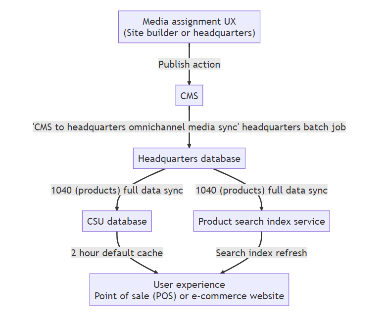

# Omnichannel media management overview

[!include[banner](../includes/banner.md)]

This article provides an overview of omnichannel media management in Microsoft Dynamics 365 Commerce.

Commerce version 10.0.35 introduced an integrated solution for managing merchandising media. This solution makes it easier to assign images and other media to products, product dimensions, and variants. Media assignments are no longer based on legacy file names. Therefore, a single media asset can be reused for multiple merchandising entities. Media can also be assigned to specific product dimensions, and unnecessary dimensions can be ignored. For example, for a shirt product that has size, color, and style dimensions, media can be assigned to color and style dimension combinations, but media assignments can be ignored for the size dimension. In addition,  tab-separated .tsv manifest files can be used to manage large sets of media assignments and metadata via bulk export and import.

The omnichannel media management solution integrates media management capabilities into the Commerce headquarters merchandising flow and introduces a new omnichannel content workspace in Commerce site builder. Currently, to use all omnichannel media management capabilities that are introduced as of Commerce version 10.0.35, you must opt in by using feature flags. New implementations activate these capabilities by default. However, for existing solutions, you can opt in on your preferred timeline by following the migration steps. Through these media management capabilities, Dynamics 365 Commerce offers a more flexible native solution for managing merchandising media.

The following video provides an overview of the omnichannel media management feature.

[!VIDEO https://www.microsoft.com/videoplayer/embed/RW18350]

## Omnichannel media management prerequisites and configuration

To enable the omnichannel media management features that are introduced in Commerce version 10.0.35, you use multiple sequential feature switches that allow for staged rollouts to the new data model and workflows. User experiences such as e-commerce websites and point of sale (POS) can still use the legacy data model. However, media and assignments are migrated and configured by using the new product media assignment workflows.

When the new media assignments are staged, you can use feature switches to update Commerce headquarters, Commerce Scale Unit (CSU), and rendering behavior so that they use the new media assignment data. To enable the necessary feature switches in your environments, you must have system administrator privileges for headquarters and tenant administrator privileges for site builder.

### Configure omnichannel media management features

> [!NOTE]
> Always run and validate the following steps first in your dev and/or user acceptance testing (UAT) environment before upgrading to a production environment.

To configure omnichannel media management features in your Commerce environments, follow these steps.

1. In site builder, go to **Tenant settings \> Features**, set the **Omnichannel content** feature flag to **On**, and then select **Save and publish**. These actions make all omnichannel content authoring controls visible in site builder.
1. In headquarters, go to **Workspaces \> Feature management**.
1. In the upper right, select **Check for updates**.
1. On the **All** tab, use the **Filter** field to search for "\*omni".
1. In the search results, select **Enable omnichannel media assignment authoring UX**.
1. In the lower right, select **Enable now**.

    > [!NOTE]
    > During the pre-general availability (GA) preview, if the **Feature state** value for the **Enable omnichannel media assignment authoring UX** feature is **Preview**, you must submit a support request to ask Microsoft to enable this feature flight for your environment. After the feature flight support request is approved, you'll be able to complete step 6. After you enable the feature, go to **Retail and Commerce \> Headquarters setup \> Parameters \> Commerce parameters**, and select **Omnichannel media management** on the left navigation pane. Enter the content management system (CMS) endpoint and CMS tenant code values that Microsoft Support provided in the response to your feature flighting support request, and then select **Save**.

1. Go to **Distribution schedules**, and run the **1110 (Global configuration)** job.
1. At this point, you can use all authoring experiences to stage product media assignments. However, nothing will flow through to headquarters, CSU databases, or end clients yet. For an existing environment migration, you might want to wait until all your media assignments are staged before you move on to step 9. For new or test environments, you can move on to step 9 now.
1. In headquarters, search for and open the **CMS to HQ omnichannel media sync** page.
1. Set the **Batch processing** option to **Yes**.
1. Select **Recurrence**, and schedule the **CMS to HQ omnichannel media sync** job to run on your preferred schedule (typically once per hour).
1. Search for and open the **Channel database** page, select **Full data sync \> 1040 (Products)** on the dropdown menu, and then select **OK**.
1. Search for and open the **Batch jobs** page from the headquarters search control. In the filter control for the **Job description** column, search for "omni", and confirm that the **CMS to HQ omnichannel media sync** job has finished running and has a status of **Ended**.
1. In the filter control for the **Job description** column, search for "Full sync", and then confirm that the **Full sync...** job has finished running and has a status of **Ended**.
1. Go to **Workspaces \> Feature management**.
1. On the **All** tab, use the **Filter** field to search for "\*omni".
1. In the search results, select **Enable omnichannel media assignments for CSU media locations**, and then select **Enable now**. This action changes how CSU delivers product media from the legacy data to the version 10.0.35 product media data model. This feature switch can be disabled if you must revert to the old data model.
1. Search for and open the **Distribution schedules** page from the headquarters search control. Then run the **1110 (Global configuration)** job to push the feature flag settings to CSU.
1. For any e-commerce channels, open site builder, and go to each site's **Site settings \> Extensions** controls. Select the **Enable omnichannel media management** feature switch until a check mark appears, and then select **Save and publish**. If you don't see the **Enable omnichannel media management** feature switch, see the note following this procedure.  
1. If you have an existing custom e-commerce deployment, you must update and redeploy your site's e-commerce modules and data actions to benefit from new omnichannel media scenarios such as "additional media" and "product videos". For instructions on how to pull the latest module library dependencies into your development environment, see [Pull updates](e-commerce-extensibility/sdk-updates.md#pull-updates).

> [!NOTE]
> If you do not see the **Enable omnichannel media management** feature switch under a site's **Site settings \> Extensions**, read the documentation on how to [update your site's app.settings.json file](e-commerce-extensibility/sdk-updates.md#update-the-appsettingsjson-file), and then add the following code to your app.settings.json file.

```javascript
"OmniChannelMedia":{
  "friendlyName": "Enable omni channel media management",
  "description": "This switch changes the default rendering behavior for product and category media. Once enabled, media assignments made in the omni channel workspace will be used instead of the legacy filename-based product and category image rendering behavior",
  "type": "boolean",
  "default": false,
  "group": "General"
  }   
```

## Omnichannel media publish (and unpublish) architecture and dataflow

On their way to user interfaces, product media assignments flow from site builder's CMS to the headquarters database, and then to the CSU databases.

The following illustration shows the product media assignment architecture and dataflow.



For more information, see [Publish media assignments](publish-media-omnichannel.md).

## Omnichannel content media library

As of Commerce version 10.0.35, site builder contains an **Omnichannel content** workspace that can host and manage omnichannel media items that can be assigned to products and categories. The **Omnichannel content** workspace has visual similarities to the authoring experience for individual websites in site builder. The main difference is that content is organized without pairing channels to specific front-end website domains. The CMS capabilities of the **Omnichannel content** workspace can be used for both e-commerce scenarios and non-e-commerce scenarios (for example, POS).

The **Omnichannel content** workspace functions as the central media library for merchandising media items that can be assigned to products and categories. The media library in the **Omnichannel content** workspace behaves like the media library for individual websites in site builder, but there are some important differences:

- The available languages in the **Omnichannel content** media library are a superset of all languages in headquarters across all configured channels.
- A system-default language that's named **Neutral** can be used as a base configuration and [default fallback](assign-media-omnichannel.md#omnichannel-channel-specific-and-locale-specific-media-assignments) for media items and assignments.

## Additional resources

[Assign media to products and categories](assign-media-omnichannel.md)

[Publish media assignments](publish-media-omnichannel.md)

[Copy omnichannel content between tenants](copy-content-between-tenants.md)

[Bulk import and export digital assets using manifests](import-export-manifest.md)

[!INCLUDE[footer-include](../includes/footer-banner.md)]
