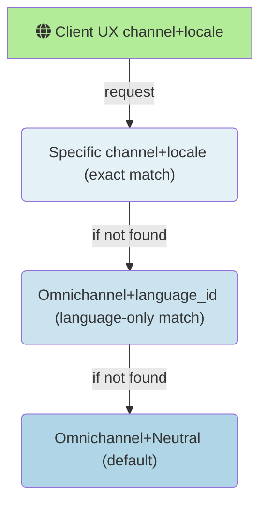
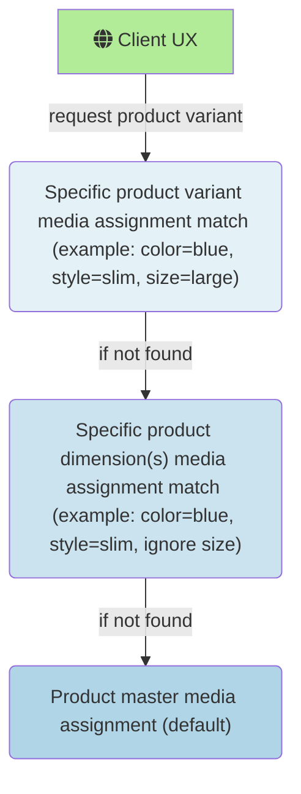
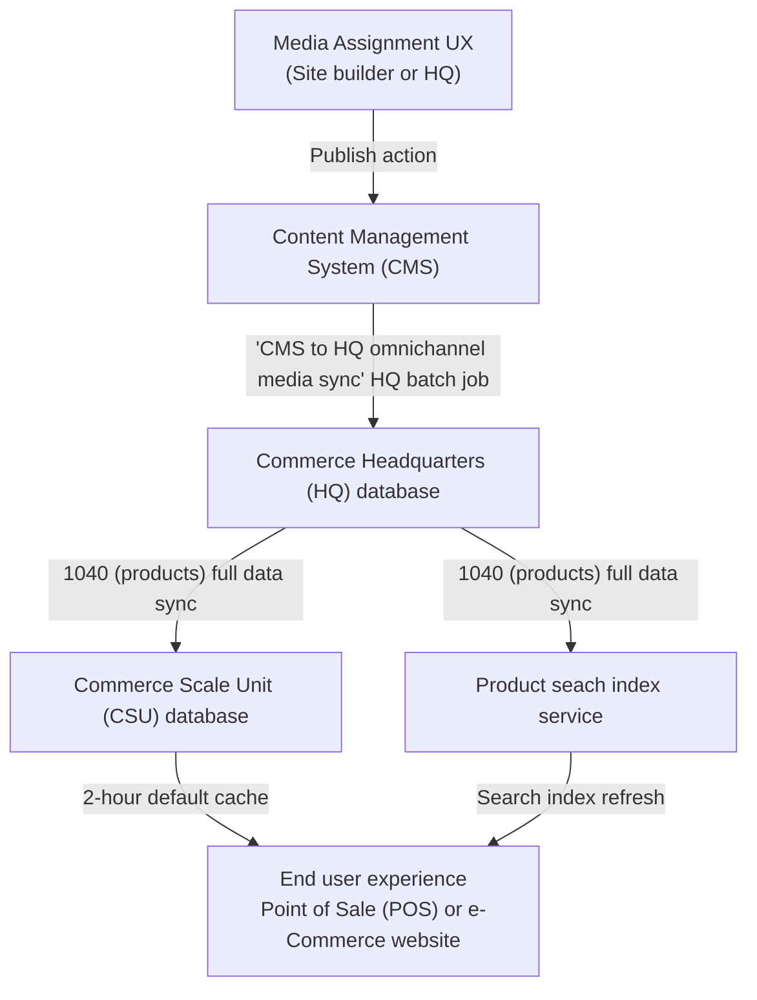

# Omnichannel media management overview
Starting with version 10.0.35, **Dynamics 365 Commerce** introduces an integrated solution for managing merchandising media. It is now easy to assign images and other media to products, product dimensions, and variants. Media assignments are no longer based on legacy filenames, allowing for the reuse of a single media asset for multiple merchandising entities. Specific product dimensions can be assigned media while ignoring unnecessary ones (example: a shirt product with size, color, and style dimensions can assign media to color + style dimension combinations, while ignoring size dimension media assignments).  Additionally, large sets of media assignments and metadata can be managed through bulk export and import using manifest files (.TSV format). The solution integrates media management capabilities into the **Commerce headquarters (HQ)** merchandising flow, and introduces a new omnichannel content workspace within **Commerce site builder**. All omnichannel media management capabilities introduced in 10.0.35+ are currently opt-in through feature flags. New implementations are encouraged to use this capability by default, while existing solutions may opt-in on their own preferred timeline by following the documented migration steps. With these capabilities, **Dynamics 365 Commerce** now offers a more flexible native solution for managing merchandising media.

# Omnichannel media management quick links
[todo]

# Omnichannel media management how-to guides
## Product media assignments
The following topics cover the steps to author and assign media to products.  
> [!NOTE]
> The following how-to guide assumes that the [**Omnichannel media management prerequisites and configuration**](#omnichannel-media-management-prerequisites-and-configuration) steps have already been followed to enable this feature for your environment.

### Assign media to simple products
For simple products, there are three media assignment scopes available: **Primary media**, **Additional media**, and product-specific **Swatches**.

### Primary media
**Primary media** is used for media assignments that should always display in a product's media gallery UX (examples: Point of Sale media gallery, e-Commerce PDP media gallery, etc.).  Media items in **Primary media** have a specific display order, and can be re-arranged using the **Up** or **Down** arrow buttons on each media item or by dragging and dropping them to the correct position.  The highest ordered image in the **Primary media** assignments is treated as the product's default image for scenarios where the entire media gallery experience is not needed.
> [!NOTE]
> The default image returned by core data-action APIs (example: get-simple-products) for UX scenarios like category pages, search results, or any other list view, will be the highest ordered media item in the **Primary media** assignments that is an image (example: any media item that is not an image will be skipped over, and the first image found in the **Primary media** ordered assignments will be returned as the default image for the product).

To assign media to a product's **Primary media**, follow these steps:
1. Navigate to the **Product media** assignments view in either **site builder's** **Omnichannel content** workspace, or to the same view in **Commerce Headquarters (HQ)** via the **Product media assignments** button in the released products by category view.
2. Search for a product using its name or product ID in the search view on the left, and select it.
3. Click the **Edit product media** button in the upper right.
4. Click the **Add media** button in the Master > **Primary media** section.  
5. Select one or more media items from the media library picker (you can also upload new images here with the **Upload** button in the upper left of the media picker), then click **Apply**.
6. Use the up and down arrows, or drag and drop, to reorder the media in the **Primary media** assignments.
7. Click **Finish editing** in the upper right to check in your changes (this will not publish your edits, but will allow others within your organization to see staged changes and make additional edits prior to publish). 

### Additional media
**Additional media** is used for media assignments that have a purpose outside of a standard product media gallery.  **Additional media** items have a property named **Purpose** that indicates its inteded use.  Typical **Additional media** purposes include product manuals, spec sheets, media kits, or any other custom media assignment purpose needed outside of the primary media gallery.  The list of media purposes is extensible and can be defined and expanded using the Commerce SDKs.

### Product-specific swatches
Prior to Commerce version 10.0.35, swatches were centrally managed in Commerce HQ by assigning a color hex value or image to dimension values (_example_: color|blue = #0000ff).  This central management of swatch assignments does _not_ change with the introduction of the media management features included in 10.0.35+ versions of Commerce; but there is a new capability to optionally assign product-specific swatches to override within product page experiences.  Swatches used for filtering products in category page, list view, and search results still use the centrally managed swatch values configured for product dimension values.  These centrally managed dimension-specific swatch assignments allow search refiners and filters to behave correctly accross multiple products. But for scenarios where more detailed swatches are wanted within a single product page, product-specific swatch overrides are available.  These swatch overrides can be used to show things like product-specific fabric textures, multi-colored patterns, iconography, or anything else that might go beyond the generic swatch values needed for product list refiners spanning multiple products.

>[!NOTE]
>If you plan to assign product-specific swatch assignements, it is important to ensure that swatch values are also assigned to the centrally managed list of dimension values in Commerce HQ.  This ensures that product list refiners and filters will display correctly for experiences that return results spanning multiple products (examples: category pages, search results, and product lists).  To configure these centrally-managed swatch dimension assignments, follow the steps described in the [Configure dimension values in Commerce headquarters
](https://learn.microsoft.com/en-us/dynamics365/commerce/dev-itpro/dimensions-swatch#configure-dimension-values-in-commerce-headquarters) article.

To assign product-specific swatches, follow these steps:
1. Navigate to the **Product media** assignments view in either **site builder's** **Omnichannel content** workspace, or to the same view in **Commerce Headquarters (HQ)** via the **Product media assignments** button in the released products by category view.
2. Search for a product using its name or product ID in the search view on the left, and select it.
3. Click the **Edit product media** button in the upper right.
4. In the product's Master tab, find the **Swatches** section underneath Additional Media and click the **Add swatch** button.
5. Select the **Dimension group** (eg. Color) and **Dimension** (eg. Blue) values that you wish to assign from the drop-down selection controls. 
6. Select the **Swatch type** from the drop-down selection control. If using a hexcode color value, click on the color picker control and choose the desired hex value; then skip ahead to step 9. 
7. If using an image, click the **Add media** button and upload or choose an image from the Omnichannel media library.
8. To choose a cropped sample from a product image, toggle the **Use cropped sample of image** to **On**.  Then drag and resize the blue rectangle on the image preview to select the portion of the image to use for the swatch.
9. When finished, click the **Add swatch** button at the bottom of the panel.  
10. Repeat steps 4-9 for any additional dimension values.
11. Click **Finish editing** in the upper right to check in your changes (this will not publish your edits, but will allow others within your organization to see staged changes and make additional edits prior to publish). 

### Omnichannel, channel-specific, and locale-specific media assignments
Media can be assigned in a hierarchical fallback manner accross channels and locales.  The default assignment for any product should use Omnichannel (channel) and Neutral (locale).  These assignments will be returned by default anywhere a more specific channel+local combination is not available.  For channel+locale combinations that require different product media assignments than the default Omnichannel+Neutral assignments, specific channel+locale media assignments can be configured to override the default.  After a specific channel+locale media assignment for a product is created and published, the inheritance to the omnichannel combination is severed and all media assignments are controlled by the specific channel+locale media assignments.

Here is the fallback order for channel and locale media assignments:

### Product master, product dimension(s), and product variant media assignments
Product masters typically have one or more product dimensions (color, size, style, configuration) which determine complete set of possible variants for the product.  Media assigned directly to the product master will serve as the default media for any product variants or dimensions that don't have their own explicit media assignments.  When media assignments are created for product dimension(s) or specific product variants, the inheritance to the product master assignments is severed and all media assignments are controlled by the dimension(s) or specific product variant media assignments.

Here is the fallback order for product master, product dimension(s), and product variant media assignments:

>[!NOTE]
>The fallback diagrams above for both product master and channel+locale media assignments illustrate the effective fallback logic, but _not_ the actual runtime behavior.  All the fallback logic is processed and flattened when the media assignments are published so that no unecessary fallback processing occurs at the time of request that could impact performance.  Assigning media at any level of this hierarchy will have _no_ impact on performance between one level to the next.

### Assign media to product master

Default media for a product master is assigned using the **Master** tab in the product media view using the same steps described in the [**Assign media to simple products**](#assign-media-to-simple-products) section. The only difference in assignment workflow between simple products and product masters is that product masters can have one or more dimensions (color, style, size, configuration), which in turn define possible product variants for a master product. 

#### Assign media to product dimensions
For product masters with multiple dimensions, it's common that media assignments are only needed for a subset of dimensions.  For example, in the apparel industry it is common to take photos of different colors and styles of the same master product shirt, but not different photos for every size.  

To assign media to certain product dimensions, follow these steps:
1. Navigate to the **Product media** assignments view in either **site builder's** **Omnichannel content** workspace, or to the same view in **Commerce Headquarters (HQ)** via the **Product media assignments** button in the released products by category view.
2. Search for a product master (that is configured in HQ with more than one dimension) using its name or product ID in the search view on the left, and select it.
3. Click the **Edit product media** button in the upper right.
4. Click on the **Dimensions** tab in-between the Master tab and the Variants tab at the top of the workspace.
5. Click on the **Create assignment matrix** button in the middle of the workspace (if someone has already created an assignment matrix for this product master, then skip ahead to step 7).
6. Choose the dimension(s) that you want to use for media assignments and then click the **Create assignment matrix** button at the bottom of the panel.
7. There will now be a grid matrix with the chosen dimensions.  Click on a cell in the grid to navigate to the assignment view for that dimension value.
8. Edit your primary and additional media assignments for the chosen dimension combination using the **Add media** and **Remove** (trash can icon on each media item when selected) buttons. 
9. Use the up and down arrows, or drag and drop, to reorder the media in the **Primary media** assignments.
10. When  your changes are complete, click **Finish editing** in the upper right to check in the new set of media assignments (this will not publish your edits, but will allow others within your organization to see staged changes and make additional edits prior to publish). 

#### Assign media to product variants
As explained in the [master > dimensions > variant fallback section](#product-master-product-dimensions-and-product-variant-media-assignments) above, media can be assigned to individual product variants whenever needed.  This disconnects the fallback to both dimension or master media assignments, and media assignments for the selected variant are entirely controlled at the variant level.

To assign media to a specific product variant, follow these steps:
1. Navigate to the **Product media** assignments view in either **site builder's** **Omnichannel content** workspace, or to the same view in **Commerce Headquarters (HQ)** via the **Product media assignments** button in the released products by category view.
2. Search for a product master (that is configured in HQ with more than one dimension) using its name or product ID in the search view on the left, and select it.
3. Click the **Edit product media** button in the upper right.
4. Click on the **Variant** tab next to the Master and Dimensions tab at the top of the workspace.
5. Find the variant you wish to edit, and click the **+** button (or the preview image, if media is already assigned) in the **Assign media** column.  This will navigate to the media assignment editing workspace for the chosen product variant.
6. Edit your primary and additional media assignments for the chosen product variant using the **Add media** and **Remove** (trash can icon on each media item when selected) buttons. 
9. Use the up and down arrows, or drag and drop, to reorder the media in the **Primary media** assignments.
10. When  your changes are complete, click **Finish editing** in the upper right to check in the new set of media assignments (this will not publish your edits, but will allow others within your organization to see staged changes and make additional edits prior to publish). 

### Previewing media assignments
Omnichannel media assignments, by definition, can apply accross a range of channels and user experiences (examples: Point of Sale (POS) devices, e-Commerce product pages (PDPs), etc.).  To preview media assignments that can span multiple channels, the Omnichannel product media workspace has a generic media gallery preview experience to quickly validate how media should display for a product's primary media assignments.

To preview primary product media assignments, follow these steps:
1. Navigate to the **Product media** assignments view in either **site builder's** **Omnichannel content** workspace, or to the same view in **Commerce Headquarters (HQ)** via the **Product media assignments** button in the released products by category view.
2. Search for a product using its name or product ID in the search view on the left, and select it.
3. Click the **Preview** button in the top action bar to show the primary media preview interface.
4. The default view will show any product **Master** primary media in the media gallery preview.
5. If the product is configured with dimensions, select different dimension values in the dropdown controls to preview the media gallery experience for different product variants.
6. Click **Close** to exit the preview experience.

### Publishing media assignments
Publishing product and category media assignments involves several automatic sequential steps that happen in the backgound. The content management system (CMS) first publishes all the media library items (images, videos, documents, etc.) that are assigned to a product or category. This is the same as going to the **Media library** and clicking **Publish** for each assigned media item. After this step, the individual media items each have public CMS URLs. Next, the product (or category) assignments and fallback defaults are flattened and stored in the Commerce Headquarters (HQ) SQL database via batch job. Then, the HQ data-sync jobs push the flattened media assignments to Commerce Scale Unit (CSU) database(s) accross configured channels. The CSU architecture has a two-hour rolling cache for product and category merchandising data from its own database. To summarize, the time for product and category media assignments to appear for end users after a **Publish** action depends on these factors: 1) the number of media items and assignments for the publish action, 2) the frequency of the HQ omnichannel media batch job in HQ, 3) the frequency of the HQ -> CSU data sync jobs in HQ, 4) the default 2-hour cache for CSU merchandising data.

To publish product (or category) media assignments, follow these steps:
1. Navigate to the **Product media** assignments view in either **site builder's** **Omnichannel content** workspace, or to the same view in **Commerce Headquarters (HQ)** via the **Product media assignments** button in the released products by category view.
2. Search for a product (or category) using its name or product ID in the search view on the left, and select it.
3. Ensure that the product (or category) is _not_ still being edited.  If it is, and the edits are yours, then click the **Finish editing button** to check-in the changes to the CMS.  If someone else is editing the media assignments, then ask them to check-in their changes (or if necessary, you can **Discard edits** to return to the previously checked-in media assignments).
4. Click the **Publish** button on the action bar at the top.  For products, this will publish all draft media assignments in **Master**, **Dimensions**, and **Variants** for the selected product.
5. The first time you publish media assignments you will see a dialog explaining the sequential publish behavior described in the [paragraph above](#publishing-media-assignments). To skip this dialog for future publish actions, select the **Don't show this message again** checkbox, and then click the **I understand** button.
6. If the media assignments reference any unpublished CMS items, you will see a dialog listing the unpublished dependencies.  Click the **Publish all** to automatically publish the unpublished CMS item dependencies.
7. The assignments are now **Published**, and will appear for channel-specific end-users after the configured HQ batch jobs, CSU data-sync, and CSU cache schedule are completed.

#### Using publish groups for media assignments
[todo]

### Reseting assignments to defaults
The **Reset to default** button in the product media action bar will clear _all media_ assignments accross Master, Dimensions, and Variants for the product in the currently selected channel and locale.  If assignments for a product in a specific channel are **Reset to default**, then the product will revert back to any default fallback assignments, as explained in the [channel and locale media fallback section](#omnichannel-channel-specific-and-locale-specific-media-assignments).  This effectively _reverses_ the action of clicking the "Edit product media" button for the first time on a channel specific product media assignment (which disconnects the inheritance to Omnichannel media assignments).  Clicking the **Reset to default** button while in the **Omnichannel - Neutral** context is equivalent to a "clear-all" for the selected product's media assignments accross Master, Dimensions, and Variants.

To reset a product's media assignments, follow these steps:
1. Navigate to the **Product media** assignments view located in the **Omnichannel content** workspace within **site builder** , or to the same view in **Commerce Headquarters (HQ)** via the **Product media assignments** button in the released products by category view.
2. Search for a product (or category) using its name or product ID in the search view on the left, and select it.
3. Click the **Reset to default** button in the top action bar.
4. When the confirmation dialog appears, click **Ok**.

## Category media assignments
Category media assignments are always channel-specific, which means that default media assignments are not made at the Omnichannel-level like they can be for individual products.  Category media assignments are generally used for category navigation end-user experiences.  Commerce currently supports a single default image to be assigned to each channel-specific category.

To assign a default image for a channel-specific category, follow these steps:
1. Navigate to the **Product media** assignments view in either **site builder's** **Omnichannel content** workspace, or to the same view in **Commerce Headquarters (HQ)** via the **Product media assignments** button in the released products by category view.
2. Set the channel context picker in the upper right portion of the action bar to any channel other than Omnichannel.
3. Search for a known category name in the search view on the left.  Category records will have the word **Category** underneath the name in the results list.  Find the desired category and select it.
4. In the media assignment workspace, click the **Edit category media** button in the upper right.
5. In the **Primary media** section, click the **Add media** button.
6. Select (or upload) the category image to assign from the media picker, and click **Apply**. 
7. Click **Finish editing** in the upper right to check in the category media assignment (this will not publish your edits, but will allow others within your organization to see staged changes and make additional edits prior to publish). 

# Omnichannel content media library
[Todo]

## Bulk import and export of media assignments
[todo: Link to Petri's documentation]

## Omnichannel content copy between tenants
[todo]

# Omnichannel media management prerequisites and configuration
[todo]
To configure omnichannel media managment features in your Commerce environments, follow these steps:
1. In Site Builder set **Enable omnichannel content** feature flag to on.
2. In HQ, search for **feature managemnt** in the seach bar
3. Click **Check for updates** in upper right
4. Click **All** and search for *Omni
5. Select the **Enable omnichannel meida assignment authoring UX**
6. In the right panel click **Enable now**.  (If you dont see this then during the preview period, then you will need to submit an ICM asking Microsoft to enable this feature flight for your environment.  Once the feature flight ICM is approved you will be able to enable this feature).
7. For preview window, need to go to **Commerce parameters** from search bar
8. Select **Set up omnichannel media management**
9. Under the CMS endpoint enter CMS endpoint and tenant code that was provided in the feature flighting ICM request response
10. Hit **save**
11. Go to **Distribution schedules** and run 1110 job (**Global configuration**)
12. Stage all media assignments
13. In HQ, search for **CMS to HQ omnichannel media sync** in seach bar.
14. Set **Batch processing** to **Yes**
15. Click **Recurrence** and set the CMS->HQ data sync job to run on your desired schedule (typically once per hour)
16. Go to **Channel database** in search bar and select **Full data sync** and select 1040 (Products) from the dropdown selection and click **Ok**
17. Go to **Batch jobs** and search for "omni" and validate that the job is in "ended" state"
18. Also look for "full sync" on job description filter and validate that job has ended.
19. In HQ, search for **feature managemnt** in the seach bar
20. Click **All** and search for *Omni
21. Select **Enable omnichannel media assignments for CSU media locations** and click **Enable now** to switch CSU media locations behavior
22. Go to **Distribution schedules** and run 1110 job (**Global configuration**)
23. In site builder's individual sites go to **Site settings** > **Extensions** and turn on **Enable omnichannel media management**.  Click **Save and publish** button at the top.

# Omnichannel media management concepts and data model
[todo]

## Omnichannel media architecture and dataflow
[Todo]

[todo]

# Migrating legacy product media libraries to latest 10.0.35+ omnichannel media management data model
[todo]

# Omnichannel merchandising media extensibility
[todo]

## e-Commerce merchandising media modules
[todo]

### e-Commerce module scenarios for primary media
[todo]

### e-Commerce module scenarios for additional media
[todo]

## Omnichannel media data actions and APIs
[todo]

# Omnichannel media management FAQs
[Todo]

