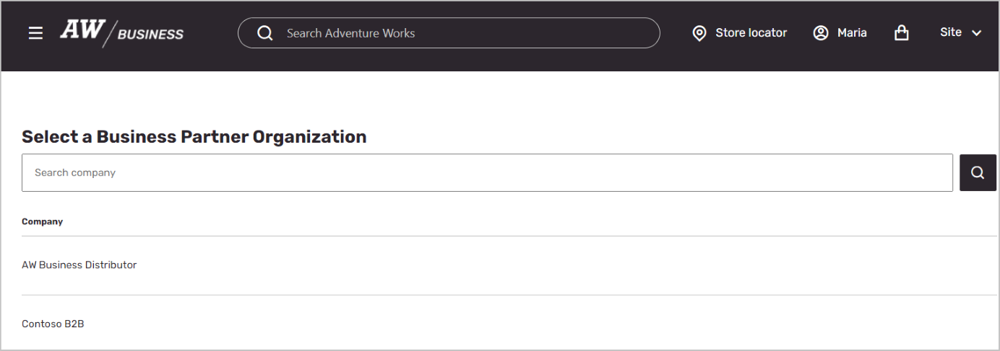
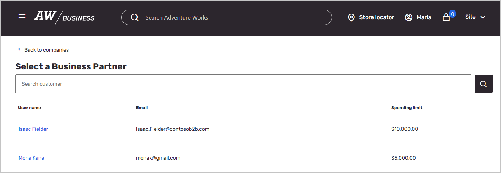

---
# required metadata

title: Enable on behalf of (OBO) functionality
description: This article describes how to enable on behalf of (OBO) functionality for Microsoft Dynamics 365 Commerce business-to-business (B2B) sites.
author: mariash529
ms.date: 08/02/2024
ms.topic: how-to
audience: Application User
ms.reviewer: v-chrgriffin
ms.search.region: Global
ms.author: asharchw
ms.search.validFrom: 2023-02-28
ms.custom: 
  - bap-template
---

# Enable on behalf of (OBO) functionality

[!include [banner](includes/banner.md)]

This article describes how to enable on behalf of (OBO) functionality for Microsoft Dynamics 365 Commerce business-to-business (B2B) sites.

> [!NOTE]
> OBO functionality is available in Dynamics 365 Commerce version 10.0.33 and later.

OBO functionality enables a retailer representative such an account manager to sign in to a B2B e-commerce website and select a B2B buyer organization and a buyer that they want to work on behalf of. The representative can then view the same products, prices, promotions, and discount experiences as the buyer, and can add items to a cart and place orders on behalf of the buyer. Each representative must have an activity license. 

## Prerequisites

To enable the OBO functionality, you must complete the following prerequisites:

- Create a Microsoft Entra B2B application. For instructions, see [Create and configure a Microsoft Entra application for account manager sign-in](dev-itpro/obo-create-aad-application.md).
- Modify the B2B site's sign-in page in Commerce site builder so that it includes an employee sign-in button. For instructions, see [Create and modify pages for on behalf of (OBO) functionality](dev-itpro/obo-add-pages-site-builder.md).
- Set up and configure OBO functionality for your environment in Commerce headquarters. For more information, see [Set up on behalf of (OBO) functionality](dev-itpro/obo-configure-hq.md).

## Sign in to a B2B site by using OBO functionality

After the prerequisites have been met, you're ready to sign in to a B2B site by using OBO functionality.

To sign in to a B2B site by using OBO functionality, follow these steps.

1. On the B2B site, select **Sign-in**.
1. Select **Employee sign-in**.

    

1. On the next page, search for and select the business buyer organization that you want to work on behalf of.

    

1. On the next page, search for and select the buyer that you want to work on behalf of.

     .

After this procedure is completed, you (as the account manager) now represent the buyer that you selected, and have full access to their account information, pricing, catalog information, and discounts. You can add items to the cart and create an order. Completed orders are easily distinguished from regular orders, because they're prefixed with the account manager's name.

You can also create a template for the buyer to use later. We recommend that you give the template a distinctive name that includes the account manager's name and the purpose of the template.

> [!NOTE]
> The OBO experience differs from the regular B2B site experience in the following ways:
> - The only method of payment that's provided is **On Account**.
> - Account managers have access to view a buyer's invoices, but they can't pay invoices.
> - Account managers can create a new order template for the buyer. The order template won't have an additional identifier to indicate that the template was created by the account manager.
> - The [Create Commerce catalogs for B2B sites](catalogs-b2b-sites.md) feature is supported starting with Commerce version 10.0.35. 
> - Any custom extensions that affect customer hierarchies or sales groups might have to be modified to support OBO functionality. Any extensions that retrieve values directly from the user context on an e-commerce site might also have to be modified.

## Additional resources

[Create and configure a Microsoft Entra application for account manager sign-in](dev-itpro/obo-create-aad-application.md)

[Create and modify pages for on behalf of (OBO) functionality](dev-itpro/obo-add-pages-site-builder.md)

[Set up on behalf of (OBO) functionality](dev-itpro/obo-configure-hq.md)
