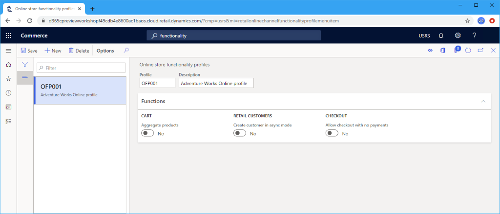

# Create an online functionality profile

[!include [banner](includes/banner.md)]

This article presents an overview of setting up an online functionality profile for Microsoft Dynamics 365 Commerce.

The online functionality profile provides various settings used for online channels. Each online channel must specify an online functionality profile.

## Create an online functionality profile

The following procedure explains how to create an online functionality profile from within Commerce Headquarters app.

1. In the navigation pane, go to **Modules \> Channel setup \> Online store setup \> Functionality profiles**.
1. On the action pane, select **New**.
1. In the **Profile** field, enter an ID for the profile.
1. In the **Description** field, enter a value ("Adventure Works Profile" in the example image below).
1. In the **Functions** section, modify the **CART**, **RETAIL CUSTOMERS**, or **CHECKOUT** settings, as needed.
1. On the action pane, select **Save**.

The following image shows an example online functionality profile.
  

## Functions

- **Aggregate products**: When enabled, this function allows the cart to update quantity when the same item is added multiple times.
- **Allow checkout with no payments**: When enabled, this function handles the scenario when items added to cart have a price $0.00.
- **Create customer in async mode**: This is a legacy setting applicable to third-party e-Commerce channels and is not applicable to the Dynamics 365 e-Commerce site.

## Additional resources

[Channels overview](channels-overview.md)

[Channel setup prerequisites](channels-prerequisites.md)

[Set up an online channel](channel-setup-online.md)

[Set up a retail channel](channel-setup-retail.md)

[Set up a call center channel](channel-setup-callcenter.md)

[!INCLUDE[footer-include](../includes/footer-banner.md)]
