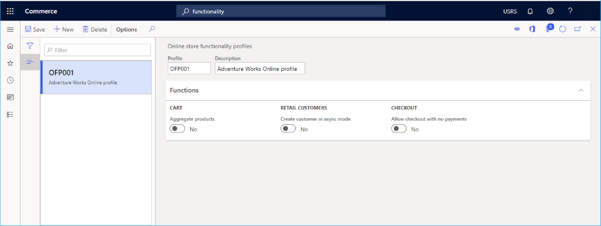

---
# required metadata

title: Online functionality profile
description: This topic presents an overview of setting up an online functionality profile for Microsoft Dynamics 365 Commerce.
author: samjarawan
manager: annbe
ms.date: 01/20/2020
ms.topic: article
ms.prod: 
ms.service: dynamics-365-commerce
ms.technology: 

# optional metadata

# ms.search.form: 
audience: Application User
# ms.devlang: 
ms.reviewer: v-chgri
ms.search.scope: Retail, Core, Operations
# ms.tgt_pltfrm: 
ms.custom: 
ms.assetid: 
ms.search.region: Global
# ms.search.industry: 
ms.author: samjar
ms.search.validFrom: 2020-01-20
ms.dyn365.ops.version: Release 10.0.8

---
# Online functionality profile

[!include [banner](../includes/preview-banner.md)]
[!include [banner](../includes/banner.md)]

This topic presents an overview of setting up an online functionality profile for Microsoft Dynamics 365 Commerce.

## Overview

The online functionality profile provides various settings used for online channels.  Each channel must specify a functionality profile.

## Create a functionality profile

The following procedure explains how to create an online functionality profile from within Commerce Headquarters app.

1. Go to **Navigation pane** > **Modules** > **Channel setup** > **Online store setup** > **Functionality profiles**.
1. From the action pane, click **New**.
1. In the **Profile** field, provide an ID for the profile.
1. In the **Description** field, provide a value, the example below uses "Adventure Works Profile".
1. Expand the **Functions** section.
  1. Modify the **CART**, **RETAIL CUSTOMERS** or **CHECKOUT** settings as desired.
  1. Select **Save** button in the action pane when complete.

The following image shows an example online functionality profile.
  

## Functions
* **Aggregate products** when enabled is for the cart view to update quantity when same item is added multiple times.
* **Create customer in async mode** is a legacy setting applicable to 3rd party e-Commerce channels and not applicable to the Dynamics 365 Commerce e-Commerce site.
* **Allow checkout with no payments** is for the scenario when items added to cart havea a price $0.00.

## Additional resources

[Channels overview](channels-overview.md)

[Channel setup prerequisites](channels-prerequisites.md)

[Set up an online channel](channel-setup-online.md)

[Set up a retail channel](channel-setup-retail.md)

[Set up a call center channel](channel-setup-callcenter.md)
