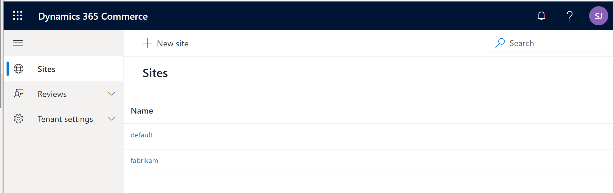
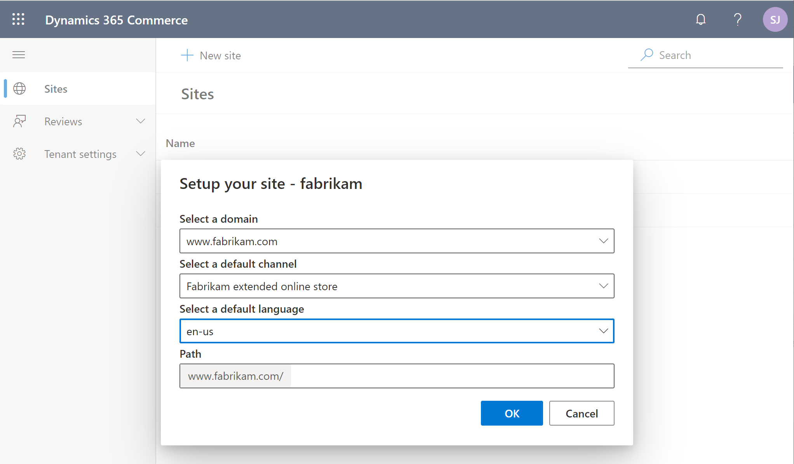
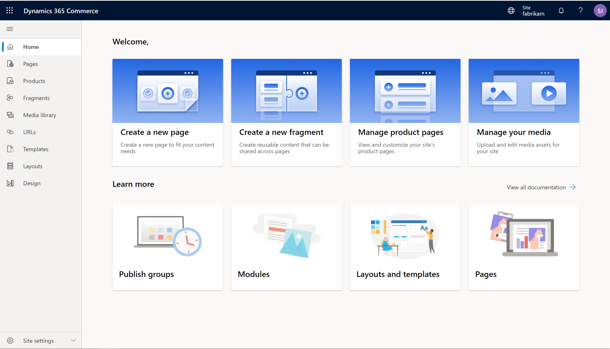
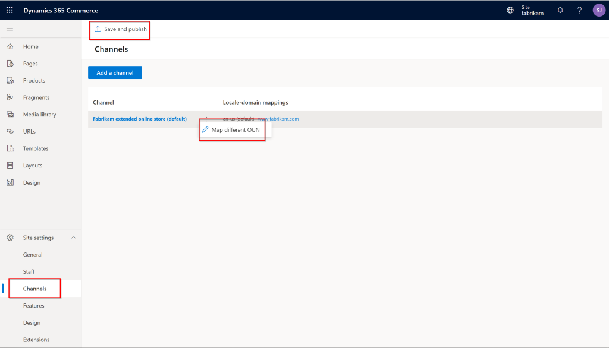
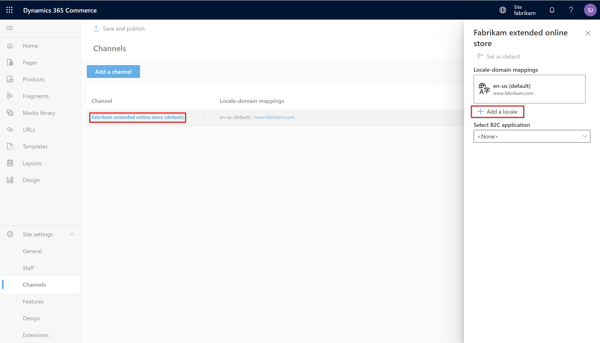

---
# required metadata

title: E-commerce site overview
description: This article provides an overview of the support for e-commerce sites in Microsoft Dynamics 365 Commerce.
author: bicyclingfool
ms.date: 05/28/2024
ms.topic: overview
audience: Application user
ms.reviewer: josaw
ms.search.region: Global
ms.author: shajain
ms.search.validFrom: 2019-09-30
ms.custom: 
  - bap-template
  - evergreen
---

# E-commerce site overview

[!include [banner](includes/banner.md)]

This article provides an overview of the support for e-commerce sites in Microsoft Dynamics 365 Commerce. It includes information about how e-commerce online stores are initialized and managed in Dynamics 365 Commerce. It also provides links to more information about online stores, and about how to set up and configure an e-commerce site. Although this article covers many of the basics, it doesn't cover everything that is required to set up a production e-commerce site. More advanced articles can be found in the Dynamics 365 Commerce documentation.

## Online store channel

Before you can build your site in Dynamics 365 Commerce, at least one online store channel must be set up. For more information, see [Set up an online channel](channel-setup-online.md). 

In Dynamics 365 Commerce, you use an online store channel to establish the products, pricing, languages, payment methods, delivery modes, fulfillment centers, and other aspects of the online experience that should be available to your customers.

Only one online store channel has to be set up before you can get started with Dynamics 365 Commerce. However, a single e-commerce site can provide the online experience for multiple online stores. For example, if multiple online stores are set up to support different geographical regions, a single set of e-commerce pages can be used to provide the unique experiences that are defined by each store. For more information about how to configure a site to support multiple online stores, see [Associate an online site with a channel](associate-site-online-store.md).

After an online store is set up, it can be associated with the Dynamics 365 Commerce site that will serve as your online storefront. For more information about online stores and how to set them up, see [Set up online stores](/dynamics365/unified-operations/retail/online-stores).

## Deploy a new e-commerce tenant

During initialization of an e-commerce site, you're prompted for a domain name. For more information about domains in Commerce, see [Configure your domain name](configure-your-domain-name.md) and [Domains in Dynamics 365 Commerce](dev-itpro/domains-commerce.md). To deploy a new e-commerce tenant by using [Microsoft Dynamics Lifecycle Services (LCS)](/dynamics365/unified-operations/dev-itpro/lifecycle-services/lcs-user-guide), follow the steps in [Deploy a new e-commerce tenant](deploy-ecommerce-site.md). After your e-commerce tenant is set up in LCS, a link to Commerce site builder will be provided. You can then use Commerce site builder to initialize and configure your e-commerce sites.

## Initialize your e-commerce site

When you start Commerce site builder from LCS, the **Sites** page appears. This page includes two preconfigured sites, **default** and **fabrikam**, as shown in the example in the following illustration.

When you select one of these sites, you're prompted to select a domain name, a default online store channel, a supported language for the selected channel, and a path. If only one channel is used, you can leave the path blank. More online store channels or languages can be configured later in Commerce site builder. Each additional channel or language will require a unique path. For example, you have two online channels that are associated with a single site, and the domain name for the site is `www.fabrikam.com`. In this case, the path for one channel can be the default value that has no path (`https://www.fabrikam.com`), and the second channel can be set to a new path, such as **site2**, that will have the URL `https://www.fabrikam.com/site2`. The following illustration shows an example of a site initialization dialog box in Commerce site builder.

The **Sites** page also includes a **New site** button. The dialog box that appears when you select this button resembles the site initialization dialog box, but it's used to create a new site. New sites are blank. They don't include the same default templates, fragments, pages, and images that are provided with the **default** and **fabrikam** sites. However, as you require, you can open a support ticket to request that a copy of the default content be added to a new blank site. For more information, see [Create an e-commerce site](create-ecommerce-site.md).

After a new site is initialized, the Commerce site builder **Home** page appears. This page includes links to common actions and guidance content, as shown in the example in the following illustration.

## Modify online store channels or add online store channels to an e-commerce site

After an e-commerce site is created, you can change the channel that it's associated with by following the steps in [Associate an e-commerce site with an online channel](associate-site-online-store.md). The example in the following illustration shows how a channel operating unit number (OUN) can be changed on the **Channels** page (**Site settings \> Channels**). After you've finished making a change, be sure to select **Save and publish**. In this way, you ensure that the change is published.

You can add new channels by selecting **Add a channel**. To add new languages to a channel, select the channel, and then select **Add a locale** in the channel dialog box that appears. Before locales can appear in the dialog box, they must be preconfigured for the online store channel in Commerce headquarters.

## Set up an Azure B2C tenant

Dynamics 365 Commerce uses Microsoft Entra business-to-consumer (B2C) to support user credential and authentication flows. For information about how to set up your Azure B2C tenant, see [Set up a B2C tenant in Commerce](set-up-b2c-tenant.md), [Set up custom pages for user sign-ins](custom-pages-user-logins.md), and [Configure multiple B2C tenants in a Commerce environment](configure-multi-b2c-tenants.md).

## Overview of the default site pages

The **default** and **fabrikam** sites include preconfigured templates, fragments, and pages to help you get started. For more information, see the following articles:

- [Home page overview](quick-tour-home-page.md)
- [Product details page overview](quick-tour-pdp.md)
- [Cart and checkout pages overview](quick-tour-cart-checkout.md)
- [Account management pages overview](quick-tour-account-management.md)

## Manage site settings

For information about how to manage your site settings, see the following articles:

- [Manage e-commerce users and roles](manage-ecommerce-users-roles.md)
- [Search engine optimization (SEO) considerations for your site](search-engine-optimization-considerations.md)
- [Manage Content Security Policy (CSP)](dev-itpro/manage-csp.md)
- [Select a site theme](select-site-theme.md)

## Manage site content

For information about how to manage site content, see the following articles:

- [Page model glossary](page-elements-overview.md)
- [Document states and lifecycle](document-states-overview.md)
- [Templates and layout](templates-layouts-overview.md)
- [Work with fragments](work-with-fragments.md)
- [Work with modules](work-with-modules.md)
- [Digital asset management overview](dam-overview.md)
- [Module library overview](starter-kit-overview.md)

## Additional resources

[Create an e-commerce site](create-ecommerce-site.md)

[Deploy a new e-commerce site](deploy-ecommerce-site.md)

[Associate an online site with a channel](associate-site-online-store.md)

[Configure your domain name](configure-your-domain-name.md)

[Add support for a content delivery network (CDN)](add-cdn-support.md)

[Enable location-based store detection](enable-store-detection.md)

[Set up custom pages for user logins](custom-pages-user-logins.md)

[!INCLUDE[footer-include](../includes/footer-banner.md)]
