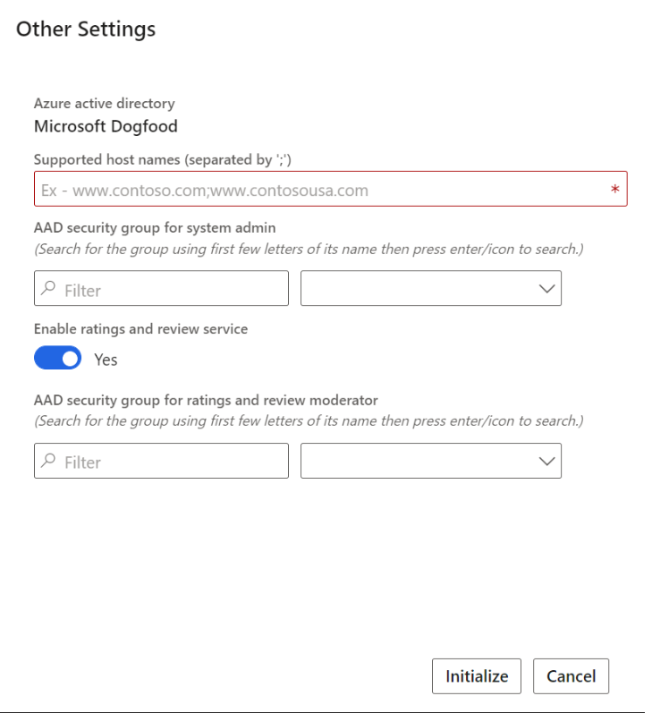

---
# required metadata

title: Opt in to use ratings and reviews 
description: This topic explains how to opt in to use ratings and reviews on your Microsoft Dynamics 365 Commerce site.
author:  gvrmohanreddy 
ms.date: 02/16/2020
ms.topic: article
ms.prod: 
ms.technology: 

# optional metadata

# ms.search.form: 
# ROBOTS: 
audience: Application User
# ms.devlang: 
ms.reviewer: v-chgri
# ms.tgt_pltfrm: 
ms.custom: 
ms.assetid: 
ms.search.region: Global
ms.search.industry: 
ms.author: gmohanv
ms.search.validFrom: 2019-10-31
ms.dyn365.ops.version: Release 10.0.5
---

# Opt in to use ratings and reviews

[!include [banner](includes/banner.md)]

This topic explains how to opt in to use ratings and reviews on your Microsoft Dynamics 365 Commerce site.

The ratings and reviews solution is an omni-channel solution that you can make available in Dynamics 365 Commerce by using Microsoft Dynamics Lifecycle Services (LCS). LCS is an administration portal that retailers use to manage their environments from provisioning to decommissioning.

If you want to use the ratings and reviews solution on your Commerce website, you must opt in for ratings and reviews during deployment of your e-Commerce site on Dynamics 365 Commerce.

## Opt in to use ratings and reviews

To opt in to use ratings and reviews on your site, follow these steps.

1. Follow the steps in [Deploy a new e-Commerce site](deploy-ecommerce-site.md).
1. While you're still in LCS, go to **Retail deployment setup \> Other settings**.
1. Set the **Enable ratings and reviews service** option to **Yes**.
1. In the **AAD security group for ratings and review moderator** field, enter the ID of the Microsoft Azure Active Directory (Azure AD) security group that includes the ratings and reviews moderators.

    

1. Complete the e-Commerce initialization process.

> [!NOTE] 
> If you are an existing Dynamics 365 Commerce customer who has already deployed an e-Commerce site without having opted in for ratings and reviews and now want to use ratings and reviews from the Dynamics 365 Commerce package, please submit a service request. For information about how to submit a service request, see [Submit service requests process](../fin-ops-core/dev-itpro/lifecycle-services/submit-request-dynamics-service-engineering-team.md?toc=/dynamics365/commerce/toc.json). 

## Additional resources

[Ratings and reviews overview](ratings-reviews-overview.md)

[Manage ratings and reviews](manage-reviews.md)

[Configure ratings and reviews](configure-ratings-reviews.md)

[Sync product ratings in Dynamics 365 Commerce](sync-product-ratings.md)

[Enable manual publishing of ratings and reviews by a moderator](manual-publish-rating-reviews.md)

[Import and export ratings and reviews](import-export-reviews.md)

[Configure Service-to-Service authentication](service-to-service-auth.md)

[Ratings and reviews FAQ](ratings-reviews-faq.md)

[!INCLUDE[footer-include](../includes/footer-banner.md)]
