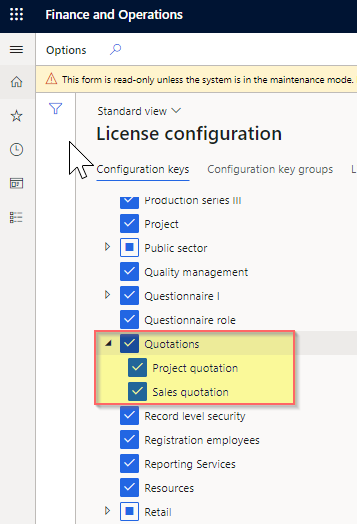

# Enable order lookup for guest checkouts

[!include [banner](includes/banner.md)]

This article describes how to enable order lookup for guest checkouts in Microsoft Dynamics 365 Commerce.

The order lookup for guest checkouts feature lets customers who make purchases as guest users look up their orders. The order lookup capability is useful when customers want to perform actions such as checking the fulfillment status of products on an order, verifying the address that an order was shipped to, reordering a product, or confirming the store that an order will be picked up from.

Customers who place orders as registered users can see their order details when they are signed in, but customers who use guest checkout to place orders can't. However, when the order lookup for guest checkouts feature is enabled, it provides a form that customers can use to search for orders that they placed as guests. In this form, customers enter the order confirmation ID and (optionally) the email address that they specified at checkout.

Additionally, a link or button that takes the customer directly to the order details page for their order can be included in any order-related transactional emails. This link or button will work for orders that are placed both by registered users and by guest users.

## Turn on necessary features in Commerce headquarters

To enable order lookup for guest checkouts, you must turn on the following features at **Workspaces \> Feature management** in Commerce headquarters.

| Feature | Purpose |
|---------|---------|
| Retail anonymous user search order details opting feature | This feature exposes the user interface in Commerce parameters that lets you enable the order lookup API for unauthenticated users and configure how personal data is displayed. |
| Enable generation of a stronger channel reference ID | This feature generates a more secure 12-character channel reference ID (order confirmation ID) that can be passed in the query string when an order is looked up. |
| Generate a consistent channel reference ID format across channels | This feature generates a secure channel reference ID for orders that are placed through an e-commerce site, the retail point of sale (POS), or a call center. Before you can turn on this feature, the **Enable generation of a stronger channel reference ID** feature must be turned on. |

After you turn on the **Retail anonymous user search order details opting feature** feature, you must enable the API that supports unauthenticated order lookup in Commerce headquarters. Go to **Retail and Commerce \> Headquarters setup \> Parameters \> Customer orders**. On the **Customer orders** page, on the **Order search** FastTab, set the **Enable unauthenticated order lookup** option to **Yes**, as shown in the following illustration.

## Manage the display of personal data

The **Order search** FastTab on the **Customer orders** page in Commerce headquarters includes a **Include personal data in guest order lookup** field that lets you control whether personal information is shown to customers. This personal information includes the customer's shipping address and the last four digits of the customer's credit card number. By default, personal information isn't shown to customers when unauthenticated order lookup is enabled. The following table describes the available options.

| Option | Result |
|--------|--------|
| Never | The default value. No personal information is shown in order lookups. When registered users who are signed in look up an order that they created while they were signed in, they will be able to see their personal information. |
| Guest orders only | Personal information is shown in order lookups for orders that customers created as guests. If an order was created by a registered user, that user must sign in to see their personal information. |
| All orders | Personal information is shown in all order lookups. |

> [!NOTE]
> These options determine when personal data such as the customer's address and the last four digits of the customer's credit card number is shown to anonymous guest users. To help protect the privacy of registered customers, we recommend that you select the **Guest orders only** option. However, the most secure option is **Never**.

After you change the value of the **Include personal data in guest order lookup** field, you must run job 1070 (**Channel configuration**) in Commerce headquarters by going to **Retail and Commerce \> Retail and Commerce IT \> Distribution schedule**.

## Configure the order lookup module

The order lookup module in the Commerce module library is used to render the form that guest users use to look up orders. The order lookup module can be included in the body slot of any page that doesn't require customer sign-in. For information about how to configure the module, see [Order lookup module](order-lookup-module.md).

## Configure the order details page

Before guest users can view their order details, the order details page on your e-commerce site must be configured so that it doesn't require sign-in. To turn off the sign-in requirement for your order details page, open the page in Commerce site builder, select the **Default page (required)** slot in the tree view, and clear the **Requires sign in?** checkbox at the bottom of the properties pane on the right.

## Add a link to order details in transactional emails

In order-related emails, you can provide a link or button that takes customers to the order details page for their order. To add this link or button, create an HTML hyperlink that points to the order details page on your e-commerce site, and pass the order confirmation ID and customer's email address as URL parameters, as shown in the following example.

`<a href="https://[domain]/[orderdetailspage]?confirmationId=%orderconfirmationid%&propertyName=email&propertyValue=%customeremailaddress%" target="_blank">View my order status</a>`

> [!NOTE]
> To enable the order lookup feature, ensure that the **Quotations** key is enabled under **License configuration** > **Configuration keys**.
>
>

## Additional resources

[Order lookup module](order-lookup-module.md)

[Set up an email notification profile](email-notification-profiles.md)

[!INCLUDE[footer-include](../includes/footer-banner.md)]
