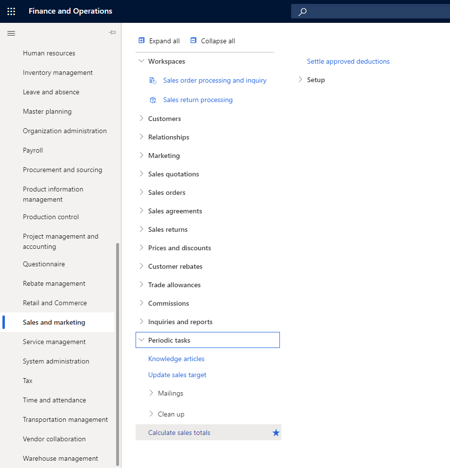

# Performance improvements of Commerce Order search

[!include [banner](../includes/banner.md)]

This article explains how to improve search order performance by enabling the use of intermediate order totals in Microsoft Dynamics 365 Commerce.

The **Improve performance of Commerce Order search** feature allows you to improve search order performance by enabling the use of intermediate order totals calculated by the **Calculate sales totals** job. To enable this feature, in Commerce headquarters, go to the **Feature management** workspace and enable **Improve performance of Commerce Order search**. 

<!---->

### Prior to enabling ‘Improve performance of Commerce order search’ from feature management 

Go to **Sales and marketing \> Periodic tasks \> Calculate sales totals**. 

This feature helps improve performance by enabling the system to use parallel processing when it calculates sales totals in a batch. The feature adds a new **Number of threads** field to the **Calculate sales totals** flyout menu. If you choose to run the calculation in a batch, you can use this field to set the maximum number of threads. If you set the value to **0** (zero) or **1** (one), a single thread will be used. Values above **1** enable multithreading. Microsoft recommends that you enable the **Calculate sales totals using multiple threads** feature to speed up totals processing in case if there is a large number of sales orders and quotations.

<!---->

To schedule this job we use these steps:

1. In Commerce headquarters, go to **System administration \> Inquiries \> Batch Jobs**.
1. Select **+New**.
1. For **Job description**, enter a descriptive name (for example, "Calculate Sales Totals").
1. While new job is in the **Withhold** state, complete the following steps to configure the job:
    1. Give similar name to the batch task
    1. For **Class**, enter "SalesTotalsCalculateBatch".
    1. Select a company, for example **USRT**.
    1. In parameters of the task, set both toggles to **Yes** as shown in the following example image.

    

    1. Schedule the job recurrence to run every 5-10 minutes.
    1. Change status to “Waiting”
    1. Go to **Batch job history** and inspect 100% correct execution.

