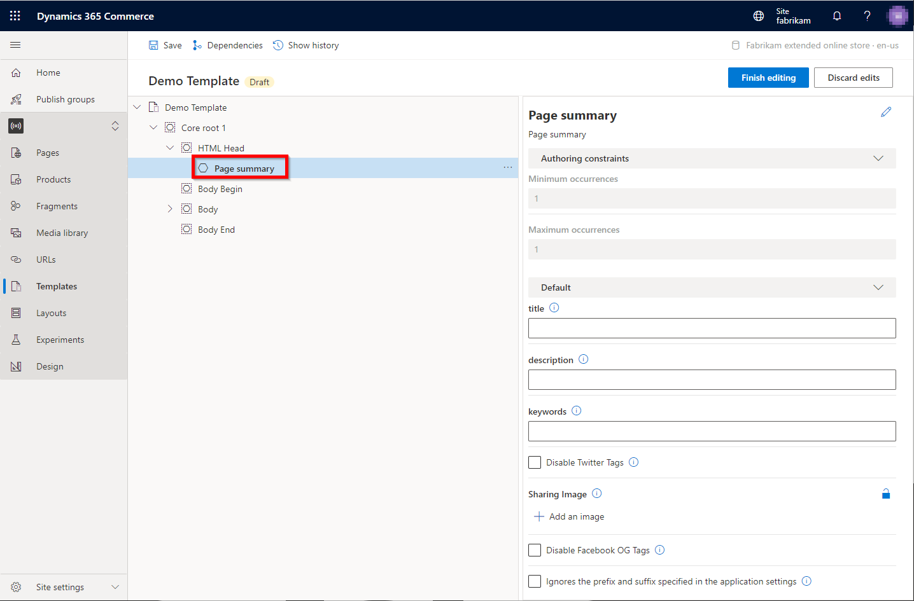

---
# required metadata

title: Page summary module
description: This topic covers page summary modules and describes how to add them to templates in Microsoft Dynamics 365 Commerce.
author: samjarawan
manager: annbe
ms.date: 03/25/2021
ms.topic: article
ms.prod: 
ms.service: dynamics-365-commerce
ms.technology: 

# optional metadata

# ms.search.form: 
audience: Developer
# ms.devlang: 
ms.reviewer: v-chgri
# ms.tgt_pltfrm: 
ms.custom: 
ms.assetid: 
ms.search.region: Global
# ms.search.industry: 
ms.author: samjar
ms.search.validFrom: 2019-10-31
ms.dyn365.ops.version: Release 10.0.5

---

# Page summary modules

[!include [banner](includes/banner.md)]

This topic covers page summary modules and describes how to add them to templates in Microsoft Dynamics 365 Commerce.

Page summary modules simplify the entry of page summary metadata (including canonical links) that can be used by search engines and social sharing sites. The Dynamics 365 Commerce module library contains several page summary modules including the page summary, category page summary, list page summary, and product page summary modules. Each page summary module has SEO metadata tuned for the specific page types they will be used for. All summary page modules share the same set of properties defined below.

## Summary page module properties

| Property name     | Values | Description |
|-------------------|--------|-------------|
| Title | Text | The title of the site page. |
| Description | Text | A brief description of the site page contents. |
| Keywords | Text | A series of comma-separated keywords that are relevant to the page. |
| Disable Twitter Tags | **True** or **False** | If set to **True**, Twitter tags will not be rendered in the HTML. |
| Sharing image | Image selector | The image used when sharing the page. |
| Disable Facebook OG tags | **True** or **False** | If set to **True**, Facebook Open Graph (OG) tags will not be rendered in the HTML. |
| Ignore the prefix and suffix specified in the application settings | **True** or **False** | If set to **True**, the site-level prefix and suffix setting will be ignored. |

## Add a page summary module to a template

To add a page summary module to a template, follow these steps.

1. In site builder for your site, select **Templates**. 
1. Select a template, and then select **Edit**.
1. In the **HTML Head** slot, select the ellipsis (**...**), and then select **Add Module**.
1. In the **Add Module** dialog box, select the **Page summary** module (or another page summary module such as the list page summary module), and then select **OK**. Ensure that you add the appropriate page summary module based on the page types the template will be used for.

    

Once the summary module is added, it should look similar to the following example image. The module can now be configured and the template can be saved and published.

> [!NOTE]
> You can set default values in the template, but they can be overwritten on pages that use the template.

## Additional resources

[Module library overview](starter-kit-overview.md)

[Default page module](default-page-module.md)

[Script modules](script-module.md)

[Metatags module](metatags-module.md)

[!INCLUDE[footer-include](../includes/footer-banner.md)]
