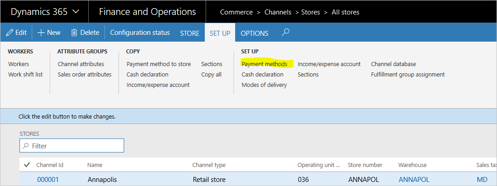
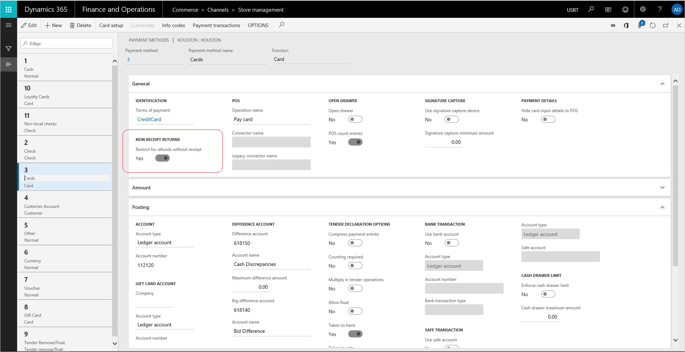
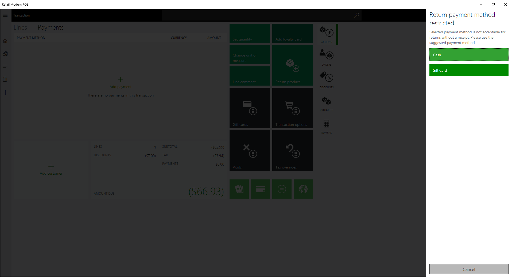

# Restrict payment methods for returns without a receipt

[!include [banner](includes/banner.md)]

Each payment type that a retailer accepts must be configured when the system is set up. This article describes how certain payment types can be restricted for refund if the returns are made without a receipt.

## Set up payment methods

To set up payment methods, the following tasks must be completed.
1. Create the payment methods that are accepted by the entire organization.
2. Create organization-wide card types and card numbers. If credit cards or debit cards are accepted, you must create one payment method for cards, and then create the organization-wide card types and card numbers.
3. Set up store payment methods. Associate payment methods with each store, and then enter the store-specific settings for each payment method.
4. Set up card payment methods for stores. For any card payment methods that the store accepts, complete the card setup.

 

## Restrict payment methods for returns without a receipt

For each store payment method, on the **Store management** page, under **Non receipt returns**, set **Restrict for refunds without receipt** to **Yes**. 

The default value of the toggle is **No**, which ensures that the payment method is allowed for refunds. 

When **Restrict for refunds without receipt** is set to **Yes**, the selected payment method will not be allowed for refunds. 

 

> [!NOTE]
> When a cashier selects a payment method that is restricted for refund without a receipt, a message displays to verify the acceptable payment methods.

 

If a transaction has both a receipted return and a return without a receipt, the restriction conditions will not be enforced because the transaction will be a return workflow with a receipt. 

[!INCLUDE[footer-include](../includes/footer-banner.md)]
