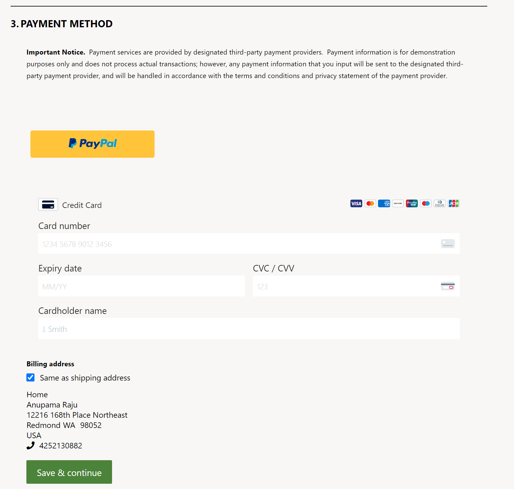
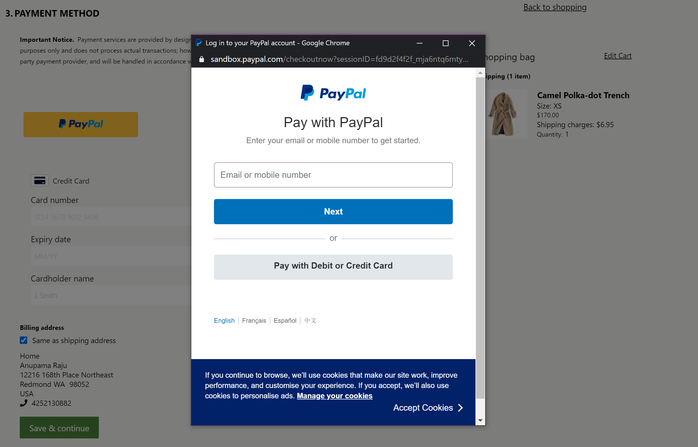

---
# required metadata

title: Payment module
description: This topic covers the payment module and explains how to configure it in Microsoft Dynamics 365 Commerce.
author: anupamar-ms
manager: annbe
ms.date: 08/05/2020
ms.topic: article
ms.prod: 
ms.service: dynamics-365-commerce
ms.technology: 

# optional metadata

# ms.search.form: 
audience: Application user
# ms.devlang: 
ms.reviewer: v-chgri
ms.search.scope: Operations, Retail, Core
# ms.tgt_pltfrm: 
ms.custom: 
ms.assetid: 
ms.search.region: Global
# ms.search.industry: 
ms.author: anupamar
ms.search.validFrom: 2019-10-31
ms.dyn365.ops.version: Release 10.0.13

---

# Payment module

[!include [banner](includes/banner.md)]
[!include [banner](includes/preview-banner.md)]

This topic covers the payment module and explains how to configure it in Microsoft Dynamics 365 Commerce.

## Overview

The payment module lets customers pay for orders by using credit or debit cards. Payment integration for this module is provided by the Dynamics 365 Payment Connector for Adyen. For more information about how to set up and configure the payment connector, see [Dynamics 365 Payment Connector for Adyen](dev-itpro/adyen-connector.md).  

In 10.0.14 this module is also integrated with the Dynamics 365 Payment connector for Paypal to provide payments via Paypal. For more information about how to set up and configure the payment connector, see [Dynamics 365 Payment Connector for Paypal](paypal.md). 

## Dynamics 365 Payment Connector for Adyen 

The payment module hosts the payment information that is served via Adyen in an HTML inline frame (iframe). The payment module interacts with the Commerce Scale Unit to retrieve the Adyen payment information. As part of the Commerce Scale Unit interaction, the payment module can allow billing address information to be served either withiin the iframe via Adyen or as a separate module. In the Fabrikam theme, the billing address is enabled as a separate module. This approach allows for more formatting flexibility, because the address lines can be rendered so that they resemble the lines of the shipping address.

The payment module also lets signed-in customers save their payment information. The payment information and billing address are saved and managed via the Adyen payment connector.

The payment module covers any order charges that aren't already covered by loyalty points or a gift card. If the total for an order is fully covered by loyalty points or gift card credits, the payment module will be hidden, and the customer will be able to place the order without it.

The Adyen payment connector also supports strong customer authentication (SCA). Part of the European Union (EU) Payment Services Directive 2.0 (PSD2.0) requires that online shoppers be authenticated outside their online shopping experience when they use an electronic payment method. During the checkout flow,  customers are redirected to their banking site. Then, after authentication, they are redirected back to the Commerce checkout flow. During this redirection, the information that a customer entered in the checkout flow (for example, the shipping address, delivery options, gift card information, and loyalty information) will persist. Before you can turn on this feature, the payment connector must be configured for SCA in Commerce headquarters. For more information, see [Strong Customer Authentication using Adyen](adyen_redirect.md). This feature was enabled in 10.0.12 release.

The following illustration shows an example of gift card, loyalty, and Adyen payment modules on a checkout page.

## Dynamics 365 Payment Connector for Paypal

In 10.0.14, payment module is integrated with the Dynamics 365 Payment Connector for Paypal. For more information about how to setup and configure this payment connector see  [Dynamics 365 Payment Connector for Paypal](paypal.md)
 
On the checkout page, you can have both Adyen and the Paypal connector configured. The payment module has been enhanced with additional properties to help identify which connector it should work with. See module properties **Supported tender types** and **Is primary payment** for more details.
  
When the module is configured with Paypal connector, a Paypal button  appears on the checkout page. When invoked by the site user it renders an iframe with Paypal information. The site user can login and provide their paypal information within this iframe to complete thier transaction.

The paypal connector does not require a billing address module as all billing related infromation is handled by Paypal within its iframe. SHipping and shipping options are required though.

The following illustration shows an example of two Payment modules one configured with Adyen and the other with Paypal on a checkout page.

The following illustration shows an example of the Paypal iframe which is invoked via the Paypal button. Once a user chooses Paypal, the remaining balance on the order will be charged via Paypal

## Payment module properties

| Property name | Values | Description |
|---------------|--------|-------------|
| Heading | Heading text | An optional heading for the payment module. |
| Height of the iframe | Pixels | The iframe height, in pixels. The height can be adjusted as required. |
| Show billing address | **True** or **False** | If this property is set to **True**, the billing address will be served by Adyen inside the payment module iframe. If it's set to **False**, the billing address won't be served by Adyen, and a Commerce user will have to configure a module to show the billing address on the checkout page. For Paypal payment connector, this field has no impact as billing address is fully handled within Paypal |
| Payment style override | Cascading Style Sheets (CSS) code | Because the payment module is hosted in an iframe, there is limited styling capability. You can achieve some styling by using this property. To override site styles, you must paste the CSS code as the value of this property. Site builder CSS overrides and styles don't apply to this module. |
|Supported tender types| string| If multiple payment connectors are configured, you should provide the Supported tender type string as defined in Commerce HQ payment connector configuration. If blank, it defaults to the Adyen Payment connector. Added in 10.0.14. See attached image below.|
|Is primary payment|  **True** or **False** | If true, error messages will be surfaced from the primary connector on the checkout page. If both Adyen and Paypal connector are configured, set Adyen to true. Added in 10.0.14.|

The following shows an image of **Supported tender types** as configured as part of the payment configuration in HQ.

## Billing address

A billing address module can be used if the billing address provided within the Payment connector does not suffice in terms of look and feel and consistency of the fields etc. 

When the payment module is integrated with the Adyen payment connector, set **Show billing address** property is set to **False** so a dedicated Billing address module can be used instead of the default Adyen billing address. In this case, the site author should include a Billing address module on the checkout page. The Adyen payment connector also allows the ability to use the Shipping address as Billing address to minimize the number of steps for the site user.

Similar to payment modules, a **Supported tender types** property is added to to the Billing address module in 10.0.14. The value on this property should be identical to the value provided in the Payment module to ensure they work together. For Adyen payment connector, both Payments module and Billing address module can leave this value empty (default stateu). For Paypal connector, a dedicated billing address module is not required. For other types of payment connectors, the string should be provided as configured in Commerce HQ.

## Add a payment module to a checkout page and set the required properties

A payment module can be added only to a checkout module. For more information about how to configure a payment module for a checkout page, see [Checkout module](add-checkout-module.md).

If both Adyen and Paypal connector are needed, add both modules to the payment section.Ensure the "Supported tender types" field is set for Paypal, leave it blank for Adyen. Set "Is primary payment" true for Adyen.

## Additional resources

[Cart module](add-cart-module.md)

[Cart icon module](cart-icon-module.md)

[Checkout module](add-checkout-module.md)

[Shipping address module](ship-address-module.md)

[Delivery options module](delivery-options-module.md)

[Order details module](order-confirmation-module.md)

[Gift card module](add-giftcard.md)

[Dynamics 365 Payment Connector for Adyen](dev-itpro/adyen-connector.md)

[Dynamics 365 Payment Connector for Paypal](paypal.md)

[Strong Customer Authentication using Adyen](adyen_redirect.md)
