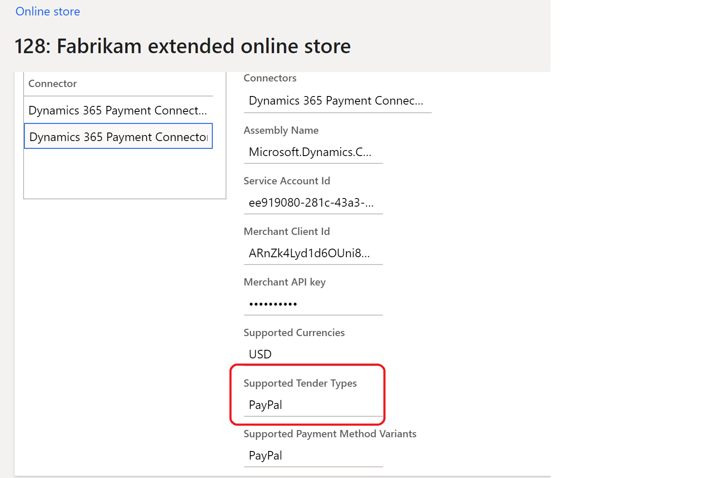

---
# required metadata

title: Payment module
description: This topic covers the payment module and explains how to configure it in Microsoft Dynamics 365 Commerce.
author: anupamar-ms
ms.date: 04/12/2022
ms.topic: article
ms.prod: 
ms.technology: 

# optional metadata

# ms.search.form: 
audience: Application user
# ms.devlang: 
ms.reviewer: v-chgri
# ms.tgt_pltfrm: 
ms.custom: 
ms.assetid: 
ms.search.region: Global
# ms.search.industry: 
ms.author: anupamar
ms.search.validFrom: 2019-10-31
ms.dyn365.ops.version: Release 10.0.14

---

# Payment module

[!include [banner](includes/banner.md)]

This topic covers the payment module and explains how to configure it in Microsoft Dynamics 365 Commerce.

The payment module lets customers pay for orders by using credit or debit cards. Payment integration for this module is provided by the Dynamics 365 Payment Connector for Adyen. For more information about how to set up and configure the payment connector, see [Dynamics 365 Payment Connector for Adyen](dev-itpro/adyen-connector.md).  

As of Commerce release 10.0.14, the payment module has also been integrated with the Dynamics 365 Payment Connector for PayPal to allow customers to pay for orders using PayPal. For more information on how to set up and configure the Dynamics 365 Payment Connector for PayPal, see [Dynamics 365 Payment Connector for PayPal](paypal.md). 

## Dynamics 365 Payment Connector for Adyen 

The payment module hosts the payment information that is served via Adyen in an HTML inline frame (iframe). The payment module interacts with the Commerce Scale Unit to retrieve the Adyen payment information. As part of the Commerce Scale Unit interaction, the payment module can allow billing address information to be served either in the iframe via Adyen or as a separate module. In the Fabrikam theme, the billing address is enabled as a separate module. This approach allows for more formatting flexibility, because the address lines can be rendered so that they resemble the lines of the shipping address.

The payment module also lets signed-in customers save their payment information. The payment information and billing address are saved and managed via the Adyen payment connector.

The payment module covers any order charges that aren't already covered by loyalty points or a gift card. If the total for an order is fully covered by loyalty points or gift card credits, the payment module will be hidden, and the customer will be able to place the order without it.

The Adyen payment connector also supports strong customer authentication (SCA). Part of the European Union (EU) Revised Payment Services Directive (PSD2) requires that online shoppers be authenticated outside of their online shopping experience when they use an electronic payment method. During the checkout flow, customers are redirected to their banking site, and then after authentication they are redirected back to the Commerce checkout flow. During this redirection, the information that a customer has entered during the checkout flow (for example, shipping address, delivery options, gift card information, and loyalty information) will persist. Before you can turn on the Adyen payment connector feature, the payment connector must be configured for SCA in Commerce headquarters. For more information, see [Strong Customer Authentication using Adyen](adyen_redirect.md). This feature was enabled in Commerce release 10.0.12.

> [!NOTE]
> For the Adyen payment connector, the iframe module in the payment module can be rendered only if you add the Adyen URL to your site's allow list. To complete this step, add **\*.adyen.com** to the **child-src**, **connect-src**, **img-src**, **script-src**, and **style-src** directives of your site's content security policy. For more information, see [Manage Content Security Policy](manage-csp.md). 

The following illustration shows an example of gift card, loyalty, and Adyen payment modules on a checkout page.

## Dynamics 365 Payment Connector for PayPal

As of Commerce release 10.0.14, the payment module is also integrated with the Dynamics 365 Payment Connector for PayPal. For more information about how to set up and configure this payment connector, see [Dynamics 365 Payment Connector for PayPal](paypal.md).
 
On the checkout page, you can have both Adyen and the PayPal connectors configured. The payment module has been enhanced with additional properties to help identify which connector it should work with. For details, see the **Supported tender types** and **Is primary payment** module properties in the following table.
  
When the payment module is configured to use the PayPal payment connector, a PayPal button appears on the checkout page. When invoked by the customer, the payment module renders an iframe containing PayPal information. The customer can sign in and provide their PayPal information within this iframe to complete their transaction. When a customer chooses to pay with PayPal, the remaining balance on the order will be charged via PayPal.

The PayPal payment connector does not require a billing address module because all billing-related information is handled by PayPal within its iframe. However, the shipping address and delivery options modules are required.

The following illustration shows an example of two payment modules on a checkout page, one configured with the Adyen payment connector and the other with the PayPal payment connector.

The following illustration shows an example of the PayPal iframe invoked using the PayPal button. 

## Payment module properties

| Property name | Values | Description |
|---------------|--------|-------------|
| Heading | Heading text | An optional heading for the payment module. |
| Height of the iframe | Pixels | The iframe height, in pixels. The height can be adjusted as required. |
| Show billing address | **True** or **False** | If this property is set to **True**, the billing address will be served by Adyen inside the payment module iframe. If set to **False**, the billing address won't be served by Adyen, and a Commerce user will have to configure a module to show the billing address on the checkout page. For the PayPal payment connector, this field has no impact, as the billing address is fully handled within PayPal. |
| Payment style override | Cascading Style Sheets (CSS) code | Because the payment module is hosted in an iframe, there is limited styling capability. You can achieve some styling by using this property. To override site styles, you must paste the CSS code as the value of this property. Site builder CSS overrides and styles don't apply to this module. |
|Supported tender types| String| If multiple payment connectors are configured, you should provide the supported tender type string as defined in the Commerce headquarters payment connector configuration (see the following image). If blank, it defaults to the Adyen payment connector. Added in Commerce release 10.0.14.|
|Is primary payment|  **True** or **False** | If **True**, any error messages will be generated from the primary payment connector on the checkout page. If both Adyen and PayPal payment connectors are configured, set Adyen to **True**, which was added in Commerce release 10.0.14.|
|Use connector id| **True** or **False** | Use this property if multiple payment connectors are configured for the site. If **True**, connectors will need to use the connector id for payment correlation.|
|Use browser set language code for iFrame|  **True** or **False** | (Adyen only) If **True**, the Adyen iFrame will render the language based on the site user's browser context instead of using the language code of the Commerce channel configured for the site. Added in Commerce release 10.0.27.|

The following illustration shows an example of the **Supported Tender Types** value set to "PayPal" in the payment connector configuration in Commerce headquarters.

## Billing address

A billing address module can be used on the checkout page if the Adyen payment connector billing address lines do not sufficiently match the appearance of the rest of the site. 

To use a billing address module on the checkout page when the payment module is integrated with the Adyen payment connector, set the **Show billing address** property to **False** so that a dedicated billing address module can be used instead of the default Adyen billing address. In this case, the site author should include a billing address module on the checkout page. The Adyen payment connector also allows the ability to use the shipping address as the billing address to minimize the number of steps for the site user.

Similar to payment modules, a **Supported tender types** property has been added to the billing address module in Commerce release 10.0.14. The value of this property should be identical to the value provided in the payment module to ensure that they work together. For the Adyen payment connector, both the payment module and the billing address module should leave this value blank (the default state). For the PayPal connector, a dedicated billing address module is not required. For other types of payment connectors, the string should be provided as configured in Commerce headquarters.

## Add a payment module to a checkout page and set the required properties

A payment module can be added only to a checkout module. For more information about how to configure a payment module for a checkout page, see [Checkout module](add-checkout-module.md).

## Configure the Adyen and PayPal payment connectors when both are used

If both the Adyen and PayPal payment connectors will be used for your site, follow these steps in Commerce site builder to add payment modules for each connector to the checkout module and then configure the properties for each module.

1. In the properties pane for the PayPal payment module, follow these steps:

    1. In the field for the **Supported tender types** property, enter **PayPal**.
    1. Clear the checkbox for the **Is primary payment** property.
    1. Select the checkbox for the **Use connector ID** property.

1. In the properties pane for the Adyen payment module, follow these steps:

    1. Leave the field for the **Supported tender types** property blank.
    1. Select the checkbox for the **Is primary payment** property.
    1. Select the checkbox for the **Use connector ID** property.

> [!NOTE]
> When you configure the Adyen and PayPal connectors to be used together, the **Dynamics 365 Payment Connector for Adyen** configuration must be in the first position in the online channel's **Payment accounts** connector configuration in Commerce headquarters. To confirm or change the connector order, go to **Online Stores**, and select the channel for your site. Then, on the **Set up** tab, on the **Payment accounts** FastTab, under **Connector**, make sure that the **Dynamics 365 Payment Connector for Adyen** configuration is in the first position (that is, on the top line), and that the **Dynamics 365 Payment Connector for PayPal** configuration is on the second line. Add or remove connectors as required to reorder them.

## Additional resources

[Cart module](add-cart-module.md)

[Cart icon module](cart-icon-module.md)

[Checkout module](add-checkout-module.md)

[Shipping address module](ship-address-module.md)

[Delivery options module](delivery-options-module.md)

[Pickup information module](pickup-info-module.md)

[Order details module](order-confirmation-module.md)

[Gift card module](add-giftcard.md)

[Dynamics 365 Payment Connector for Adyen](dev-itpro/adyen-connector.md)

[Dynamics 365 Payment Connector for PayPal](paypal.md)

[Strong Customer Authentication using Adyen](adyen_redirect.md)

[!INCLUDE[footer-include](../includes/footer-banner.md)]
