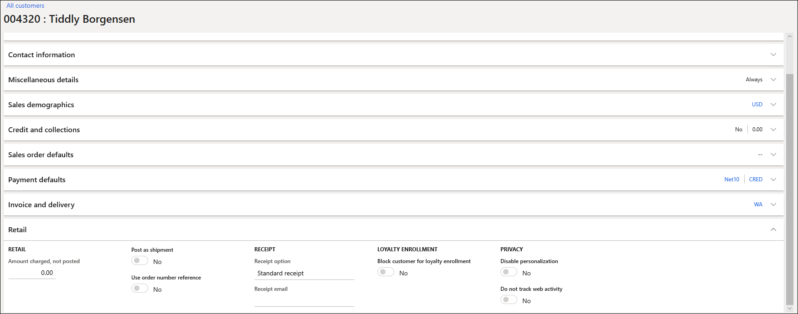
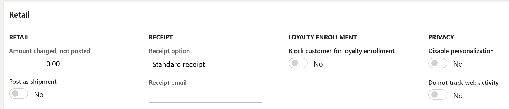

# Opt out of personalized recommendations

[!include [banner](includes/banner.md)]

This article explains how you can let customers opt out of receiving personalized recommendations in Microsoft Dynamics 365 Commerce.

During account creation, new customers are automatically set up to receive personalized recommendations. However, Dynamics 365 Commerce provides various ways for retailers to let users opt out of receiving these recommendations and restrict the processing of their personal data. Authenticated users who opt out of receiving personalized recommendations will immediately stop seeing personalized lists. Additionally, all personal data that is collected for personalization will be removed from personalized recommendations models.

For more information about personalized product recommendations, see [Enable personalized recommendations](personalized-recommendations.md).

## Ways for retailers to implement an opt-out experience

Retailers have three ways to implement an opt-out experience.

### Opting out on behalf of users

In Account management in Commerce back office, retailers can opt out on behalf of users.

1. From the back-office home page, search for **all customers**.
1. Search for and select a customer, and then select the **Retail** FastTab.

    

1. Under **Privacy**, set the **Disable personalization** option to **Yes**.

    

1. Select **Save**, and close the page.

### Module-based opt-out experience

Retailers can let authenticated users opt out of personalized recommendations by themselves. To provide this opt-out experience, add the user opt-out module to customer account profile pages.

### Custom extensions

Retailers can create their own extensions to manage the opt-out experience for users. For more information, see [Call Retail Server APIs](e-commerce-extensibility/call-retail-server-apis.md) and [Online channel extensibility](e-commerce-extensibility/overview.md).

## Obtain a digital copy of personalized recommendations data on behalf of an authenticated user

Customers might want to obtain a digital copy of their personal data and also see an exported view of their recommendations results. If a customer requests this information, the retailer must create a customized extension that calls the Retail Server application programming interface (API) and queries for the full results from the **Picks for you** list, based on the customer's customer ID. The results can then be exported in comma-separated values (CSV) format and shared with the customer.

The following example shows how a retailer can accomplish this task.

1. The retailer creates a custom extension to pull personal recommendations data on behalf of the user. For information about how to create modules, clone existing modules, call Retail Server APIs, and call data actions, see [Online channel extensibility](e-commerce-extensibility/overview.md).
2. The custom extension makes a call to the **get-recommendations** core data action and passes the required information to it, based on the requirements of the list. In the case of the **Picks for you** list, the extension must pass the correct list name and customer ID to the data action.

    One way to create the custom extension is to clone the existing product collection module that is used to return recommendations results. By cloning this existing module, a retailer can modify the existing code and add a new button that exports the recommendations results to a CSV file. For more information, see [Clone a module library module](e-commerce-extensibility/clone-starter-module.md) and [Product collection modules](product-collection-module-overview.md).

    For a full view of the Retail Server API library, see [Retail Server Customer and Consumer APIs](dev-itpro/retail-server-customer-consumer-api.md).

3. After the custom extension is created, the retailer can export a CSV file of all recommendations results, based on the unique customer ID of the authenticated user.
4. The retailer can share the exported CSV file that contains the full personalized list of recommended products with the authenticated user.

## Additional resources

[Product recommendations overview](product-recommendations.md)

[Enable Azure Data Lake Storage in a Dynamics 365 Commerce environment](enable-adls-environment.md)

[Enable product recommendations](enable-product-recommendations.md)

[Enable personalized recommendations](personalized-recommendations.md)

[Enable "shop similar looks" recommendations](shop-similar-looks.md)

[Add product recommendations on POS](product.md)

[Add recommendations to the transaction screen](add-recommendations-control-pos-screen.md)

[Adjust AI-ML recommendations results](modify-product-recommendation-results.md)

[Manually create curated recommendations](create-editorial-recommendation-lists.md)

[Create recommendations with demo data](product-recommendations-demo-data.md)

[Product recommendations FAQ](faq-recommendations.md)

[!INCLUDE[footer-include](../includes/footer-banner.md)]
