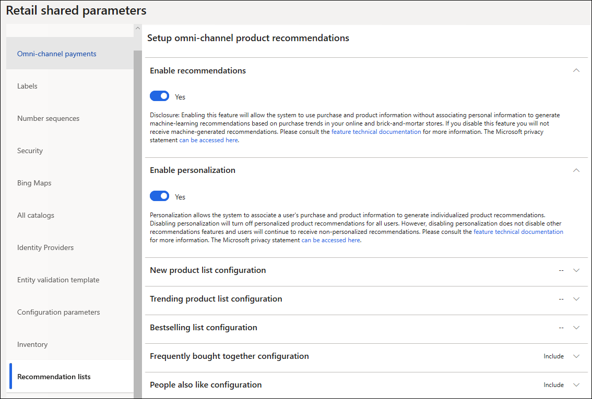

---
# required metadata

title: Enable personalized product recommendations
description: This topic describes how to enable personalized product recommendations for customers in Microsoft Dynamics 365 Commerce. 
author: bebeale
manager: AnnBe
ms.date: 01/28/2020
ms.topic: article
ms.prod: 
ms.service: dynamics-365-commerce
ms.technology: 

# optional metadata

ms.search.form: 
# ROBOTS: 
audience: Application User
# ms.devlang: 
ms.reviewer: v-chgri
ms.search.scope: 
# ms.tgt_pltfrm: 
ms.custom: 
ms.assetid: 
ms.search.region: global
ms.search.industry: Retail, eCommerce
ms.author: bebeale
ms.search.validFrom: 2019-10-31
ms.dyn365.ops.version: 10.0.5

---

# Enable personalized recommendations

[!include [banner](includes/preview-banner.md)]
[!include [banner](includes/banner.md)]

This topic describes how to enable personalized product recommendations for customers in Microsoft Dynamics 365 Commerce.

## Overview

Retailers can enable personalized product recommendations (also known as personalization) in Dynamics 365 Commerce to incorporate personalized recommendations into their customers' online and point of sale (POS) experiences. Personalization allows the system to associate a user's purchase and product information to generate individualized product recommendations.

## Personalization prerequisites

Before enabling personalized product recommendations for customers, please note that product recommendations are only supported for Commerce users who have migrated their storage to Azure Data Lake Storage (ADLS). For customers to receive personalized product recommendations, retailers must first [enable product recommendations](enable-product-recommendations.md). 

> [!NOTE] 
> Enabling product recommendations will also enable personalization. Disabling personalization will not disable the other types of product recommendations.
For more information about product recommendations, see the [Product recommendations overview](product-recommendations.md).

## Enable personalization

To enable personalization, follow these steps.

1. Go to **Retail and commerce \> Product recommendations \> Recommendation parameters**. 
1. In the list of retail shared parameters, select **Recommendation lists**.
1. For **Enable personalization**, select **Yes**.

> [!NOTE]
> Enabling personalization starts the process of generating personalized product recommendation lists. Up to one day may be required before these lists are available and visible online and at the point of sale (POS).
The following image shows where to enable personalization on the **Recommendation lists** page.

## Personalized lists

In addition to existing machine-generated lists, the recommendations service also supports the ability to personalize the product discovery experience both online and on POS.

After enabling personalization, retailers are able to show shoppers personalized "picks for you" lists online or "recommended products" on POS terminals. Additionally, retailers can apply personalization to existing product recommendations lists and provide General Data Protection Regulation (GDPR) privacy opt-out experiences for their authenticated users. Disabling personalization will disable these features. 

### "Picks for you" lists online

A "Picks for you" artificial intelligence-machine learning (AI-ML) list shows an authenticated user a personalized list of suggested products that is based on their omnichannel purchase history. Personalized recommendations update dynamically over time as more purchases are made. This type of list also supports category filtering, which allows retailers to show top picks based on navigational hierarchies. 

In order for the **Picks for you** list to appear on any e-Commerce page, the following user requirements must be met. 
-	Users must be signed in. Anonymous users will not see personalized recommendations.
- Users must have at least one purchase on their account.
- Users must be opted in to receive personalized recommendations. 

The following image shows an example of a "Picks for you" list on an online store page.

### "Recommended for customer" lists on POS

Retailers can enhance their clienteling experience by personalizing existing customer details pages by adding a contextual "Recommended for customer" list.

The following image shows an example of a "Recommended for customer" list on a POS terminal.

## Apply personalization to existing recommendation lists

Retailers can apply personalization to existing recommendation lists such as "New," "Trending," "Best selling," "People also like," and "Frequently bought together." Applying personalization to existing lists removes items that a signed-in user has previously purchased. For both anonymous and opted-out users, default versions of the existing lists will be shown, which removes the need for retailers to manually maintain separate page experiences. 

### How to personalize an existing recommendation list

Follow the steps below to personalize existing product recommendation lists:

1. From an existing site builder page, open the product collection module and select a list source.
1. Select the "apply personalization" checkbox, and save the list.

3. Save and publish the page. 

Once published, signed-in users will now see personalized trending lists. 
For example, a signed-in user who purchased the black watch and the brown work boots in the "Trending - default" list will be able to see new products instead (as shown in the "Trending - personalized" list).

## Additional resources

[Product recommendations overview](product-recommendations.md)

[Enable product recommendations](enable-product-recommendations.md)

[GDPR and product recommendations](personalization-gdpr.md)

[Add product recommendation lists to pages](add-reco-list-to-page.md)

[Add recommendations panel to POS devices](add-recommendations-control-pos-screen.md)

[Product collection module overview](product-collection-module-overview.md)
