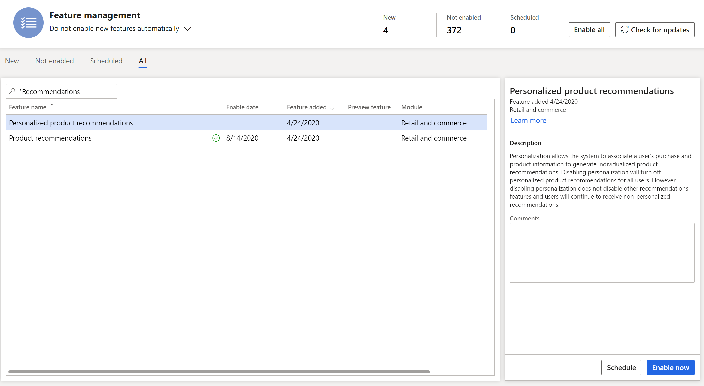
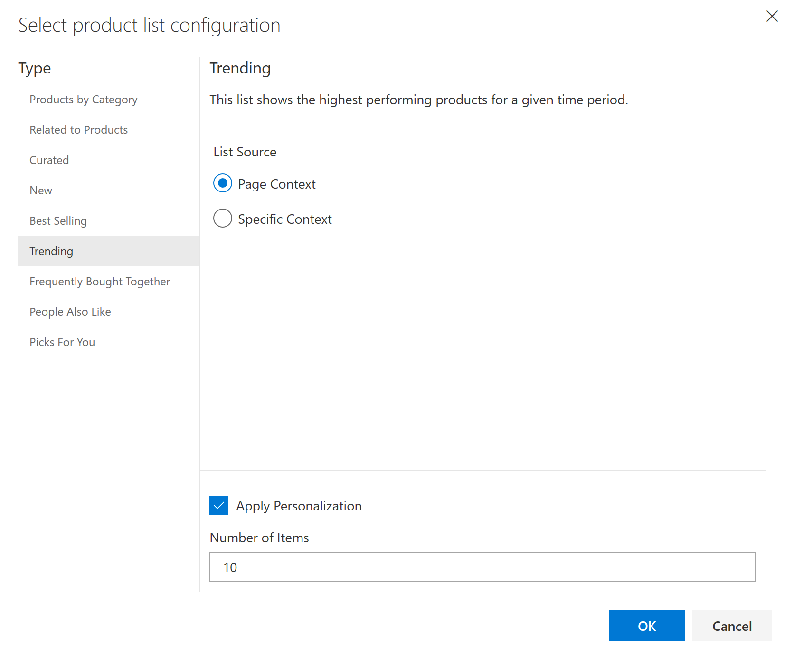

# Enable personalized recommendations

[!include [banner](includes/banner.md)]

This article describes how to make personalized product recommendations available for customers in Microsoft Dynamics 365 Commerce.

In Dynamics 365 Commerce, retailers can make personalized product recommendations (also known as personalization) available. In this way, personalized recommendations can be incorporated into the customer experience online and at the point of sale (POS). When the personalization functionality is turned on, the system can associate a user's purchase and product information to generate individualized product recommendations.

## Personalization prerequisites

Before you make personalized product recommendations available for customers, note that product recommendations are supported only for Commerce users who have migrated their storage to Azure Data Lake Store. Before customers can receive personalized product recommendations, retailers must [turn on product recommendations](enable-product-recommendations.md).

> [!NOTE]
> By turning on product recommendations, you also turn on personalization. However, if you turn off personalization, you don't turn off the other types of product recommendations.

For more information about product recommendations, see the [Product recommendations overview](product-recommendations.md).

## Turn on personalization

To turn on personalization, follow these steps.

1. In Commerce headquarters, search for **Feature Management**.
1. Select **All** to see a list of available features. 
1. In the search box, enter **Recommendations**.
1. Select the **Personalized product recommendations** feature.
1. In the **Personalized product recommendations** properties pane, select **Enable now**.

> [!NOTE]
> When you turn on personalization, the process of generating personalized product recommendation lists is started. Up to one day might be required before these lists are available and visible online and at the POS.

## Personalized lists

In addition to allowing for personalization of existing machine-generated lists, the recommendations service allows for personalization of the product discovery experience both online and at the POS.

After personalization is turned on, retailers can show shoppers personalized "Picks for you" lists online or "Recommended for customer" lists on POS terminals. Additionally, retailers can apply personalization to existing product recommendation lists and provide General Data Protection Regulation (GDPR) opt-out experiences for authenticated users. If you turn off personalization, you also turn off these features.

### Online "Picks for you" lists

A "Picks for you" list is an artificial intelligence-machine learning (AI-ML) list that shows an authenticated user a personalized list of suggested products. This list is based on the user's omnichannel purchase history. Personalized recommendations are dynamically updated as the user makes more purchases. This type of list also supports category filtering, so that retailers can show top picks, based on navigational hierarchies.

Before the "Picks for you" list can appear on any e-Commerce page, the following user requirements must be met:

- Users must be signed in. Anonymous users won't see personalized recommendations.
- Users must have at least one purchase on their account.
- Users must opt in to receive personalized recommendations.

The following illustration shows an example of a "Picks for you" list on an online store page.

### "Recommended for customer" lists at the POS

To enhance their clienteling experience, retailers can personalize existing customer details pages by adding a contextual "Recommended for customer" list.

The following illustration shows an example of a "Recommended for customer" list on a POS terminal.

## Apply personalization to existing recommendation lists

Retailers can apply personalization to existing recommendation lists, such as "New," "Trending," "Best selling," "People also like," and "Frequently bought together." When personalization is applied to existing lists, items that a signed-in user previously bought are removed from those lists. For both anonymous users and users who opted out of receiving personalized recommendations, default versions of the existing lists are shown. Therefore, retailers don't have to manually maintain separate page experiences.

For example, a signed-in user has already bought the black watch and the brown work boots that appear in the "Trending - default" list in the following illustration. Therefore, the user will see new products instead of those products, as shown in the "Trending - personalized" list.

To apply personalization to an existing recommendation list in the Commerce site builder, follow these steps.

1. Open an existing site builder page that contains a product collection module.
1. In the left navigation pane, select the product collection module.
1. In the right navigation pane, under **Products**, select the list.
1. In the **Select product list configuration** dialog box, under **Type**, select the list type.
1. Select the **Apply Personalization** check box, and then select **OK**.

    

1. Save the page, finish editing it, and then publish it. After the page is published, signed-in users will see personalized trending lists.

## Additional resources

[Product recommendations overview](product-recommendations.md)

[Enable Azure Data Lake Storage in a Dynamics 365 Commerce environment](enable-adls-environment.md)

[Enable product recommendations](enable-product-recommendations.md)

[Enable "shop similar looks" recommendations](shop-similar-looks.md)

[Opt out of personalized recommendations](personalization-opt-out.md)

[Add product recommendations on POS](product.md)

[Add recommendations to the transaction screen](add-recommendations-control-pos-screen.md)

[Adjust AI-ML recommendations results](modify-product-recommendation-results.md)

[Manually create curated recommendations](create-editorial-recommendation-lists.md)

[Create recommendations with demo data](product-recommendations-demo-data.md)

[Product recommendations FAQ](faq-recommendations.md)

[!INCLUDE[footer-include](../includes/footer-banner.md)]
