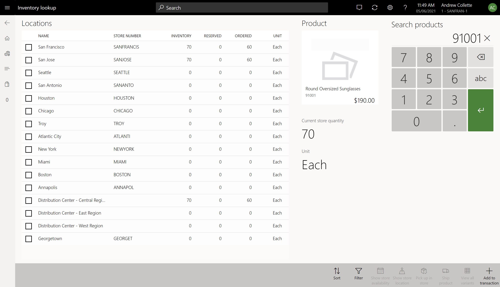
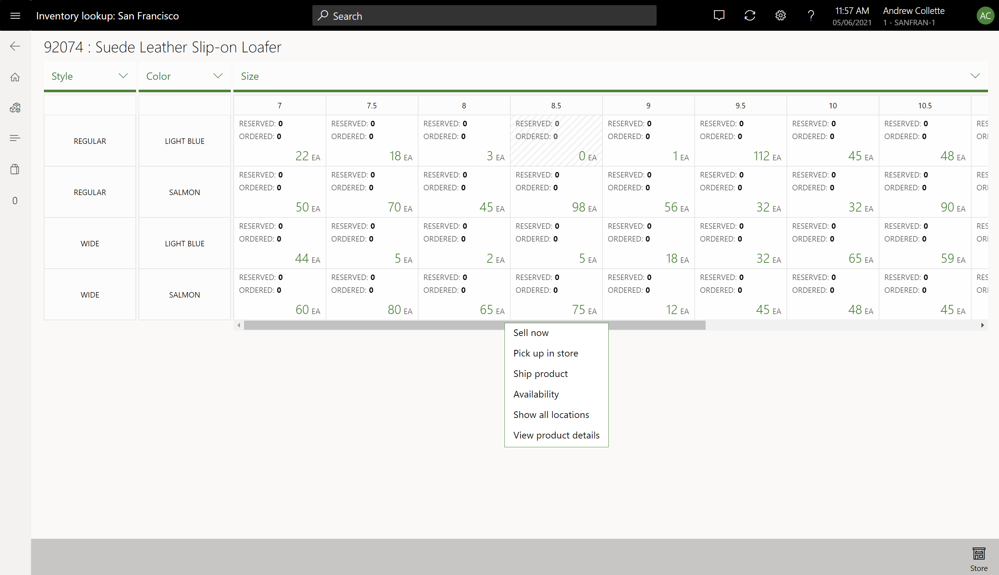
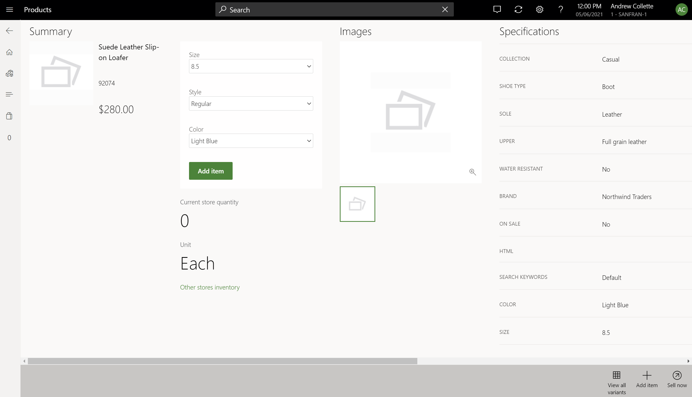

---
# required metadata

title: Inventory lookup operation in POS
description: This topic describes how to use the inventory lookup operation in Dynamics 365 Commerce point of sale (POS) to view the on-hand inventory availability of products across stores and warehouses. 
author: boycezhu
ms.date: 05/10/2021
ms.topic: article
ms.prod: 
ms.technology: 

# optional metadata

# ms.search.form: 
audience: Application User
# ms.devlang: 
ms.reviewer: v-chgri
# ms.tgt_pltfrm: 
ms.custom: 
ms.assetid: 
ms.search.region: global
ms.search.industry: Retail
ms.author: asharchw
ms.search.validFrom: 2018-03-30
ms.dyn365.ops.version: Application update 5, AX 8.0

---

# Inventory lookup operation in POS

[!include [banner](includes/banner.md)]

This topic describes how to use the inventory lookup operation in Dynamics 365 Commerce point of sale (POS) to view the on-hand inventory availability of products across stores and warehouses.

An accurate view of inventory across an organization helps store associates provide timely, effective customer service. The moment that matters most is the moment when a customer is ready to make a purchase decision. It's important that cashiers in a retail store have real-time or near real-time inventory information at their fingertips, so that they can accurately promise product delivery and pickup.

The inventory lookup operation in Commerce POS helps retailers achieve operational excellence and gain insights by connecting stores with Commerce headquarters. This functionality provides an inventory availability view of products across stores and warehouses. It also helps retailers drive additional efficiencies and cost savings by improving inventory planning in real time.

When the inventory lookup operation is started from the POS application, the POS cashier uses the numeric keyboard to enter a product number to query its inventory information. If the product entered has variants, the cashier can optionally select dimension or other values to check inventory information of a specific product variant.

## Inventory lookup list view for individual products

For an individual product, the inventory lookup operation provides an inventory lookup list view showing the following product information for a list of locations:

- **Inventory** - Refers to the "available physical" quantity of a product.
- **Reserved** - Refers to the "physical reserved" quantity retrieved from headquarters.
- **Ordered** - Refers to the "ordered in total" quantity retrieved from headquarters.
- **Unit** - Refers to the inventory unit of measure configured in headquarters.

The list view of locations includes all stores and warehouses that are configured in the fulfillment groups that the current store is linked to.

The following actions are available on the POS app bar:

- **Sort** - This action lets the POS user sort the data in the list view based on various criteria: **Geo location** (from the closest location to the farthest location, compared with the current store), **Name** (in ascending or descending order), **Store number** (in ascending or descending order), **Inventory** (in descending order), **Reserved** (in descending order), and **Ordered** (in descending order). Location-based sorting is the default sort option.
- **Filter** - This action lets the POS user view filtered data for a specific location.
- **Show store availability** - This action lets the POS user view the available-to-promise (ATP) quantities for a product in the selected store.
- **Show store location** - This action opens a separate page to show the map view, address, and store hours for the selected store.
- **Pick up in store** - This action creates a customer order for the product that will be picked up from the selected store, and redirects the user to the transaction screen.
- **Ship product** - This action creates a customer order for the product that will be shipped from the selected store, and redirects the user to the transaction screen.
- **View all variants** - For a product with variants, this action switches from a list view to a matrix view that displays inventory information for all variants of the product.
- **Add to transaction** - This action adds the product to the cart and redirects the user to the transaction screen.

> [!NOTE]
> For a location-based sort, the distance between a location and current store is determined by the coordinates (latitude and longitude) defined in Commerce headquarters. For a store, the location information is defined in the primary address of the operating unit associated with the store. For a non-store warehouse, the location information is defined in the warehouse address. If the current store doesn't have coordinates properly defined, the location-based sort option will display the current store at the top of the list and then sort other locations by name.

> [!NOTE]
> The **Show store availability**, **Show store location**, **Pick up in store**, and **Ship product** actions are not available for non-store locations.

## Inventory lookup matrix view for variants

For a master product with variants, the inventory lookup operation also provides a dimension-based matrix view that displays inventory availability information for all variants of the master product at a selected location. By default, the matrix view shows data for the current store. You can use the **Store** action on the app bar to look up inventory information at other stores configured in the fulfillment groups that the current store is linked to.

In the matrix view, each cell represents an individual variant, and displays an on-hand inventory (available physical) value in the lower-right corner, as well as **reserved** (physical reserved) and **ordered** (ordered in total) values in the upper-left corner. The following table explains the meaning of the various on-hand values.

| On-hand value                            | Description |
|------------------------------------------|-------------|
| Numeric value that is more than 0 (zero) | A variant has been released to the selected location, and you can perform additional actions in the cell. |
| **0** (zero)                             | A variant has been released to the selected location, but the item isn't available at the selected location. You can perform additional actions in the cell. |
| **n/a**, or an inactive cell              | A variant hasn't been released to the selected location, and you can't perform additional actions in the cell. |

The display order of the dimension values in the matrix view is based on the dimension display order configuration in Commerce headquarters. You can change the dimension display order configuration by selecting a new dimension to use. 

The following actions are available in the matrix view cell:

- **Sell now** - This action adds the selected variant to the cart, and redirects the user to the transaction screen.
- **Pick up in store** - This action creates a customer order for the selected variant that will be picked up from the selected store, and redirects the user to the transaction screen.
- **Ship product** - This action creates a customer order for the selected variant that will be shipped from the selected store, and redirects the user to the transaction screen.
- **Availability** - This action takes the user to a separate page showing the ATP quantities for the selected variant in the selected store.
- **Show all locations** - This action switches to the standard inventory availability list view showing the inventory information for the selected variant.
- **View product details** - This action redirects the user to the product details page (PDP) of the selected variant.

## Access inventory lookup from other pages in POS

POS users can access the inventory lookup operation from other pages in POS.

On the PDP of a master product, you can use the **View all variants** action on the app bar to launch the inventory lookup matrix view that displays inventory availability information for the current store for all variants of a product. For an individual product, the PDP displays the on-hand inventory (available physical) value of that product for the current store. Additionally, you can select the **Other stores inventory** link to launch the inventory lookup operation to check the inventory availability of a product across other stores or warehouses.

> [!NOTE]
> The **View all variants** action on the PDP is available only for master products that have variants. It isn't available for distinct products or kits.

You can configure the inventory lookup operation to appear as a link in the button grid on the POS transaction screen. Once configured, when the user selects a cart line and then selects the **Inventory lookup** button, the inventory lookup list view for the selected product will be displayed. For more information about how to configure button grids using POS screen layout designer tool, see [POS user interface visual configurations](pos-screen-layouts.md).

## Inventory lookup with channel-side calculation

In the Commerce version 10.0.9 release and earlier, the **available physical** value in the inventory lookup operation is retrieved from Commerce headquarters via a real-time service call. In the Commerce version 10.0.10 release and later, you can configure the POS inventory lookup operation to use channel-side calculation on the Commerce server to determine the available physical value, which can provide a more reliable and more accurate estimate of the on-hand inventory by factoring in the transactional data that is not yet synchronized to headquarters. For more information about channel-side inventory calculation and related POS configuration in headquarters, see [Calculate inventory availability for retail channels](calculated-inventory-retail-channels.md).

## Additional resources

[POS user interface visual configurations](pos-screen-layouts.md)

[Calculate inventory availability for retail channels](calculated-inventory-retail-channels.md)

[!INCLUDE[footer-include](../includes/footer-banner.md)]
