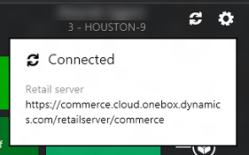
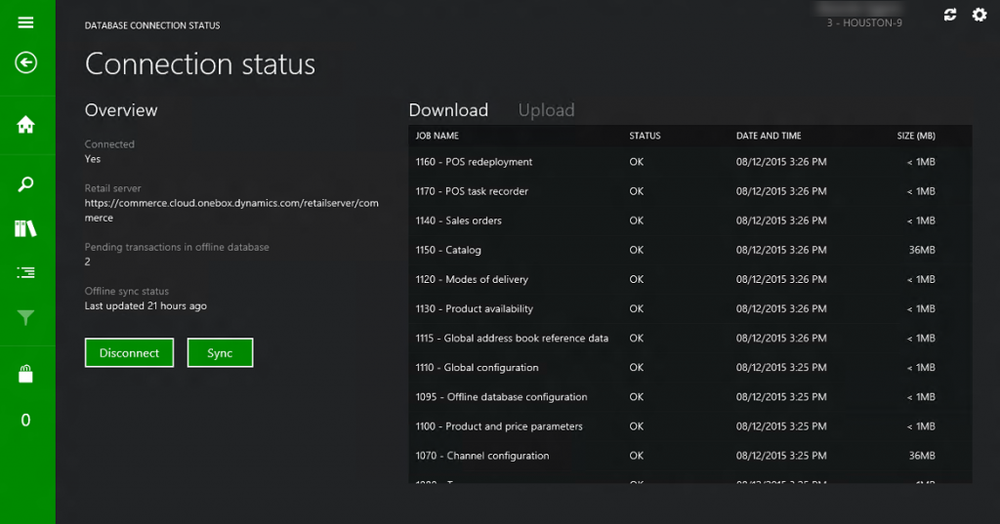
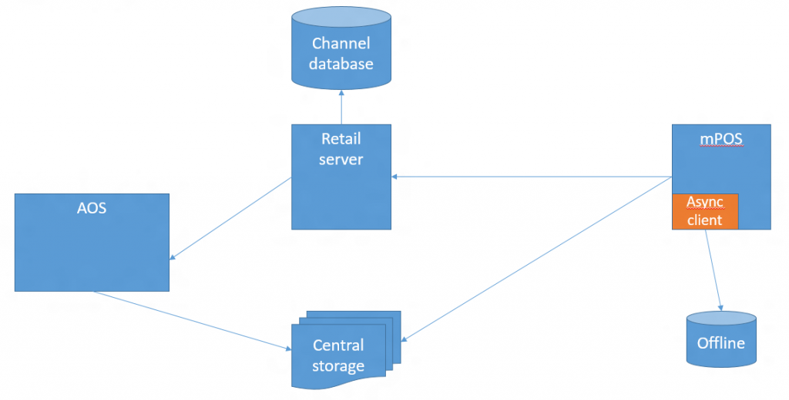

---
# required metadata

title: Offline point of sale (POS) functionality
description: This article provides information about offline mode for the Store Commerce app for Windows, in which POS devices automatically switch from the channel database to the offline database if the Commerce Scale Unit is unavailable. This article also includes general setup information for offline mode and explains the data synchronization that occurs between the offline database and the channel database.
author: josaw1
ms.date: 02/03/2023
ms.topic: article
ms.prod: 
ms.technology: 

# optional metadata

ms.search.form: RetailTerminalTable
# ROBOTS: 
audience: IT Pro
# ms.devlang: 
ms.reviewer: josaw
# ms.tgt_pltfrm: 
ms.custom: 27041
ms.assetid: 20b51874-8912-40cf-9296-864df707315a
ms.search.region: Global
ms.search.industry: Retail
ms.author: josaw
ms.search.validFrom: 2016-02-28
ms.dyn365.ops.version: AX 7.0.0, Retail July 2017 update

---

# Offline point of sale (POS) functionality

[!include [banner](includes/banner.md)]

This article provides information about offline mode for the Store Commerce app for Windows, in which POS devices automatically switch from the channel database to the offline database if the Commerce Scale Unit is unavailable. This article also includes general setup information for offline mode and explains the data synchronization that occurs between the offline database and the channel database.

In the Store Commerce app, a point of sale (POS) device goes into offline mode whenever the Commerce Scale Unit is unavailable. Therefore, if the connection is lost, the POS automatically switches to the offline database. 

During a sales transaction, if a data request doesn't succeed within the time-out interval that is configured in the offline profile, the POS automatically switches to the offline database and continues the sales transaction. While the POS device is in offline mode, the Store Commerce app tries to reconnect to the Commerce Scale Unit after the reconnection attempt interval that is configured in the offline profile. This reconnection attempt occurs only at the beginning of a transaction.

### Determining the connection mode of the Store Commerce app

The status header in the Store Commerce app indicates the current connection status, and the **Connection status** window shows the status of the last attempt to sync with the offline database.

### Creating a button to manually switch between online and offline modes

You can add a button to the Store Commerce app to manually switch between online and offline modes. Create a button for POS operation **917 – Database connection status**. The name of this button is **Disconnect** when the POS is connected to the Commerce Scale Unit and **Connect** when it is disconnected. You can use this button to view the connection, and to disconnect from the Commerce Scale Unit or connect to it.

## Setup

To enable offline support for a POS device (register), set the **Support offline** option to **Yes** on the **Register** page. A new channel database entity is created and added to the store's channel data group. Then run all the required distribution schedules to generate the data packages for the offline database. Next, install the offline version of the Store Commerce app. The installation process creates the offline database. Additionally, install a currently supported version of Microsoft SQL Server Express if it is required. (Currently, SQL 2019 is the most up-to-date version available). Offline data synchronization starts after the first sign-in to the Store Commerce app.

## Data synchronization

The Commerce scheduler is used to send master data to the offline database. By default, when a distribution schedule is run, data changes are sent to both the channel database and the offline database. The Store Commerce app includes the async sync library, which downloads any available data packages and inserts them into the offline database. If any transactions are created offline, the POS uploads them to the Commerce Scale Unit, so that they can be inserted into the channel database. Offline data synchronization can occur only if the Store Commerce app is running.

[!INCLUDE[footer-include](../includes/footer-banner.md)]
