---
# required metadata

title: POS user interface visual configurations
description: This topic provides information about screen layouts for Dynamics 365 Commerce point of sale (POS) experiences.
author: boycezhu
manager: annbe
ms.date: 05/20/2019
ms.topic: article
ms.prod: 
ms.service: dynamics-365-commerce
ms.technology: 

# optional metadata

ms.search.form: RetailTillLayout
# ROBOTS: 
audience: Application user
# ms.devlang: 
ms.reviewer: josaw
ms.search.scope: Core, Operations, Retail
# ms.tgt_pltfrm: 
ms.custom: 90573
ms.assetid: a6868f93-02ed-4928-9f6a-3b7383e7e399
ms.search.region: global
ms.search.industry: Retail
ms.author: jblucher, boycezhu
ms.search.validFrom: 2016-02-28
ms.dyn365.ops.version: 10.0.11
---

# POS user interface visual configurations
[!include [banner](includes/banner.md)]

The Dynamics 365 Commerce point of sale (POS) user interface (UI) can be configured by using a combination of visual profiles and screen layouts that are assigned to stores, registers and/or users. This topic provides information about those configuration options.

The following illustration shows the relationships among the various entities that make up the configurable aspects of the POS UI.

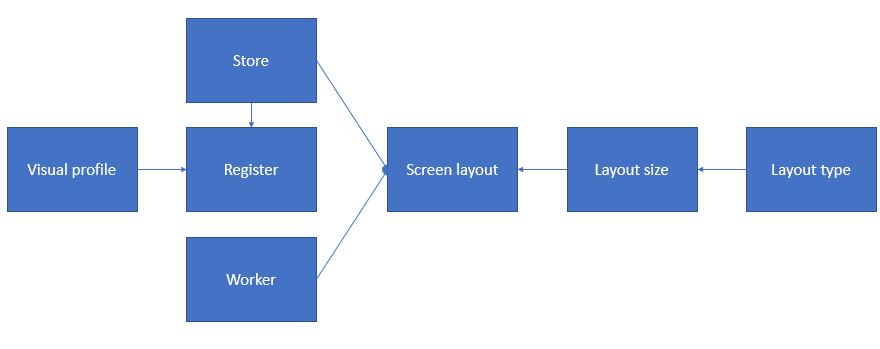

## Visual profile

Visual profiles are assigned to registers, and they specify the visual elements that are register-specific and shared across users. Every user who signs in to the register sees the same theme, layout, colors and images.

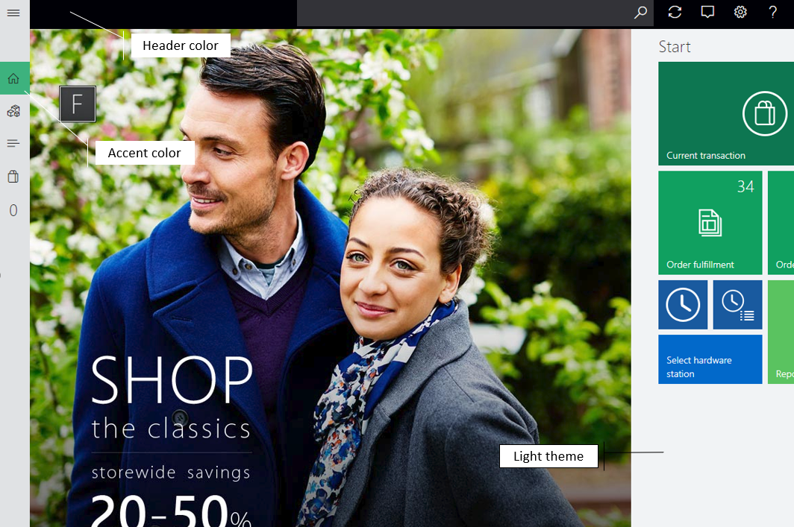

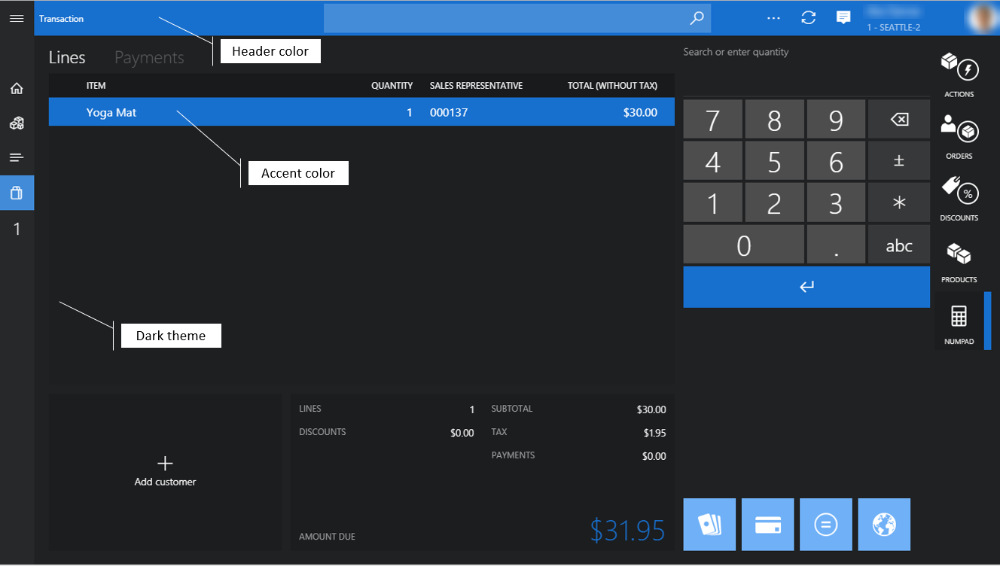

- **Profile number** – The profile number is the unique identifier of the visual profile.
- **Description** – You can specify a meaningful name that will help identify the correct profile for your situation.
- **Theme** – You can select between the **Light** and **Dark** application themes. The theme affects the font and background colors throughout the application.
- **Accent color** – The accent color is used throughout the POS to differentiate or highlight specific visual elements, such as tiles, command buttons and hyperlinks. Typically, these elements are actionable.
- **Header color** – You can configure the color of the page header to meet the retailer's branding requirements.
- **Font scheme** – You can select between **Standard** and **Large** font scheme, which affects the font size throughout the application. The default scheme is Standard.
- **Always show application bar labels** – When enabled, the label text is always visible under the application bar buttons.
- **Layout** – You can select between **Centered** and **Right** layout options. The selection affects the alignment of sign-in box on the sign-in screen. The default layout is Centered.
- **Show date/time** – When enabled, the current date and time will be displayed in the POS header and sign-in screen.
- **Keyboard** – You can select between **Default to OS keyboard** and **Show number pad** to specify the default keyboard to be used for sign-in screen inputs. Number pad is a virtual keyboard primarily used for touch-based devices. The default selection is OS keyboard.
- **Logo image** – You can specify a logo image to be displayed on the sign-in screen. It's recommended to use image with transparent background. The file size should be kept as small as possible.
- **Login background** – You can specify a background image for the sign-in screen. The file size of background images should be kept as small as possible, because storing and loading large files can affect application behavior and performance.
- **Background** – You can specify a background image that is used instead of the solid theme color throughout the application. As for login backgrounds, the file size should be kept as small as possible.

> [!NOTE]
> The right layout and date/time display are not applicable to sign-in screen in compact view.

## Screen layouts

Screen layout configurations determine the actions, content, and placement of UI controls on the POS **Welcome** screen and **Transaction** screen.

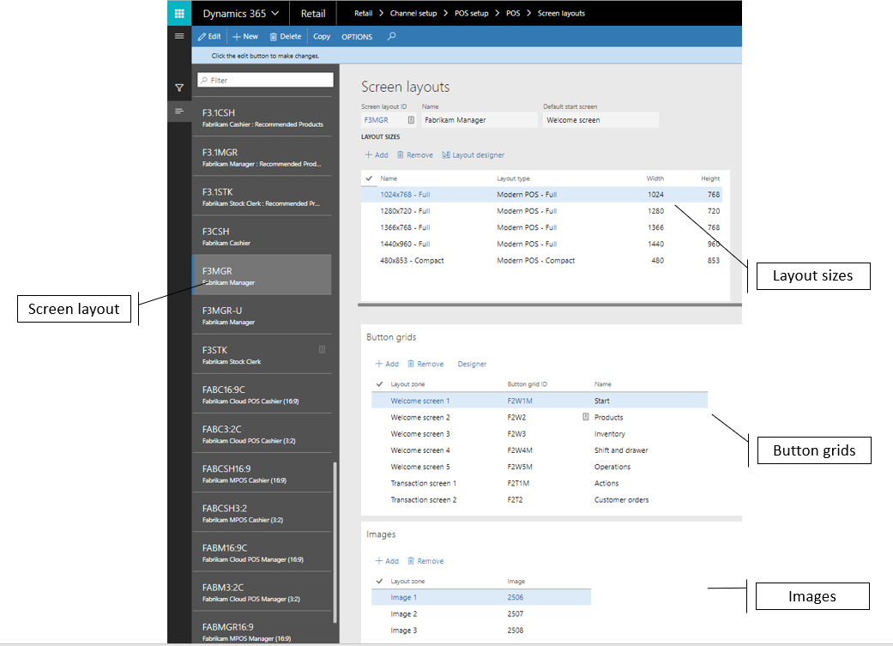

- **Welcome screen** – In most cases, the welcome screen is the page that users see when they first sign in to the POS. The welcome screen can consist of a branding image and button grids that provide access to POS operations. Typically, operations that aren't specific to the current transaction are put on this screen.

    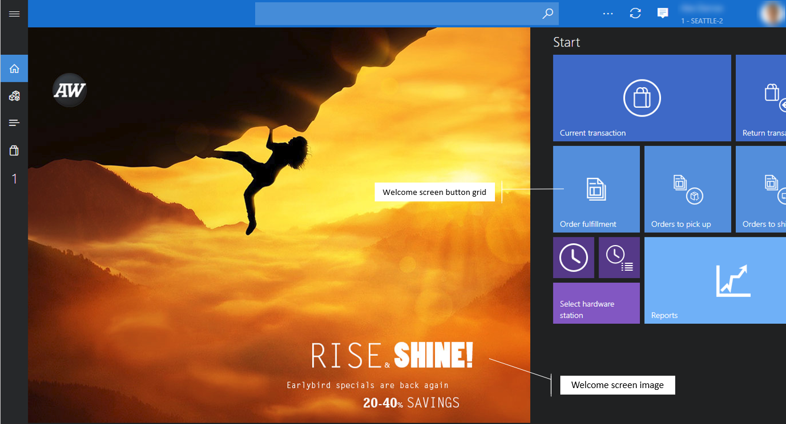

- **Transaction screen** – The **Transaction** screen is the main screen in the POS for processing sales transactions and orders. The content and layout are configured by using the screen layout designer.

    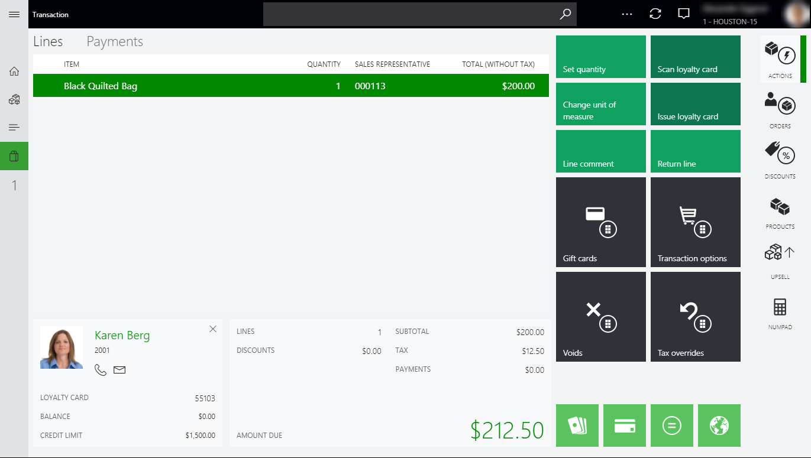

- **Default start screen** – Some retailers prefer that cashiers go directly to the **Transaction** screen after sign-in. The **Default start screen** setting lets you specify the default screen that appears after sign-in for each screen layout.

### Assignment

Screen layouts can be assigned at the store, register, or user level. The user assignment overrides the register and store assignments, and the register assignment overrides the store assignment. In a simple scenario where all users use the same layout, regardless of register or role, the screen layout can be set only at the store level. In scenarios where specific registers or users require specialized layouts, those layouts can be assigned.

### Layout sizes

Most aspects of the POS UI are responsive, and the layout is automatically resized and adjusted based on the screen size and orientation. However, the POS **Transaction** screen must be configured for every screen resolution that is expected.

At startup, the POS application automatically selects the closest layout size that is configured for the device. A screen layout can also contain configurations for both landscape and portrait modes, and for both full-size and compact devices. Therefore, users can be assigned to a single screen layout that works across various sizes and form factors that are used in the store.

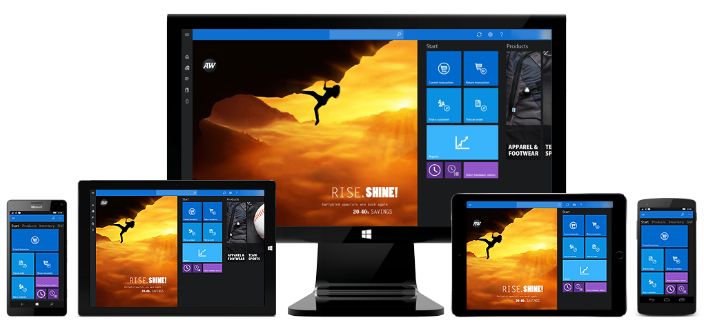

- **Name** – You can enter a meaningful name to identify the screen size.
- **Layout type** – The POS application can show its UI in various modes to provide the best user experience on a given device.

    - **Modern POS – Full** – Full layouts are typically best for larger displays, such as desktop monitors and tablets. You can select the UI elements to include, specify the size and placement of those elements, and configure their detailed properties. Full layouts support both portrait and landscape configurations.
    - **Modern POS – Compact** – Compact layouts are typically best for phones and small tablets. The design possibilities for compact devices are limited. You can configure the columns and fields for the receipt and totals panels.

- **Width/Height** – These values represent the effective screen size, in pixels, that is expected for the layout. Remember that some operating systems use scaling for high-resolution displays.

> [!TIP]
> You can learn the layout size that is required for a POS screen by viewing the resolution in the app. Start the POS, and go to **Settings \> Session information**. POS shows the screen layout that is currently loaded, the layout size, and the resolution of the app window.

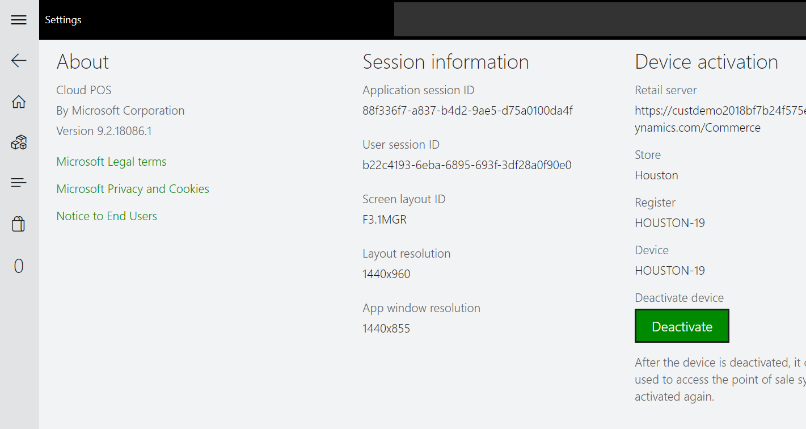

### Button grids

For each layout size in a screen layout, you can configure and assign button grids for the POS welcome screen and **Transaction** screen. Button grids for the welcome screen are automatically laid out from left to right, from the lowest number (Welcome screen 1) to the highest number.

In Full POS layouts, the placement of button grids is specified in the screen layout designer.

In Compact POS layouts, the button grids are automatically laid out from top to bottom, from the lowest number (Transaction screen 1) to the highest number. They can be accessed on the **Actions** menu.

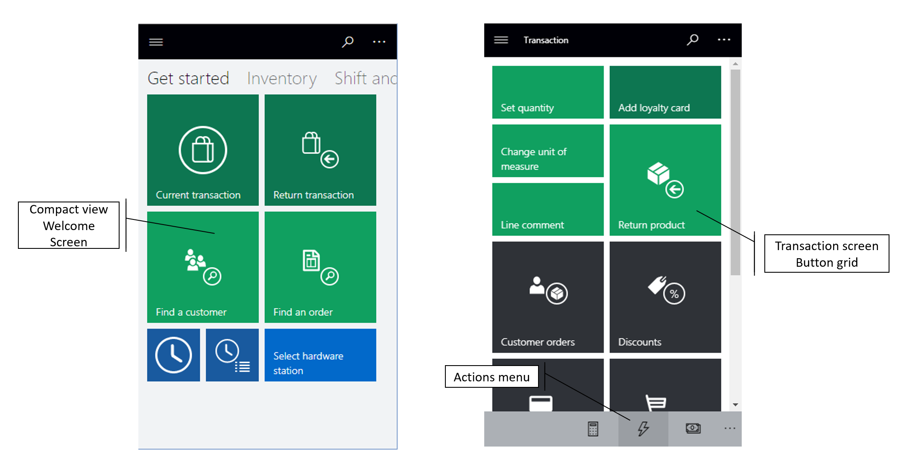

### Images

For each layout size in a screen layout, you can specify images to include in the POS UI. For Full POS layouts, a single image can be specified for the welcome screen. This image appears as the first UI element on the left. On the **Transaction** screen, images can be used as tab images or as a logo. Compact POS layouts don't use these images.

### Screen layout designer

The screen layout designer lets you configure various aspects of the POS **Transaction** screen for each layout size, in both portrait and landscape modes, and for both Full and Compact layouts. The screen layout designer uses the ClickOnce deployment technology to download, install, and start the latest version of the application every time that users access it. Be sure to check the browser requirements for ClickOnce. Some browsers, such as Google Chrome, require extensions.

> [!IMPORTANT]
> You must configure a screen layout for each layout size that is defined and that is used by the POS.

### Full layout designer

The Full layout designer lets users drag UI controls onto the POS **Transaction** screen and configure the settings of those controls.

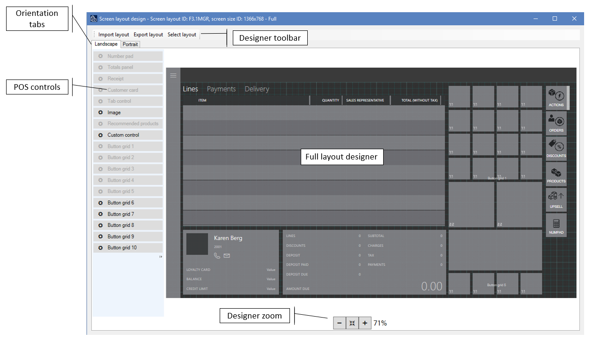

- **Import layout/Export layout** – You can export and import POS screen layout designs as XML files, so that you can easily reuse and share them across environments. It's important that you import layout designs for the correct layout sizes. Otherwise, UI elements might not fit correctly on the screen.
- **Landscape/Portrait** – If the POS device lets users switch between landscape and portrait modes, you must define a screen layout for each mode. The POS automatically detects screen rotation and shows the correct layout.
- **Layout grid** – The POS layout designer uses a 4-pixel grid. UI controls "snap" to the grid to help you correctly align the content.
- **Designer zoom** – You can zoom the designer view in and out to better view the content on the POS screen. This feature is useful when the screen resolution on the POS differs greatly from the resolution of the screen that is used in the designer.
- **Show/hide navigation bar** – For Full POS layouts, you can select whether the left navigation bar is visible on the **Transaction** screen. This feature is helpful for displays that have a lower resolution. To set the visibility, right-click the navigation bar in the designer, and select or clear the **Always visible** check box. If the navigation bar is hidden, POS users can still access it by using the menu in the upper left.

    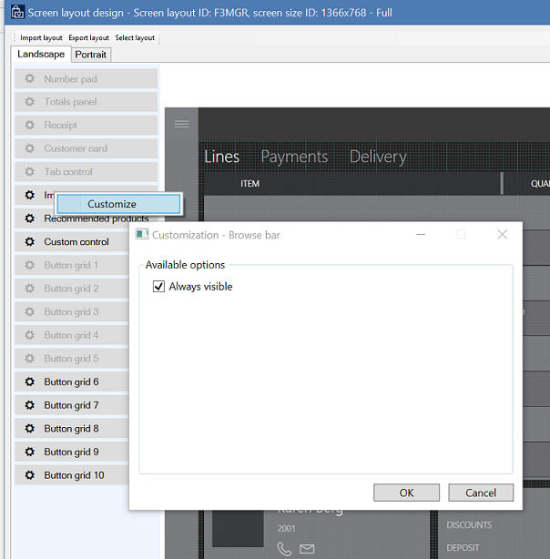

- **POS controls** – The POS layout designer supports the following controls. You can configure many controls by right-clicking and using the shortcut menu.

    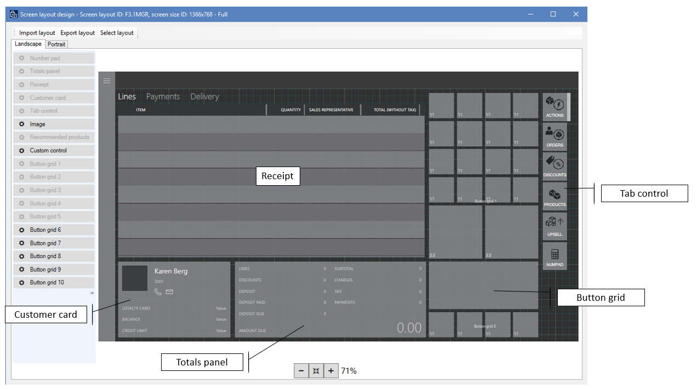

    - **Number pad** – The number pad is the main mechanism for user input on the POS **Transaction** screen. You can configure the control so that the full number pad is shown. This option is ideal for touchscreen devices. Alternatively, you can configure it so that only the input field is shown. In this case, a physical keyboard is used for input. The number pad settings are available only for Full layouts. For Compact layouts, the full number pad is always shown on the **Transaction** screen.
    - **Totals panel** – You can configure the totals panel in either one column or two columns, to show values such as the line count, discount amount, charges, subtotal, and tax. Compact layouts support only a single column.
    - **Receipt panel** – The receipt panel contains the sales lines, payment lines, and delivery information for the products and services that are processed in the POS. You can specify columns, widths, and placement. In Compact layouts, you can also configure additional information that appears in the row under the main line.
    - **Customer card** – The customer card shows information about the customer who is associated with the current transaction. You can configure the customer card to hide or show additional information.
    - **Tab control** – You can add the tab control to a screen layout, and then put other controls, such as the number pad, customer card, or button grids, in it. The tab control is a container that helps you fit more content on the screen. The tab control is available only for Full layouts.
    - **Image** – You can use the image control to show the store's logo or another branding image on the **Transaction** screen. The image control is available only for Full layouts.
    - **Recommended products** – If the recommended products control is configured for the environment, it shows product suggestions, based on machine learning.
    - **Custom control** – The custom control acts as a placeholder in the screen layout and lets you reserve space for custom content. The custom control is available only for Full layouts.

### Compact layout designer

Like the Full layout designer, the Compact layout designer lets you configure the POS screen layout for phones and small tablets. However, in this case, the layout itself is fixed. You can configure the controls in the layout by right-clicking and using the shortcut menu. However, you can't use drag-and-drop operations for additional content.

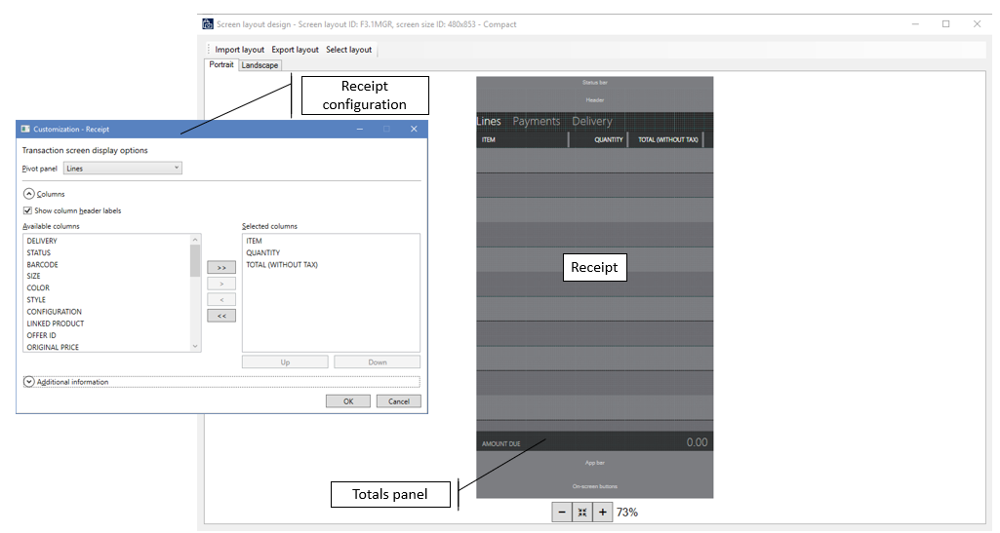

### Button grid designer

The button grid designer lets you configure button grids that can be used on the POS welcome screen and **Transaction** screen for both Full and Compact layouts. The same button grid can be used across layouts and layout types. Like the screen layout designer, the button grid designer uses the ClickOnce deployment technology to download, install, and start the latest version of the application every time that users access it. Be sure to check the browser requirements for ClickOnce. Some browsers, such as Google Chrome, require extensions.

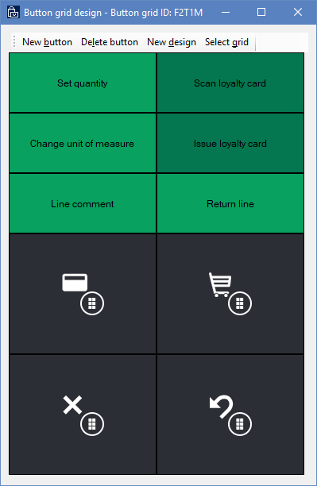

- **New button** – Click to add a new button to the button grid. By default, new buttons appear in the upper-left corner of the grid. However, you can arrange buttons by dragging them in the layout.

    > [!IMPORTANT]
    > The contents of the button grid can overlap. When you arrange buttons, make sure that they don't hide other buttons.

- **New design** – Click to automatically set up a button grid layout by specifying the number of buttons per row and column.
- **Button properties** – You can configure button properties by right-clicking the button and using the shortcut menu.

    > [!IMPORTANT]
    > Some button grid settings apply only to Enterprise POS, not to Modern POS or Cloud POS.

    

    - **Action** – In the list of applicable POS operations, select the operation that is invoked when the button is clicked in the POS.

        For the list of supported POS operations, see [Online and offline point of sale (POS) operations](pos-operations.md).

    - **Action parameters** – Some POS operations use additional parameters when they are invoked. For example, for the Add product operation, users can specify the product to add.
    - **Button text** – Specify the text that appears on the button in the POS.
    - **Hide button text** – Use this check box to hide or show the button text. Button text is often hidden for small buttons that show only an icon.
    - **Tooltip** – Specify additional Help text that appears when users mouse over the button.
    - **Size in columns/Size in rows** – You can specify how tall and wide the button is.

        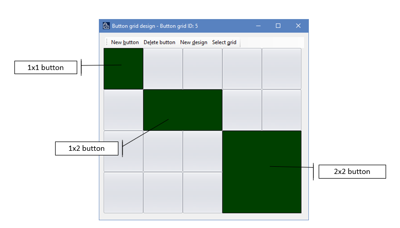

    - **Custom font** – When you select the **Enable custom font for POS** check box, you can specify a font other than the default system font for the POS.
    - **Custom theme** – By default, POS buttons use the accent color from the visual profile. When you select the **Use custom theme** check box, you can specify additional colors.

        > [!NOTE]
        > Modern POS and Cloud POS use only the **Back color** and **Font color** values.

    - **Button image** – Buttons can include images or icons. Select among the available images that are specified at **Retail and Commerce \> Channel setup \> POS setup \> POS \> Images**.

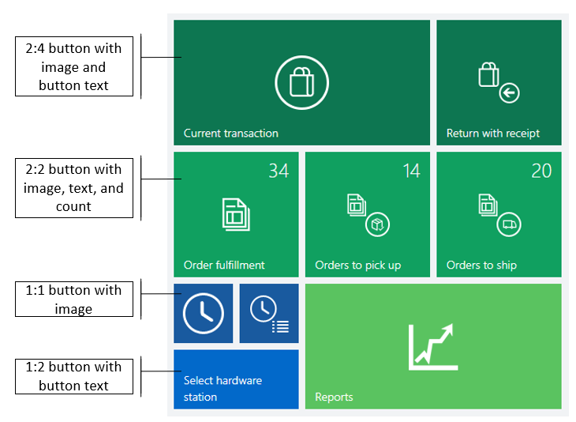

## Additional resources

[Install the Retail point of sale (POS) layout designer](install-pos-layout-designer.md)
